

### 425

|Name|RAJ2000[deg]|DEJ2000[deg] |Ext[arcmin]| Ext,ml | z | z_src| C|GC(XSZ,Delta_z<0.01)| GC(OPT,Delta_z<0.01)|GC| R_sig[arcmin] | R500[arcmin] | R500[Mpc]| CRsig[c/s] | CR500[c/s] |L500[1E44 erg/s]|F500[1E-12 erg/s/cm^2]| M500[1E14 Msun]|Tx[keV]|Cnt_sig|Beta|Rc[arcmin]|Comment|Alias|
|---|---|---|---|---|---|------|---|--------|---------|----------|---|---|---|---|---|---|---|---|---|---|---|---|---|---|
|425| 176.324| 15.484| 2.23| 64.34| 0.0689(0.005)| z1, z_xsz| B| F20, L03, MCXC| A, N, W| A, C, F20, L03, MCXC, N, W| 29.144| 10.054| 0.795| 0.251(0.059)| 0.227(0.053)| 0.475(0.071)| 4.118(0.617)| 1.52(0.12)| 2.84(0.14)| 136.8| 0.936(-0.086+0.046)| 4.380(-0.526+0.383)| -| k257|

|[RASS image](../image/425/425_img.pdf)|[filtered image](../image/425/425_fil.pdf)|[Segment image](../image/425/425_seg.pdf)|
|-------------------|--------------------|-------------------|
| 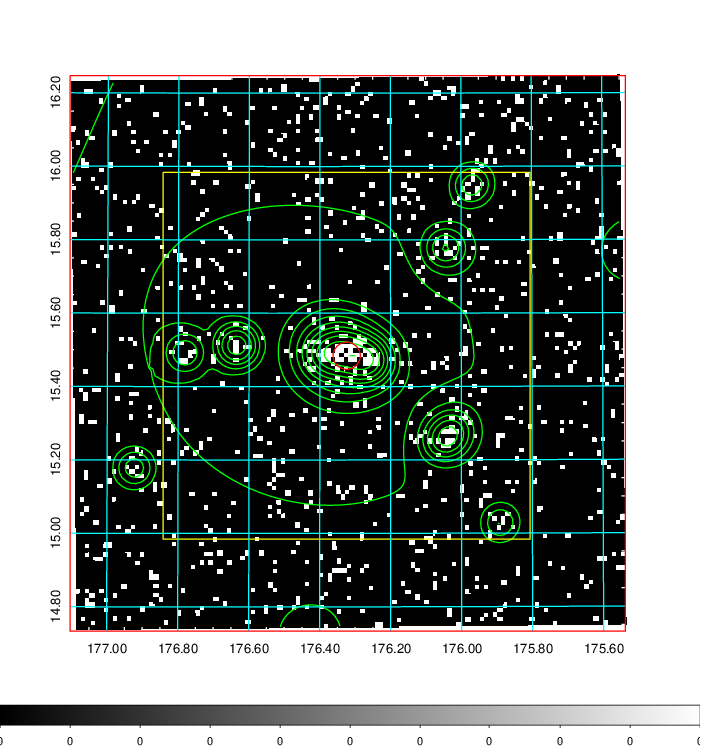  | 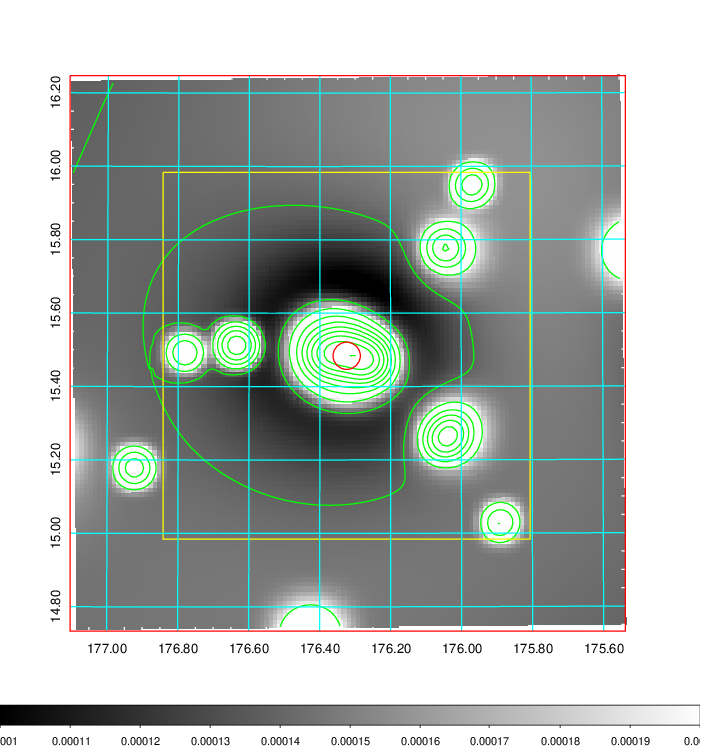   | 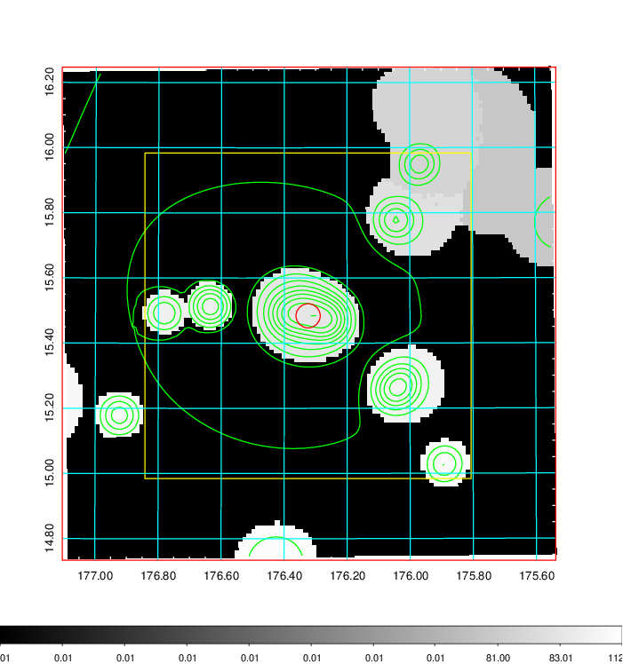  |

|[Exposure image](../image/425/425_mex.pdf)| [nH image](../image/425/425_nh.pdf)| [Planck image](../image/425/425_p.pdf)|
|-------------------|--------------------|-------------------|
|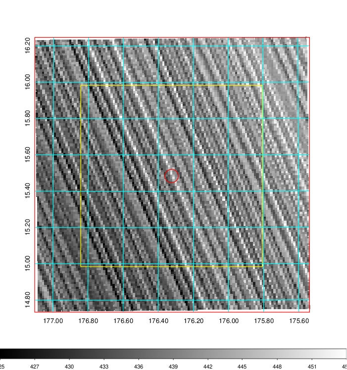   | 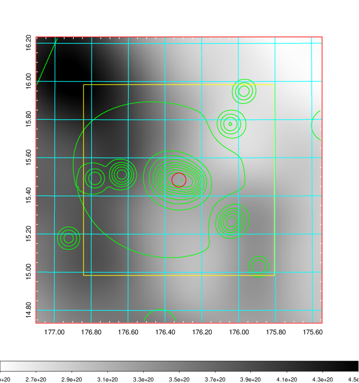    | 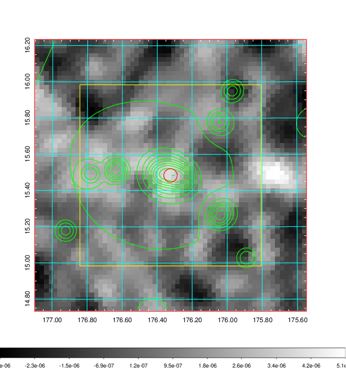 |

|[Redshift Histogram](../image/425/425_zg.pdf) | [DSS image(z1)](../image/425/425_dss_z1.pdf)      |  [DSS image(z2)](../image/425/425_dss_z2.pdf)    |
|-------------------|--------------------|-------------------|
|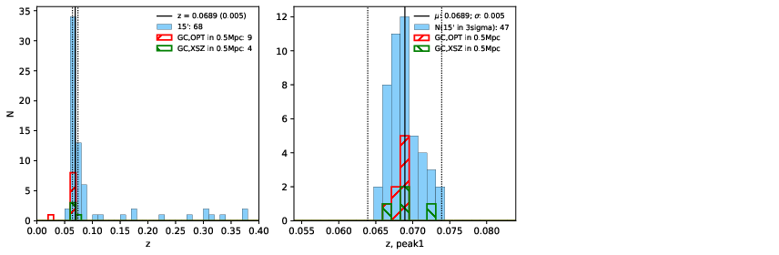 |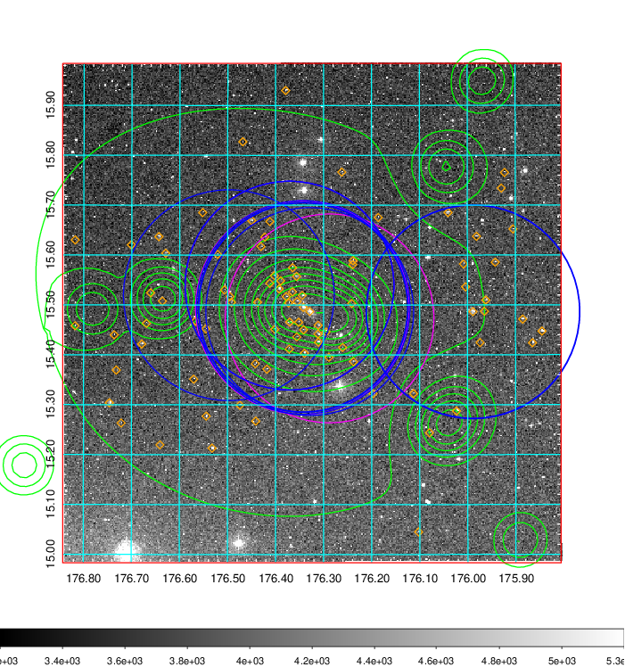  Blue circle for optical clusters;  Magenta circle for XSZ clusters;  all with r=1Mpc;  Only GC with Delta_z<0.01 are shown. | 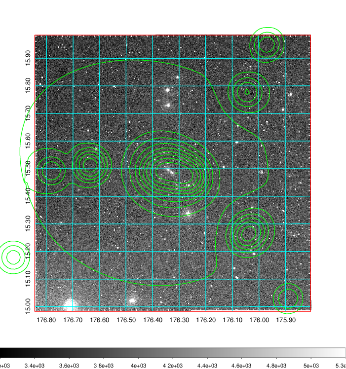 Blue circle for optical clusters;  Magenta circle for XSZ clusters;  all with r=1Mpc;  Only GC with Delta_z<0.01 are shown.  |

|[known Abell/XSZ clusters](../image/425/425_gc.pdf) | [2MASS image](../image/425/425_2mass.pdf)      |[SDSS image](../image/425/425_sdss.pdf)   |
|-------------------|-------------------|-------------------|
|  Magenta, blue and green circles  for optical, X-ray and SZ clusters  respectively, with redshift of clusters  labelled. The radius of circles  are 1Mpc.|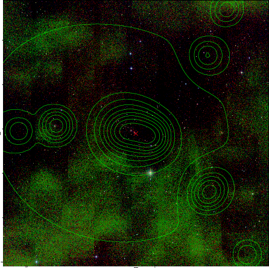  | 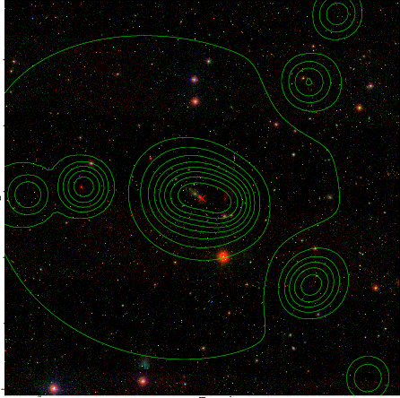  |

