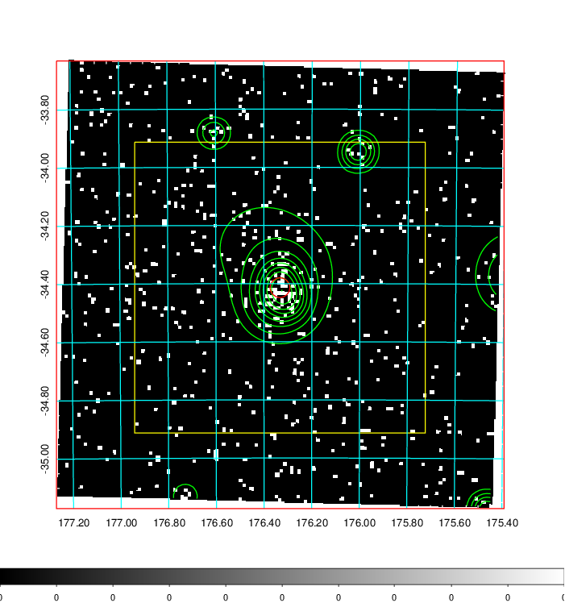
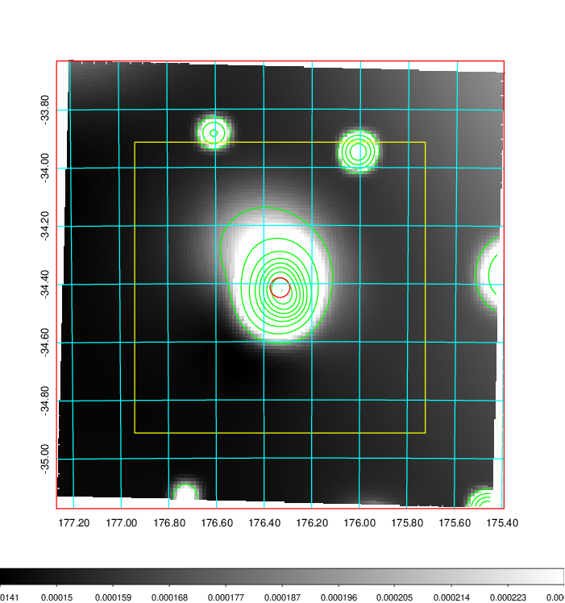
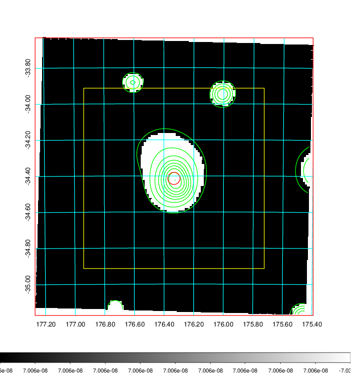
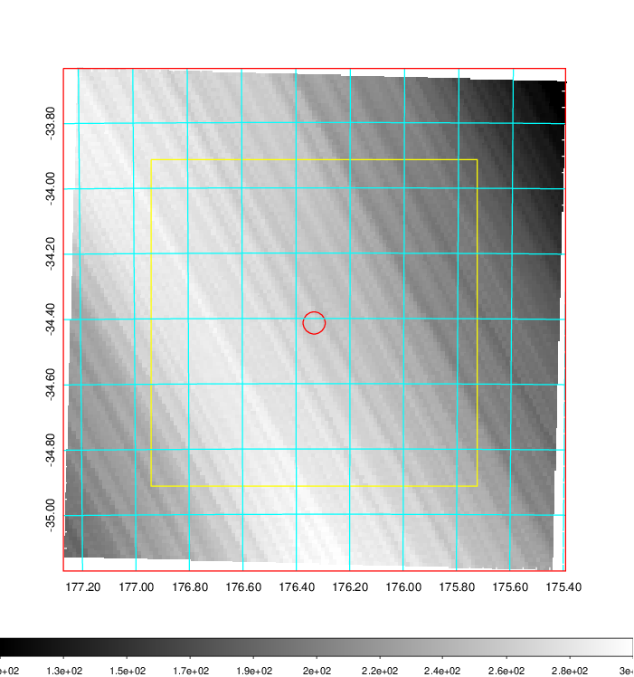
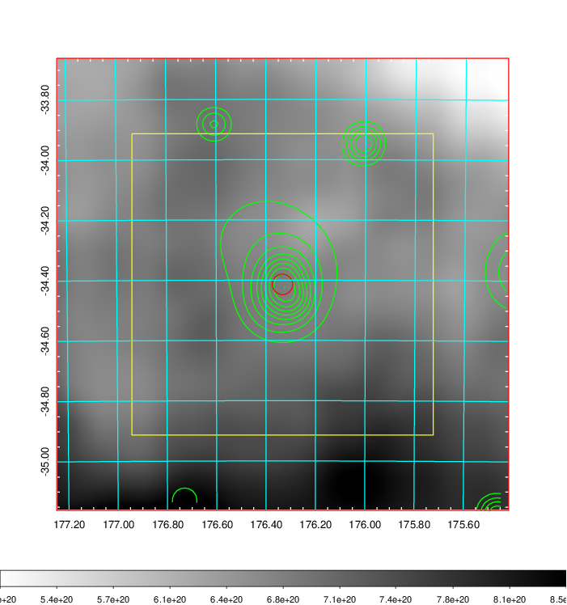
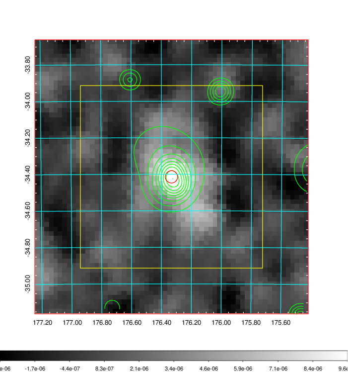
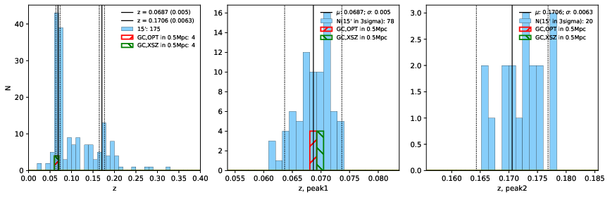
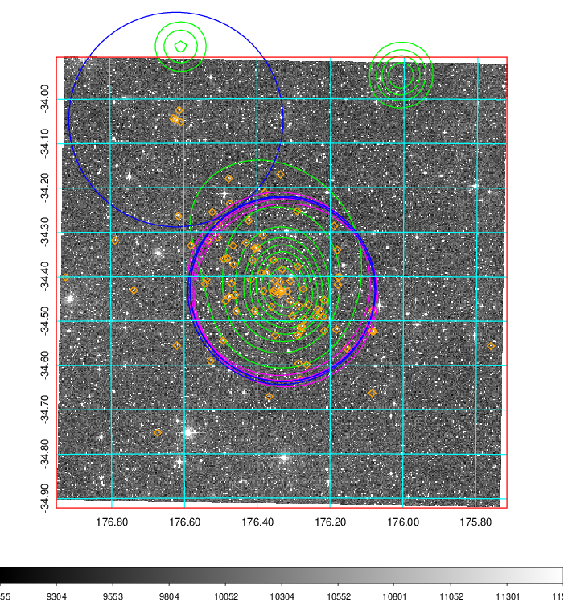
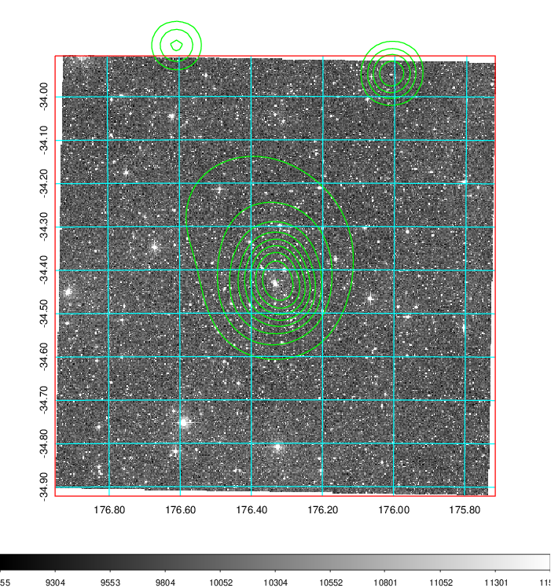
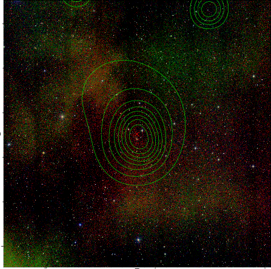

### 426

|Name|RAJ2000[deg]|DEJ2000[deg] |Ext[arcmin]| Ext,ml | z | z_src| C|GC(XSZ,Delta_z<0.01)| GC(OPT,Delta_z<0.01)|GC| R_sig[arcmin] | R500[arcmin] | R500[Mpc]| CRsig[c/s] | CR500[c/s] |L500[1E44 erg/s]|F500[1E-12 erg/s/cm^2]| M500[1E14 Msun]|Tx[keV]|Cnt_sig|Beta|Rc[arcmin]|Comment|Alias|
|---|---|---|---|---|---|------|---|--------|---------|----------|---|---|---|---|---|---|---|---|---|---|---|---|---|---|
|426| 176.333| -34.414| 2.04| 45.11| 0.0687(0.005)| z1, z_xsz| B| MCXC, PSZ2, Tar, XB| A, W| A, MCXC, PSZ2, Tar, W, XB| 20.750| 10.892| 0.859| 0.328(0.077)| 0.304(0.072)| 0.609(0.067)| 5.316(0.580)| 1.92(0.11)| 3.27(0.11)| 81.8| 0.683(-0.066+0.099)| 3.418(-0.710+0.932)| -| k224|

|[RASS image](../image/426/426_img.pdf)|[filtered image](../image/426/426_fil.pdf)|[Segment image](../image/426/426_seg.pdf)|
|-------------------|--------------------|-------------------|
|   |    |   |

|[Exposure image](../image/426/426_mex.pdf)| [nH image](../image/426/426_nh.pdf)| [Planck image](../image/426/426_p.pdf)|
|-------------------|--------------------|-------------------|
|   |     |  |

|[Redshift Histogram](../image/426/426_zg.pdf) | [DSS image(z1)](../image/426/426_dss_z1.pdf)      |  [DSS image(z2)](../image/426/426_dss_z2.pdf)    |
|-------------------|--------------------|-------------------|
| |  Blue circle for optical clusters;  Magenta circle for XSZ clusters;  all with r=1Mpc;  Only GC with Delta_z<0.01 are shown. |  Blue circle for optical clusters;  Magenta circle for XSZ clusters;  all with r=1Mpc;  Only GC with Delta_z<0.01 are shown.  |

|[Previous-identified clusters](../image/426/426_gc.pdf) | [2MASS image](../image/426/426_2mass.pdf)      |
|-------------------|-------------------|
|  Green, magenta, and blue circles  for optical, X-ray and SZ clusters  respectively, with redshift of clusters  labelled. The radius of circles  are 1Mpc.|  |

