

### 427

|Name|RAJ2000[deg]|DEJ2000[deg] |Ext[arcmin]| Ext,ml | z | z_src| C|GC(XSZ,Delta_z<0.01)| GC(OPT,Delta_z<0.01)|GC| R_sig[arcmin] | R500[arcmin] | R500[Mpc]| CRsig[c/s] | CR500[c/s] |L500[1E44 erg/s]|F500[1E-12 erg/s/cm^2]| M500[1E14 Msun]|Tx[keV]|Cnt_sig|Beta|Rc[arcmin]|Comment|Alias|
|---|---|---|---|---|---|------|---|--------|---------|----------|---|---|---|---|---|---|---|---|---|---|---|---|---|---|
|427| 176.419| -2.382| 5.62| 31.25| 0.1247(0.006)| z1, z_opt| S| -| A, N| A, C, F20, N, W| 13.675| 6.171| 0.828| 0.101(0.035)| 0.092(0.032)| 0.716(0.184)| 1.759(0.452)| 1.82(0.23)| 3.22(0.26)| 43.9| 0.853(-0.159+0.105)| 7.595(-1.585+1.279)| -| t289|

|[RASS image](../image/427/427_img.pdf)|[filtered image](../image/427/427_fil.pdf)|[Segment image](../image/427/427_seg.pdf)|
|-------------------|--------------------|-------------------|
| 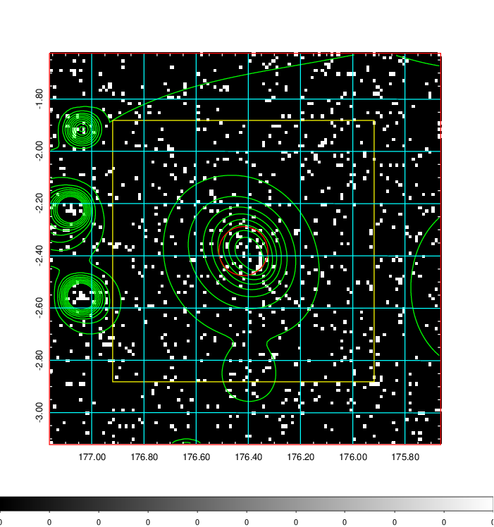  | 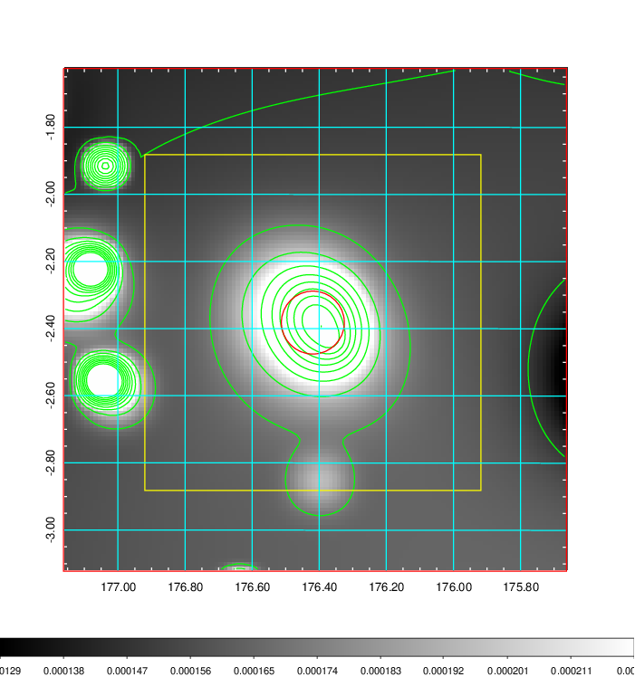   | 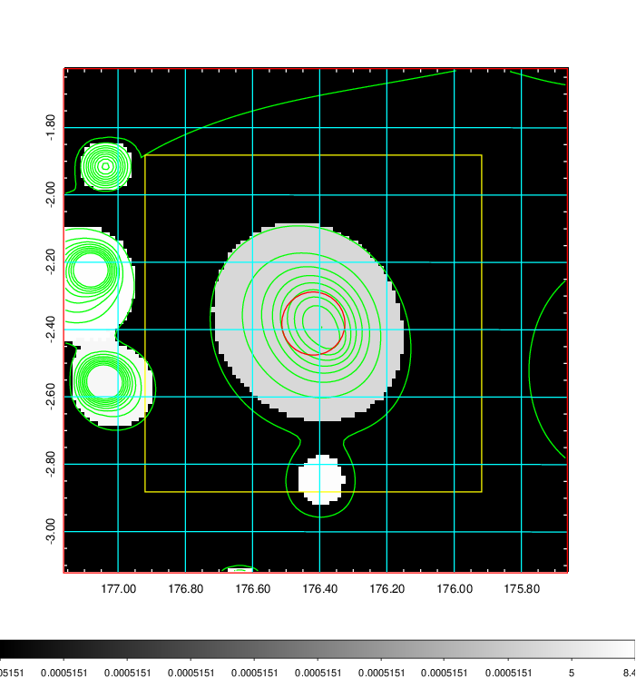  |

|[Exposure image](../image/427/427_mex.pdf)| [nH image](../image/427/427_nh.pdf)| [Planck image](../image/427/427_p.pdf)|
|-------------------|--------------------|-------------------|
|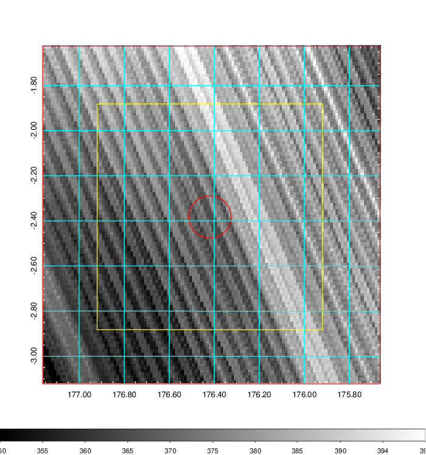   | 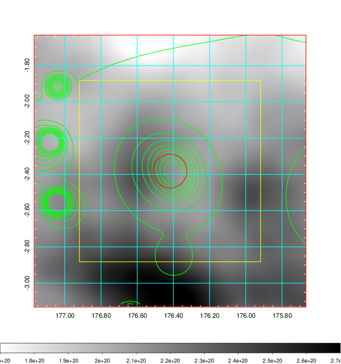    | 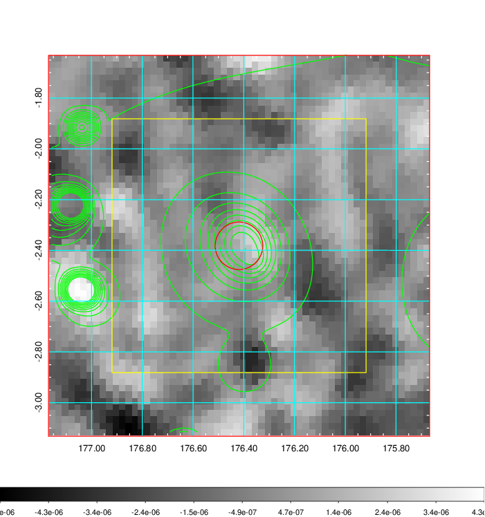 |

|[Redshift Histogram](../image/427/427_zg.pdf) | [DSS image(z1)](../image/427/427_dss_z1.pdf)      |  [DSS image(z2)](../image/427/427_dss_z2.pdf)    |
|-------------------|--------------------|-------------------|
|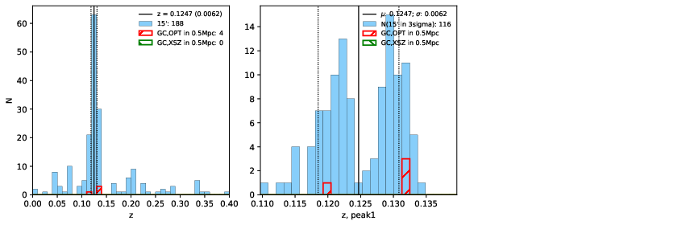 |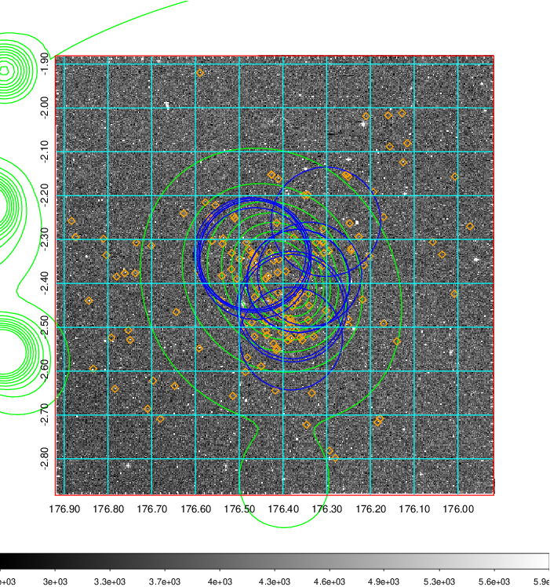  Blue circle for optical clusters;  Magenta circle for XSZ clusters;  all with r=1Mpc;  Only GC with Delta_z<0.01 are shown. | 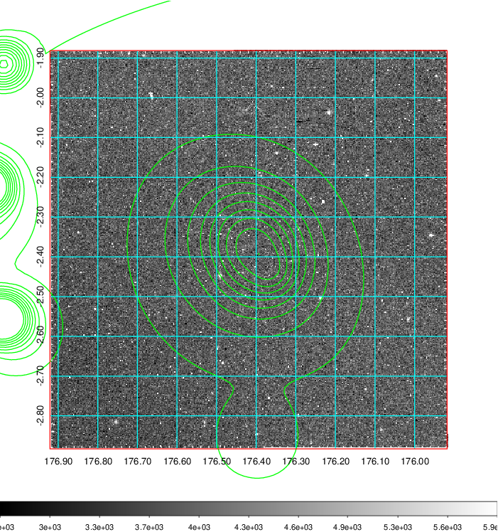 Blue circle for optical clusters;  Magenta circle for XSZ clusters;  all with r=1Mpc;  Only GC with Delta_z<0.01 are shown.  |

|[known Abell/XSZ clusters](../image/427/427_gc.pdf) | [2MASS image](../image/427/427_2mass.pdf)      |[SDSS image](../image/427/427_sdss.pdf)   |
|-------------------|-------------------|-------------------|
|  Magenta, blue and green circles  for optical, X-ray and SZ clusters  respectively, with redshift of clusters  labelled. The radius of circles  are 1Mpc.|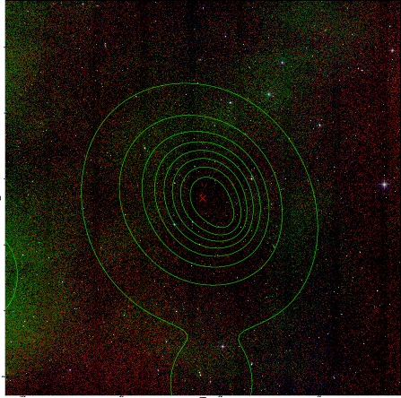  | 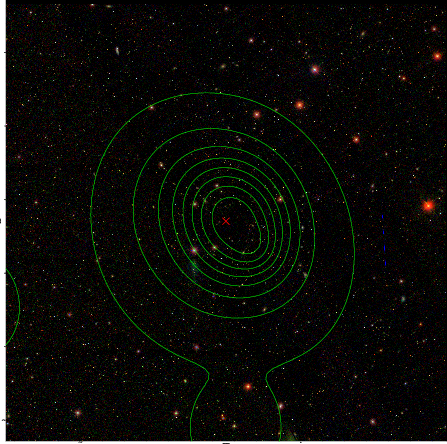  |

|[ATLAS image](../image/427/427_s.pdf)        |
|-------------------|
|   |
