

### 428

|Name|RAJ2000[deg]|DEJ2000[deg] |Ext[arcmin]| Ext,ml | z | z_src| C|GC(XSZ,Delta_z<0.01)| GC(OPT,Delta_z<0.01)|GC| R_sig[arcmin] | R500[arcmin] | R500[Mpc]| CRsig[c/s] | CR500[c/s] |L500[1E44 erg/s]|F500[1E-12 erg/s/cm^2]| M500[1E14 Msun]|Tx[keV]|Cnt_sig|Beta|Rc[arcmin]|Comment|Alias|
|---|---|---|---|---|---|------|---|--------|---------|----------|---|---|---|---|---|---|---|---|---|---|---|---|---|---|
|428| 176.879| 55.750| 4.52| 68.92| 0.0514(0.005)| z1, z_xsz| B| L03, MCXC| A, N, W| A, C, F20, L03, MCXC, N, SPI, W| 14.162| 11.567| 0.696| 0.234(0.035)| 0.227(0.034)| 0.276(0.034)| 4.403(0.538)| 1.01(0.06)| 2.19(0.09)| 99.0| 0.692(-0.127+0.180)| 5.860(-1.606+1.881)| -| k506|

|[RASS image](../image/428/428_img.pdf)|[filtered image](../image/428/428_fil.pdf)|[Segment image](../image/428/428_seg.pdf)|
|-------------------|--------------------|-------------------|
| 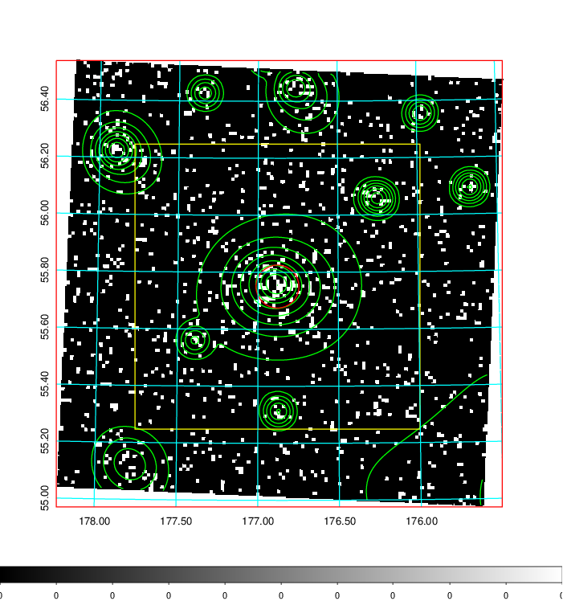  | 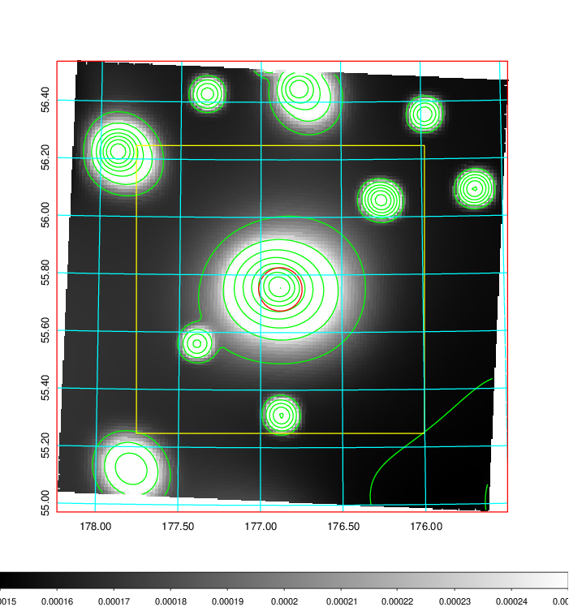   | 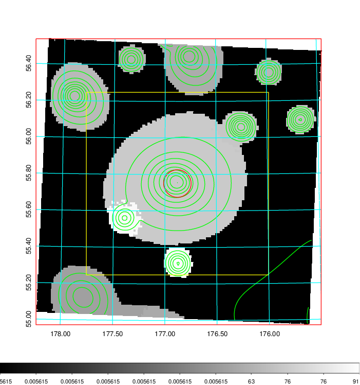  |

|[Exposure image](../image/428/428_mex.pdf)| [nH image](../image/428/428_nh.pdf)| [Planck image](../image/428/428_p.pdf)|
|-------------------|--------------------|-------------------|
|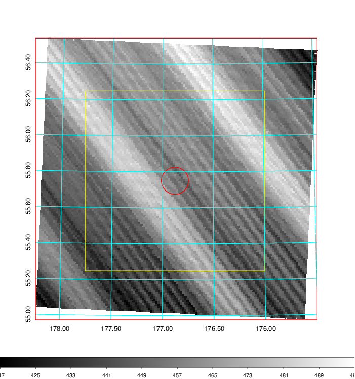   | 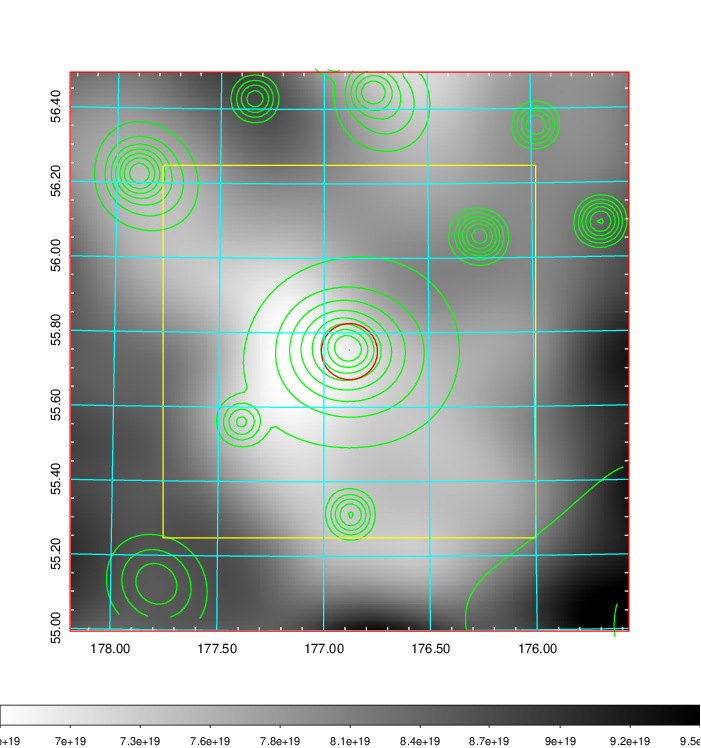    | 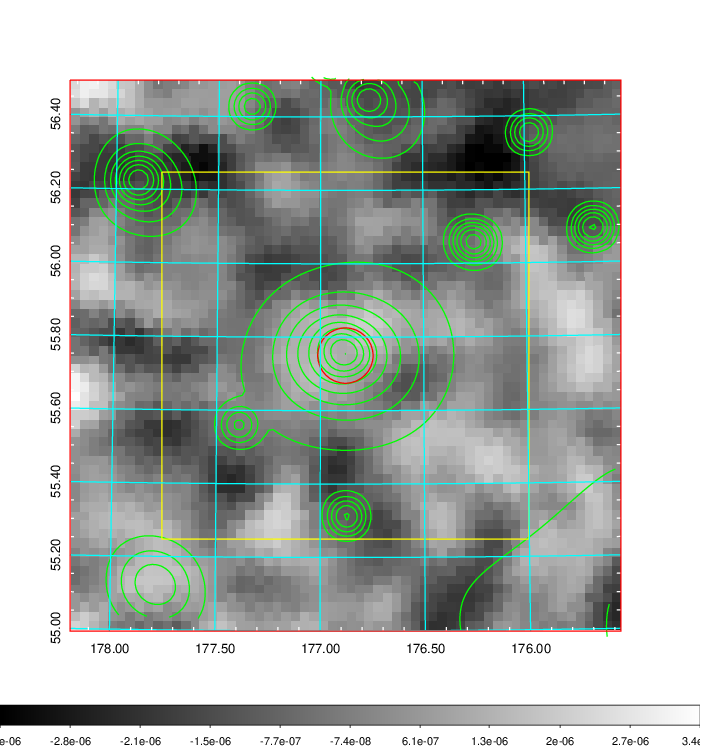 |

|[Redshift Histogram](../image/428/428_zg.pdf) | [DSS image(z1)](../image/428/428_dss_z1.pdf)      |  [DSS image(z2)](../image/428/428_dss_z2.pdf)    |
|-------------------|--------------------|-------------------|
|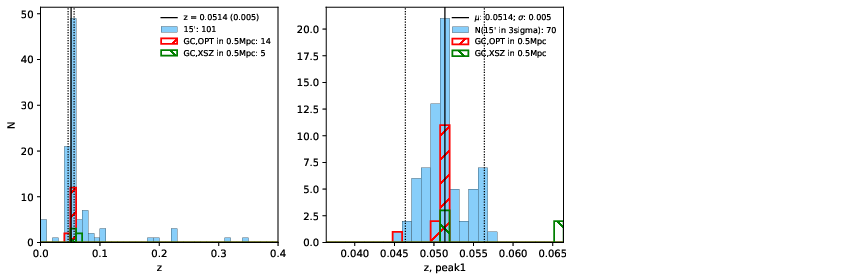 |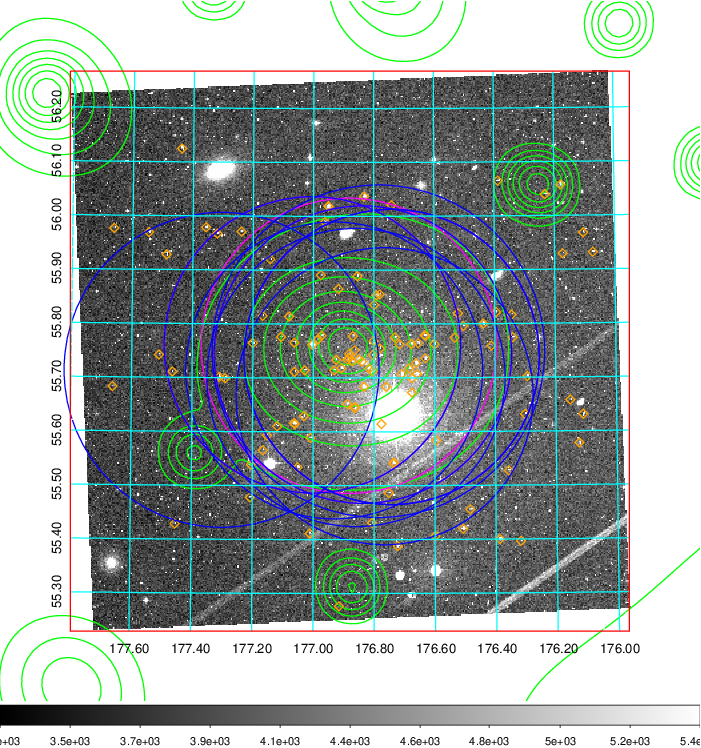  Blue circle for optical clusters;  Magenta circle for XSZ clusters;  all with r=1Mpc;  Only GC with Delta_z<0.01 are shown. | 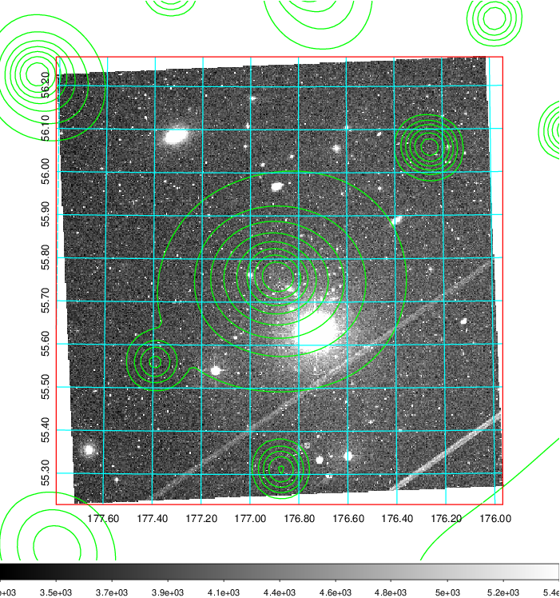 Blue circle for optical clusters;  Magenta circle for XSZ clusters;  all with r=1Mpc;  Only GC with Delta_z<0.01 are shown.  |

|[known Abell/XSZ clusters](../image/428/428_gc.pdf) | [2MASS image](../image/428/428_2mass.pdf)      |[SDSS image](../image/428/428_sdss.pdf)   |
|-------------------|-------------------|-------------------|
|  Magenta, blue and green circles  for optical, X-ray and SZ clusters  respectively, with redshift of clusters  labelled. The radius of circles  are 1Mpc.|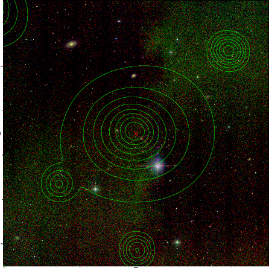  | 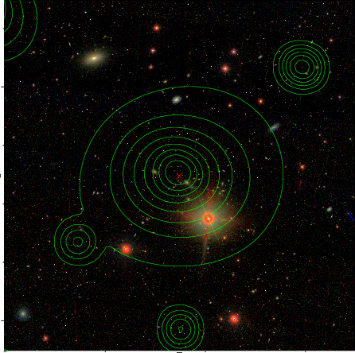  |

