

### 429

|Name|RAJ2000[deg]|DEJ2000[deg] |Ext[arcmin]| Ext,ml | z | z_src| C|GC(XSZ,Delta_z<0.01)| GC(OPT,Delta_z<0.01)|GC| R_sig[arcmin] | R500[arcmin] | R500[Mpc]| CRsig[c/s] | CR500[c/s] |L500[1E44 erg/s]|F500[1E-12 erg/s/cm^2]| M500[1E14 Msun]|Tx[keV]|Cnt_sig|Beta|Rc[arcmin]|Comment|Alias|
|---|---|---|---|---|---|------|---|--------|---------|----------|---|---|---|---|---|---|---|---|---|---|---|---|---|---|
|429| 176.979| 54.691| 2.54| 30.71| 0.0595(0.005)| z1, z_xsz| B| L03| A, N, W| A, F20, L03, N, SPI, W| 20.256| 11.728| 0.809| 0.371(0.061)| 0.347(0.057)| 0.575(0.098)| 6.771(1.160)| 1.60(0.14)| 2.91(0.16)| 148.3| 0.512(-0.009+0.020)| 3.479(-0.346+0.485)| -| t099|

|[RASS image](../image/429/429_img.pdf)|[filtered image](../image/429/429_fil.pdf)|[Segment image](../image/429/429_seg.pdf)|
|-------------------|--------------------|-------------------|
| 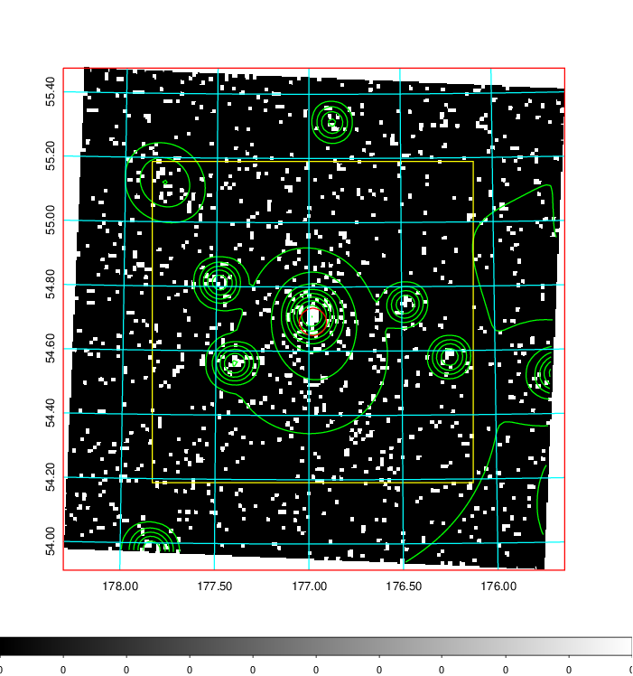  | 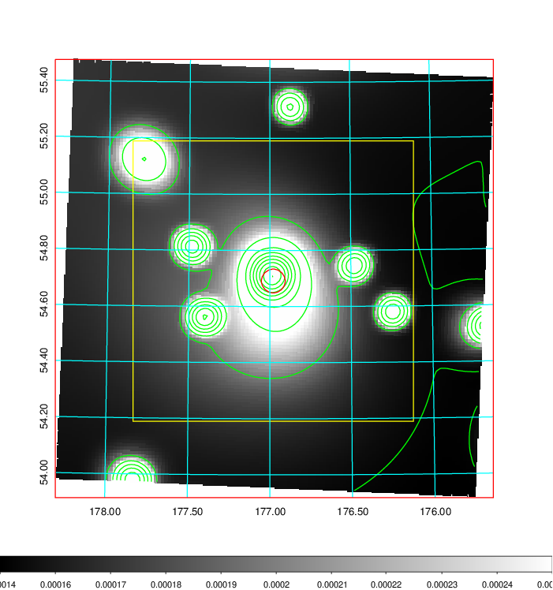   | 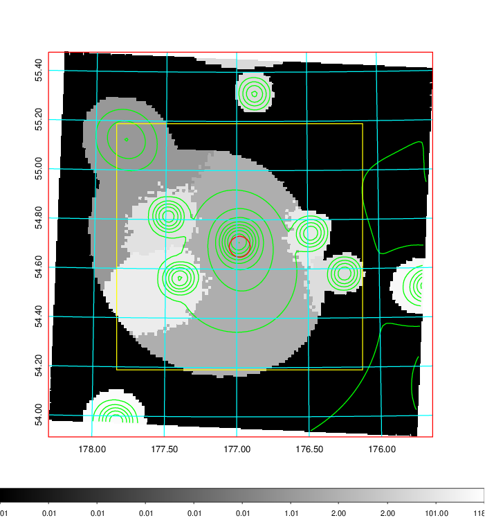  |

|[Exposure image](../image/429/429_mex.pdf)| [nH image](../image/429/429_nh.pdf)| [Planck image](../image/429/429_p.pdf)|
|-------------------|--------------------|-------------------|
|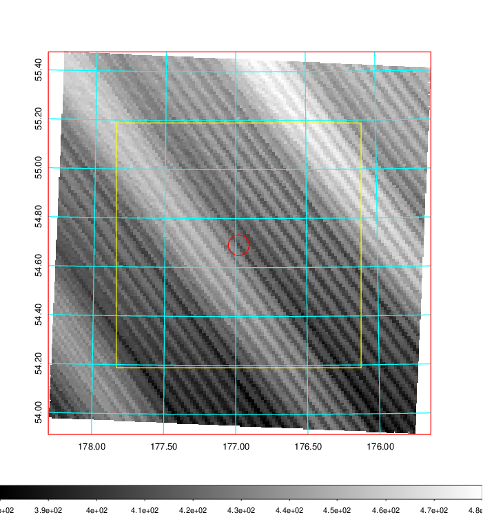   | 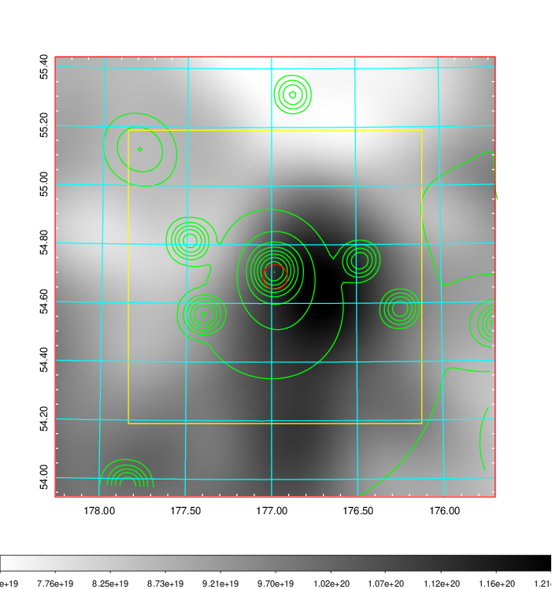    | 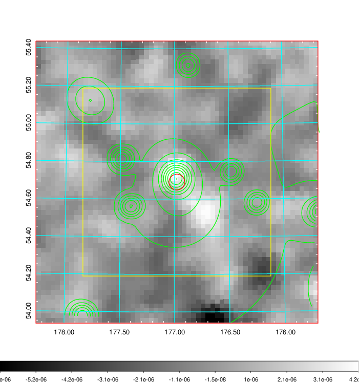 |

|[Redshift Histogram](../image/429/429_zg.pdf) | [DSS image(z1)](../image/429/429_dss_z1.pdf)      |  [DSS image(z2)](../image/429/429_dss_z2.pdf)    |
|-------------------|--------------------|-------------------|
|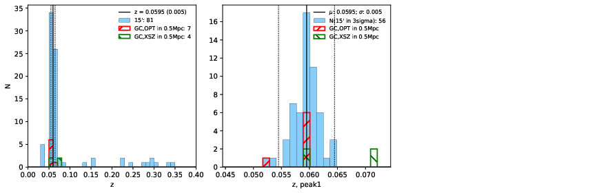 |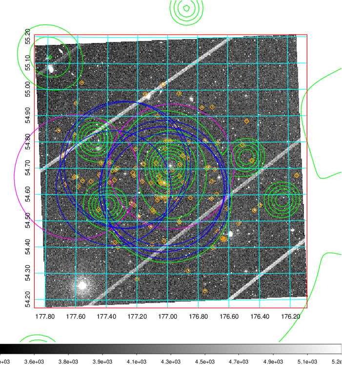  Blue circle for optical clusters;  Magenta circle for XSZ clusters;  all with r=1Mpc;  Only GC with Delta_z<0.01 are shown. | 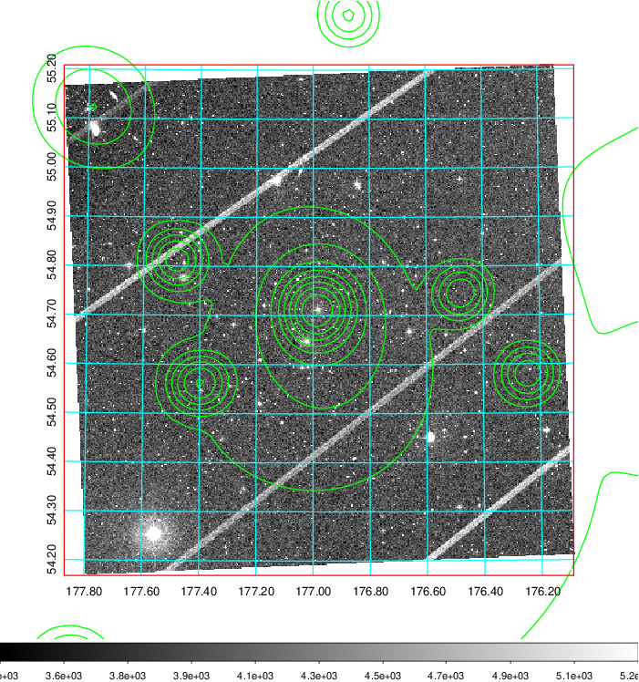 Blue circle for optical clusters;  Magenta circle for XSZ clusters;  all with r=1Mpc;  Only GC with Delta_z<0.01 are shown.  |

|[known Abell/XSZ clusters](../image/429/429_gc.pdf) | [2MASS image](../image/429/429_2mass.pdf)      |[SDSS image](../image/429/429_sdss.pdf)   |
|-------------------|-------------------|-------------------|
|  Magenta, blue and green circles  for optical, X-ray and SZ clusters  respectively, with redshift of clusters  labelled. The radius of circles  are 1Mpc.|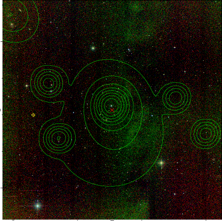  | 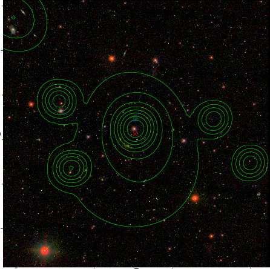  |

