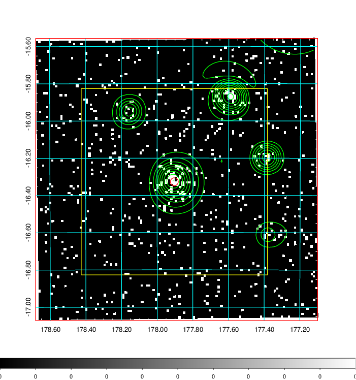
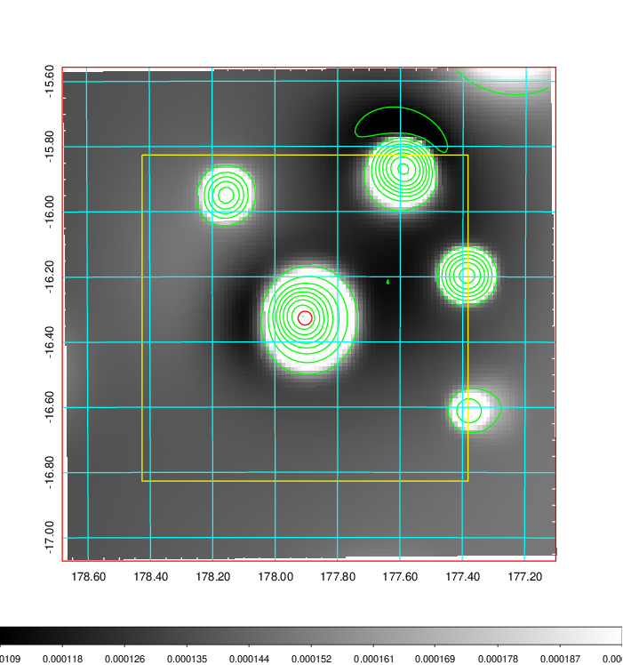
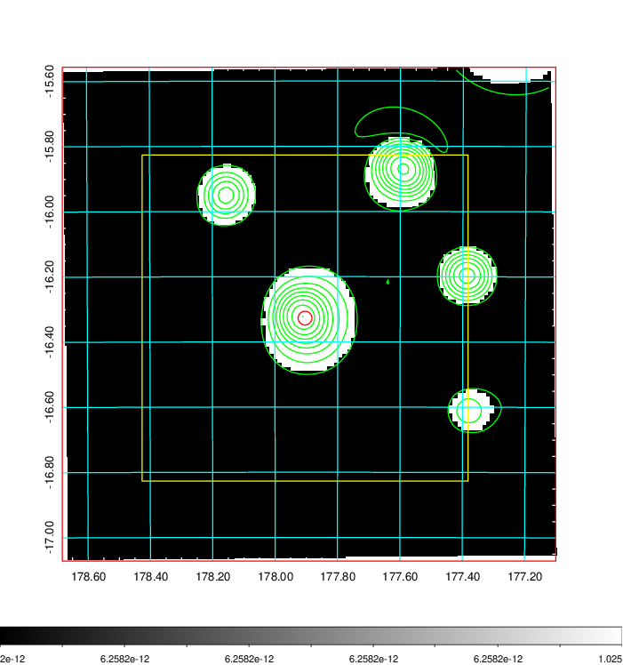
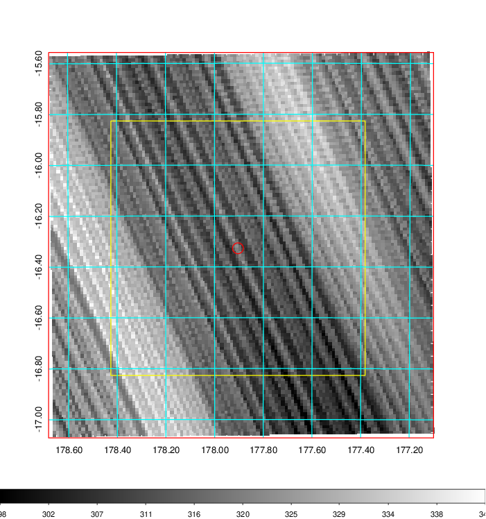
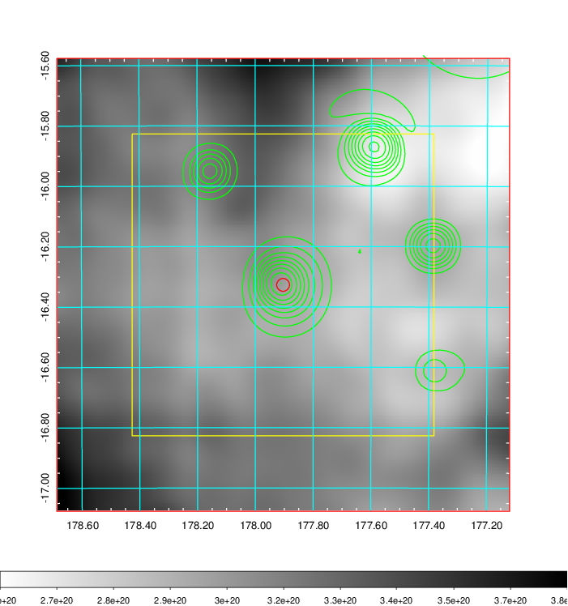
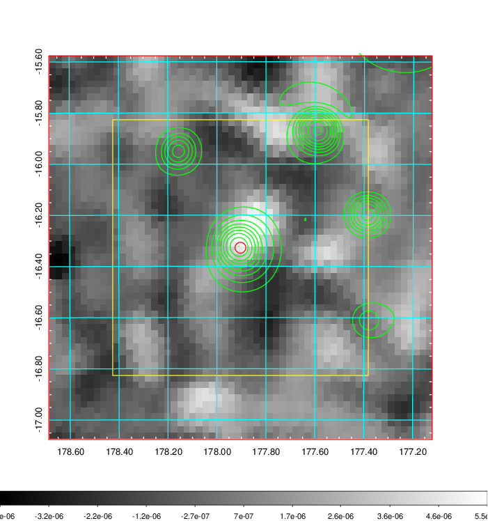
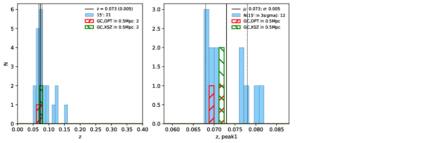
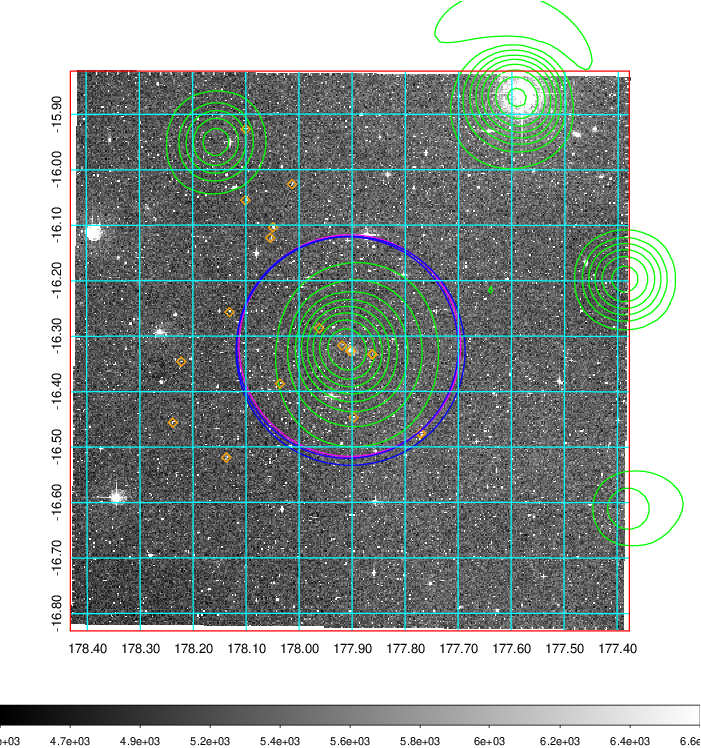
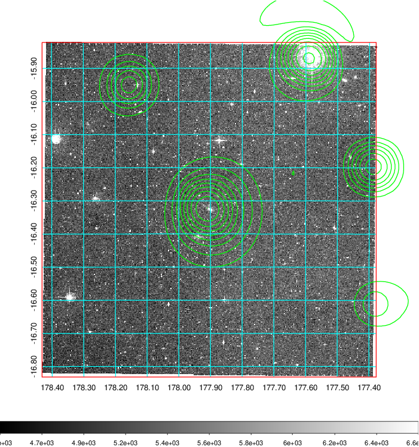
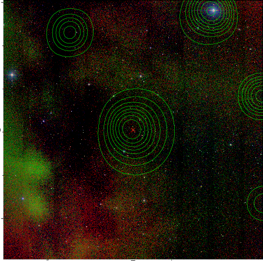

### 430

|Name|RAJ2000[deg]|DEJ2000[deg] |Ext[arcmin]| Ext,ml | z | z_src| C|GC(XSZ,Delta_z<0.01)| GC(OPT,Delta_z<0.01)|GC| R_sig[arcmin] | R500[arcmin] | R500[Mpc]| CRsig[c/s] | CR500[c/s] |L500[1E44 erg/s]|F500[1E-12 erg/s/cm^2]| M500[1E14 Msun]|Tx[keV]|Cnt_sig|Beta|Rc[arcmin]|Comment|Alias|
|---|---|---|---|---|---|------|---|--------|---------|----------|---|---|---|---|---|---|---|---|---|---|---|---|---|---|
|430| 177.904| -16.327| 1.28| 29.13| 0.0730(0.005)| z1, z_xsz| B| MCXC, Tar| N, W| MCXC, N, Tar, W| 25.194| 10.645| 0.887| 0.380(0.069)| 0.347(0.063)| 0.837(0.100)| 6.432(0.766)| 2.13(0.13)| 3.49(0.13)| 104.6| 0.509(-0.007+0.014)| 1.162(-0.193+0.234)| -| k073|

|[RASS image](../image/430/430_img.pdf)|[filtered image](../image/430/430_fil.pdf)|[Segment image](../image/430/430_seg.pdf)|
|-------------------|--------------------|-------------------|
|   |    |   |

|[Exposure image](../image/430/430_mex.pdf)| [nH image](../image/430/430_nh.pdf)| [Planck image](../image/430/430_p.pdf)|
|-------------------|--------------------|-------------------|
|   |     |  |

|[Redshift Histogram](../image/430/430_zg.pdf) | [DSS image(z1)](../image/430/430_dss_z1.pdf)      |  [DSS image(z2)](../image/430/430_dss_z2.pdf)    |
|-------------------|--------------------|-------------------|
| |  Blue circle for optical clusters;  Magenta circle for XSZ clusters;  all with r=1Mpc;  Only GC with Delta_z<0.01 are shown. |  Blue circle for optical clusters;  Magenta circle for XSZ clusters;  all with r=1Mpc;  Only GC with Delta_z<0.01 are shown.  |

|[known Abell/XSZ clusters](../image/430/430_gc.pdf) | [2MASS image](../image/430/430_2mass.pdf)      |
|-------------------|-------------------|
|  Magenta, blue and green circles  for optical, X-ray and SZ clusters  respectively, with redshift of clusters  labelled. The radius of circles  are 1Mpc.|  |

|[ATLAS image](../image/430/430_s.pdf)        |
|-------------------|
|   |
