

### 431

|Name|RAJ2000[deg]|DEJ2000[deg] |Ext[arcmin]| Ext,ml | z | z_src| C|GC(XSZ,Delta_z<0.01)| GC(OPT,Delta_z<0.01)|GC| R_sig[arcmin] | R500[arcmin] | R500[Mpc]| CRsig[c/s] | CR500[c/s] |L500[1E44 erg/s]|F500[1E-12 erg/s/cm^2]| M500[1E14 Msun]|Tx[keV]|Cnt_sig|Beta|Rc[arcmin]|Comment|Alias|
|---|---|---|---|---|---|------|---|--------|---------|----------|---|---|---|---|---|---|---|---|---|---|---|---|---|---|
|431| 178.311| 12.962| 2.36| 25.54| 0.0826(0.005)| z1, z_xsz| B| F20| N, W| C, F20, N, W| 41.590| 9.715| 0.906| 0.340(0.079)| 0.302(0.070)| 0.970(0.302)| 5.741(1.787)| 2.29(0.36)| 3.66(0.36)| 123.1| 0.503(-0.002+0.005)| 2.705(-0.301+0.333)| -| t085|

|[RASS image](../image/431/431_img.pdf)|[filtered image](../image/431/431_fil.pdf)|[Segment image](../image/431/431_seg.pdf)|
|-------------------|--------------------|-------------------|
| 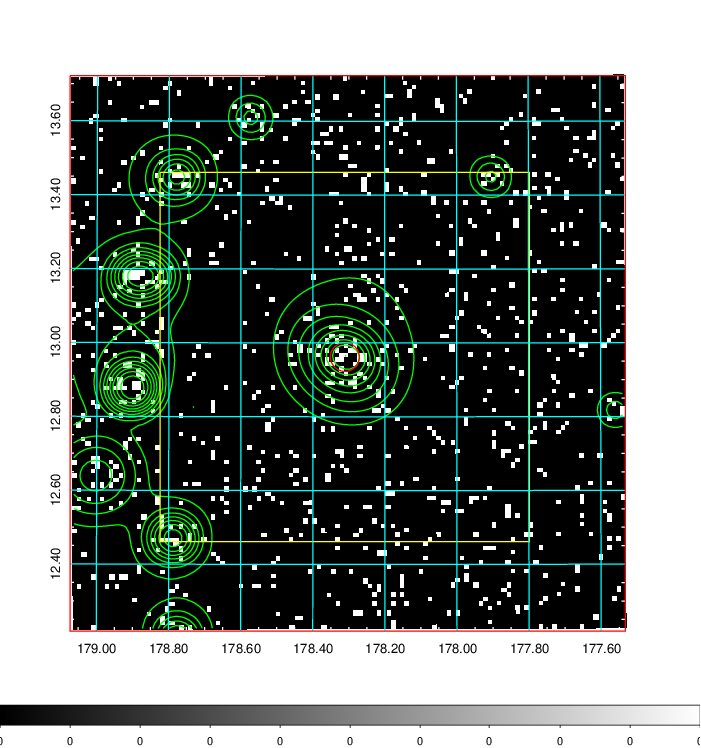  | 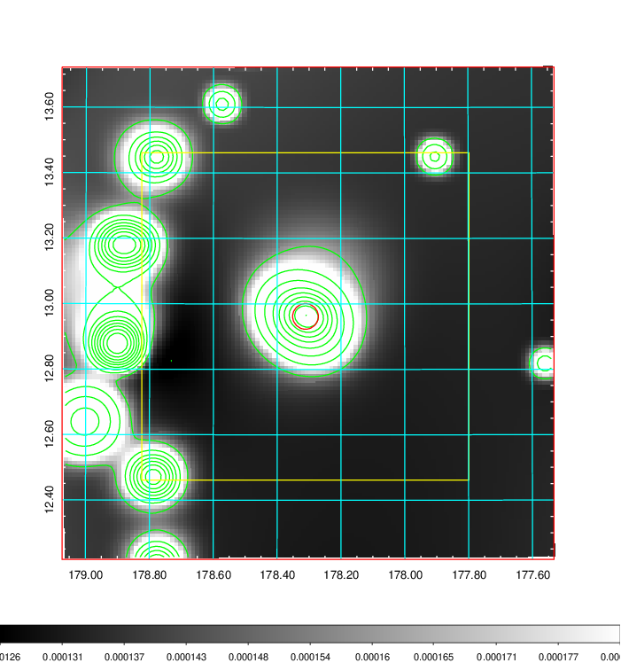   | 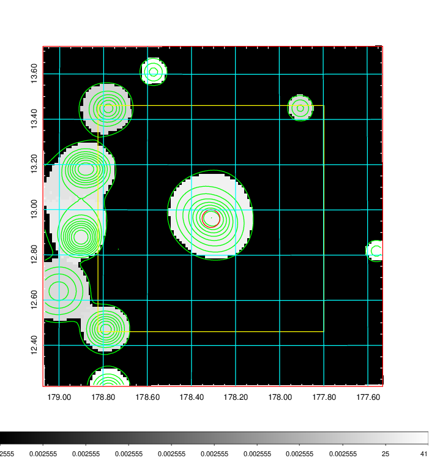  |

|[Exposure image](../image/431/431_mex.pdf)| [nH image](../image/431/431_nh.pdf)| [Planck image](../image/431/431_p.pdf)|
|-------------------|--------------------|-------------------|
|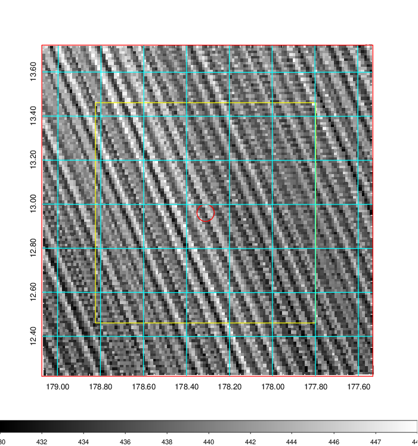   | 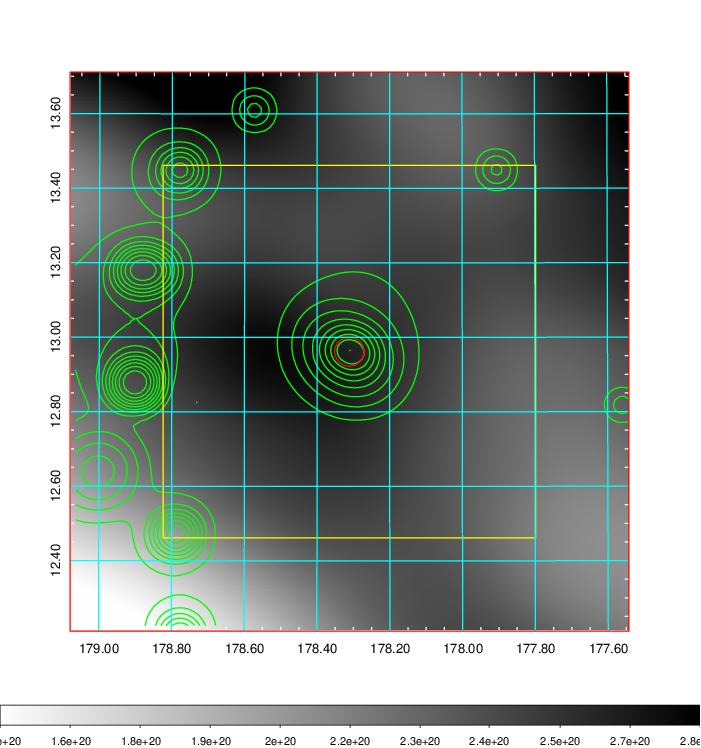    | 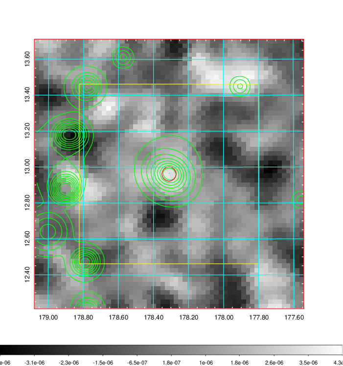 |

|[Redshift Histogram](../image/431/431_zg.pdf) | [DSS image(z1)](../image/431/431_dss_z1.pdf)      |  [DSS image(z2)](../image/431/431_dss_z2.pdf)    |
|-------------------|--------------------|-------------------|
|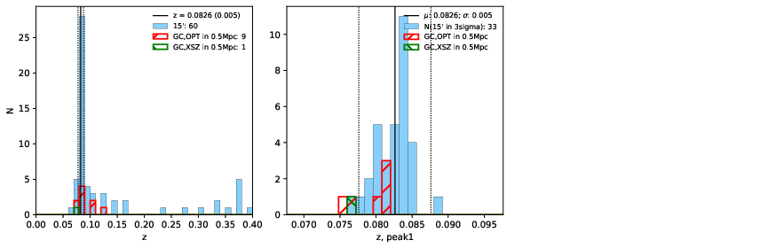 |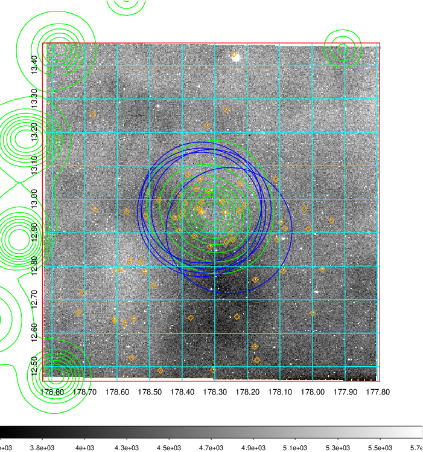  Blue circle for optical clusters;  Magenta circle for XSZ clusters;  all with r=1Mpc;  Only GC with Delta_z<0.01 are shown. | 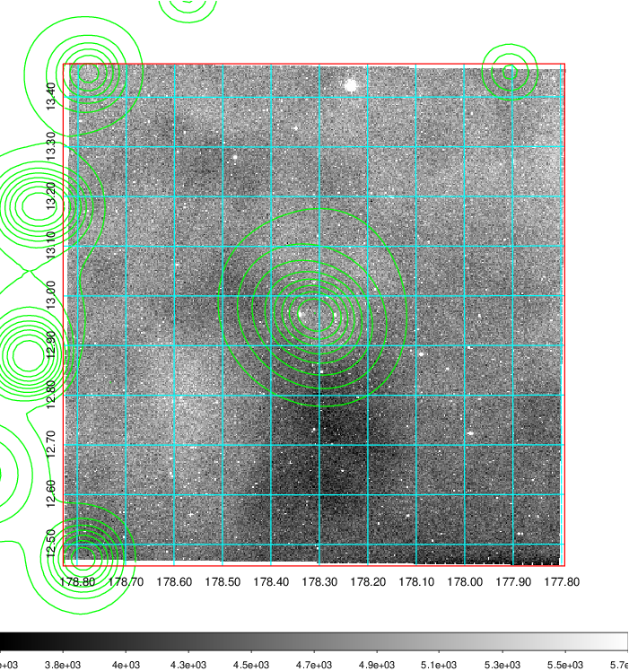 Blue circle for optical clusters;  Magenta circle for XSZ clusters;  all with r=1Mpc;  Only GC with Delta_z<0.01 are shown.  |

|[known Abell/XSZ clusters](../image/431/431_gc.pdf) | [2MASS image](../image/431/431_2mass.pdf)      |[SDSS image](../image/431/431_sdss.pdf)   |
|-------------------|-------------------|-------------------|
|  Magenta, blue and green circles  for optical, X-ray and SZ clusters  respectively, with redshift of clusters  labelled. The radius of circles  are 1Mpc.|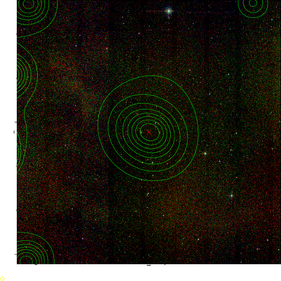  | 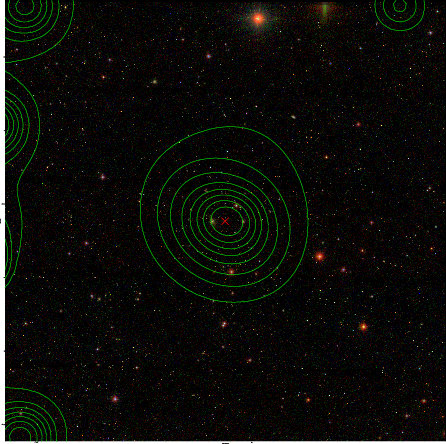  |

