

### 432

|Name|RAJ2000[deg]|DEJ2000[deg] |Ext[arcmin]| Ext,ml | z | z_src| C|GC(XSZ,Delta_z<0.01)| GC(OPT,Delta_z<0.01)|GC| R_sig[arcmin] | R500[arcmin] | R500[Mpc]| CRsig[c/s] | CR500[c/s] |L500[1E44 erg/s]|F500[1E-12 erg/s/cm^2]| M500[1E14 Msun]|Tx[keV]|Cnt_sig|Beta|Rc[arcmin]|Comment|Alias|
|---|---|---|---|---|---|------|---|--------|---------|----------|---|---|---|---|---|---|---|---|---|---|---|---|---|---|
|432| 178.826| 23.403| 1.10| 116.53| 0.1409(0.005)| z1, z_xsz| B| F20, MCXC, PSZ2, Tar, XB| A, C, N, RM, W| A, C, F20, MCXC, N, PSZ2, Tar, W, XB| 8.312| 8.801| 1.310| 0.654(0.046)| 0.661(0.046)| 7.030(0.193)| 13.242(0.363)| 7.33(0.10)| 7.66(0.06)| 290.3| 0.837(-0.089+0.096)| 2.656(-0.479+0.450)| -| k042|

|[RASS image](../image/432/432_img.pdf)|[filtered image](../image/432/432_fil.pdf)|[Segment image](../image/432/432_seg.pdf)|
|-------------------|--------------------|-------------------|
| 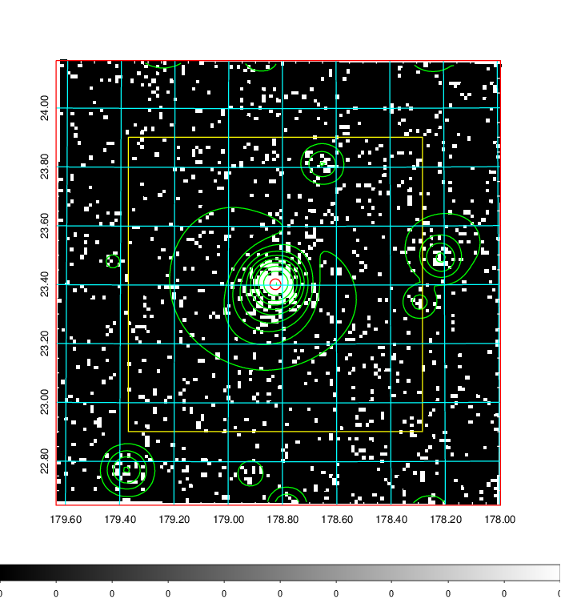  | 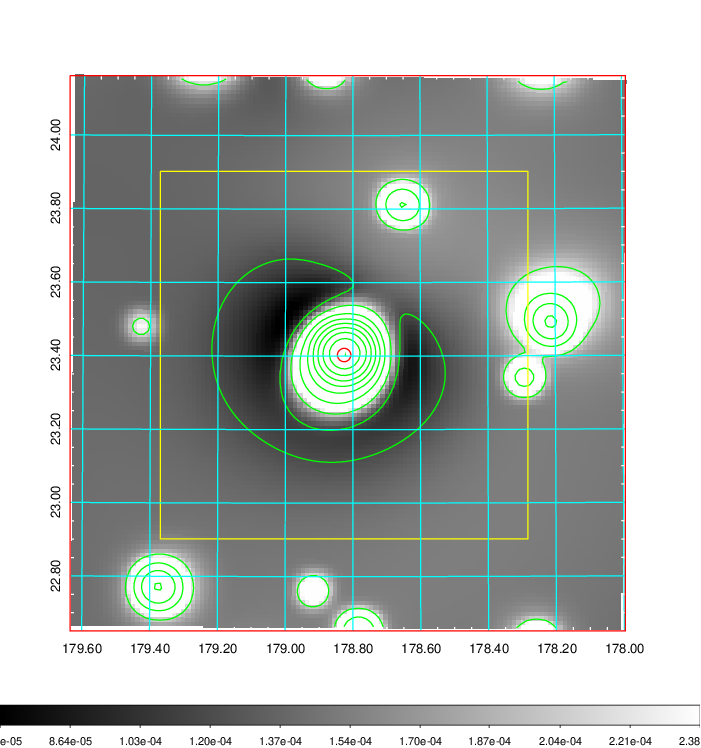   | 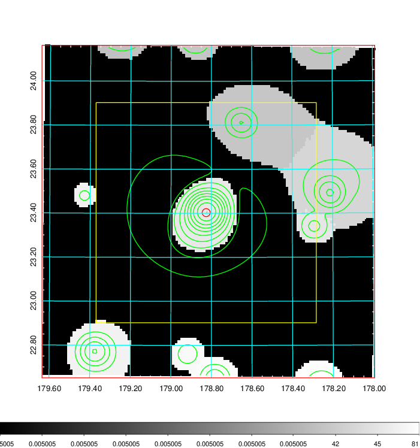  |

|[Exposure image](../image/432/432_mex.pdf)| [nH image](../image/432/432_nh.pdf)| [Planck image](../image/432/432_p.pdf)|
|-------------------|--------------------|-------------------|
|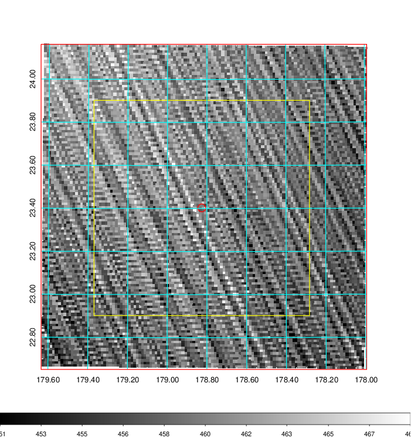   | 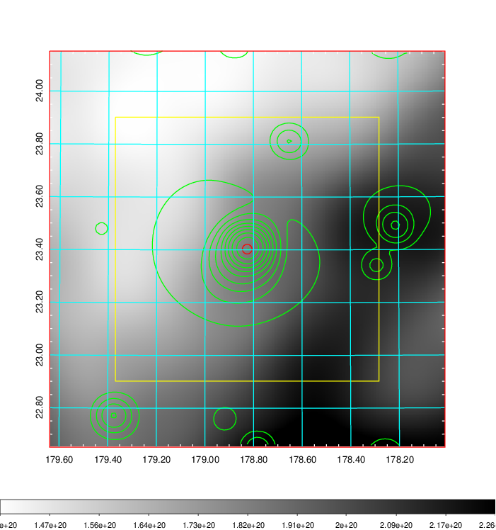    | 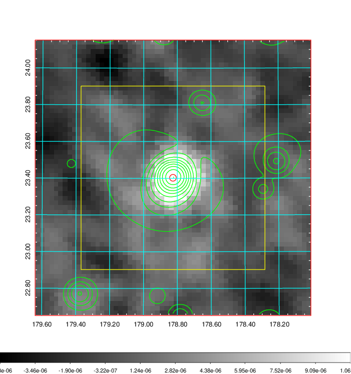 |

|[Redshift Histogram](../image/432/432_zg.pdf) | [DSS image(z1)](../image/432/432_dss_z1.pdf)      |  [DSS image(z2)](../image/432/432_dss_z2.pdf)    |
|-------------------|--------------------|-------------------|
|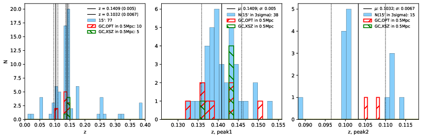 |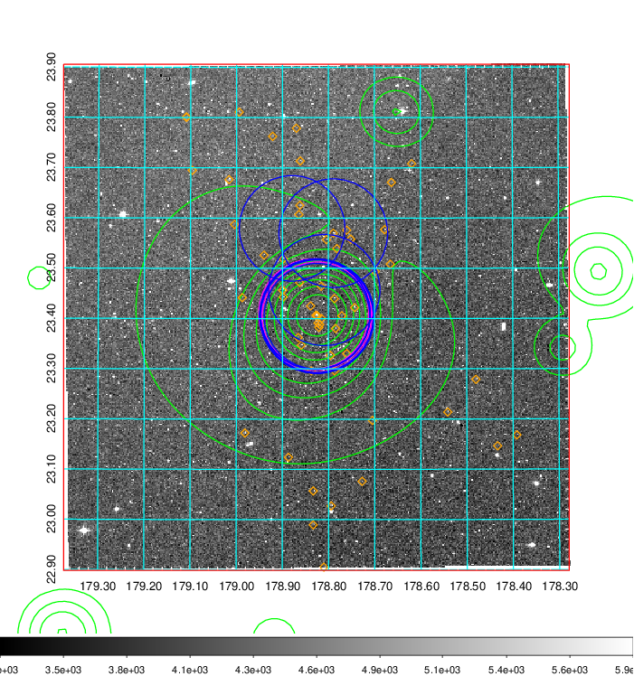  Blue circle for optical clusters;  Magenta circle for XSZ clusters;  all with r=1Mpc;  Only GC with Delta_z<0.01 are shown. | 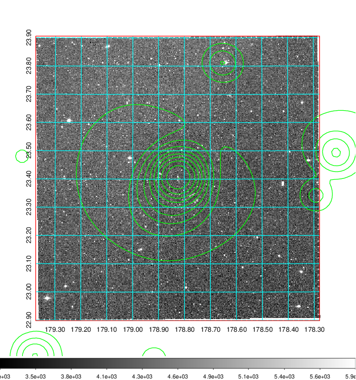 Blue circle for optical clusters;  Magenta circle for XSZ clusters;  all with r=1Mpc;  Only GC with Delta_z<0.01 are shown.  |

|[Previous-identified clusters](../image/432/432_gc.pdf) | [2MASS image](../image/432/432_2mass.pdf)      |[SDSS image](../image/432/432_sdss.pdf)   |
|-------------------|-------------------|-------------------|
|  Green, magenta, and blue circles  for optical, X-ray and SZ clusters  respectively, with redshift of clusters  labelled. The radius of circles  are 1Mpc.|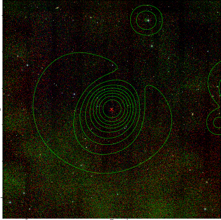  | 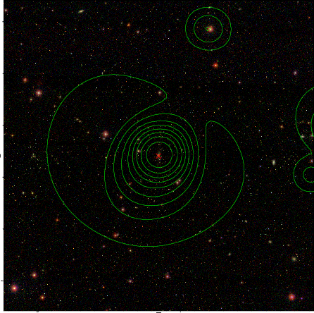  |

