

### 434

|Name|RAJ2000[deg]|DEJ2000[deg] |Ext[arcmin]| Ext,ml | z | z_src| C|GC(XSZ,Delta_z<0.01)| GC(OPT,Delta_z<0.01)|GC| R_sig[arcmin] | R500[arcmin] | R500[Mpc]| CRsig[c/s] | CR500[c/s] |L500[1E44 erg/s]|F500[1E-12 erg/s/cm^2]| M500[1E14 Msun]|Tx[keV]|Cnt_sig|Beta|Rc[arcmin]|Comment|Alias|
|---|---|---|---|---|---|------|---|--------|---------|----------|---|---|---|---|---|---|---|---|---|---|---|---|---|---|
|434| 179.341| 33.634| 2.10| 53.27| 0.2141(0.005)| z2, z_xsz| B| F20, MCXC, PSZ2, SPI, Tar, XB| N, RM, W| A, C, F20, MCXC, N, PSZ2, SPI, Tar, W, XB| 7.338| 5.576| 1.164| 0.190(0.034)| 0.183(0.033)| 5.013(0.432)| 3.744(0.322)| 5.55(0.23)| 6.61(0.17)| 91.4| 0.940(-0.078+0.044)| 4.488(-0.476+0.386)| -| k234|

|[RASS image](../image/434/434_img.pdf)|[filtered image](../image/434/434_fil.pdf)|[Segment image](../image/434/434_seg.pdf)|
|-------------------|--------------------|-------------------|
| 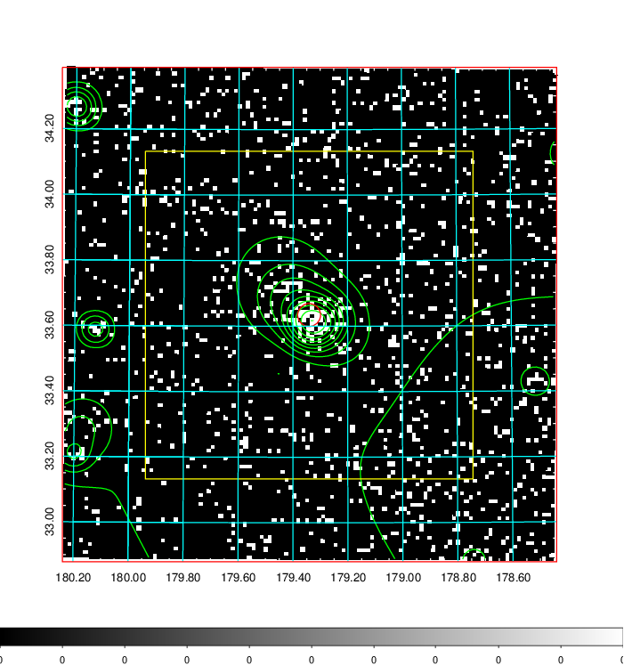  | 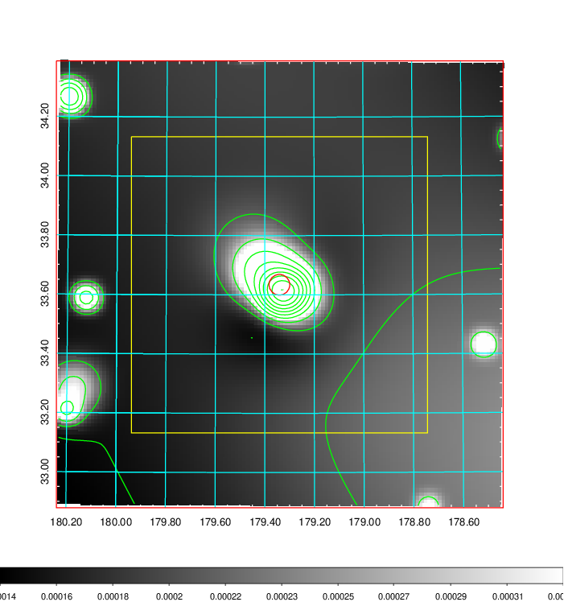   | 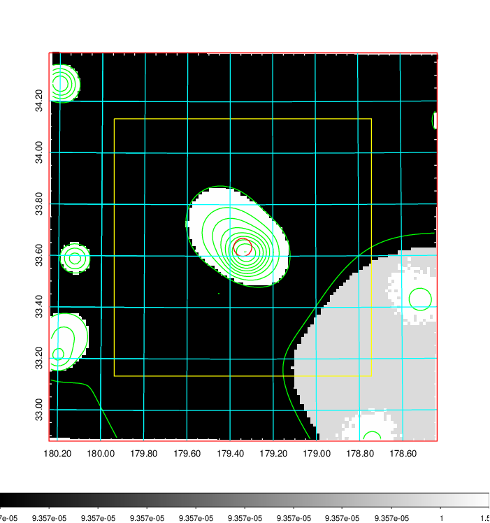  |

|[Exposure image](../image/434/434_mex.pdf)| [nH image](../image/434/434_nh.pdf)| [Planck image](../image/434/434_p.pdf)|
|-------------------|--------------------|-------------------|
|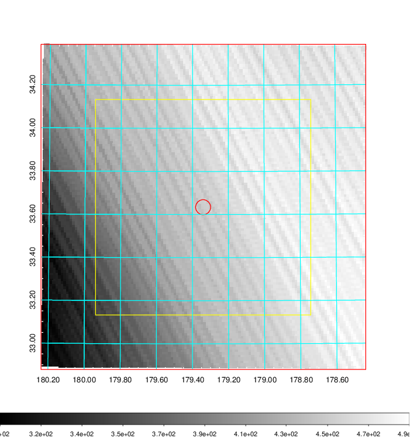   | 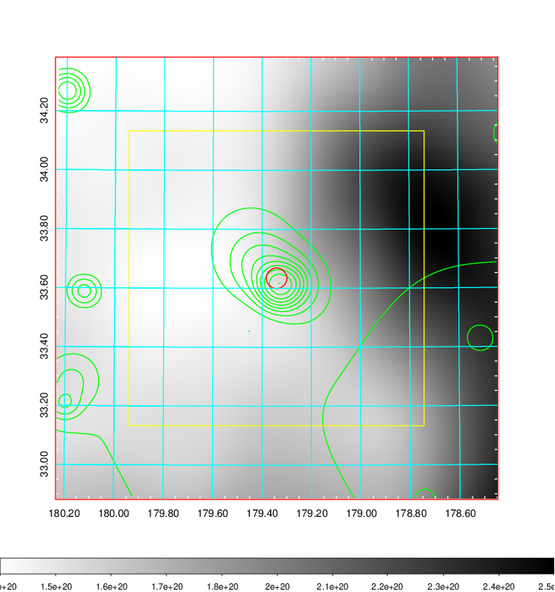    | 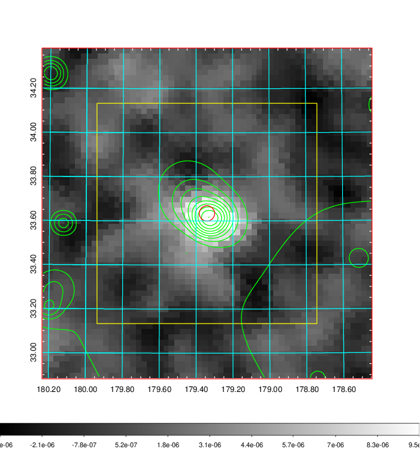 |

|[Redshift Histogram](../image/434/434_zg.pdf) | [DSS image(z1)](../image/434/434_dss_z1.pdf)      |  [DSS image(z2)](../image/434/434_dss_z2.pdf)    |
|-------------------|--------------------|-------------------|
|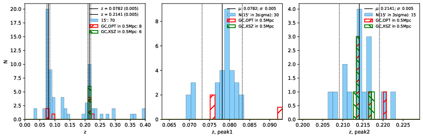 |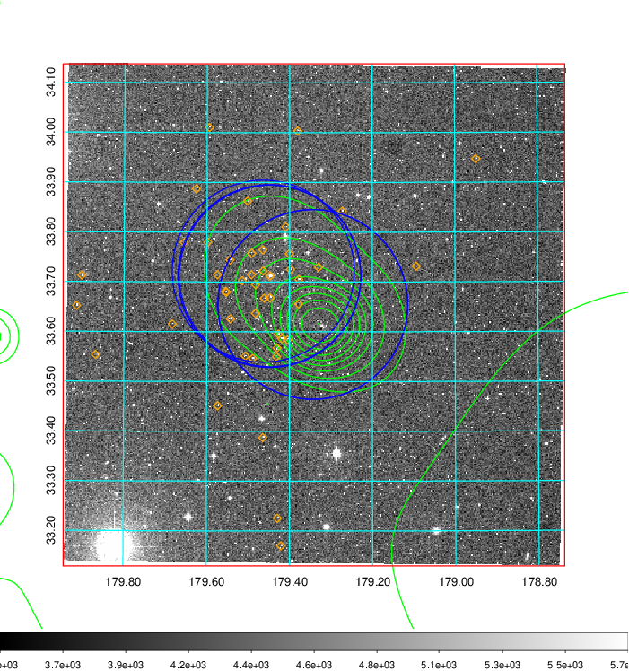  Blue circle for optical clusters;  Magenta circle for XSZ clusters;  all with r=1Mpc;  Only GC with Delta_z<0.01 are shown. | 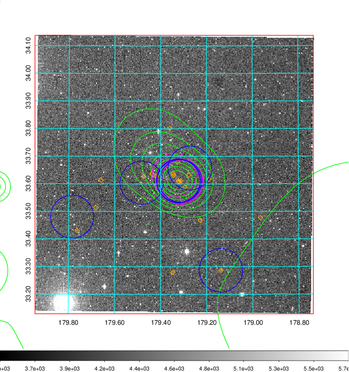 Blue circle for optical clusters;  Magenta circle for XSZ clusters;  all with r=1Mpc;  Only GC with Delta_z<0.01 are shown.  |

|[Previous-identified clusters](../image/434/434_gc.pdf) | [2MASS image](../image/434/434_2mass.pdf)      |[SDSS image](../image/434/434_sdss.pdf)   |
|-------------------|-------------------|-------------------|
|  Green, magenta, and blue circles  for optical, X-ray and SZ clusters  respectively, with redshift of clusters  labelled. The radius of circles  are 1Mpc.|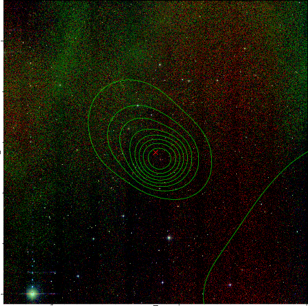  | 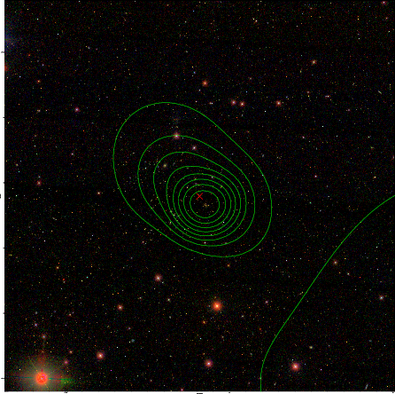  |

