

### 435

|Name|RAJ2000[deg]|DEJ2000[deg] |Ext[arcmin]| Ext,ml | z | z_src| C|GC(XSZ,Delta_z<0.01)| GC(OPT,Delta_z<0.01)|GC| R_sig[arcmin] | R500[arcmin] | R500[Mpc]| CRsig[c/s] | CR500[c/s] |L500[1E44 erg/s]|F500[1E-12 erg/s/cm^2]| M500[1E14 Msun]|Tx[keV]|Cnt_sig|Beta|Rc[arcmin]|Comment|Alias|
|---|---|---|---|---|---|------|---|--------|---------|----------|---|---|---|---|---|---|---|---|---|---|---|---|---|---|
|435| 179.365| 5.103| 3.23| 49.85| 0.0761(0.005)| z1, z_xsz| B| L03, MCXC| A, N, RM, W| A, F20, L03, MCXC, N, W| 12.700| 9.323| 0.807| 0.220(0.032)| 0.211(0.031)| 0.573(0.057)| 4.034(0.402)| 1.61(0.08)| 2.94(0.09)| 94.1| 0.813(-0.156+0.129)| 6.161(-1.451+1.111)| -| k400|

|[RASS image](../image/435/435_img.pdf)|[filtered image](../image/435/435_fil.pdf)|[Segment image](../image/435/435_seg.pdf)|
|-------------------|--------------------|-------------------|
| 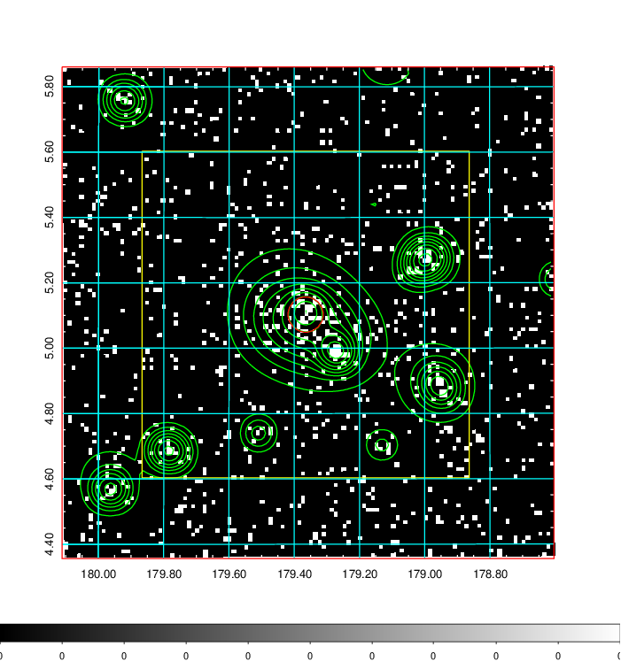  | 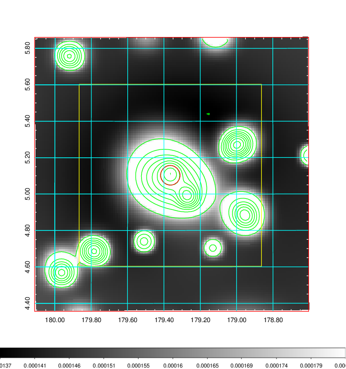   | 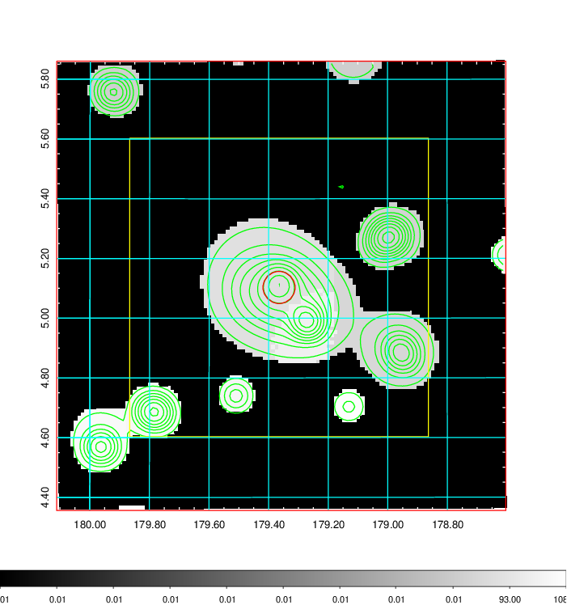  |

|[Exposure image](../image/435/435_mex.pdf)| [nH image](../image/435/435_nh.pdf)| [Planck image](../image/435/435_p.pdf)|
|-------------------|--------------------|-------------------|
|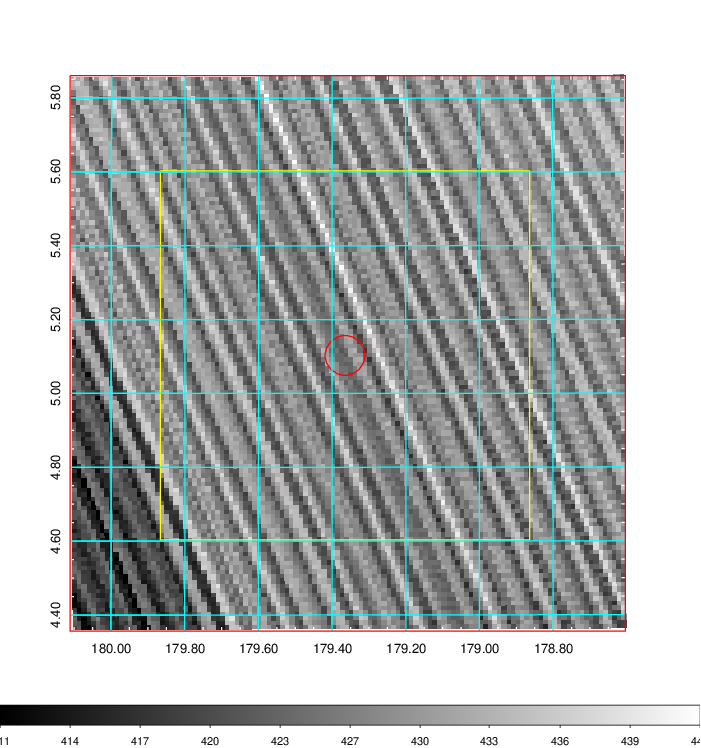   | 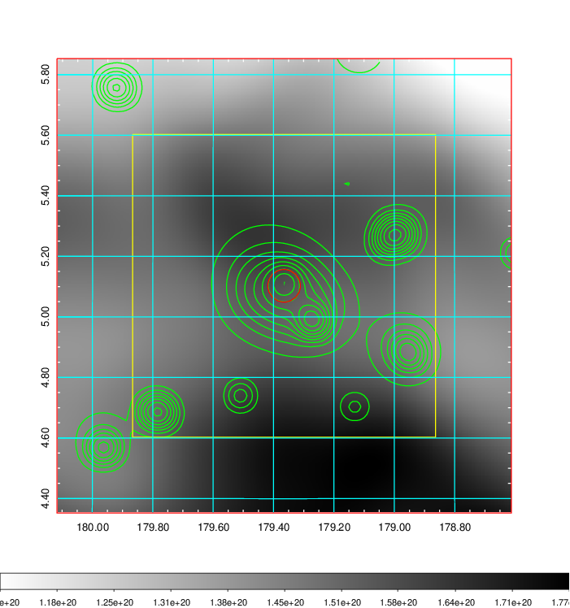    | 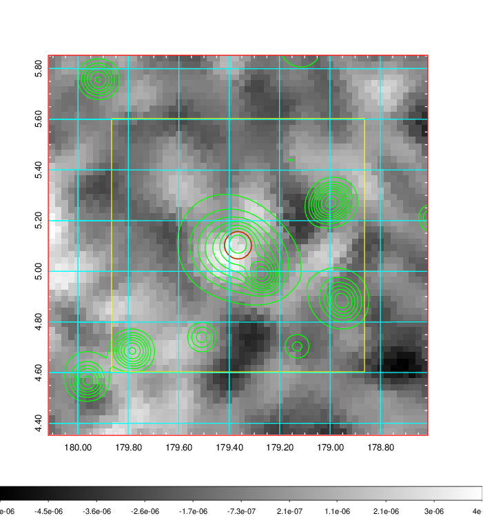 |

|[Redshift Histogram](../image/435/435_zg.pdf) | [DSS image(z1)](../image/435/435_dss_z1.pdf)      |  [DSS image(z2)](../image/435/435_dss_z2.pdf)    |
|-------------------|--------------------|-------------------|
|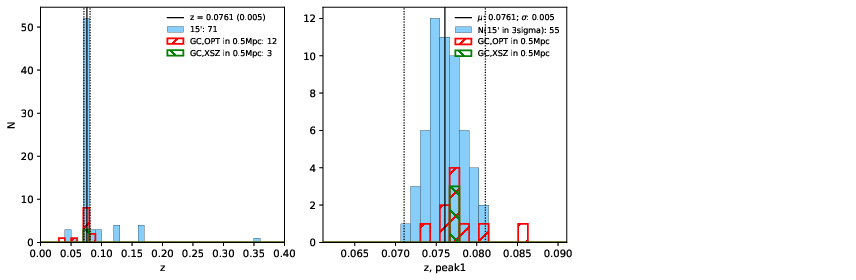 |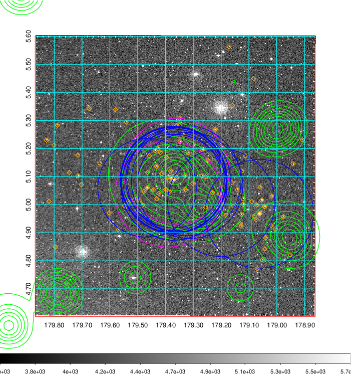  Blue circle for optical clusters;  Magenta circle for XSZ clusters;  all with r=1Mpc;  Only GC with Delta_z<0.01 are shown. | 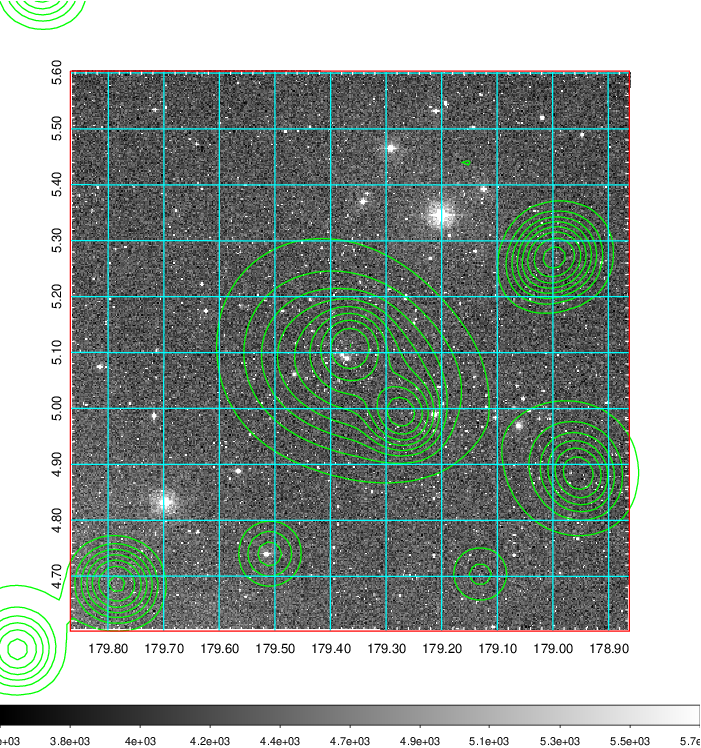 Blue circle for optical clusters;  Magenta circle for XSZ clusters;  all with r=1Mpc;  Only GC with Delta_z<0.01 are shown.  |

|[known Abell/XSZ clusters](../image/435/435_gc.pdf) | [2MASS image](../image/435/435_2mass.pdf)      |[SDSS image](../image/435/435_sdss.pdf)   |
|-------------------|-------------------|-------------------|
|  Magenta, blue and green circles  for optical, X-ray and SZ clusters  respectively, with redshift of clusters  labelled. The radius of circles  are 1Mpc.|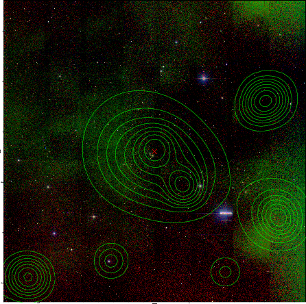  | 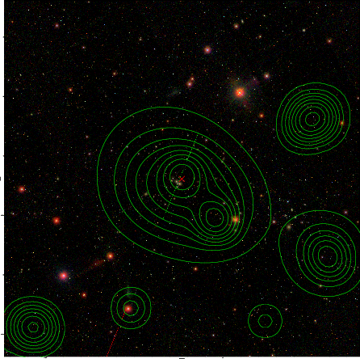  |

