

### 436

|Name|RAJ2000[deg]|DEJ2000[deg] |Ext[arcmin]| Ext,ml | z | z_src| C|GC(XSZ,Delta_z<0.01)| GC(OPT,Delta_z<0.01)|GC| R_sig[arcmin] | R500[arcmin] | R500[Mpc]| CRsig[c/s] | CR500[c/s] |L500[1E44 erg/s]|F500[1E-12 erg/s/cm^2]| M500[1E14 Msun]|Tx[keV]|Cnt_sig|Beta|Rc[arcmin]|Comment|Alias|
|---|---|---|---|---|---|------|---|--------|---------|----------|---|---|---|---|---|---|---|---|---|---|---|---|---|---|
|436| 179.530| -2.244| 7.48| 41.78| 0.0826(0.005)| z1, z_opt| S| -| N| C, F20, N, W| 23.712| 8.462| 0.789| 0.176(0.059)| 0.159(0.053)| 0.503(0.235)| 2.976(1.389)| 1.51(0.36)| 2.84(0.42)| 65.2| 0.652(-0.092+0.128)| 8.338(-1.555+1.843)| -| t375|

|[RASS image](../image/436/436_img.pdf)|[filtered image](../image/436/436_fil.pdf)|[Segment image](../image/436/436_seg.pdf)|
|-------------------|--------------------|-------------------|
| 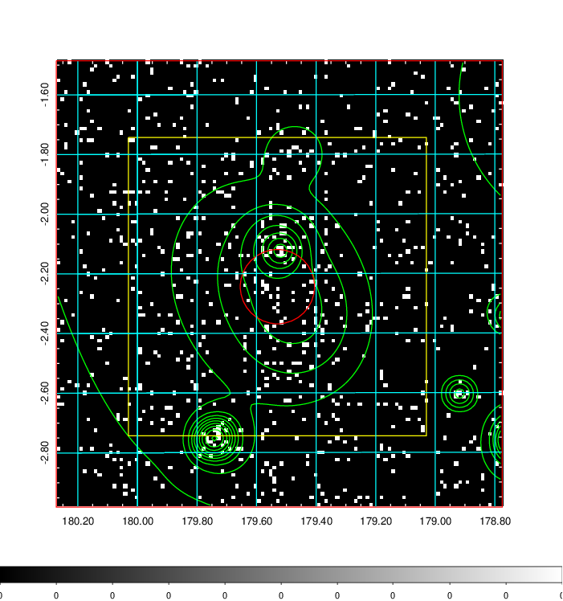  | 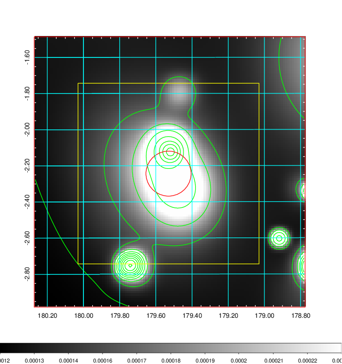   | 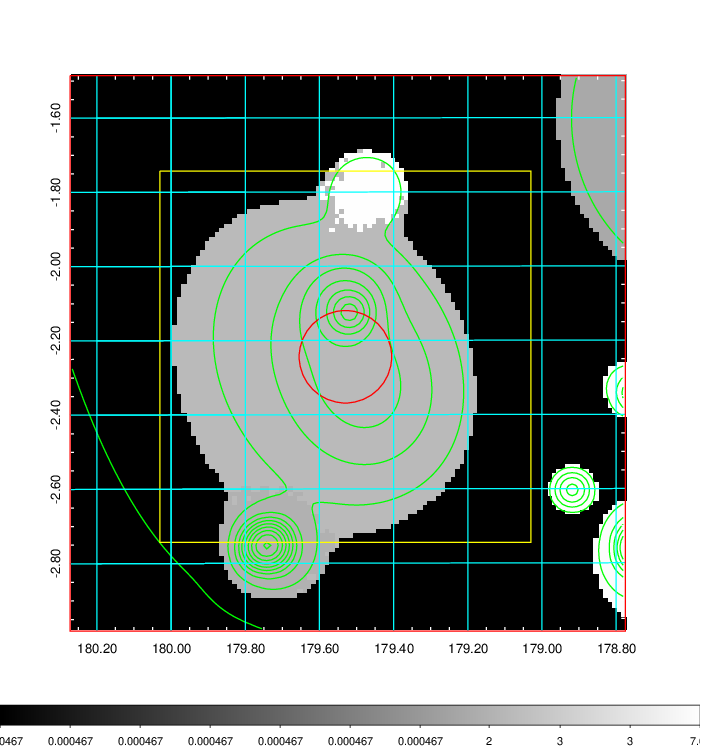  |

|[Exposure image](../image/436/436_mex.pdf)| [nH image](../image/436/436_nh.pdf)| [Planck image](../image/436/436_p.pdf)|
|-------------------|--------------------|-------------------|
|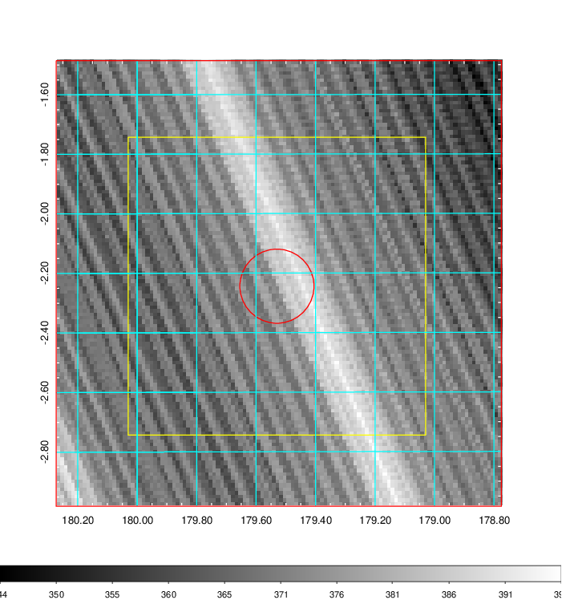   | 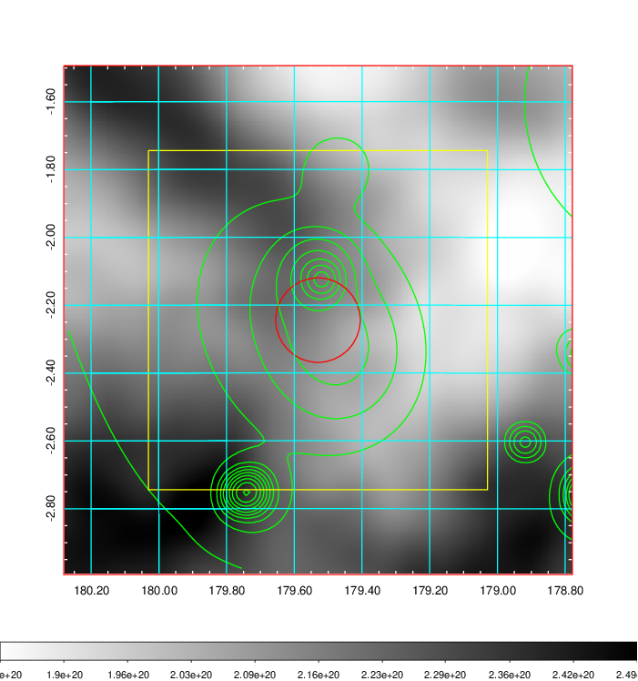    | 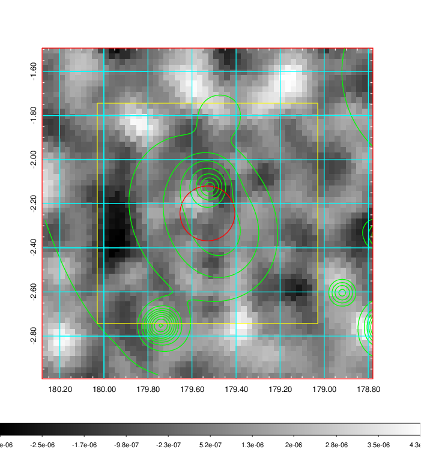 |

|[Redshift Histogram](../image/436/436_zg.pdf) | [DSS image(z1)](../image/436/436_dss_z1.pdf)      |  [DSS image(z2)](../image/436/436_dss_z2.pdf)    |
|-------------------|--------------------|-------------------|
|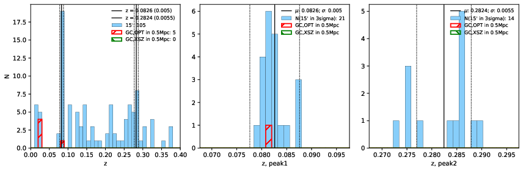 |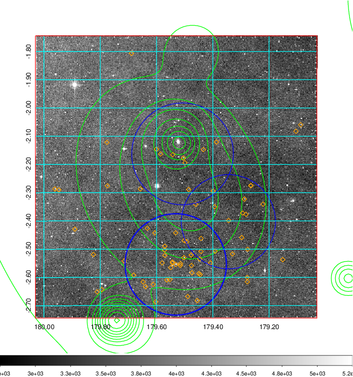  Blue circle for optical clusters;  Magenta circle for XSZ clusters;  all with r=1Mpc;  Only GC with Delta_z<0.01 are shown. | 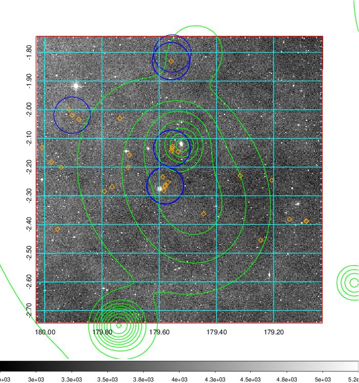 Blue circle for optical clusters;  Magenta circle for XSZ clusters;  all with r=1Mpc;  Only GC with Delta_z<0.01 are shown.  |

|[known Abell/XSZ clusters](../image/436/436_gc.pdf) | [2MASS image](../image/436/436_2mass.pdf)      |[SDSS image](../image/436/436_sdss.pdf)   |
|-------------------|-------------------|-------------------|
|  Magenta, blue and green circles  for optical, X-ray and SZ clusters  respectively, with redshift of clusters  labelled. The radius of circles  are 1Mpc.|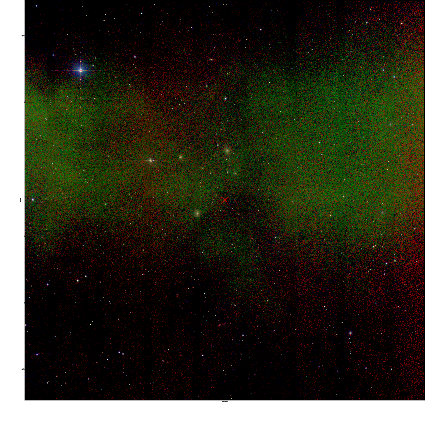  | 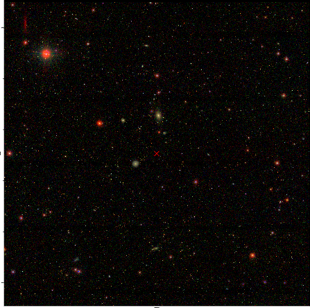  |

|[ATLAS image](../image/436/436_s.pdf)        |
|-------------------|
|   |
