

### 437

|Name|RAJ2000[deg]|DEJ2000[deg] |Ext[arcmin]| Ext,ml | z | z_src| C|GC(XSZ,Delta_z<0.01)| GC(OPT,Delta_z<0.01)|GC| R_sig[arcmin] | R500[arcmin] | R500[Mpc]| CRsig[c/s] | CR500[c/s] |L500[1E44 erg/s]|F500[1E-12 erg/s/cm^2]| M500[1E14 Msun]|Tx[keV]|Cnt_sig|Beta|Rc[arcmin]|Comment|Alias|
|---|---|---|---|---|---|------|---|--------|---------|----------|---|---|---|---|---|---|---|---|---|---|---|---|---|---|
|437| 179.846| 49.790| 2.39| 30.45| 0.3435(0.008)| z1, z_xsz| B| Tar| N, RM, W| A, C, F20, MCXC, N, PSZ2, SPI, Tar, W| 11.238| 4.366| 1.278| 0.152(0.034)| 0.138(0.031)| 11.075(1.362)| 2.804(0.345)| 8.49(0.47)| 8.99(0.32)| 62.7| 0.891(-0.116+0.078)| 5.312(-0.839+0.661)| -| k280|

|[RASS image](../image/437/437_img.pdf)|[filtered image](../image/437/437_fil.pdf)|[Segment image](../image/437/437_seg.pdf)|
|-------------------|--------------------|-------------------|
| 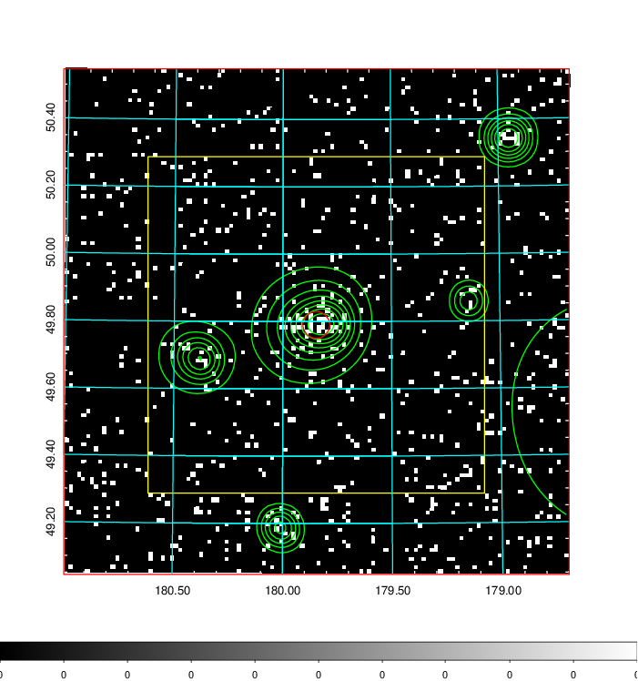  | 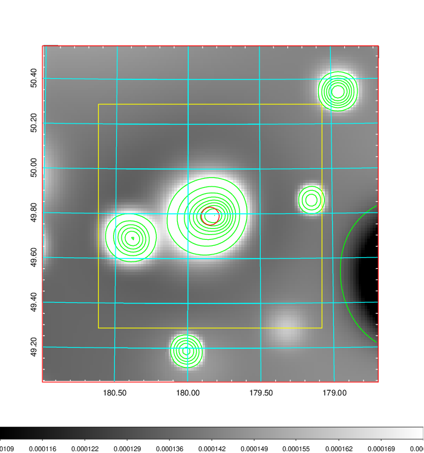   | 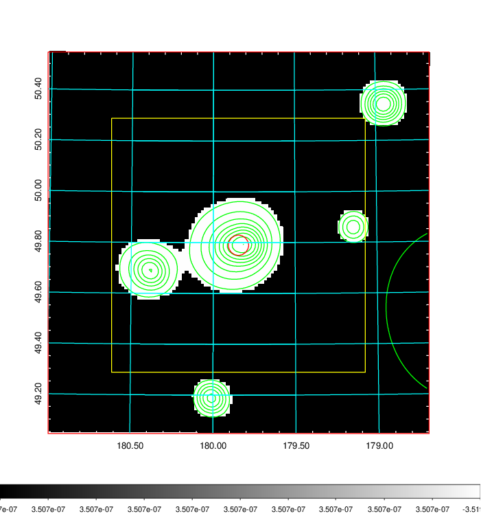  |

|[Exposure image](../image/437/437_mex.pdf)| [nH image](../image/437/437_nh.pdf)| [Planck image](../image/437/437_p.pdf)|
|-------------------|--------------------|-------------------|
|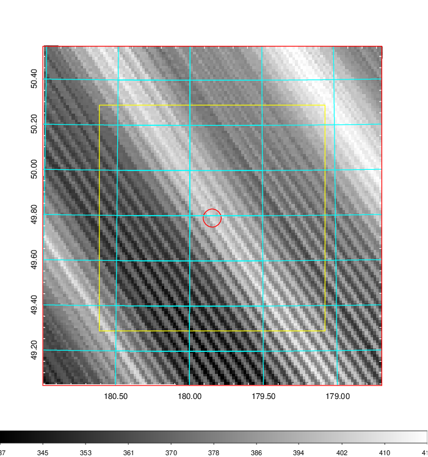   | 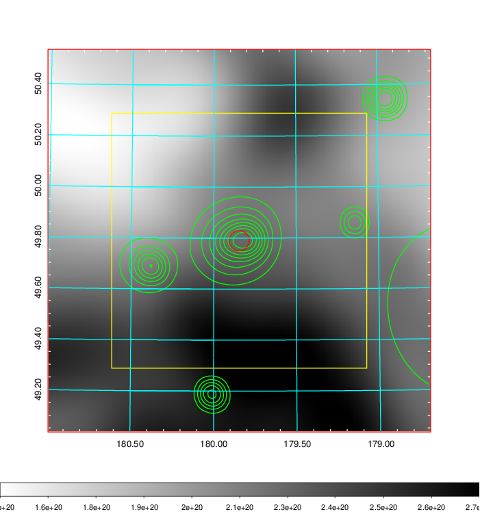    | 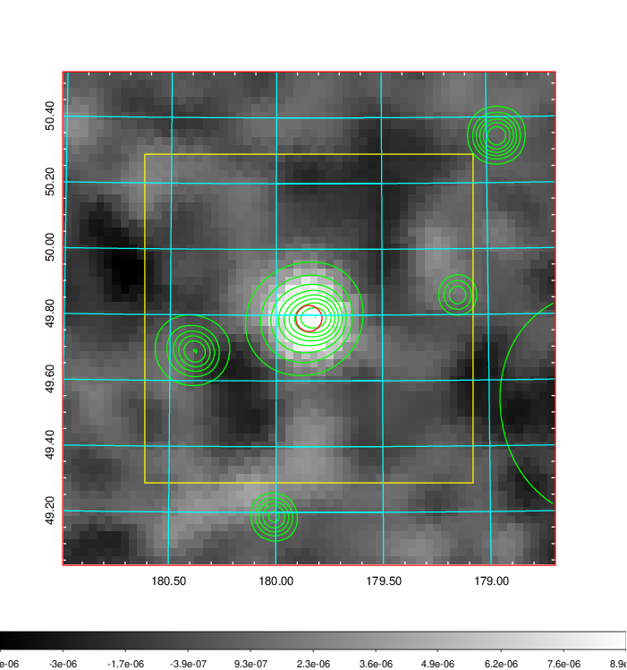 |

|[Redshift Histogram](../image/437/437_zg.pdf) | [DSS image(z1)](../image/437/437_dss_z1.pdf)      |  [DSS image(z2)](../image/437/437_dss_z2.pdf)    |
|-------------------|--------------------|-------------------|
|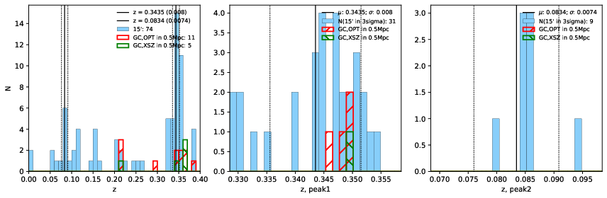 |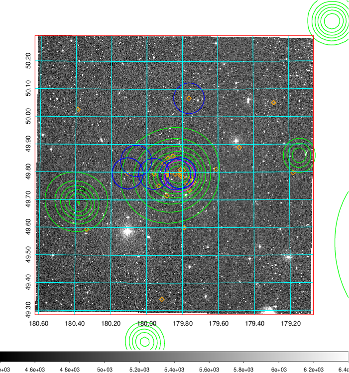  Blue circle for optical clusters;  Magenta circle for XSZ clusters;  all with r=1Mpc;  Only GC with Delta_z<0.01 are shown. | 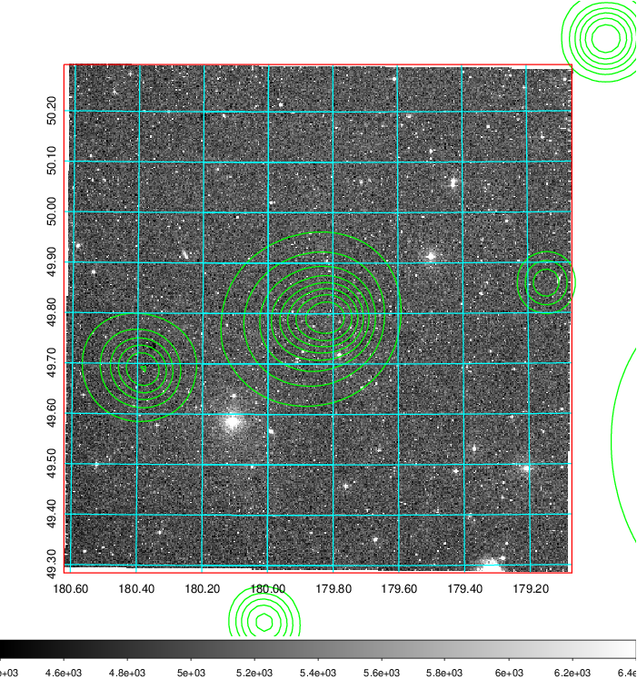 Blue circle for optical clusters;  Magenta circle for XSZ clusters;  all with r=1Mpc;  Only GC with Delta_z<0.01 are shown.  |

|[Previous-identified clusters](../image/437/437_gc.pdf) | [2MASS image](../image/437/437_2mass.pdf)      |[SDSS image](../image/437/437_sdss.pdf)   |
|-------------------|-------------------|-------------------|
|  Green, magenta, and blue circles  for optical, X-ray and SZ clusters  respectively, with redshift of clusters  labelled. The radius of circles  are 1Mpc.|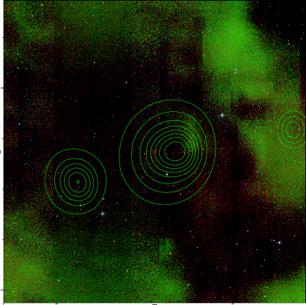  | 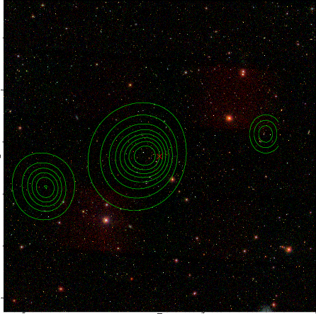  |

