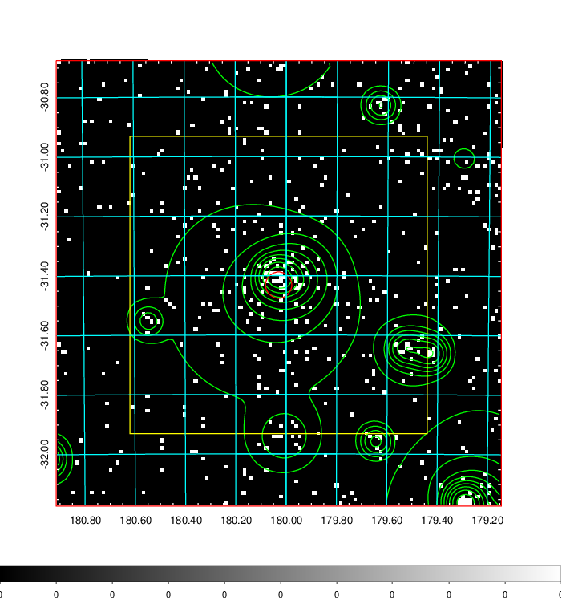
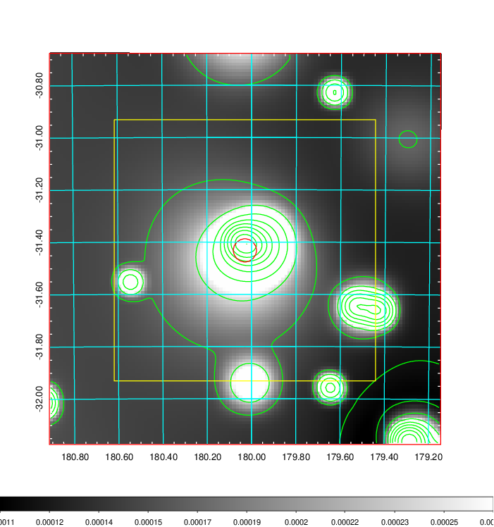
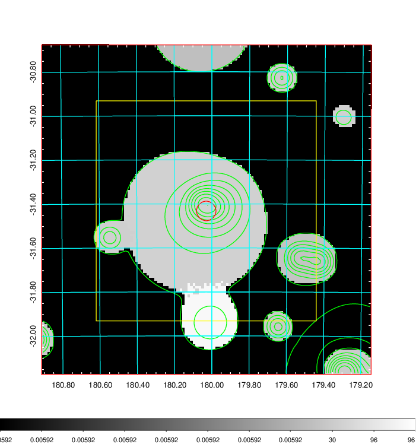
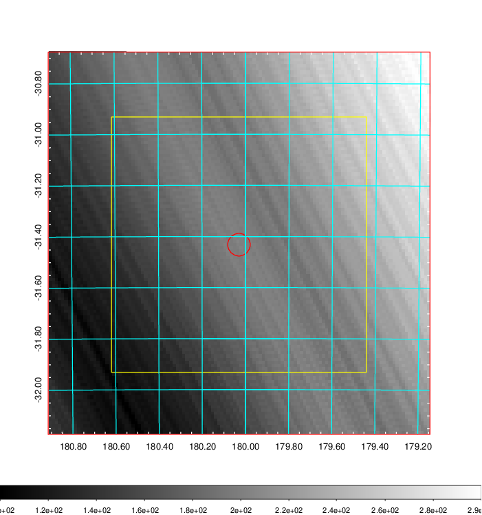
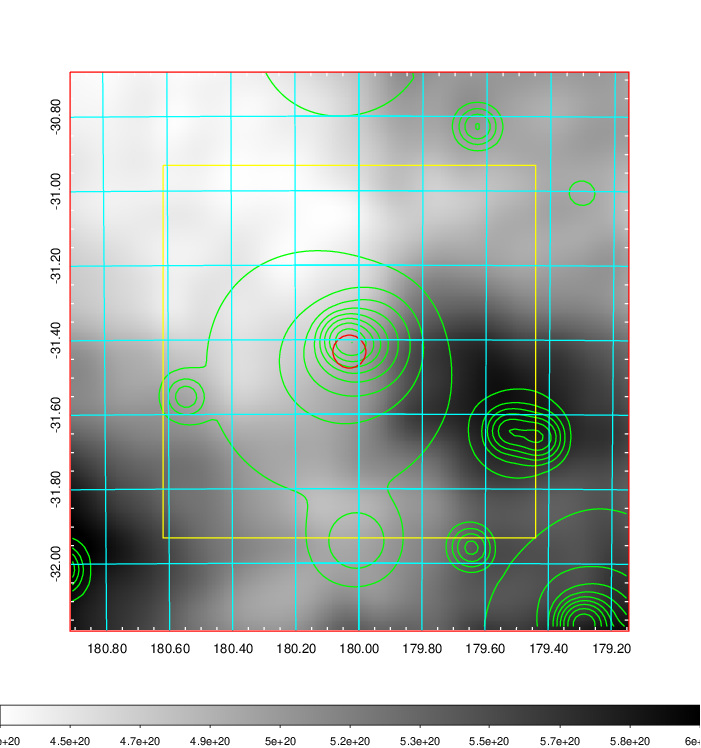
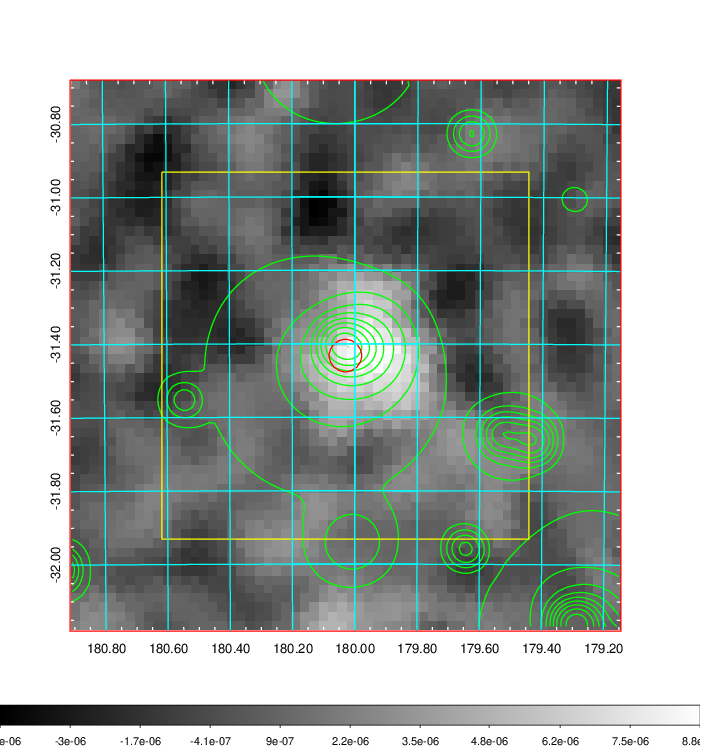
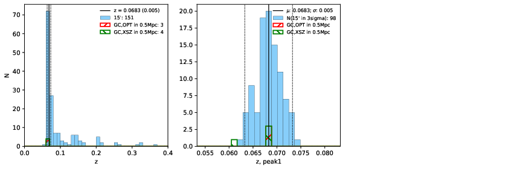
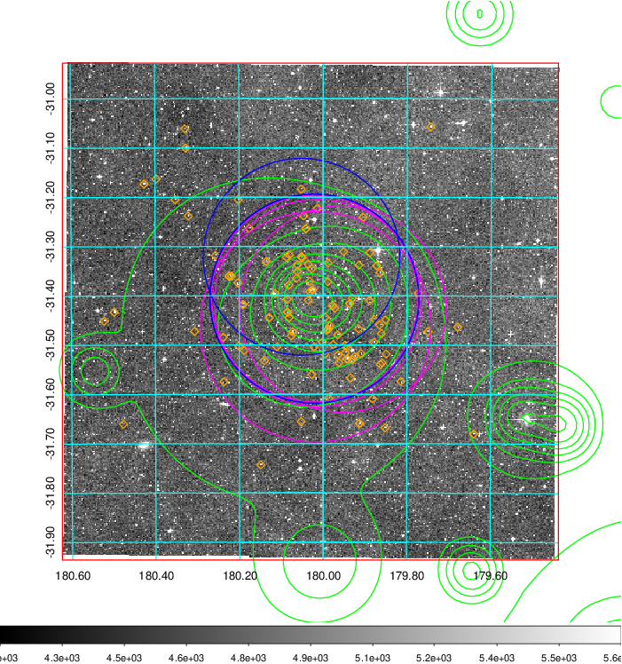
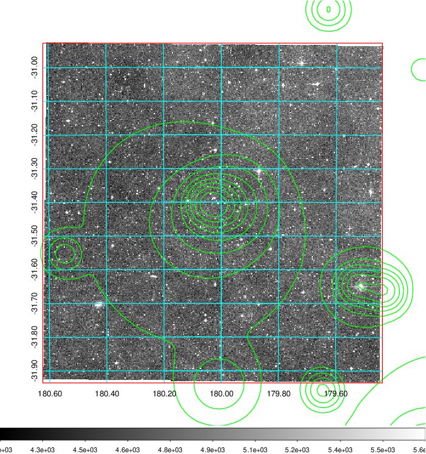
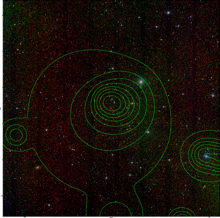

### 438

|Name|RAJ2000[deg]|DEJ2000[deg] |Ext[arcmin]| Ext,ml | z | z_src| C|GC(XSZ,Delta_z<0.01)| GC(OPT,Delta_z<0.01)|GC| R_sig[arcmin] | R500[arcmin] | R500[Mpc]| CRsig[c/s] | CR500[c/s] |L500[1E44 erg/s]|F500[1E-12 erg/s/cm^2]| M500[1E14 Msun]|Tx[keV]|Cnt_sig|Beta|Rc[arcmin]|Comment|Alias|
|---|---|---|---|---|---|------|---|--------|---------|----------|---|---|---|---|---|---|---|---|---|---|---|---|---|---|
|438| 180.030| -31.432| 2.65| 39.13| 0.0683(0.005)| z1, z_xsz| B| MCXC, PSZ2, Tar, XB| A, N| A, MCXC, N, PSZ2, Tar, W, XB| 22.231| 11.676| 0.916| 0.471(0.092)| 0.437(0.085)| 0.895(0.114)| 7.903(1.009)| 2.33(0.15)| 3.68(0.15)| 78.5| 0.580(-0.044+0.062)| 3.513(-0.729+0.946)| -| k328|

|[RASS image](../image/438/438_img.pdf)|[filtered image](../image/438/438_fil.pdf)|[Segment image](../image/438/438_seg.pdf)|
|-------------------|--------------------|-------------------|
|   |    |   |

|[Exposure image](../image/438/438_mex.pdf)| [nH image](../image/438/438_nh.pdf)| [Planck image](../image/438/438_p.pdf)|
|-------------------|--------------------|-------------------|
|   |     |  |

|[Redshift Histogram](../image/438/438_zg.pdf) | [DSS image(z1)](../image/438/438_dss_z1.pdf)      |  [DSS image(z2)](../image/438/438_dss_z2.pdf)    |
|-------------------|--------------------|-------------------|
| |  Blue circle for optical clusters;  Magenta circle for XSZ clusters;  all with r=1Mpc;  Only GC with Delta_z<0.01 are shown. |  Blue circle for optical clusters;  Magenta circle for XSZ clusters;  all with r=1Mpc;  Only GC with Delta_z<0.01 are shown.  |

|[Previous-identified clusters](../image/438/438_gc.pdf) | [2MASS image](../image/438/438_2mass.pdf)      |
|-------------------|-------------------|
|  Green, magenta, and blue circles  for optical, X-ray and SZ clusters  respectively, with redshift of clusters  labelled. The radius of circles  are 1Mpc.|  |

