

### 439

|Name|RAJ2000[deg]|DEJ2000[deg] |Ext[arcmin]| Ext,ml | z | z_src| C|GC(XSZ,Delta_z<0.01)| GC(OPT,Delta_z<0.01)|GC| R_sig[arcmin] | R500[arcmin] | R500[Mpc]| CRsig[c/s] | CR500[c/s] |L500[1E44 erg/s]|F500[1E-12 erg/s/cm^2]| M500[1E14 Msun]|Tx[keV]|Cnt_sig|Beta|Rc[arcmin]|Comment|Alias|
|---|---|---|---|---|---|------|---|--------|---------|----------|---|---|---|---|---|---|---|---|---|---|---|---|---|---|
|439| 180.076| 56.228| 4.34| 55.45| 0.0650(0.005)| z1, z_xsz| B| L03, MCXC, PSZ2, Tar| A, N, W| A, F20, L03, MCXC, N, PSZ2, SPI, Tar, W| 13.675| 10.624| 0.796| 0.275(0.038)| 0.266(0.037)| 0.524(0.053)| 5.137(0.523)| 1.52(0.08)| 2.83(0.09)| 136.1| 0.777(-0.156+0.149)| 7.234(-1.873+1.541)| -| k500|

|[RASS image](../image/439/439_img.pdf)|[filtered image](../image/439/439_fil.pdf)|[Segment image](../image/439/439_seg.pdf)|
|-------------------|--------------------|-------------------|
| 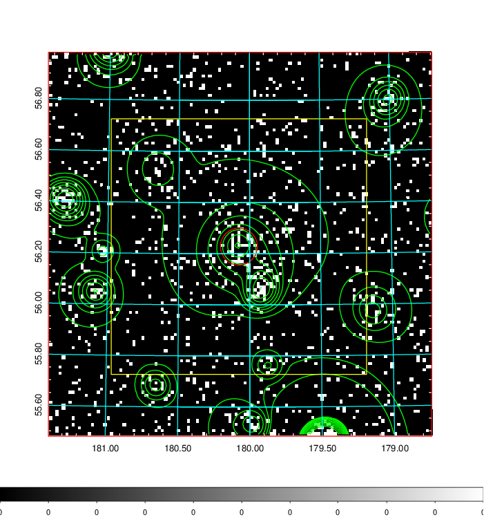  | 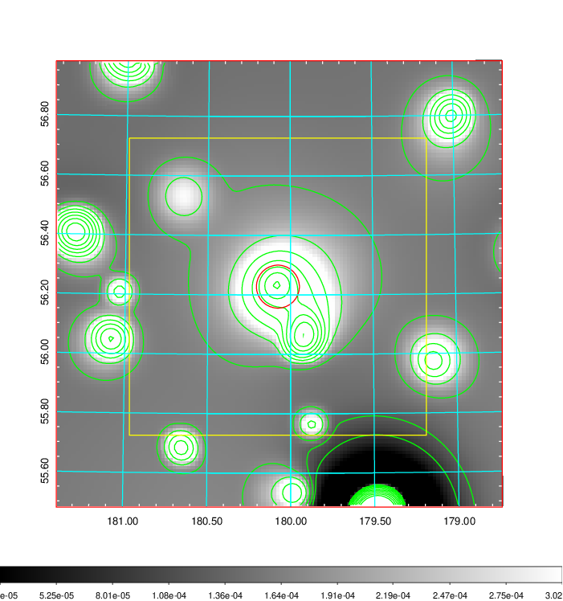   | 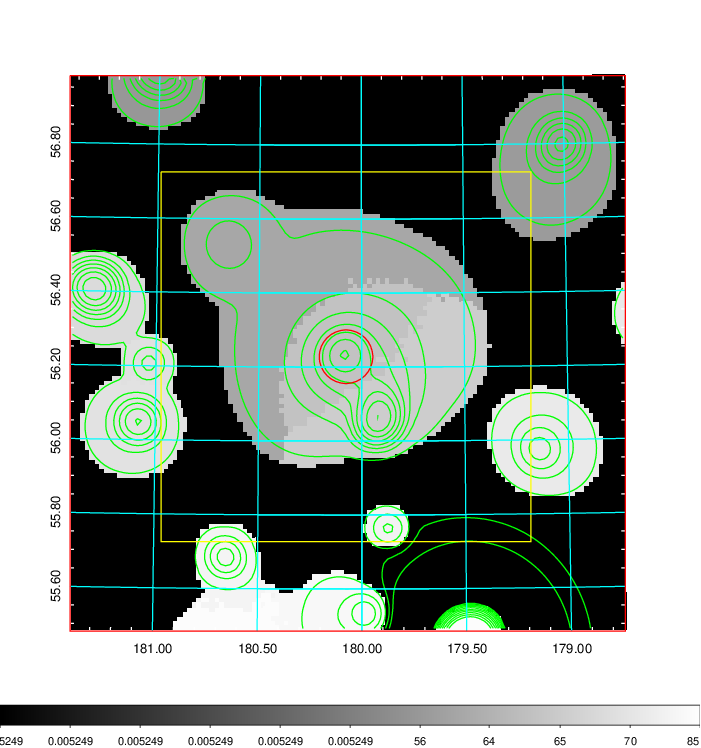  |

|[Exposure image](../image/439/439_mex.pdf)| [nH image](../image/439/439_nh.pdf)| [Planck image](../image/439/439_p.pdf)|
|-------------------|--------------------|-------------------|
|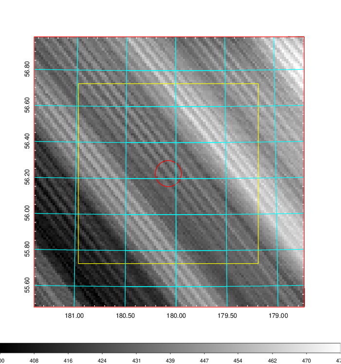   | 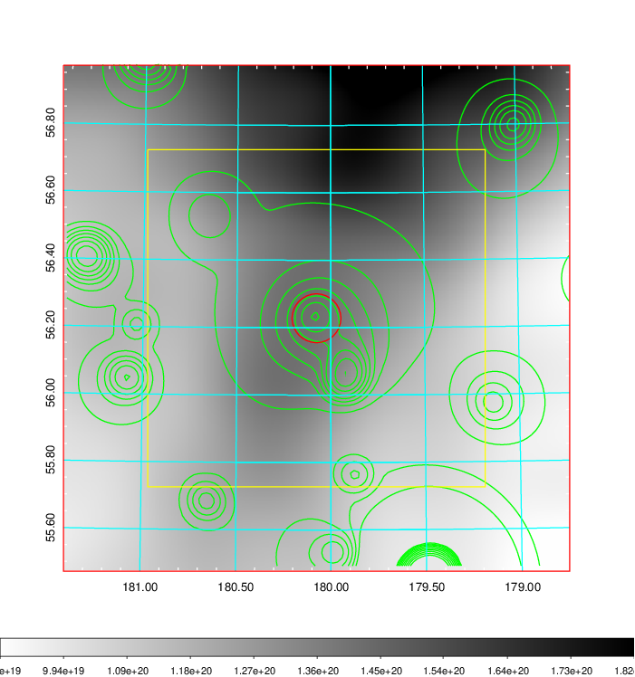    | 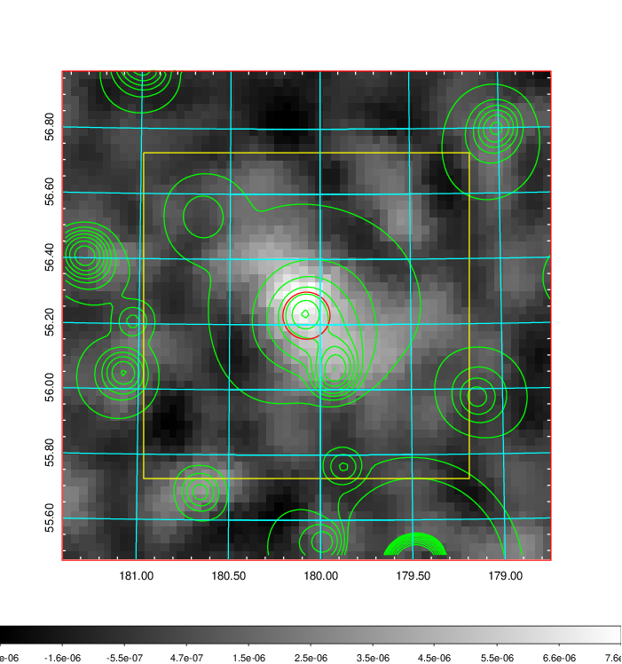 |

|[Redshift Histogram](../image/439/439_zg.pdf) | [DSS image(z1)](../image/439/439_dss_z1.pdf)      |  [DSS image(z2)](../image/439/439_dss_z2.pdf)    |
|-------------------|--------------------|-------------------|
|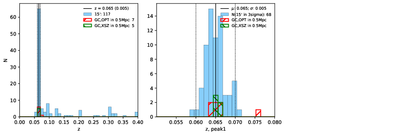 |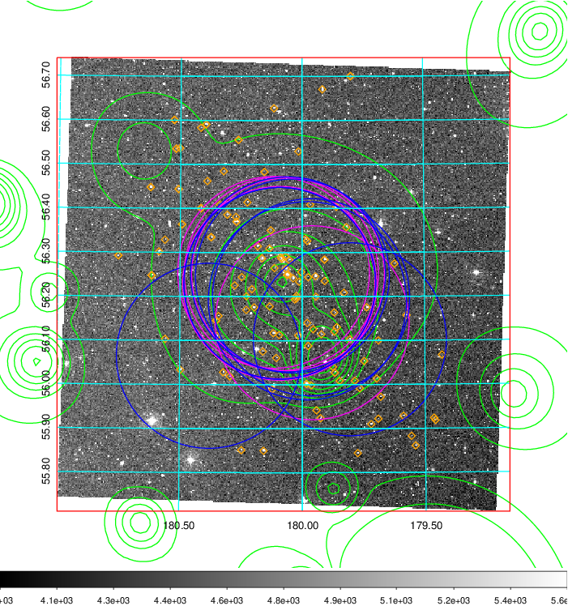  Blue circle for optical clusters;  Magenta circle for XSZ clusters;  all with r=1Mpc;  Only GC with Delta_z<0.01 are shown. | 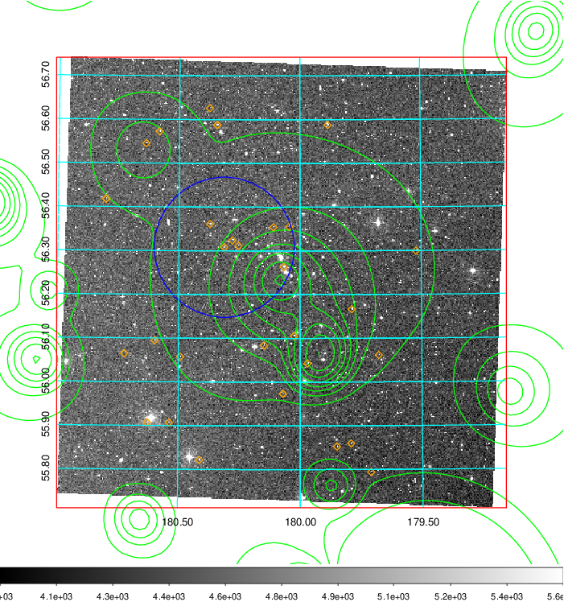 Blue circle for optical clusters;  Magenta circle for XSZ clusters;  all with r=1Mpc;  Only GC with Delta_z<0.01 are shown.  |

|[Previous-identified clusters](../image/439/439_gc.pdf) | [2MASS image](../image/439/439_2mass.pdf)      |[SDSS image](../image/439/439_sdss.pdf)   |
|-------------------|-------------------|-------------------|
|  Green, magenta, and blue circles  for optical, X-ray and SZ clusters  respectively, with redshift of clusters  labelled. The radius of circles  are 1Mpc.|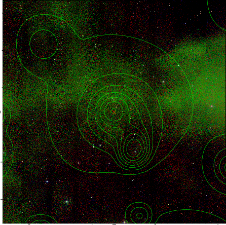  | 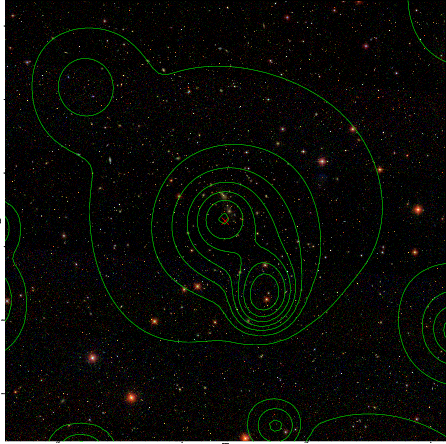  |

