

### 44

|Name|RAJ2000[deg]|DEJ2000[deg] |Ext[arcmin]| Ext,ml | z | z_src| C|GC(XSZ,Delta_z<0.01)| GC(OPT,Delta_z<0.01)|GC| R_sig[arcmin] | R500[arcmin] | R500[Mpc]| CRsig[c/s] | CR500[c/s] |L500[1E44 erg/s]|F500[1E-12 erg/s/cm^2]| M500[1E14 Msun]|Tx[keV]|Cnt_sig|Beta|Rc[arcmin]|Comment|Alias|
|---|---|---|---|---|---|------|---|--------|---------|----------|---|---|---|---|---|---|---|---|---|---|---|---|---|---|
|44| 14.086| -1.248| 6.99| 1146.94| 0.0441(0.005)| z1, z_xsz| B| L03, MCXC, PSZ2, Tar, XB| A, N, W| A, C, F20, L03, MCXC, N, PSZ2, SPI, Tar, W, XB| 27.169| 19.215| 1.001| 1.710(0.092)| 1.631(0.088)| 1.383(0.037)| 30.332(0.816)| 2.97(0.04)| 4.25(0.04)| 643.5| 0.763(-0.045+0.054)| 9.221(-0.792+0.887)| -| k556|

|[RASS image](../image/44/44_img.pdf)|[filtered image](../image/44/44_fil.pdf)|[Segment image](../image/44/44_seg.pdf)|
|-------------------|--------------------|-------------------|
| 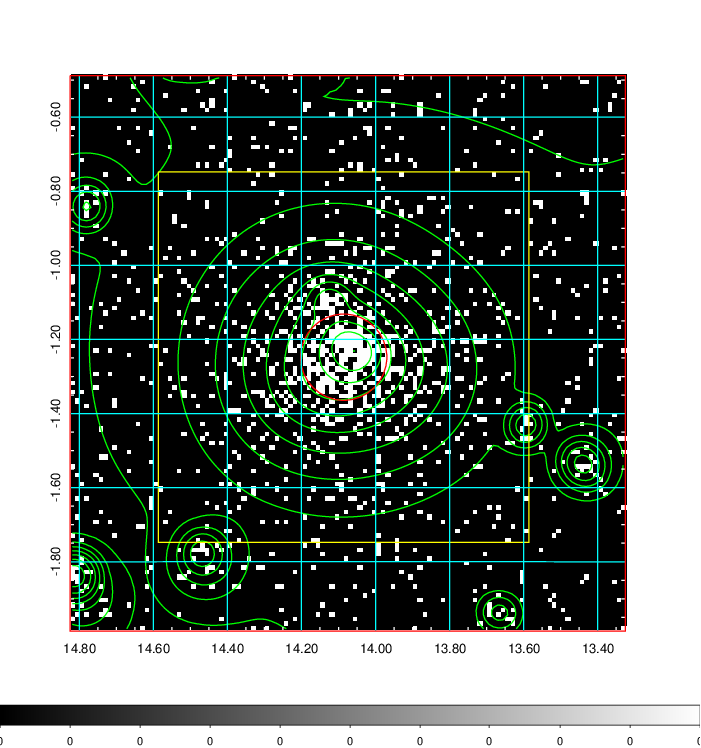  | 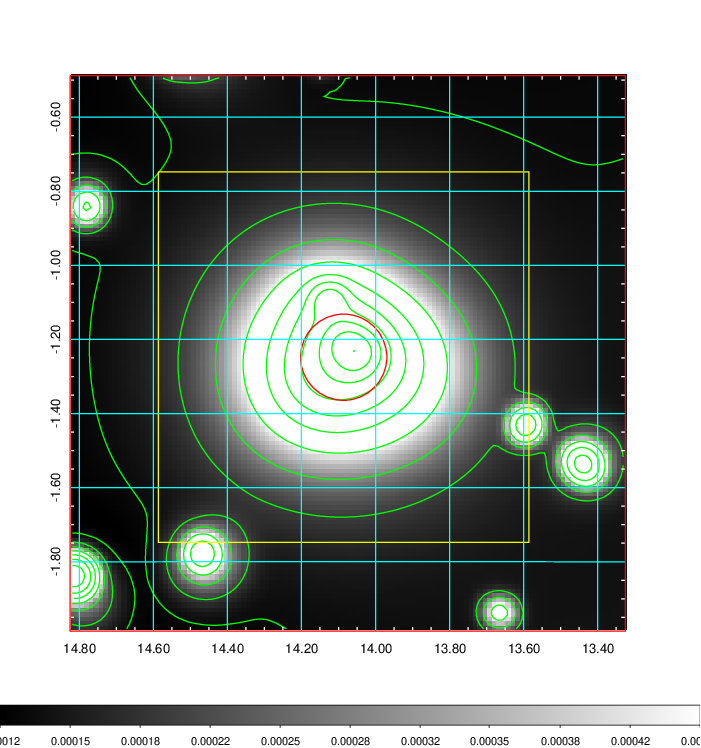   | 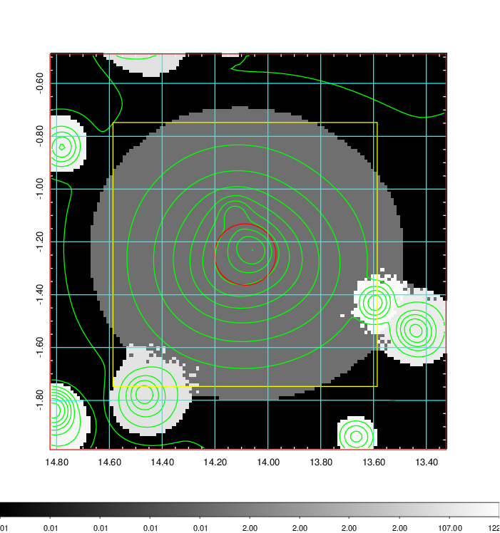  |

|[Exposure image](../image/44/44_mex.pdf)| [nH image](../image/44/44_nh.pdf)| [Planck image](../image/44/44_p.pdf)|
|-------------------|--------------------|-------------------|
|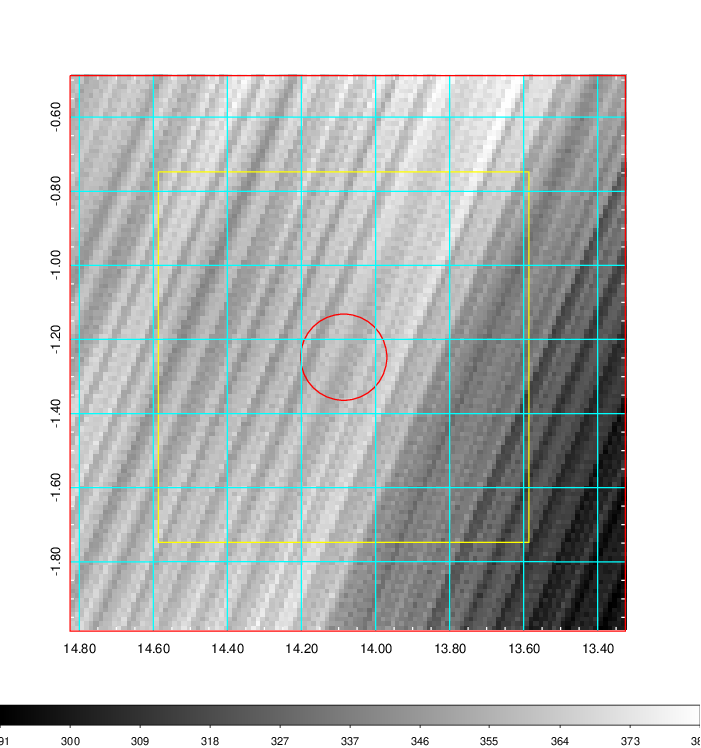   | 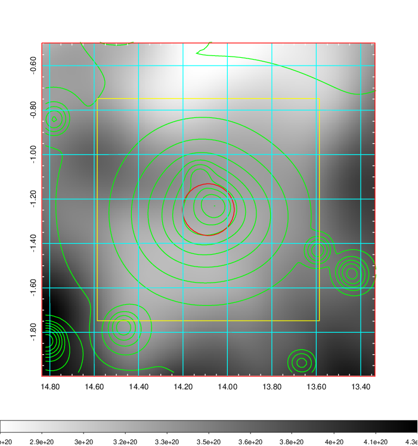    | 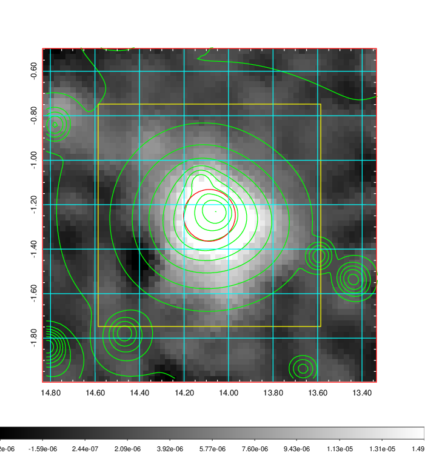 |

|[Redshift Histogram](../image/44/44_zg.pdf) | [DSS image(z1)](../image/44/44_dss_z1.pdf)      |  [DSS image(z2)](../image/44/44_dss_z2.pdf)    |
|-------------------|--------------------|-------------------|
|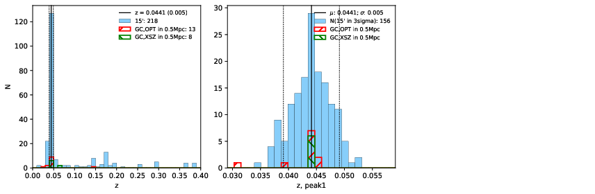 |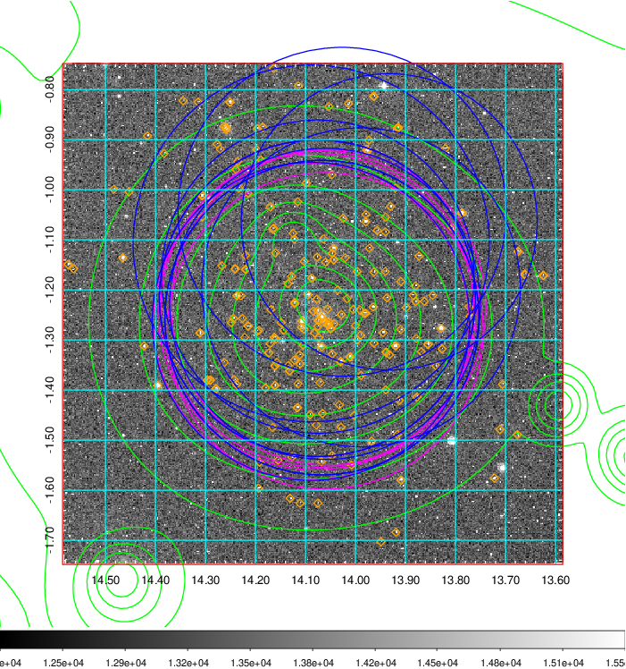  Blue circle for optical clusters;  Magenta circle for XSZ clusters;  all with r=1Mpc;  Only GC with Delta_z<0.01 are shown. | 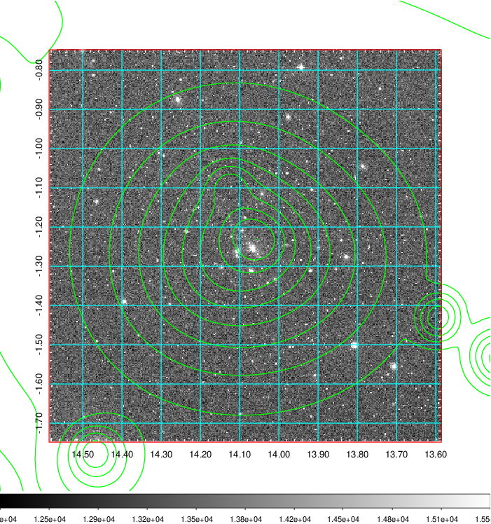 Blue circle for optical clusters;  Magenta circle for XSZ clusters;  all with r=1Mpc;  Only GC with Delta_z<0.01 are shown.  |

|[known Abell/XSZ clusters](../image/44/44_gc.pdf) | [2MASS image](../image/44/44_2mass.pdf)      |[SDSS image](../image/44/44_sdss.pdf)   |
|-------------------|-------------------|-------------------|
|  Magenta, blue and green circles  for optical, X-ray and SZ clusters  respectively, with redshift of clusters  labelled. The radius of circles  are 1Mpc.|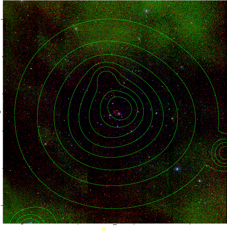  | 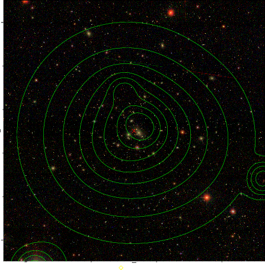  |

|[DES image](../image/44/44_des.pdf)   |
|-------------------|
|   |
