

### 440

|Name|RAJ2000[deg]|DEJ2000[deg] |Ext[arcmin]| Ext,ml | z | z_src| C|GC(XSZ,Delta_z<0.01)| GC(OPT,Delta_z<0.01)|GC| R_sig[arcmin] | R500[arcmin] | R500[Mpc]| CRsig[c/s] | CR500[c/s] |L500[1E44 erg/s]|F500[1E-12 erg/s/cm^2]| M500[1E14 Msun]|Tx[keV]|Cnt_sig|Beta|Rc[arcmin]|Comment|Alias|
|---|---|---|---|---|---|------|---|--------|---------|----------|---|---|---|---|---|---|---|---|---|---|---|---|---|---|
|440| 180.095| 3.345| 2.38| 154.32| 0.1336(0.006)| z1, z_xsz| B| F20, MCXC, PSZ2, Tar, XB| A, N, RM, W| A, C, F20, MCXC, N, PSZ2, Tar, W, XB| 8.800| 8.162| 1.162| 0.416(0.042)| 0.412(0.041)| 3.858(0.173)| 8.158(0.366)| 5.07(0.11)| 6.08(0.08)| 176.6| 0.908(-0.095+0.065)| 4.329(-0.590+0.414)| -| k274|

|[RASS image](../image/440/440_img.pdf)|[filtered image](../image/440/440_fil.pdf)|[Segment image](../image/440/440_seg.pdf)|
|-------------------|--------------------|-------------------|
| 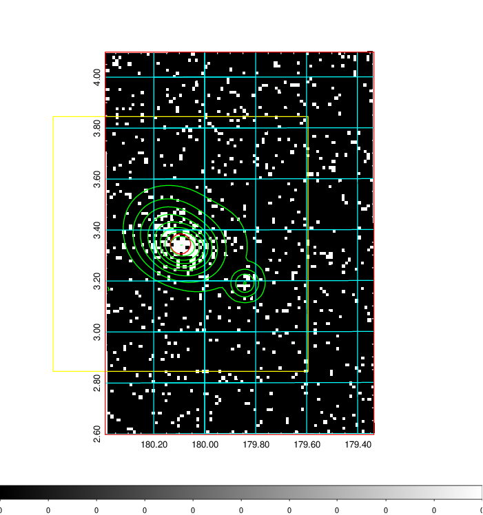  | 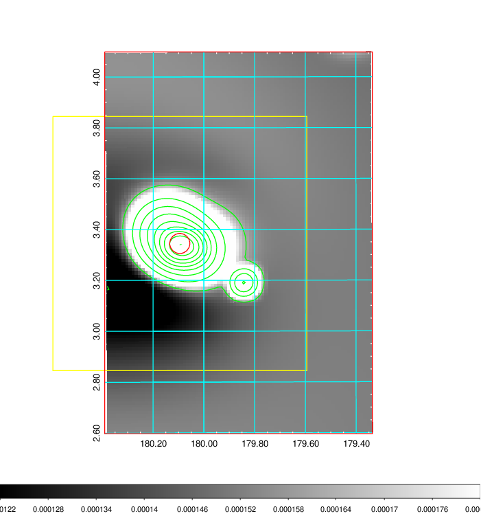   | 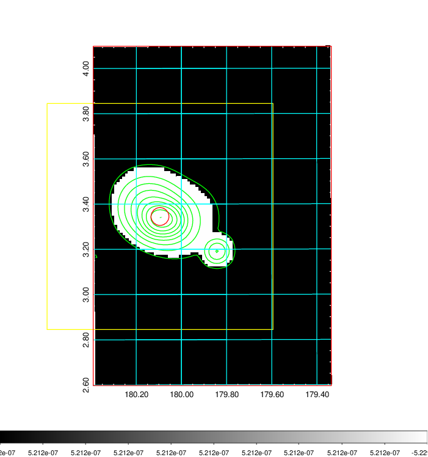  |

|[Exposure image](../image/440/440_mex.pdf)| [nH image](../image/440/440_nh.pdf)| [Planck image](../image/440/440_p.pdf)|
|-------------------|--------------------|-------------------|
|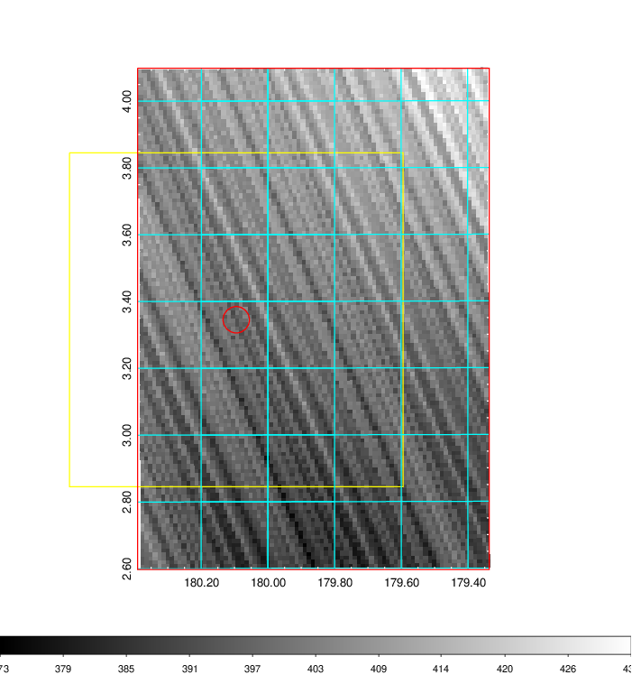   | 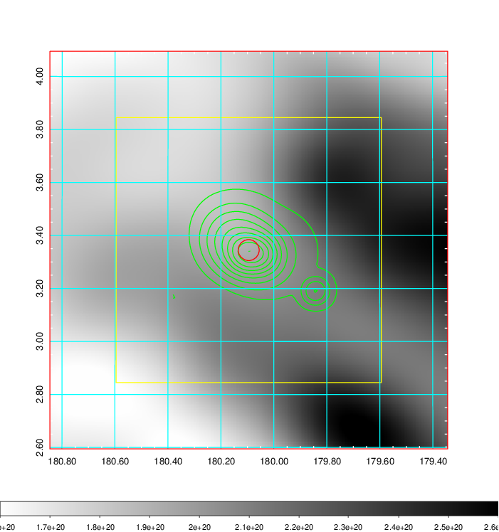    | 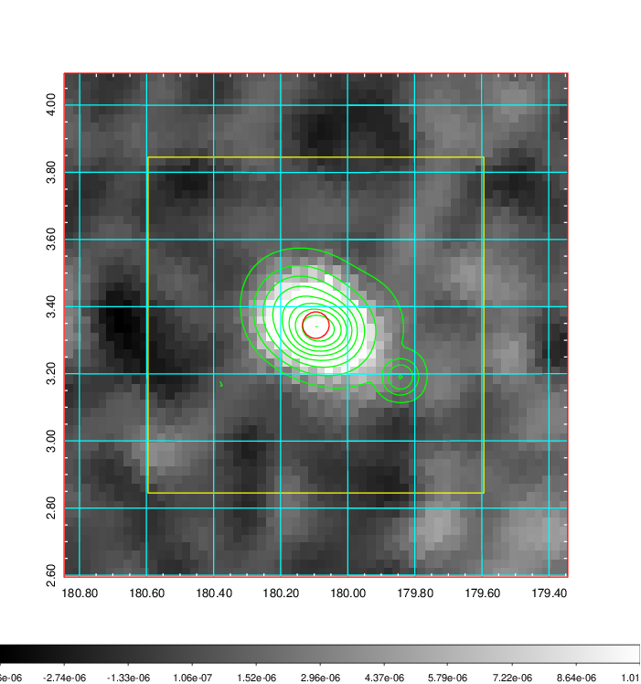 |

|[Redshift Histogram](../image/440/440_zg.pdf) | [DSS image(z1)](../image/440/440_dss_z1.pdf)      |  [DSS image(z2)](../image/440/440_dss_z2.pdf)    |
|-------------------|--------------------|-------------------|
|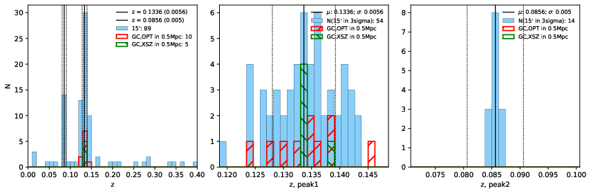 |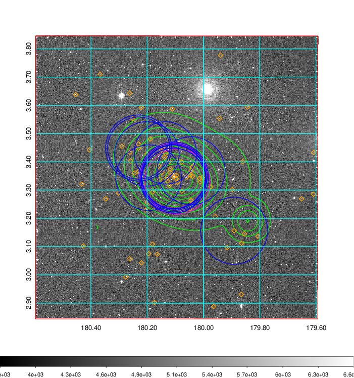  Blue circle for optical clusters;  Magenta circle for XSZ clusters;  all with r=1Mpc;  Only GC with Delta_z<0.01 are shown. | 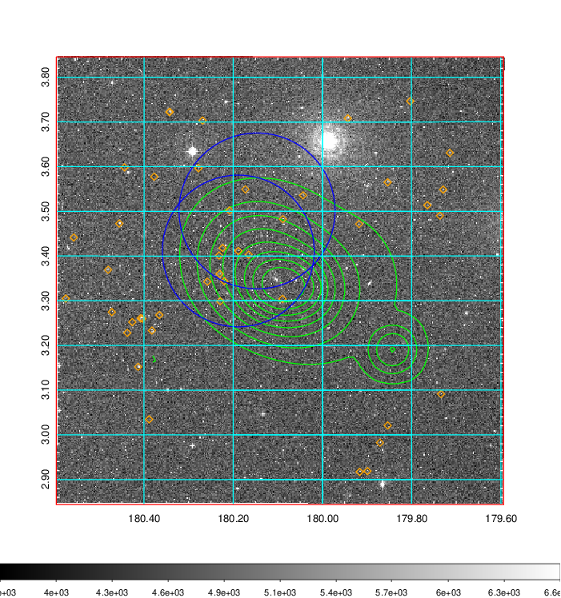 Blue circle for optical clusters;  Magenta circle for XSZ clusters;  all with r=1Mpc;  Only GC with Delta_z<0.01 are shown.  |

|[Previous-identified clusters](../image/440/440_gc.pdf) | [2MASS image](../image/440/440_2mass.pdf)      |[SDSS image](../image/440/440_sdss.pdf)   |
|-------------------|-------------------|-------------------|
|  Green, magenta, and blue circles  for optical, X-ray and SZ clusters  respectively, with redshift of clusters  labelled. The radius of circles  are 1Mpc.|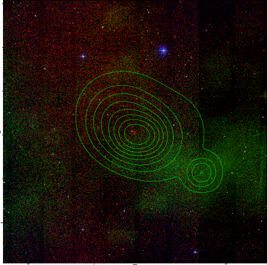  | 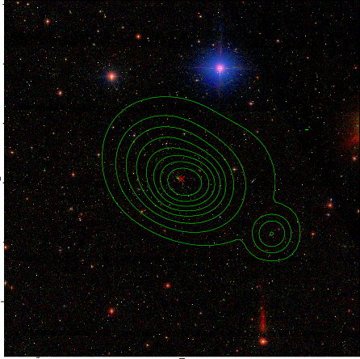  |

