

### 441

|Name|RAJ2000[deg]|DEJ2000[deg] |Ext[arcmin]| Ext,ml | z | z_src| C|GC(XSZ,Delta_z<0.01)| GC(OPT,Delta_z<0.01)|GC| R_sig[arcmin] | R500[arcmin] | R500[Mpc]| CRsig[c/s] | CR500[c/s] |L500[1E44 erg/s]|F500[1E-12 erg/s/cm^2]| M500[1E14 Msun]|Tx[keV]|Cnt_sig|Beta|Rc[arcmin]|Comment|Alias|
|---|---|---|---|---|---|------|---|--------|---------|----------|---|---|---|---|---|---|---|---|---|---|---|---|---|---|
|441| 180.494| 58.025| 1.96| 28.35| 0.1023(0.005)| z1, z_xsz| B| F20, MCXC, PSZ2, SPI, Tar| A, C, N, RM, W| A, C, F20, MCXC, N, PSZ2, SPI, Tar, W| 10.262| 7.446| 0.841| 0.152(0.035)| 0.145(0.034)| 0.759(0.107)| 2.851(0.400)| 1.86(0.13)| 3.25(0.14)| 66.4| 0.872(-0.136+0.092)| 4.042(-0.909+0.678)| -| k209|

|[RASS image](../image/441/441_img.pdf)|[filtered image](../image/441/441_fil.pdf)|[Segment image](../image/441/441_seg.pdf)|
|-------------------|--------------------|-------------------|
| 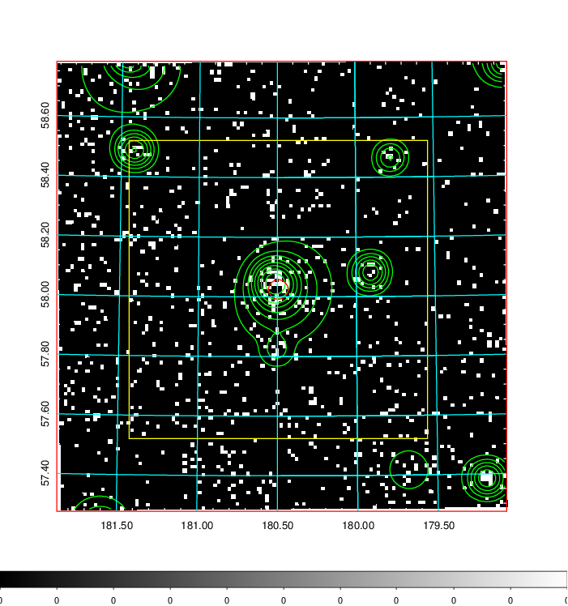  | 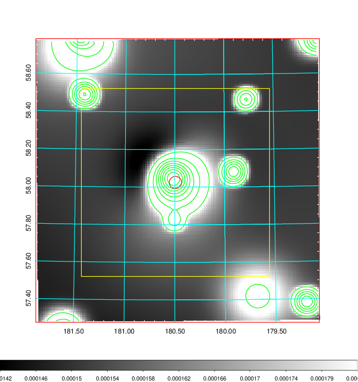   | 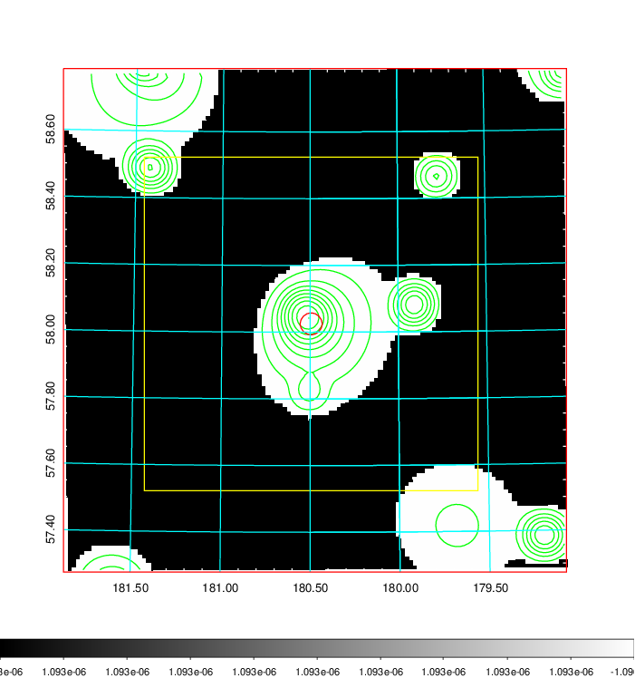  |

|[Exposure image](../image/441/441_mex.pdf)| [nH image](../image/441/441_nh.pdf)| [Planck image](../image/441/441_p.pdf)|
|-------------------|--------------------|-------------------|
|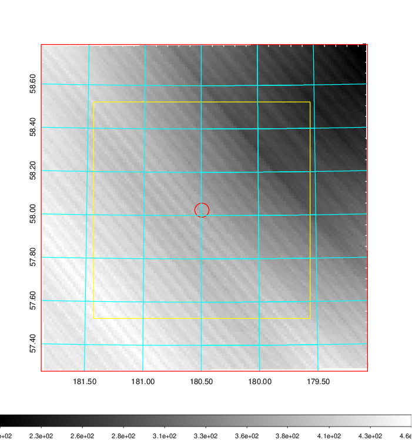   | 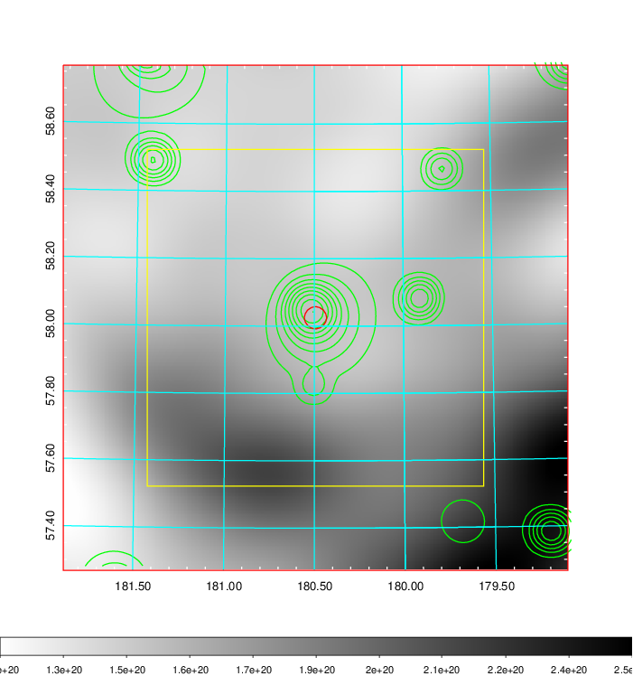    | 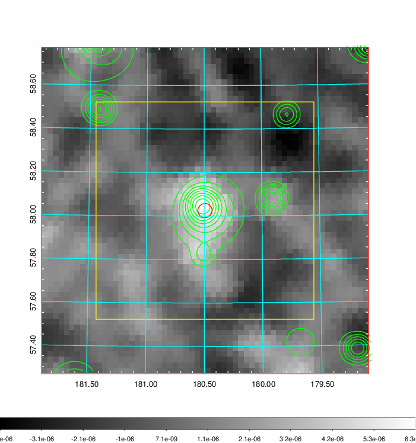 |

|[Redshift Histogram](../image/441/441_zg.pdf) | [DSS image(z1)](../image/441/441_dss_z1.pdf)      |  [DSS image(z2)](../image/441/441_dss_z2.pdf)    |
|-------------------|--------------------|-------------------|
|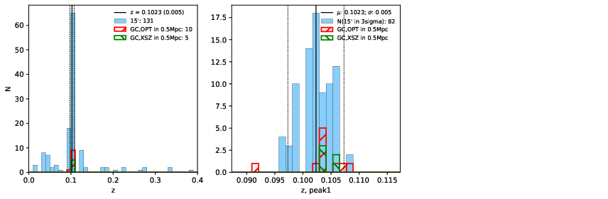 |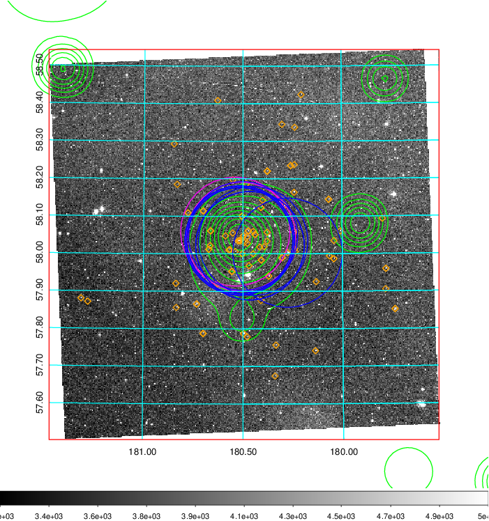  Blue circle for optical clusters;  Magenta circle for XSZ clusters;  all with r=1Mpc;  Only GC with Delta_z<0.01 are shown. | 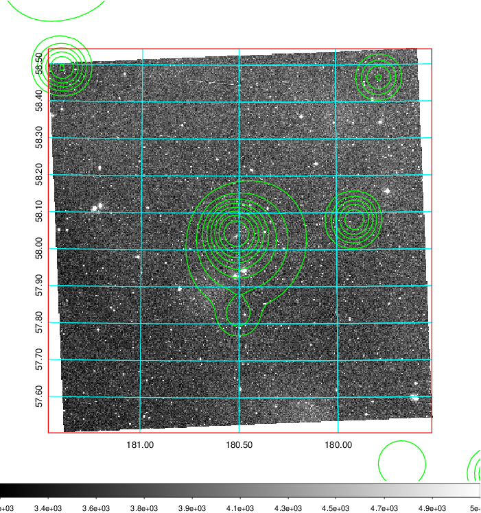 Blue circle for optical clusters;  Magenta circle for XSZ clusters;  all with r=1Mpc;  Only GC with Delta_z<0.01 are shown.  |

|[Previous-identified clusters](../image/441/441_gc.pdf) | [2MASS image](../image/441/441_2mass.pdf)      |[SDSS image](../image/441/441_sdss.pdf)   |
|-------------------|-------------------|-------------------|
|  Green, magenta, and blue circles  for optical, X-ray and SZ clusters  respectively, with redshift of clusters  labelled. The radius of circles  are 1Mpc.|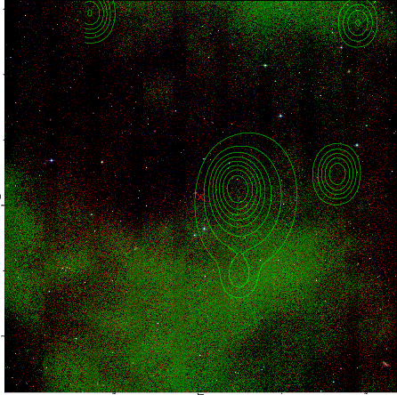  | 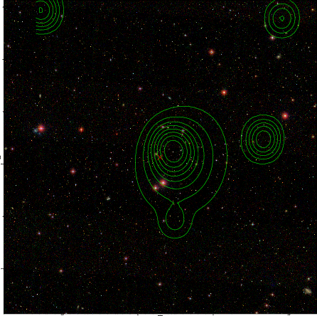  |

