

### 442

|Name|RAJ2000[deg]|DEJ2000[deg] |Ext[arcmin]| Ext,ml | z | z_src| C|GC(XSZ,Delta_z<0.01)| GC(OPT,Delta_z<0.01)|GC| R_sig[arcmin] | R500[arcmin] | R500[Mpc]| CRsig[c/s] | CR500[c/s] |L500[1E44 erg/s]|F500[1E-12 erg/s/cm^2]| M500[1E14 Msun]|Tx[keV]|Cnt_sig|Beta|Rc[arcmin]|Comment|Alias|
|---|---|---|---|---|---|------|---|--------|---------|----------|---|---|---|---|---|---|---|---|---|---|---|---|---|---|
|442| 180.731| -6.822| 1.97| 37.11| 0.1257(0.005)| z1, z_xsz| B| MCXC, PSZ2, Tar| A, W| A, MCXC, N, PSZ2, Tar, W| 8.312| 7.343| 0.992| 0.220(0.038)| 0.216(0.038)| 1.733(0.159)| 4.182(0.383)| 3.13(0.14)| 4.51(0.13)| 67.6| 0.879(-0.123+0.085)| 4.364(-0.825+0.595)| -| k215|

|[RASS image](../image/442/442_img.pdf)|[filtered image](../image/442/442_fil.pdf)|[Segment image](../image/442/442_seg.pdf)|
|-------------------|--------------------|-------------------|
| 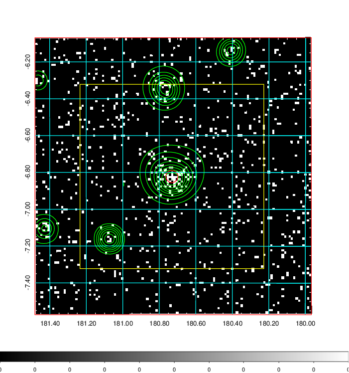  | 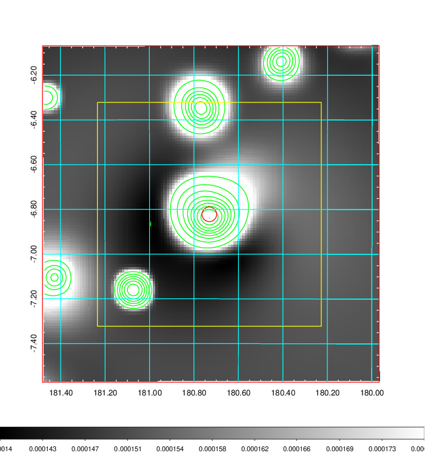   | 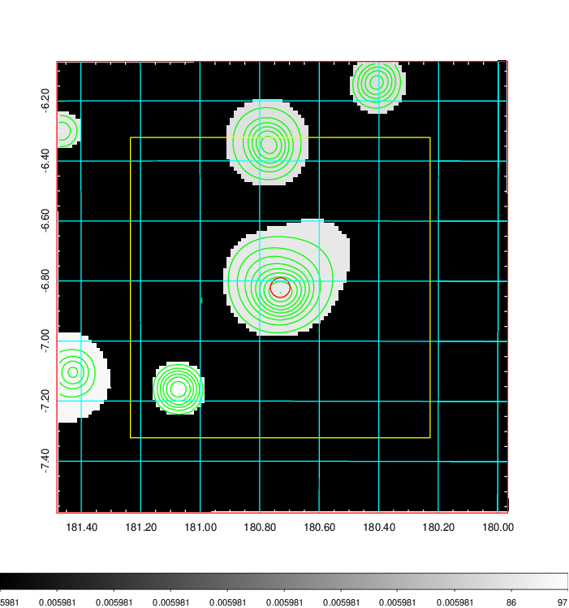  |

|[Exposure image](../image/442/442_mex.pdf)| [nH image](../image/442/442_nh.pdf)| [Planck image](../image/442/442_p.pdf)|
|-------------------|--------------------|-------------------|
|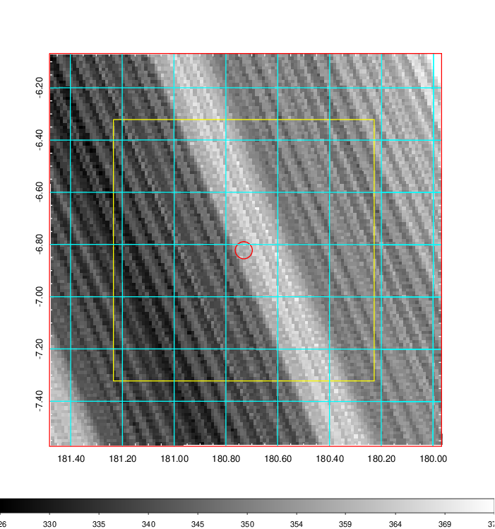   | 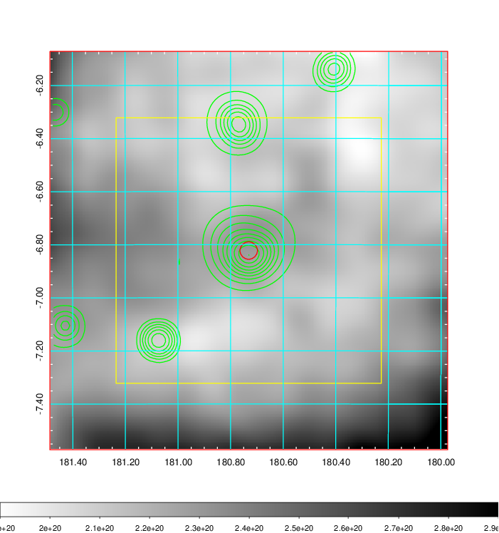    | 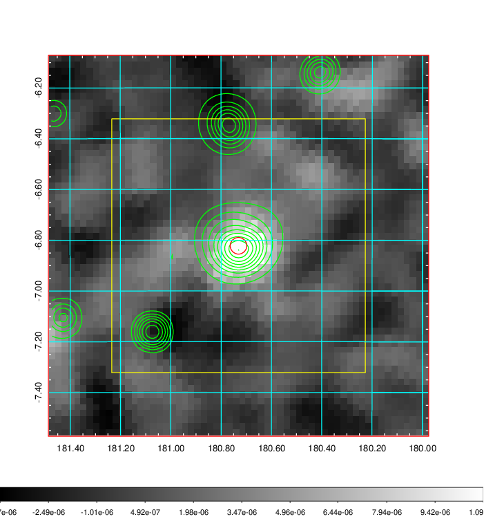 |

|[Redshift Histogram](../image/442/442_zg.pdf) | [DSS image(z1)](../image/442/442_dss_z1.pdf)      |  [DSS image(z2)](../image/442/442_dss_z2.pdf)    |
|-------------------|--------------------|-------------------|
|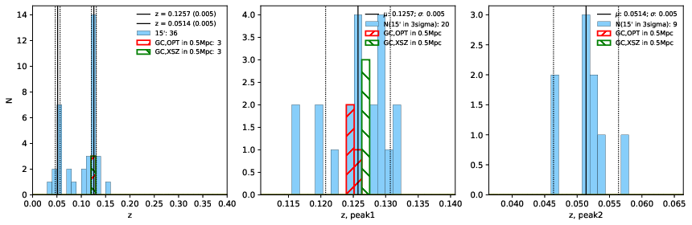 |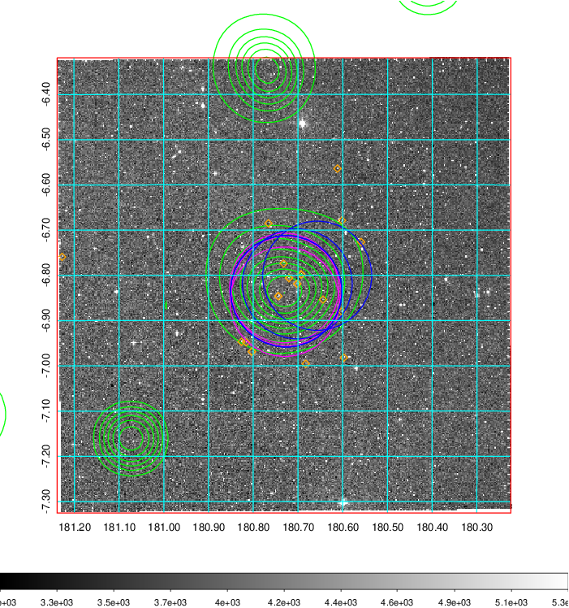  Blue circle for optical clusters;  Magenta circle for XSZ clusters;  all with r=1Mpc;  Only GC with Delta_z<0.01 are shown. | 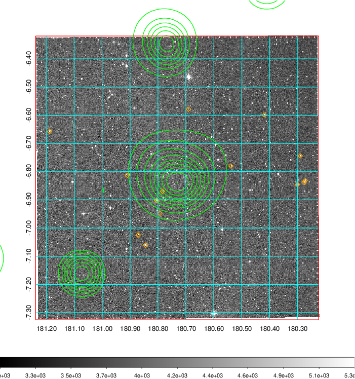 Blue circle for optical clusters;  Magenta circle for XSZ clusters;  all with r=1Mpc;  Only GC with Delta_z<0.01 are shown.  |

|[Previous-identified clusters](../image/442/442_gc.pdf) | [2MASS image](../image/442/442_2mass.pdf)      |
|-------------------|-------------------|
|  Green, magenta, and blue circles  for optical, X-ray and SZ clusters  respectively, with redshift of clusters  labelled. The radius of circles  are 1Mpc.|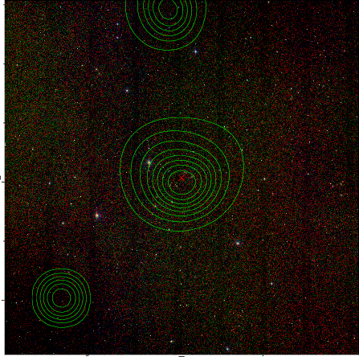  |

|[ATLAS image](../image/442/442_s.pdf)        |
|-------------------|
| 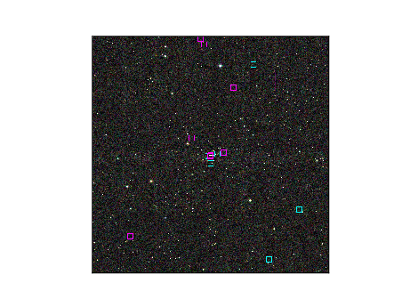  |
