

### 444

|Name|RAJ2000[deg]|DEJ2000[deg] |Ext[arcmin]| Ext,ml | z | z_src| C|GC(XSZ,Delta_z<0.01)| GC(OPT,Delta_z<0.01)|GC| R_sig[arcmin] | R500[arcmin] | R500[Mpc]| CRsig[c/s] | CR500[c/s] |L500[1E44 erg/s]|F500[1E-12 erg/s/cm^2]| M500[1E14 Msun]|Tx[keV]|Cnt_sig|Beta|Rc[arcmin]|Comment|Alias|
|---|---|---|---|---|---|------|---|--------|---------|----------|---|---|---|---|---|---|---|---|---|---|---|---|---|---|
|444| 181.117| 1.901| 2.80| 361.67| 0.0203(0.005)| z1, z_xsz| B| MCXC| N, Zw| C, F20, MCXC, N, W, XCS| 33.175| 26.771| 0.661| 1.097(0.095)| 1.063(0.092)| 0.177(0.011)| 18.981(1.155)| 0.84(0.03)| 1.93(0.04)| 479.2| 0.591(-0.014+0.015)| 2.656(-0.221+0.242)| -| k355|

|[RASS image](../image/444/444_img.pdf)|[filtered image](../image/444/444_fil.pdf)|[Segment image](../image/444/444_seg.pdf)|
|-------------------|--------------------|-------------------|
| 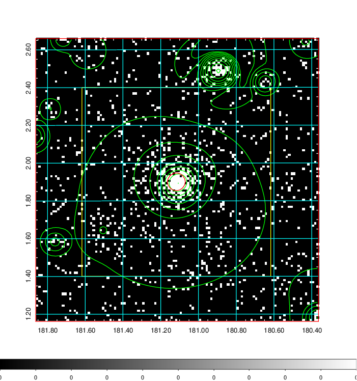  | 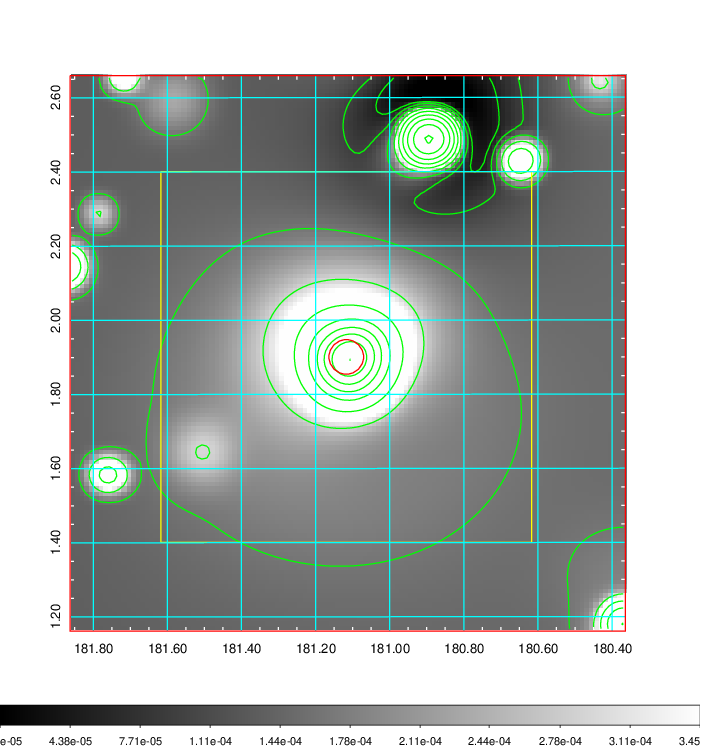   | 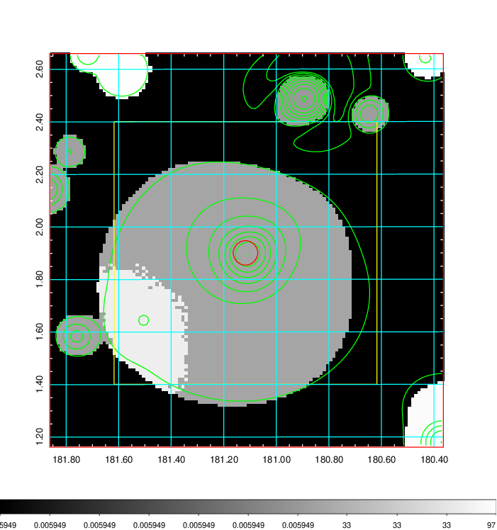  |

|[Exposure image](../image/444/444_mex.pdf)| [nH image](../image/444/444_nh.pdf)| [Planck image](../image/444/444_p.pdf)|
|-------------------|--------------------|-------------------|
|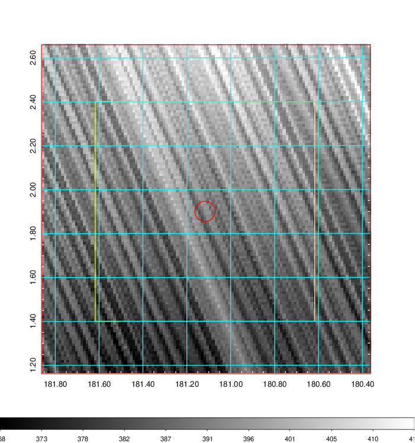   | 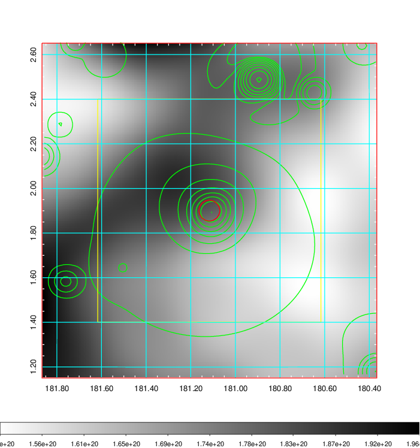    | 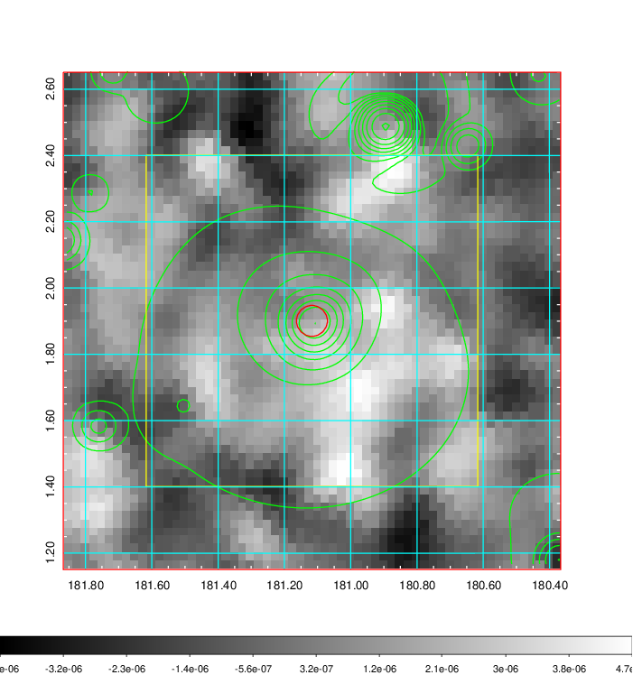 |

|[Redshift Histogram](../image/444/444_zg.pdf) | [DSS image(z1)](../image/444/444_dss_z1.pdf)      |  [DSS image(z2)](../image/444/444_dss_z2.pdf)    |
|-------------------|--------------------|-------------------|
|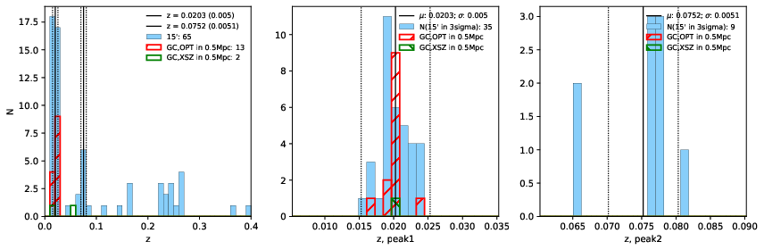 |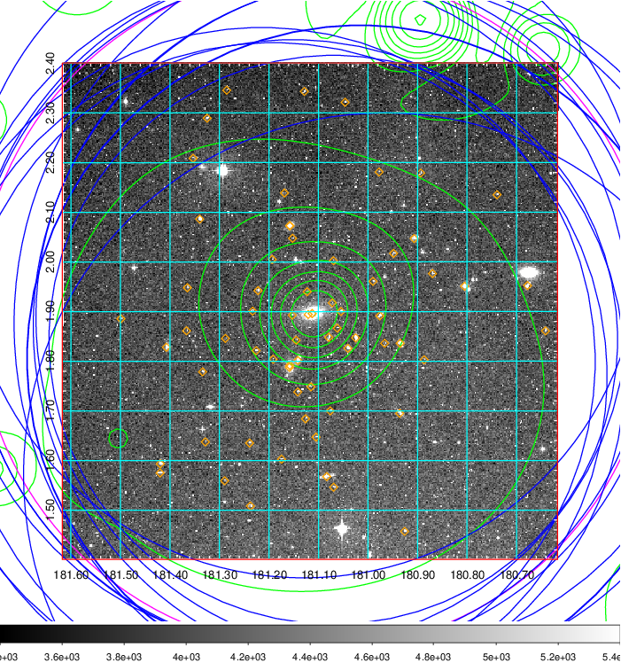  Blue circle for optical clusters;  Magenta circle for XSZ clusters;  all with r=1Mpc;  Only GC with Delta_z<0.01 are shown. | 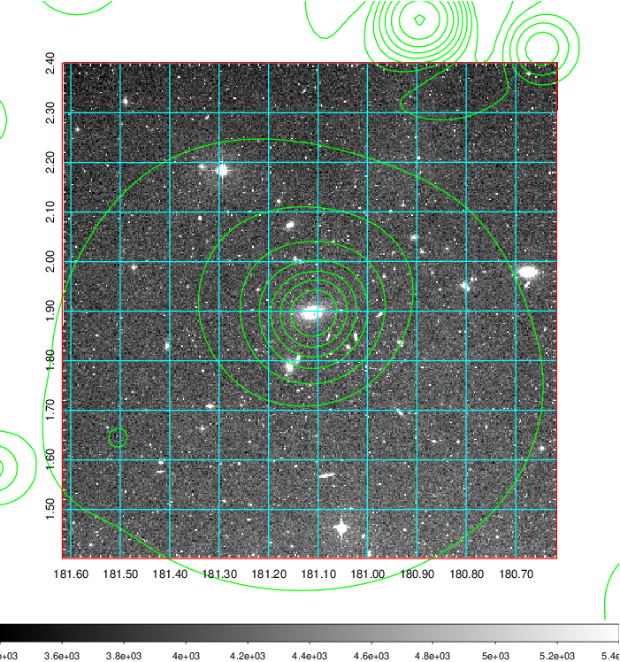 Blue circle for optical clusters;  Magenta circle for XSZ clusters;  all with r=1Mpc;  Only GC with Delta_z<0.01 are shown.  |

|[Previous-identified clusters](../image/444/444_gc.pdf) | [2MASS image](../image/444/444_2mass.pdf)      |[SDSS image](../image/444/444_sdss.pdf)   |
|-------------------|-------------------|-------------------|
|  Green, magenta, and blue circles  for optical, X-ray and SZ clusters  respectively, with redshift of clusters  labelled. The radius of circles  are 1Mpc.|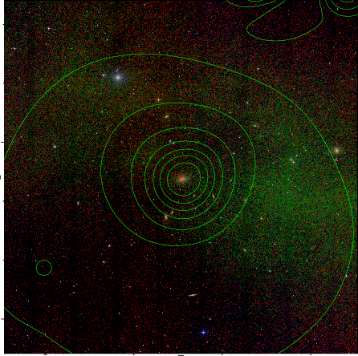  | 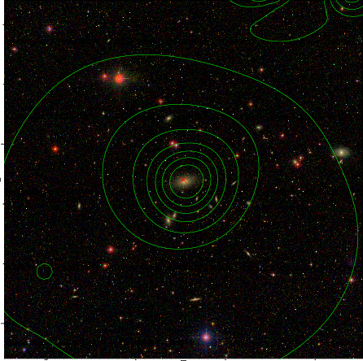  |

