

### 445

|Name|RAJ2000[deg]|DEJ2000[deg] |Ext[arcmin]| Ext,ml | z | z_src| C|GC(XSZ,Delta_z<0.01)| GC(OPT,Delta_z<0.01)|GC| R_sig[arcmin] | R500[arcmin] | R500[Mpc]| CRsig[c/s] | CR500[c/s] |L500[1E44 erg/s]|F500[1E-12 erg/s/cm^2]| M500[1E14 Msun]|Tx[keV]|Cnt_sig|Beta|Rc[arcmin]|Comment|Alias|
|---|---|---|---|---|---|------|---|--------|---------|----------|---|---|---|---|---|---|---|---|---|---|---|---|---|---|
|445| 181.297| 39.343| 1.03| 69.15| 0.0373(0.005)| z1, z_xsz| B| MCXC| N| C, F20, MCXC, N, SPI, W| 9.288| 16.913| 0.751| 0.504(0.043)| 0.583(0.050)| 0.332(0.018)| 10.292(0.549)| 1.25(0.03)| 2.49(0.04)| 210.5| 0.855(-0.099+0.093)| 2.941(-0.525+0.443)| -| k034|

|[RASS image](../image/445/445_img.pdf)|[filtered image](../image/445/445_fil.pdf)|[Segment image](../image/445/445_seg.pdf)|
|-------------------|--------------------|-------------------|
| 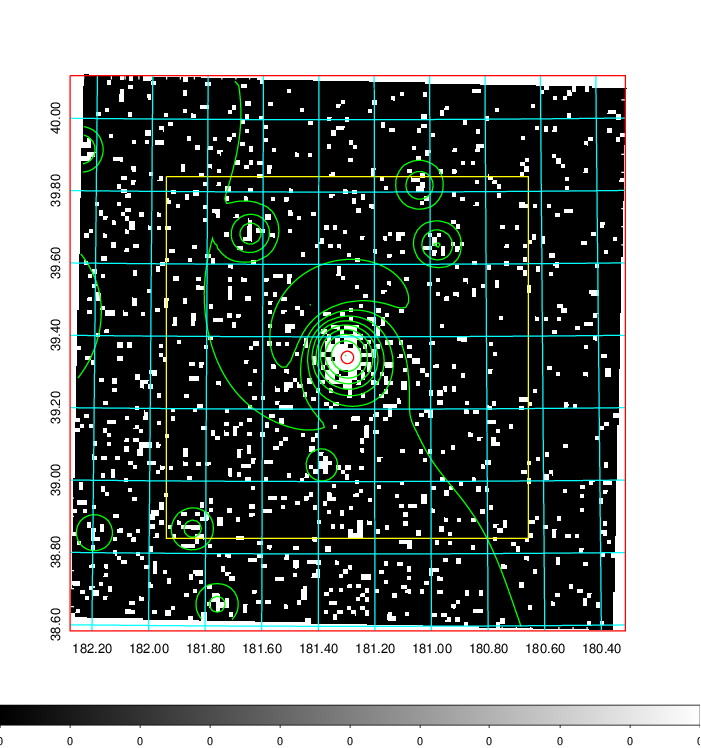  | 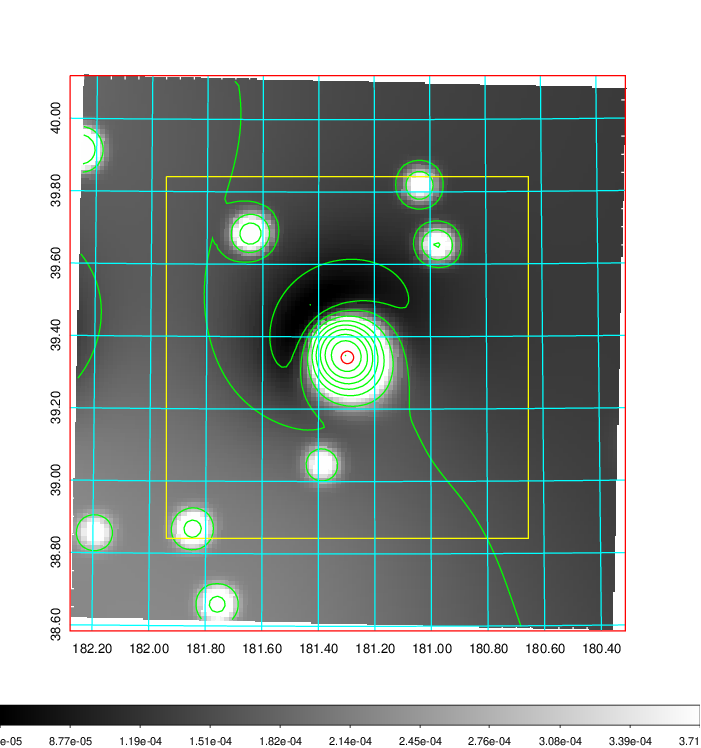   | 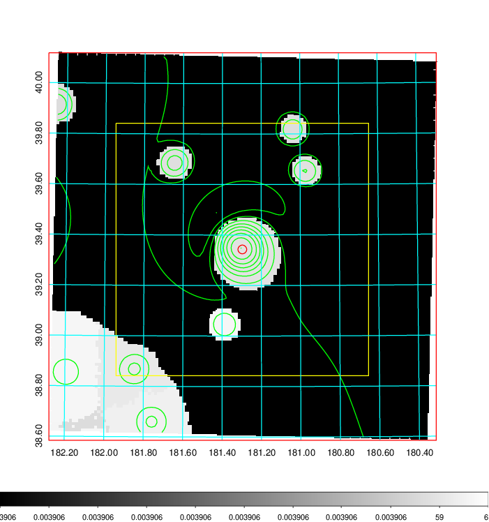  |

|[Exposure image](../image/445/445_mex.pdf)| [nH image](../image/445/445_nh.pdf)| [Planck image](../image/445/445_p.pdf)|
|-------------------|--------------------|-------------------|
|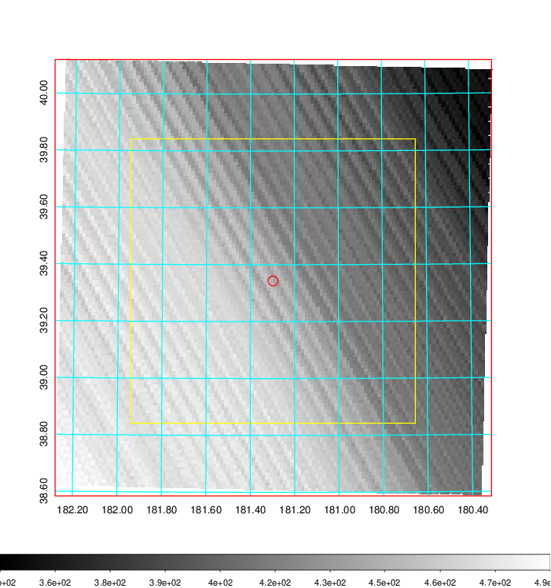   | 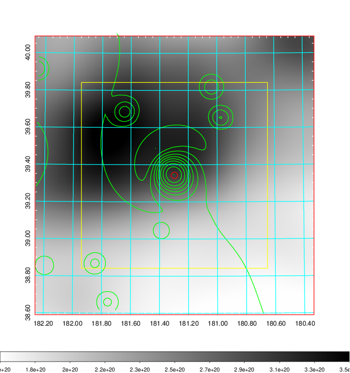    | 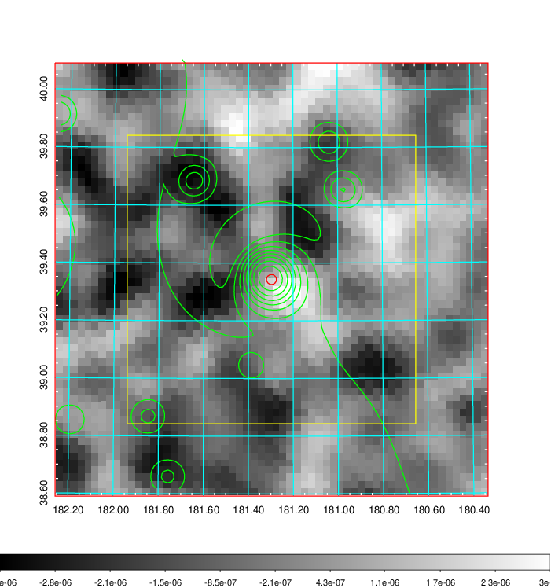 |

|[Redshift Histogram](../image/445/445_zg.pdf) | [DSS image(z1)](../image/445/445_dss_z1.pdf)      |  [DSS image(z2)](../image/445/445_dss_z2.pdf)    |
|-------------------|--------------------|-------------------|
|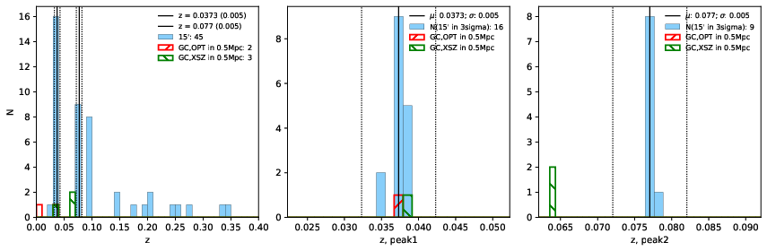 |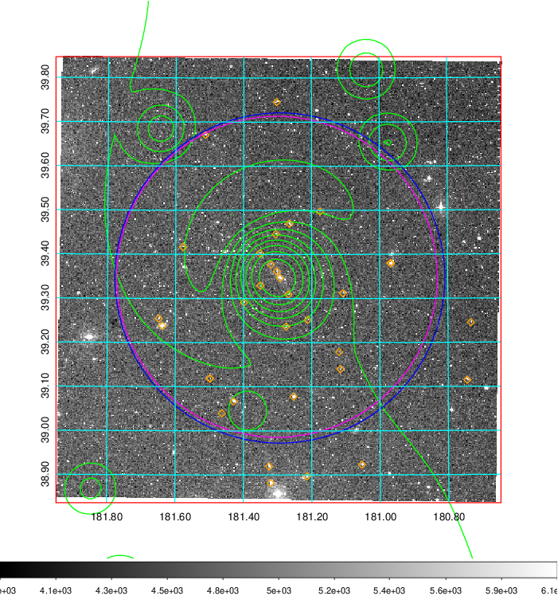  Blue circle for optical clusters;  Magenta circle for XSZ clusters;  all with r=1Mpc;  Only GC with Delta_z<0.01 are shown. | 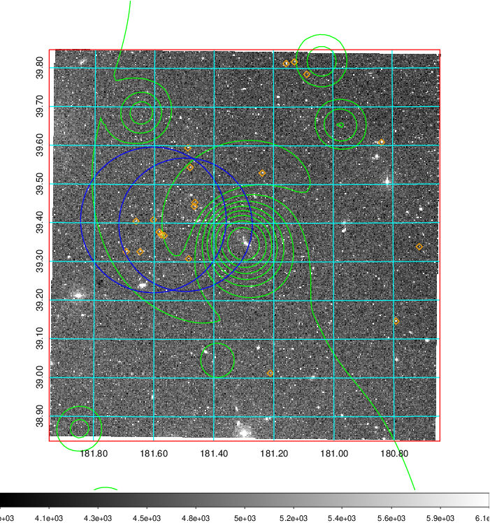 Blue circle for optical clusters;  Magenta circle for XSZ clusters;  all with r=1Mpc;  Only GC with Delta_z<0.01 are shown.  |

|[known Abell/XSZ clusters](../image/445/445_gc.pdf) | [2MASS image](../image/445/445_2mass.pdf)      |[SDSS image](../image/445/445_sdss.pdf)   |
|-------------------|-------------------|-------------------|
|  Magenta, blue and green circles  for optical, X-ray and SZ clusters  respectively, with redshift of clusters  labelled. The radius of circles  are 1Mpc.|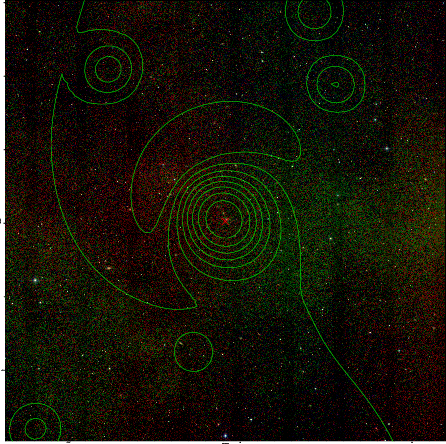  | 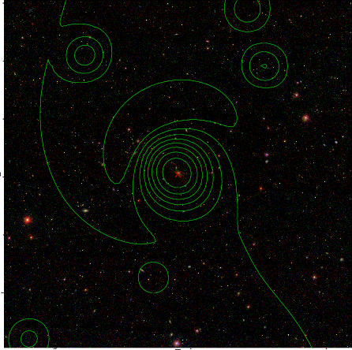  |

