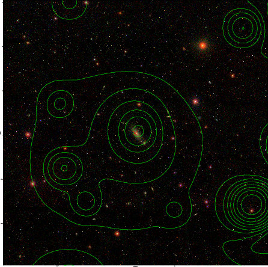

### 446

|Name|RAJ2000[deg]|DEJ2000[deg] |Ext[arcmin]| Ext,ml | z | z_src| C|GC(XSZ,Delta_z<0.01)| GC(OPT,Delta_z<0.01)|GC| R_sig[arcmin] | R500[arcmin] | R500[Mpc]| CRsig[c/s] | CR500[c/s] |L500[1E44 erg/s]|F500[1E-12 erg/s/cm^2]| M500[1E14 Msun]|Tx[keV]|Cnt_sig|Beta|Rc[arcmin]|Comment|Alias|
|---|---|---|---|---|---|------|---|--------|---------|----------|---|---|---|---|---|---|---|---|---|---|---|---|---|---|
|446| 181.667| 28.176| 3.18| 85.97| 0.0283(0.005)| z1, z_xsz| B| MCXC| N, W| C, MCXC, N, W, XCS| 34.165| 18.184| 0.619| 0.441(0.078)| 0.409(0.072)| 0.131(0.022)| 7.139(1.226)| 0.69(0.06)| 1.73(0.10)| 374.2| 0.513(-0.009+0.015)| 2.381(-0.234+0.322)| -| k395|

|[RASS image](../image/446/446_img.pdf)|[filtered image](../image/446/446_fil.pdf)|[Segment image](../image/446/446_seg.pdf)|
|-------------------|--------------------|-------------------|
|   |    |   |

|[Exposure image](../image/446/446_mex.pdf)| [nH image](../image/446/446_nh.pdf)| [Planck image](../image/446/446_p.pdf)|
|-------------------|--------------------|-------------------|
|   |     |  |

|[Redshift Histogram](../image/446/446_zg.pdf) | [DSS image(z1)](../image/446/446_dss_z1.pdf)      |  [DSS image(z2)](../image/446/446_dss_z2.pdf)    |
|-------------------|--------------------|-------------------|
| |  Blue circle for optical clusters;  Magenta circle for XSZ clusters;  all with r=1Mpc;  Only GC with Delta_z<0.01 are shown. |  Blue circle for optical clusters;  Magenta circle for XSZ clusters;  all with r=1Mpc;  Only GC with Delta_z<0.01 are shown.  |

|[known Abell/XSZ clusters](../image/446/446_gc.pdf) | [2MASS image](../image/446/446_2mass.pdf)      |[SDSS image](../image/446/446_sdss.pdf)   |
|-------------------|-------------------|-------------------|
|  Magenta, blue and green circles  for optical, X-ray and SZ clusters  respectively, with redshift of clusters  labelled. The radius of circles  are 1Mpc.|  |   |

