

### 447

|Name|RAJ2000[deg]|DEJ2000[deg] |Ext[arcmin]| Ext,ml | z | z_src| C|GC(XSZ,Delta_z<0.01)| GC(OPT,Delta_z<0.01)|GC| R_sig[arcmin] | R500[arcmin] | R500[Mpc]| CRsig[c/s] | CR500[c/s] |L500[1E44 erg/s]|F500[1E-12 erg/s/cm^2]| M500[1E14 Msun]|Tx[keV]|Cnt_sig|Beta|Rc[arcmin]|Comment|Alias|
|---|---|---|---|---|---|------|---|--------|---------|----------|---|---|---|---|---|---|---|---|---|---|---|---|---|---|
|447| 182.220| 31.012| 5.32| 31.46| 0.1609(0.008)| z1,| G| -| -| A, C, F20, N, W| 9.288| 5.013| 0.833| 0.065(0.027)| 0.061(0.025)| 0.848(0.254)| 1.194(0.358)| 1.93(0.29)| 3.38(0.32)| 45.3| 0.896(-0.128+0.076)| 7.193(-1.205+1.030)| An Abell cluster with no $z$ and offset = 1.44 Mpc(8.55 arcmin)| t273|

|[RASS image](../image/447/447_img.pdf)|[filtered image](../image/447/447_fil.pdf)|[Segment image](../image/447/447_seg.pdf)|
|-------------------|--------------------|-------------------|
| 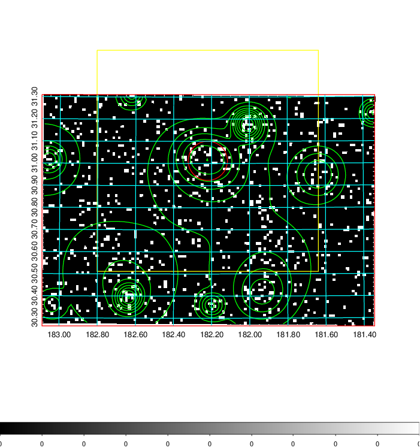  | 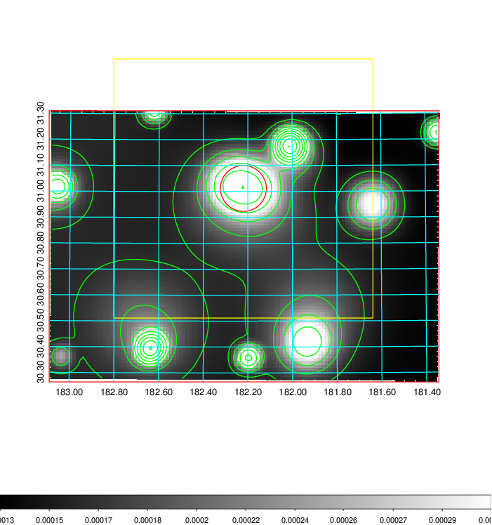   | 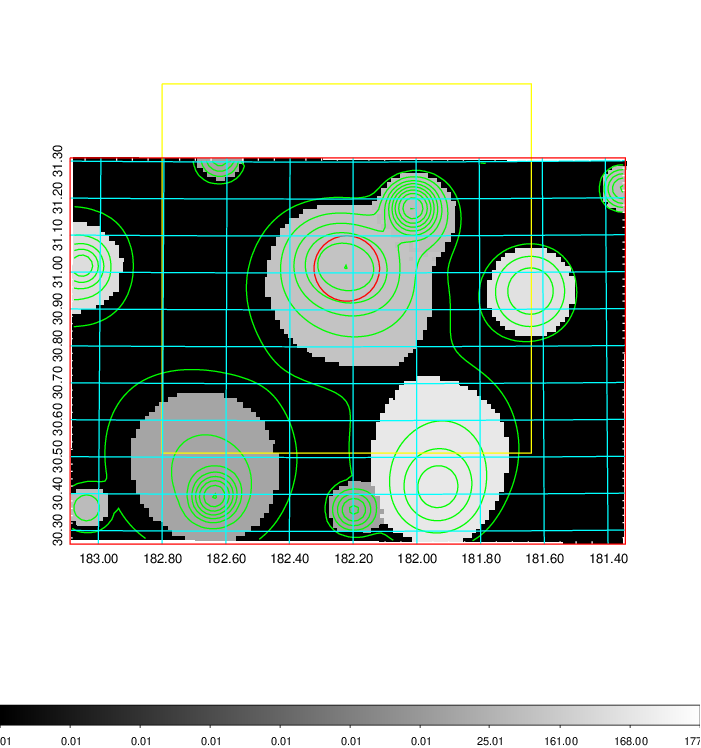  |

|[Exposure image](../image/447/447_mex.pdf)| [nH image](../image/447/447_nh.pdf)| [Planck image](../image/447/447_p.pdf)|
|-------------------|--------------------|-------------------|
|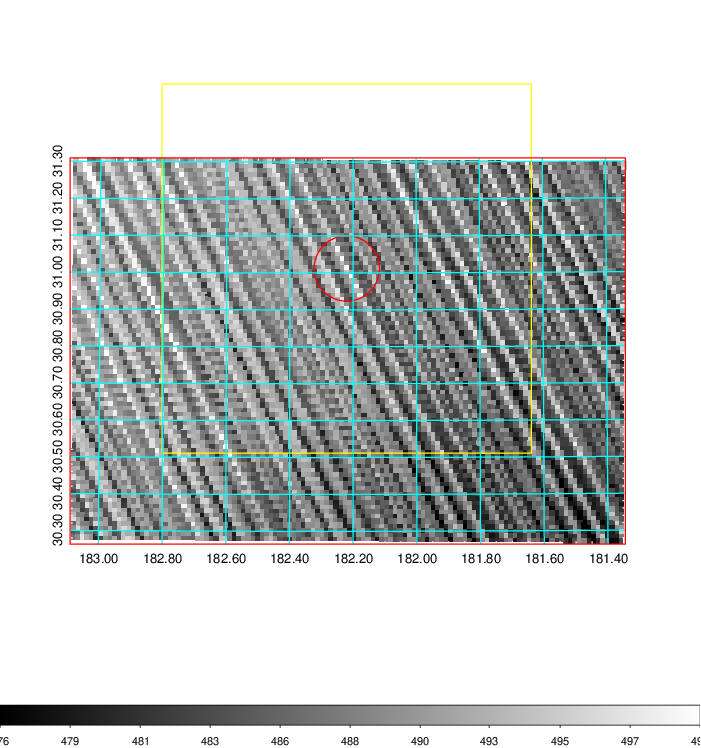   | 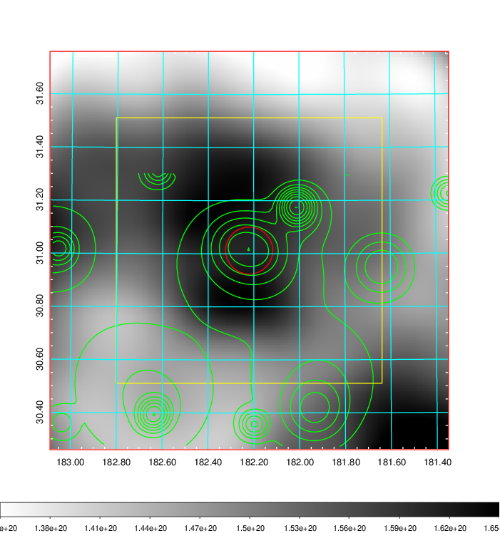    | 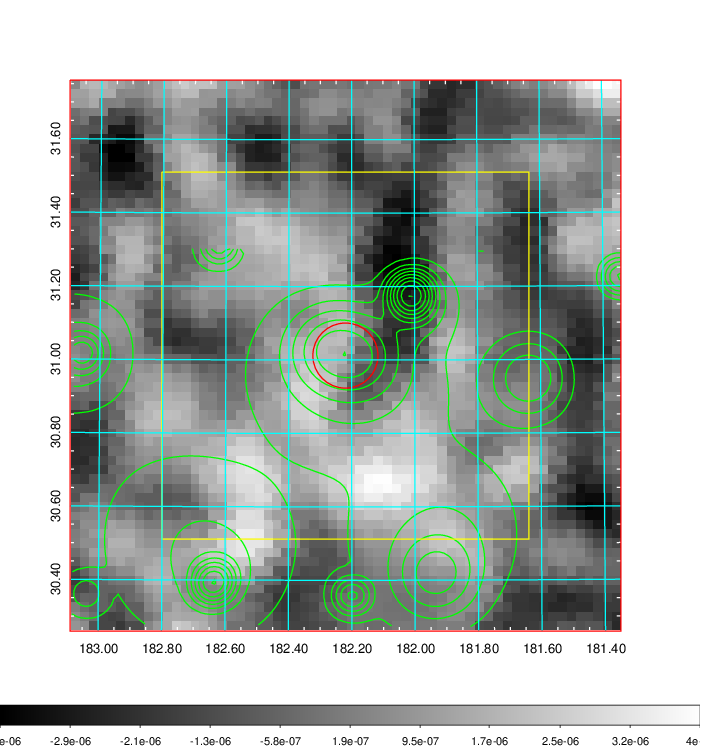 |

|[Redshift Histogram](../image/447/447_zg.pdf) | [DSS image(z1)](../image/447/447_dss_z1.pdf)      |  [DSS image(z2)](../image/447/447_dss_z2.pdf)    |
|-------------------|--------------------|-------------------|
|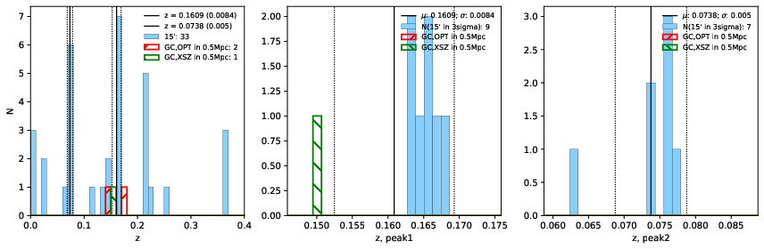 |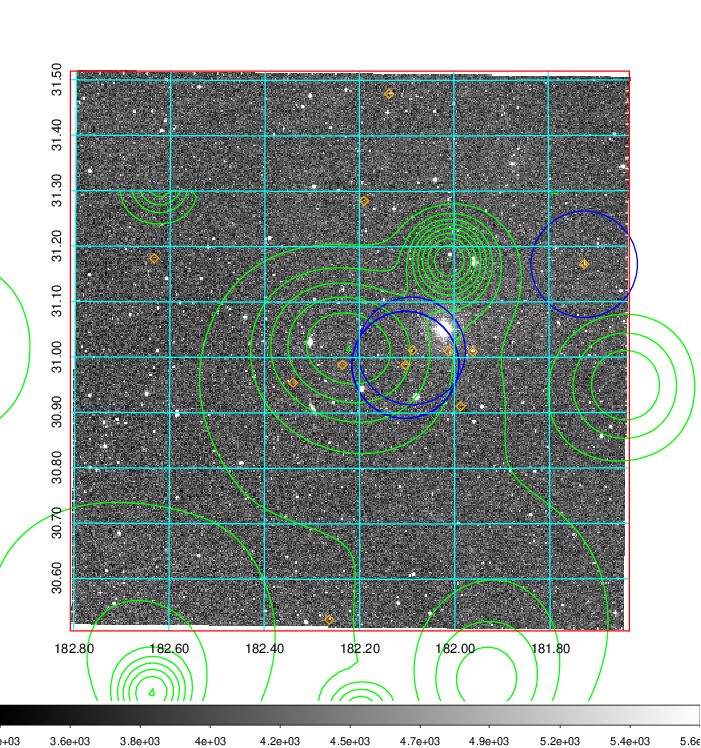  Blue circle for optical clusters;  Magenta circle for XSZ clusters;  all with r=1Mpc;  Only GC with Delta_z<0.01 are shown. | 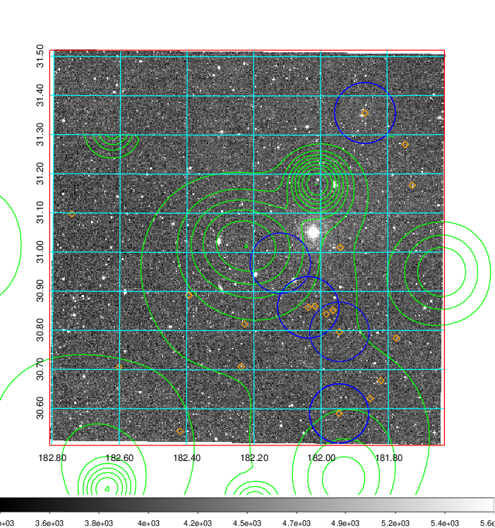 Blue circle for optical clusters;  Magenta circle for XSZ clusters;  all with r=1Mpc;  Only GC with Delta_z<0.01 are shown.  |

|[known Abell/XSZ clusters](../image/447/447_gc.pdf) | [2MASS image](../image/447/447_2mass.pdf)      |[SDSS image](../image/447/447_sdss.pdf)   |
|-------------------|-------------------|-------------------|
|  Magenta, blue and green circles  for optical, X-ray and SZ clusters  respectively, with redshift of clusters  labelled. The radius of circles  are 1Mpc.|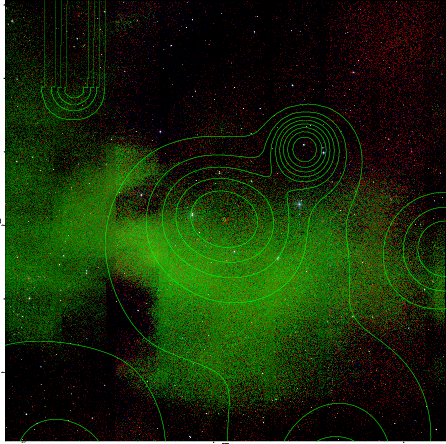  | 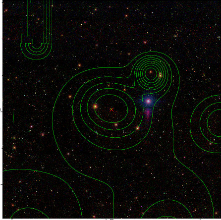  |

