

### 449

|Name|RAJ2000[deg]|DEJ2000[deg] |Ext[arcmin]| Ext,ml | z | z_src| C|GC(XSZ,Delta_z<0.01)| GC(OPT,Delta_z<0.01)|GC| R_sig[arcmin] | R500[arcmin] | R500[Mpc]| CRsig[c/s] | CR500[c/s] |L500[1E44 erg/s]|F500[1E-12 erg/s/cm^2]| M500[1E14 Msun]|Tx[keV]|Cnt_sig|Beta|Rc[arcmin]|Comment|Alias|
|---|---|---|---|---|---|------|---|--------|---------|----------|---|---|---|---|---|---|---|---|---|---|---|---|---|---|
|449| 182.567| 5.396| 2.27| 81.04| 0.0769(0.005)| z1, z_xsz| B| F20, MCXC, Tar| N, W, Zw| F20, MCXC, N, Tar, W| 9.775| 10.017| 0.875| 0.303(0.037)| 0.304(0.037)| 0.862(0.059)| 5.934(0.409)| 2.05(0.07)| 3.42(0.08)| 122.0| 0.873(-0.115+0.087)| 4.617(-0.804+0.595)| -| k262|

|[RASS image](../image/449/449_img.pdf)|[filtered image](../image/449/449_fil.pdf)|[Segment image](../image/449/449_seg.pdf)|
|-------------------|--------------------|-------------------|
| 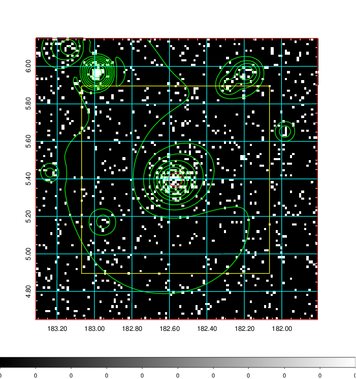  | 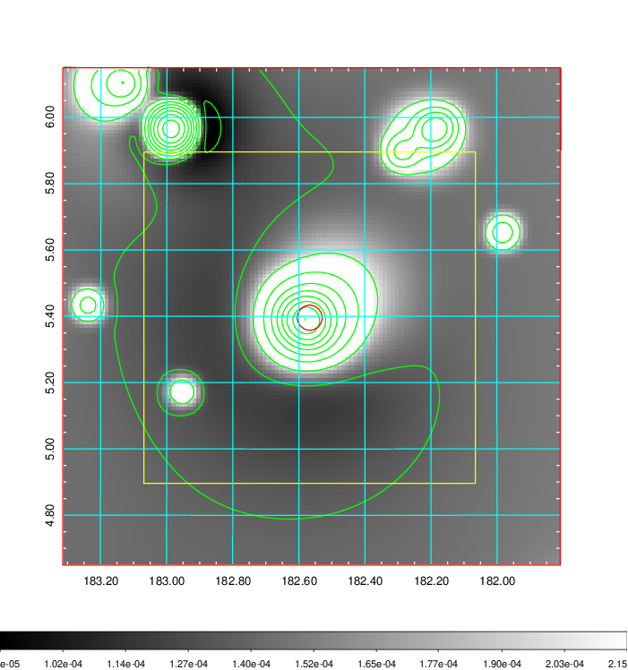   | 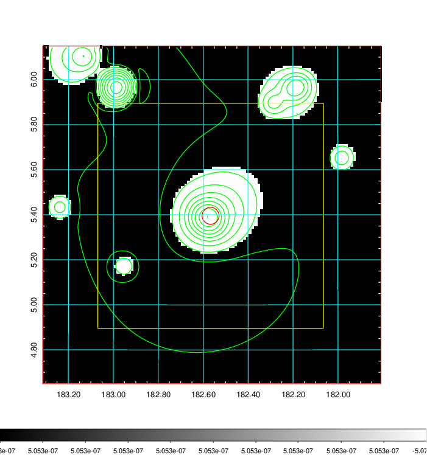  |

|[Exposure image](../image/449/449_mex.pdf)| [nH image](../image/449/449_nh.pdf)| [Planck image](../image/449/449_p.pdf)|
|-------------------|--------------------|-------------------|
|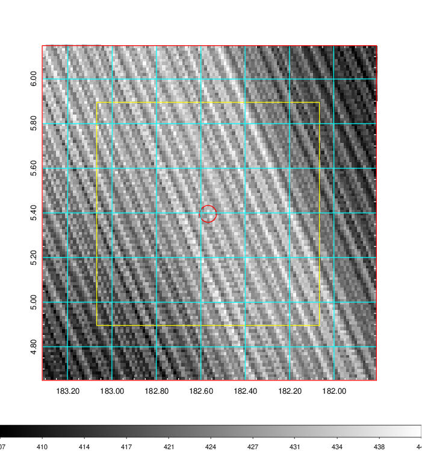   | 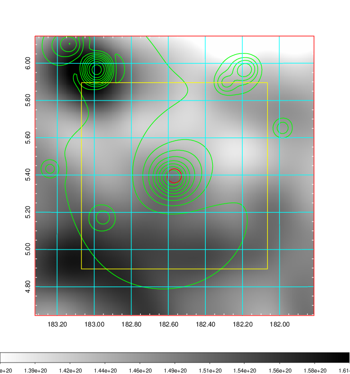    | 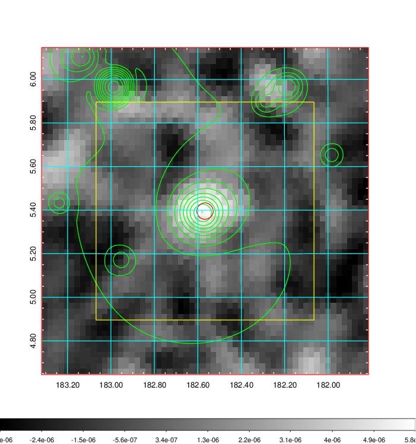 |

|[Redshift Histogram](../image/449/449_zg.pdf) | [DSS image(z1)](../image/449/449_dss_z1.pdf)      |  [DSS image(z2)](../image/449/449_dss_z2.pdf)    |
|-------------------|--------------------|-------------------|
|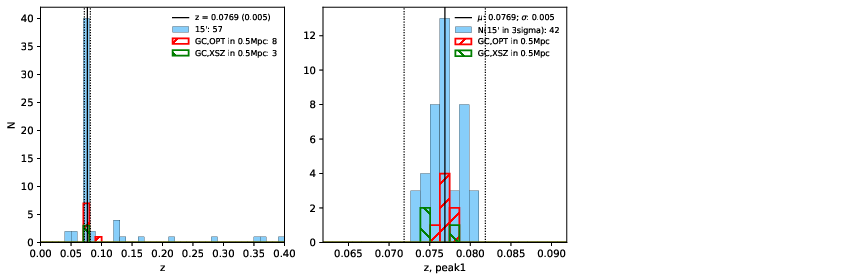 |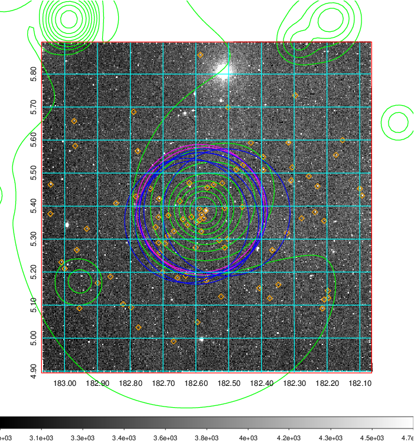  Blue circle for optical clusters;  Magenta circle for XSZ clusters;  all with r=1Mpc;  Only GC with Delta_z<0.01 are shown. | 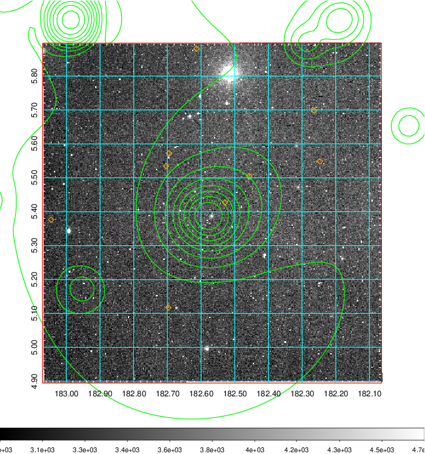 Blue circle for optical clusters;  Magenta circle for XSZ clusters;  all with r=1Mpc;  Only GC with Delta_z<0.01 are shown.  |

|[known Abell/XSZ clusters](../image/449/449_gc.pdf) | [2MASS image](../image/449/449_2mass.pdf)      |[SDSS image](../image/449/449_sdss.pdf)   |
|-------------------|-------------------|-------------------|
|  Magenta, blue and green circles  for optical, X-ray and SZ clusters  respectively, with redshift of clusters  labelled. The radius of circles  are 1Mpc.|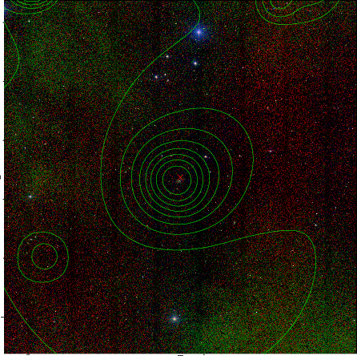  | 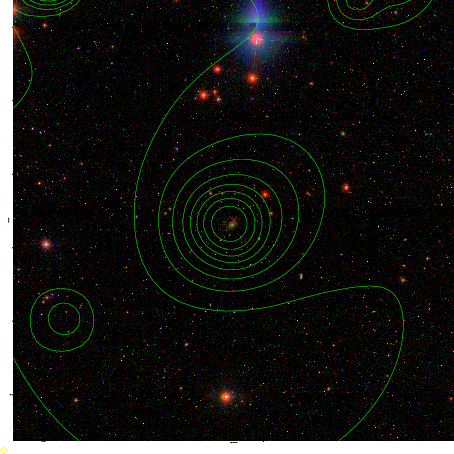  |

