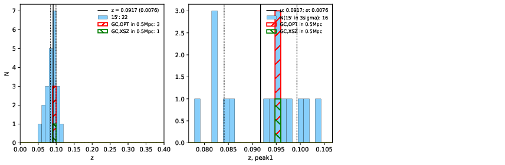

### 45

|Name|RAJ2000[deg]|DEJ2000[deg] |Ext[arcmin]| Ext,ml | z | z_src| C|GC(XSZ,Delta_z<0.01)| GC(OPT,Delta_z<0.01)|GC| R_sig[arcmin] | R500[arcmin] | R500[Mpc]| CRsig[c/s] | CR500[c/s] |L500[1E44 erg/s]|F500[1E-12 erg/s/cm^2]| M500[1E14 Msun]|Tx[keV]|Cnt_sig|Beta|Rc[arcmin]|Comment|Alias|
|---|---|---|---|---|---|------|---|--------|---------|----------|---|---|---|---|---|---|---|---|---|---|---|---|---|---|
|45| 14.595| -14.444| 3.62| 39.03| 0.0917(0.008)| z1, z_xsz| B| MCXC| A, W| A, MCXC, N, W| 9.288| 7.555| 0.774| 0.122(0.030)| 0.119(0.029)| 0.481(0.071)| 2.281(0.337)| 1.44(0.11)| 2.76(0.13)| 60.4| 0.921(-0.100+0.057)| 6.330(-0.802+0.660)| -| k448|

|[RASS image](../image/45/45_img.pdf)|[filtered image](../image/45/45_fil.pdf)|[Segment image](../image/45/45_seg.pdf)|
|-------------------|--------------------|-------------------|
|   |    |   |

|[Exposure image](../image/45/45_mex.pdf)| [nH image](../image/45/45_nh.pdf)| [Planck image](../image/45/45_p.pdf)|
|-------------------|--------------------|-------------------|
|   |     |  |

|[Redshift Histogram](../image/45/45_zg.pdf) | [DSS image(z1)](../image/45/45_dss_z1.pdf)      |  [DSS image(z2)](../image/45/45_dss_z2.pdf)    |
|-------------------|--------------------|-------------------|
| |  Blue circle for optical clusters;  Magenta circle for XSZ clusters;  all with r=1Mpc;  Only GC with Delta_z<0.01 are shown. |  Blue circle for optical clusters;  Magenta circle for XSZ clusters;  all with r=1Mpc;  Only GC with Delta_z<0.01 are shown.  |

|[Previous-identified clusters](../image/45/45_gc.pdf) | [2MASS image](../image/45/45_2mass.pdf)      |
|-------------------|-------------------|
|  Green, magenta, and blue circles  for optical, X-ray and SZ clusters  respectively, with redshift of clusters  labelled. The radius of circles  are 1Mpc.|  |

|[ATLAS image](../image/45/45_s.pdf)        |
|-------------------|
|   |
