

### 450

|Name|RAJ2000[deg]|DEJ2000[deg] |Ext[arcmin]| Ext,ml | z | z_src| C|GC(XSZ,Delta_z<0.01)| GC(OPT,Delta_z<0.01)|GC| R_sig[arcmin] | R500[arcmin] | R500[Mpc]| CRsig[c/s] | CR500[c/s] |L500[1E44 erg/s]|F500[1E-12 erg/s/cm^2]| M500[1E14 Msun]|Tx[keV]|Cnt_sig|Beta|Rc[arcmin]|Comment|Alias|
|---|---|---|---|---|---|------|---|--------|---------|----------|---|---|---|---|---|---|---|---|---|---|---|---|---|---|
|450| 184.417| 3.660| 2.77| 513.48| 0.0770(0.005)| z1, z_xsz| B| F20, MCXC| N, W, Zw| F20, MCXC, N, W| 11.725| 12.665| 1.108| 0.917(0.056)| 0.929(0.056)| 2.670(0.074)| 18.332(0.505)| 4.16(0.06)| 5.29(0.05)| 394.8| 0.966(-0.047+0.025)| 5.662(-0.313+0.222)| -| k345|

|[RASS image](../image/450/450_img.pdf)|[filtered image](../image/450/450_fil.pdf)|[Segment image](../image/450/450_seg.pdf)|
|-------------------|--------------------|-------------------|
| 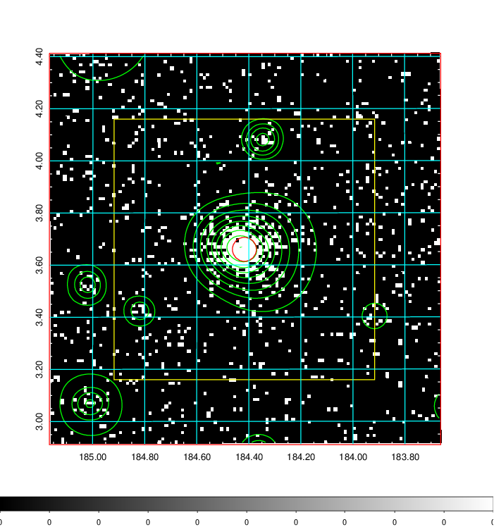  | 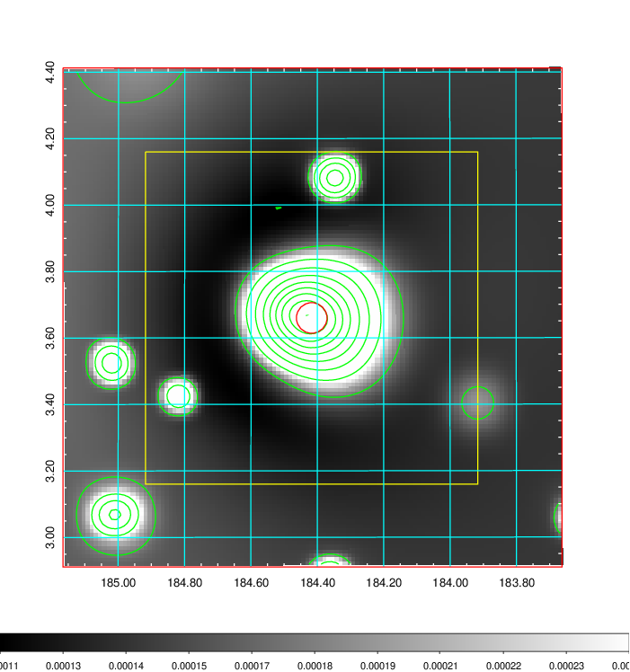   | 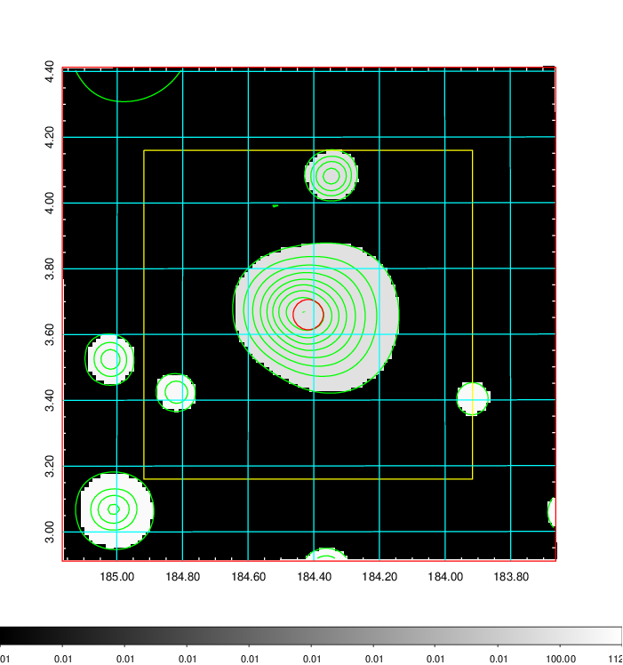  |

|[Exposure image](../image/450/450_mex.pdf)| [nH image](../image/450/450_nh.pdf)| [Planck image](../image/450/450_p.pdf)|
|-------------------|--------------------|-------------------|
|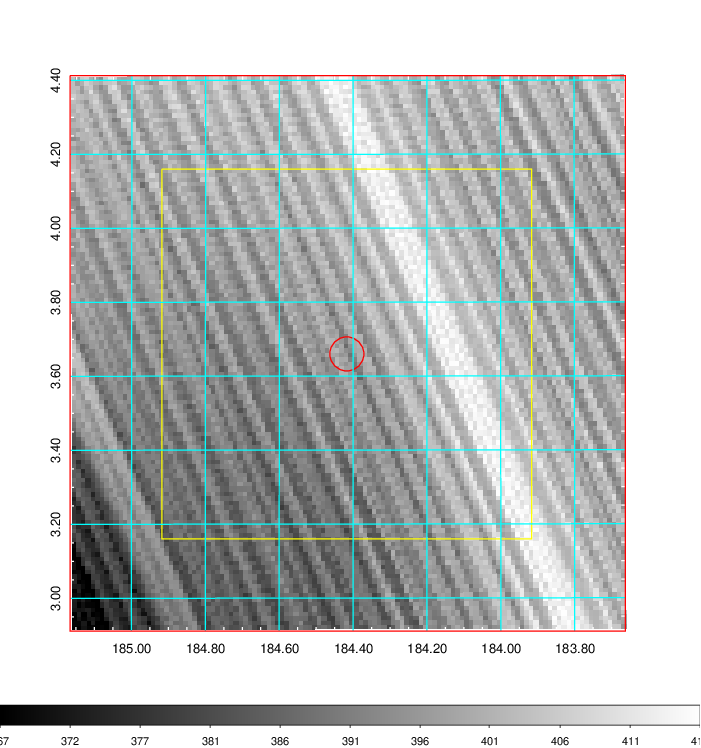   | 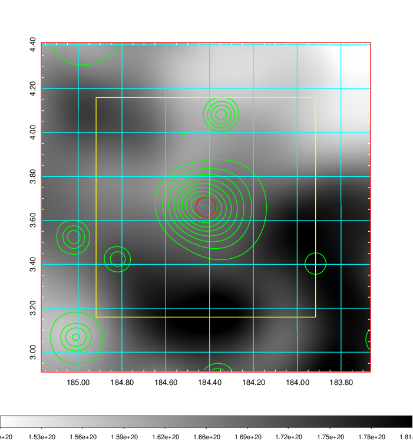    | 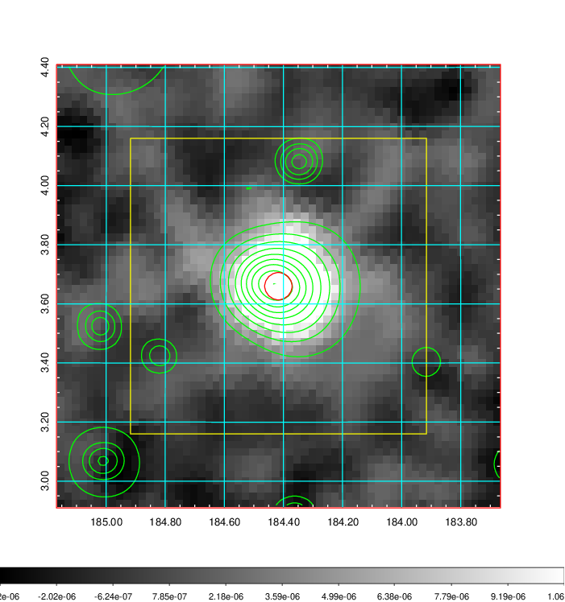 |

|[Redshift Histogram](../image/450/450_zg.pdf) | [DSS image(z1)](../image/450/450_dss_z1.pdf)      |  [DSS image(z2)](../image/450/450_dss_z2.pdf)    |
|-------------------|--------------------|-------------------|
|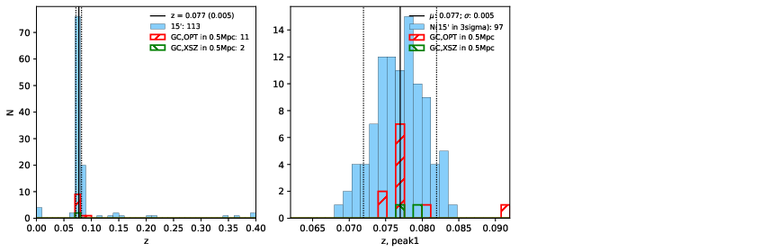 |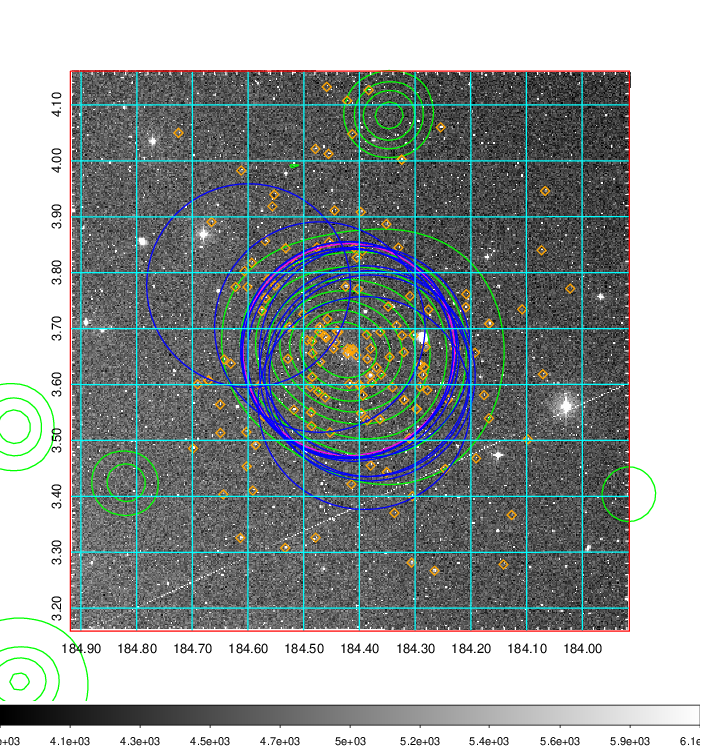  Blue circle for optical clusters;  Magenta circle for XSZ clusters;  all with r=1Mpc;  Only GC with Delta_z<0.01 are shown. | 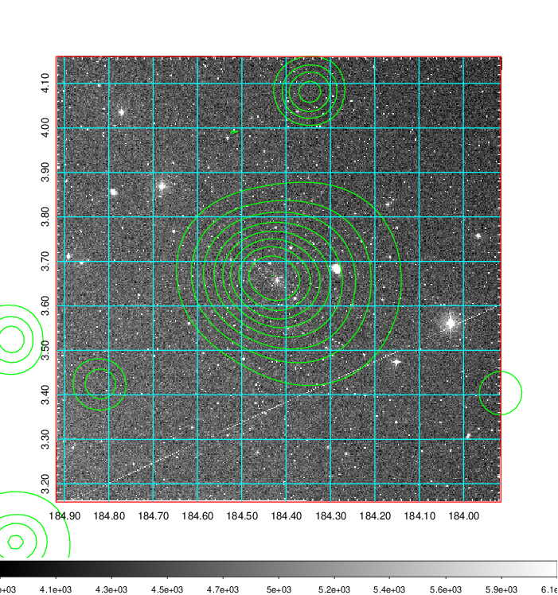 Blue circle for optical clusters;  Magenta circle for XSZ clusters;  all with r=1Mpc;  Only GC with Delta_z<0.01 are shown.  |

|[known Abell/XSZ clusters](../image/450/450_gc.pdf) | [2MASS image](../image/450/450_2mass.pdf)      |[SDSS image](../image/450/450_sdss.pdf)   |
|-------------------|-------------------|-------------------|
|  Magenta, blue and green circles  for optical, X-ray and SZ clusters  respectively, with redshift of clusters  labelled. The radius of circles  are 1Mpc.|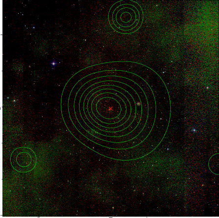  | 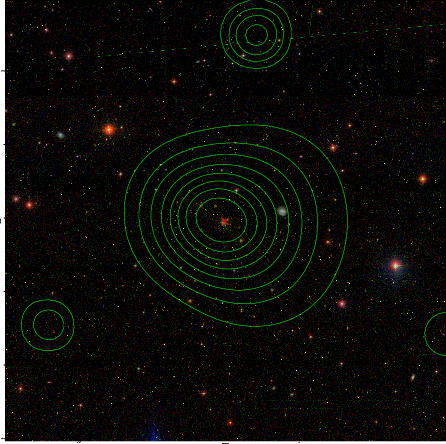  |

