

### 451

|Name|RAJ2000[deg]|DEJ2000[deg] |Ext[arcmin]| Ext,ml | z | z_src| C|GC(XSZ,Delta_z<0.01)| GC(OPT,Delta_z<0.01)|GC| R_sig[arcmin] | R500[arcmin] | R500[Mpc]| CRsig[c/s] | CR500[c/s] |L500[1E44 erg/s]|F500[1E-12 erg/s/cm^2]| M500[1E14 Msun]|Tx[keV]|Cnt_sig|Beta|Rc[arcmin]|Comment|Alias|
|---|---|---|---|---|---|------|---|--------|---------|----------|---|---|---|---|---|---|---|---|---|---|---|---|---|---|
|451| 184.790| -5.005| 3.42| 38.26| 0.0790(0.005)| z1, z_opt| S| -| W| A, W| 10.262| 8.273| 0.741| 0.133(0.038)| 0.129(0.037)| 0.352(0.066)| 2.292(0.426)| 1.25(0.12)| 2.52(0.15)| 58.1| 0.883(-0.127+0.083)| 6.008(-1.001+0.826)| -| t159|

|[RASS image](../image/451/451_img.pdf)|[filtered image](../image/451/451_fil.pdf)|[Segment image](../image/451/451_seg.pdf)|
|-------------------|--------------------|-------------------|
| 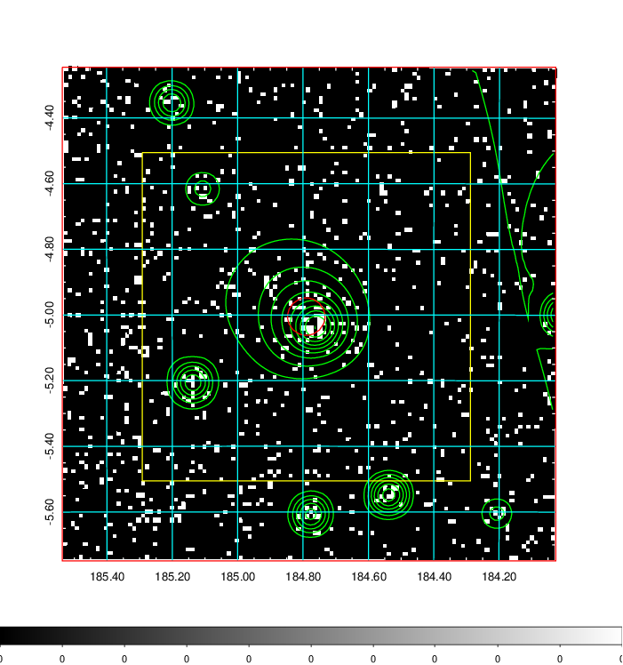  | 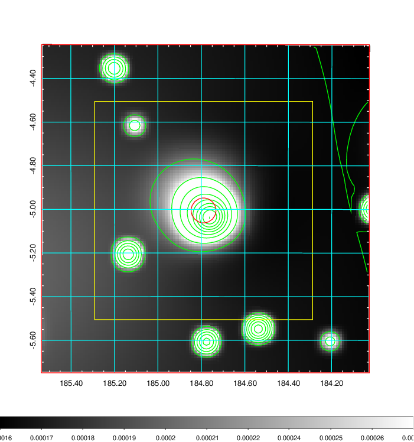   | 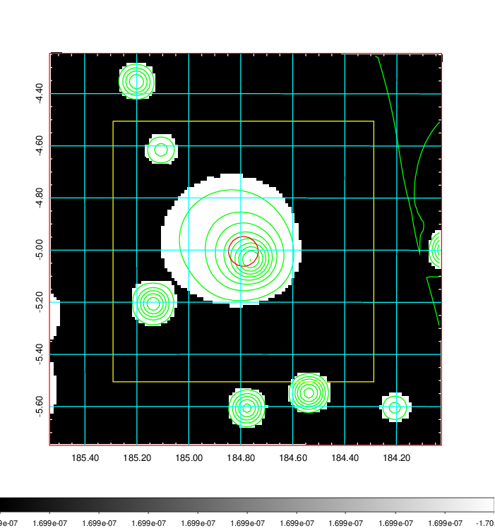  |

|[Exposure image](../image/451/451_mex.pdf)| [nH image](../image/451/451_nh.pdf)| [Planck image](../image/451/451_p.pdf)|
|-------------------|--------------------|-------------------|
|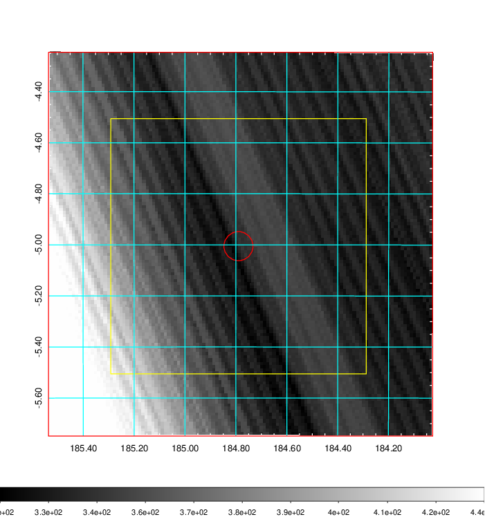   | 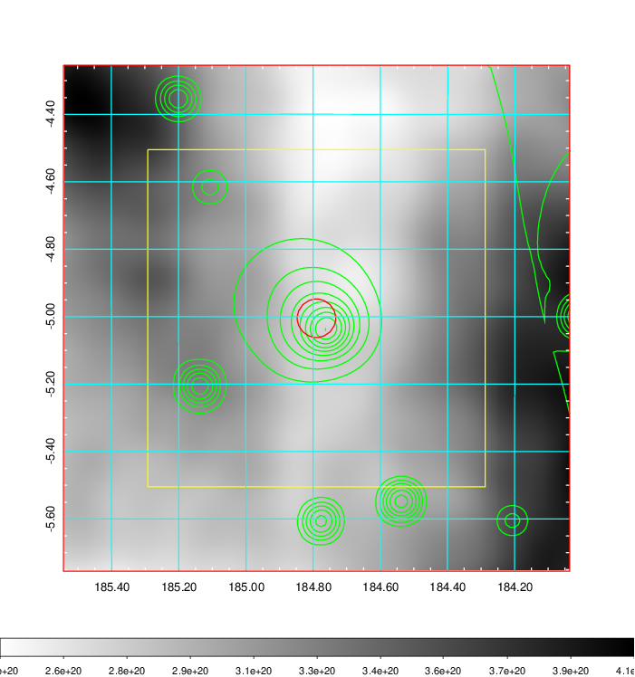    | 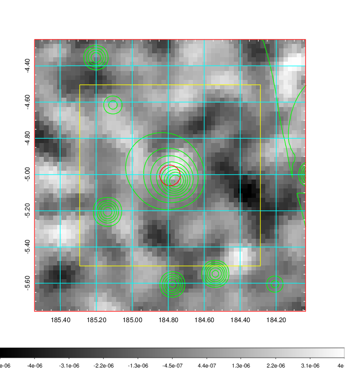 |

|[Redshift Histogram](../image/451/451_zg.pdf) | [DSS image(z1)](../image/451/451_dss_z1.pdf)      |  [DSS image(z2)](../image/451/451_dss_z2.pdf)    |
|-------------------|--------------------|-------------------|
|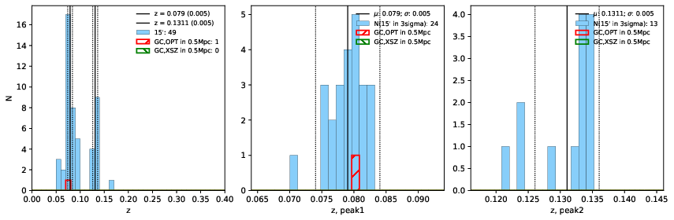 |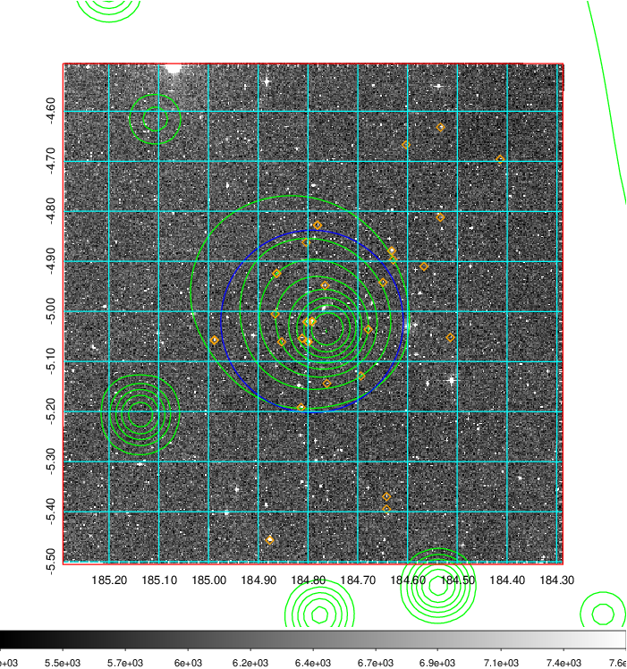  Blue circle for optical clusters;  Magenta circle for XSZ clusters;  all with r=1Mpc;  Only GC with Delta_z<0.01 are shown. | 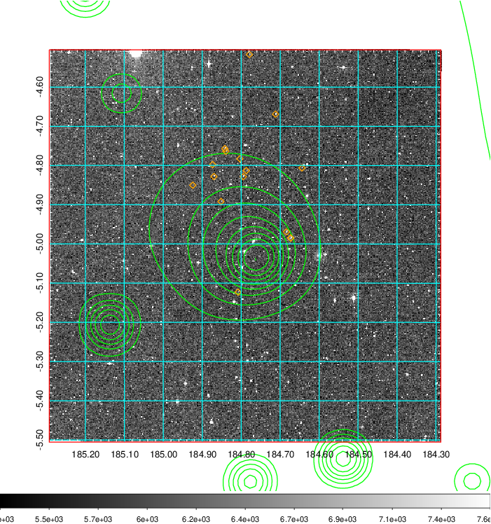 Blue circle for optical clusters;  Magenta circle for XSZ clusters;  all with r=1Mpc;  Only GC with Delta_z<0.01 are shown.  |

|[Previous-identified clusters](../image/451/451_gc.pdf) | [2MASS image](../image/451/451_2mass.pdf)      |
|-------------------|-------------------|
|  Green, magenta, and blue circles  for optical, X-ray and SZ clusters  respectively, with redshift of clusters  labelled. The radius of circles  are 1Mpc.|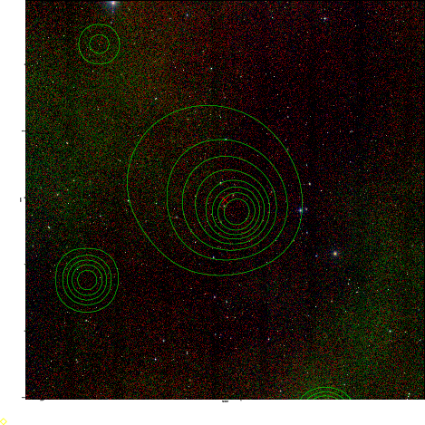  |

|[ATLAS image](../image/451/451_s.pdf)        |
|-------------------|
| 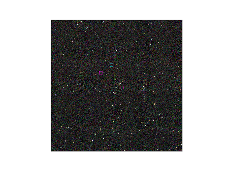  |
