

### 452

|Name|RAJ2000[deg]|DEJ2000[deg] |Ext[arcmin]| Ext,ml | z | z_src| C|GC(XSZ,Delta_z<0.01)| GC(OPT,Delta_z<0.01)|GC| R_sig[arcmin] | R500[arcmin] | R500[Mpc]| CRsig[c/s] | CR500[c/s] |L500[1E44 erg/s]|F500[1E-12 erg/s/cm^2]| M500[1E14 Msun]|Tx[keV]|Cnt_sig|Beta|Rc[arcmin]|Comment|Alias|
|---|---|---|---|---|---|------|---|--------|---------|----------|---|---|---|---|---|---|---|---|---|---|---|---|---|---|
|452| 184.819| 5.791| 17.14| 154.62| 0.0067(0.005)| z1, z_opt| S| -| N| C, N, Tak, W| 34.081| 47.664| 0.395| 0.728(0.071)| 0.780(0.076)| 0.011(0.001)| 10.716(0.871)| 0.18(0.01)| 0.73(0.02)| 348.4| 0.510(-0.007+0.017)| 11.074(-0.718+0.879)| An X-ray cluster with $z$ = 0.3535 and offset = 0.12 Mpc (14 arcmin), an SZ cluster with no $z$ with offset = 0.28 Mpc (32 arcmin)| t560|

|[RASS image](../image/452/452_img.pdf)|[filtered image](../image/452/452_fil.pdf)|[Segment image](../image/452/452_seg.pdf)|
|-------------------|--------------------|-------------------|
| 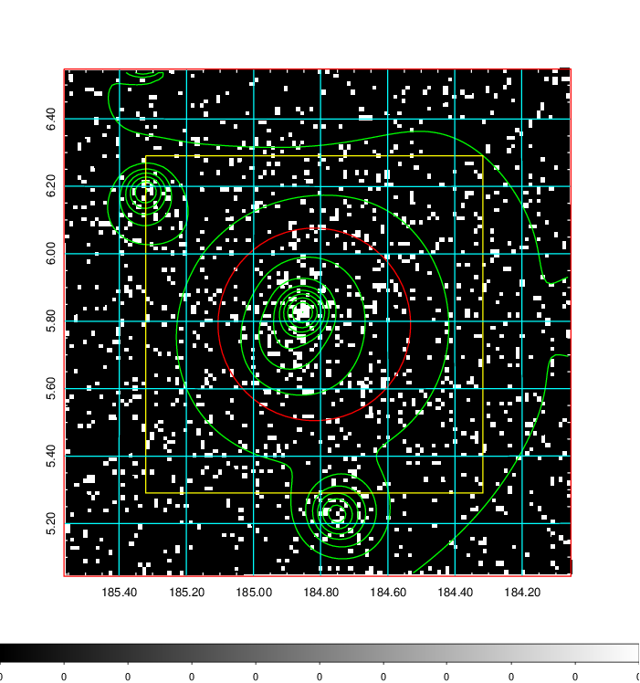  | 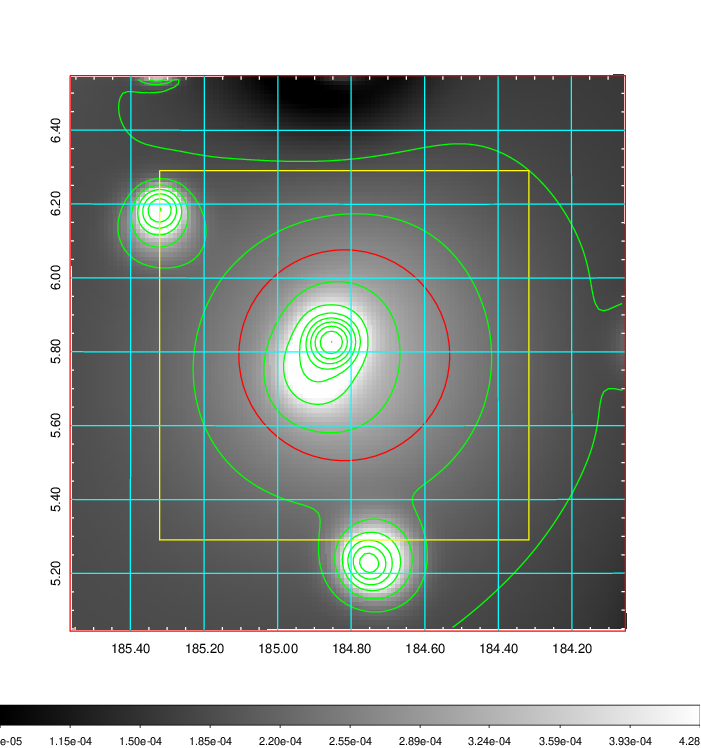   | 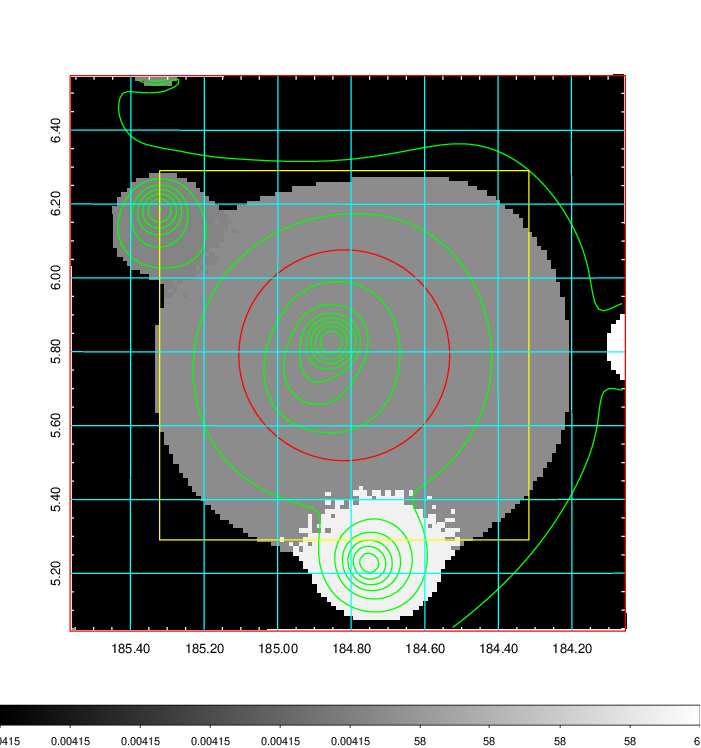  |

|[Exposure image](../image/452/452_mex.pdf)| [nH image](../image/452/452_nh.pdf)| [Planck image](../image/452/452_p.pdf)|
|-------------------|--------------------|-------------------|
|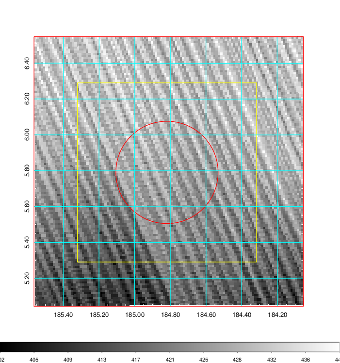   | 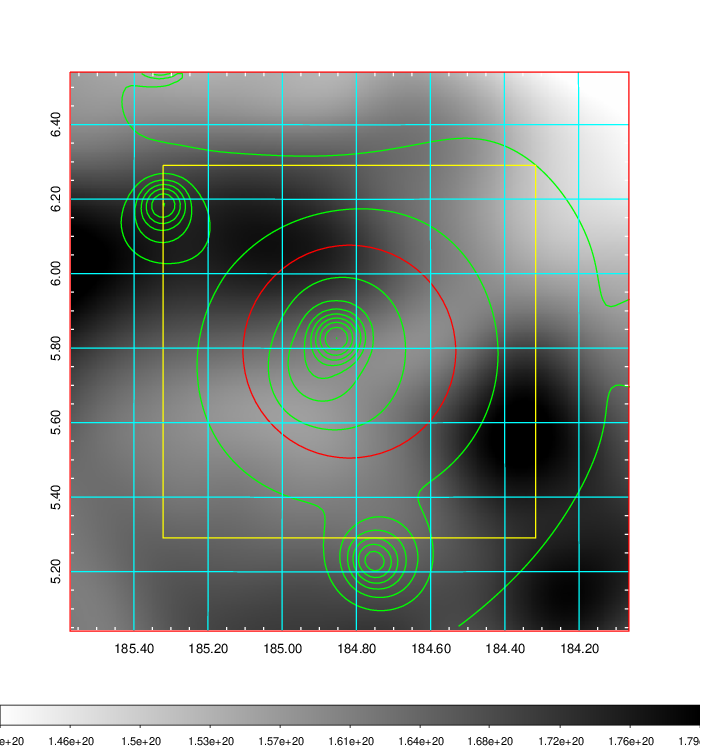    | 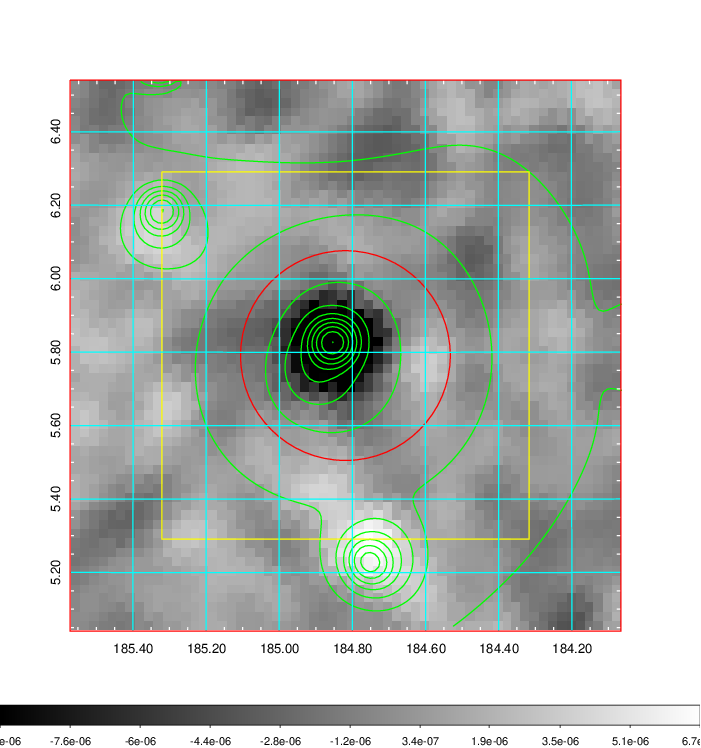 |

|[Redshift Histogram](../image/452/452_zg.pdf) | [DSS image(z1)](../image/452/452_dss_z1.pdf)      |  [DSS image(z2)](../image/452/452_dss_z2.pdf)    |
|-------------------|--------------------|-------------------|
|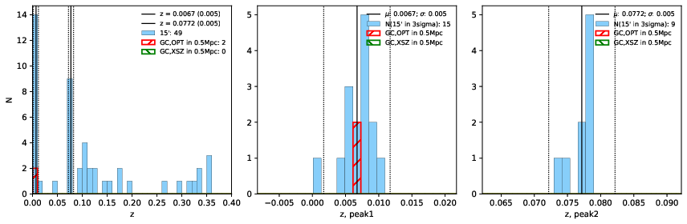 |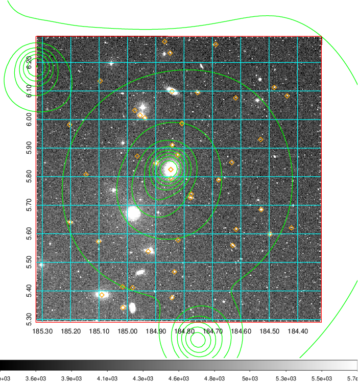  Blue circle for optical clusters;  Magenta circle for XSZ clusters;  all with r=1Mpc;  Only GC with Delta_z<0.01 are shown. | 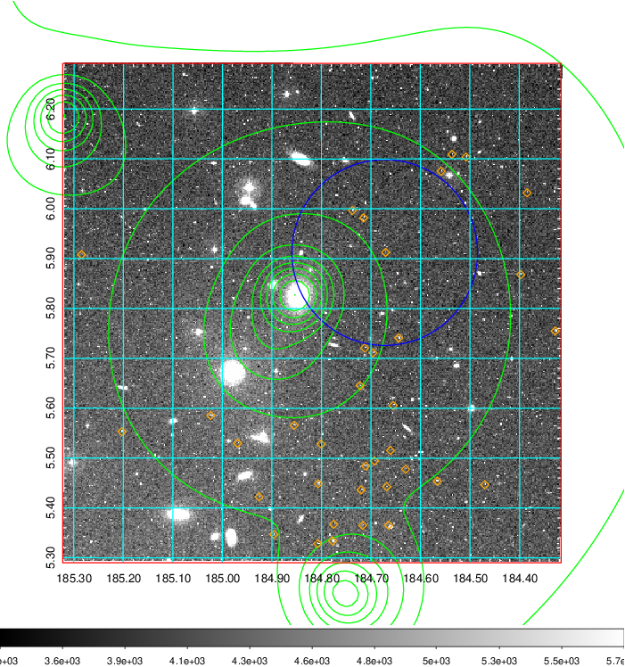 Blue circle for optical clusters;  Magenta circle for XSZ clusters;  all with r=1Mpc;  Only GC with Delta_z<0.01 are shown.  |

|[Previous-identified clusters](../image/452/452_gc.pdf) | [2MASS image](../image/452/452_2mass.pdf)      |[SDSS image](../image/452/452_sdss.pdf)   |
|-------------------|-------------------|-------------------|
|  Green, magenta, and blue circles  for optical, X-ray and SZ clusters  respectively, with redshift of clusters  labelled. The radius of circles  are 1Mpc.|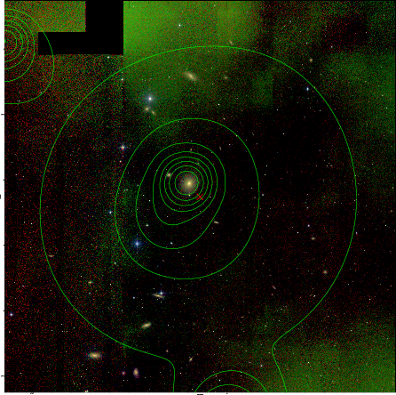  | 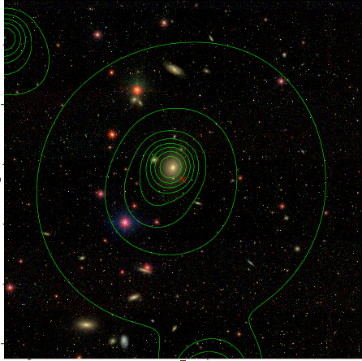  |

