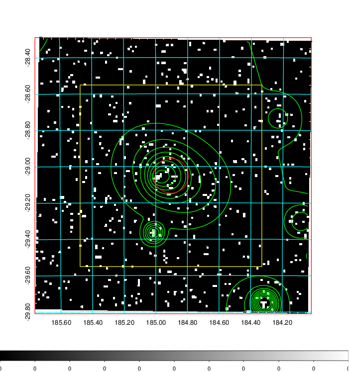
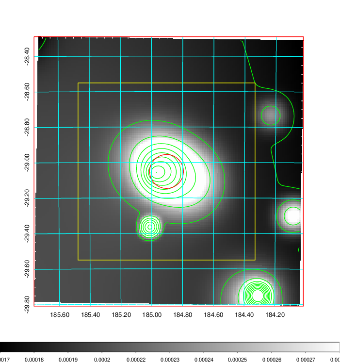
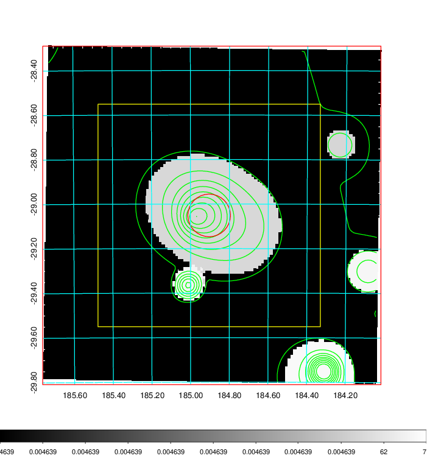
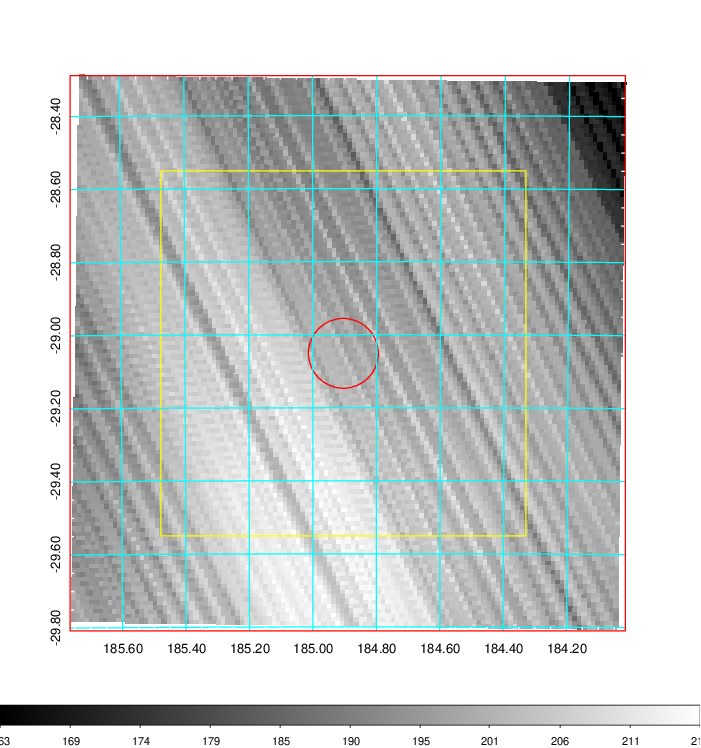
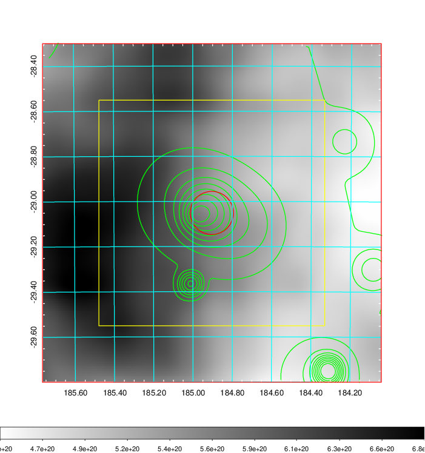
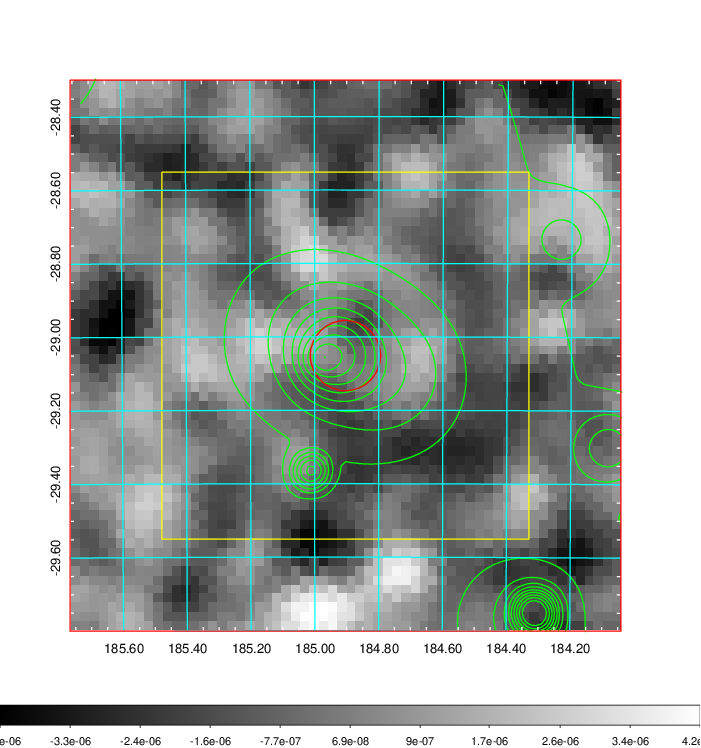
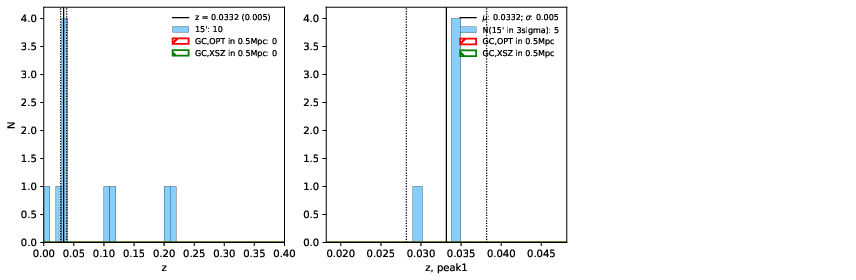
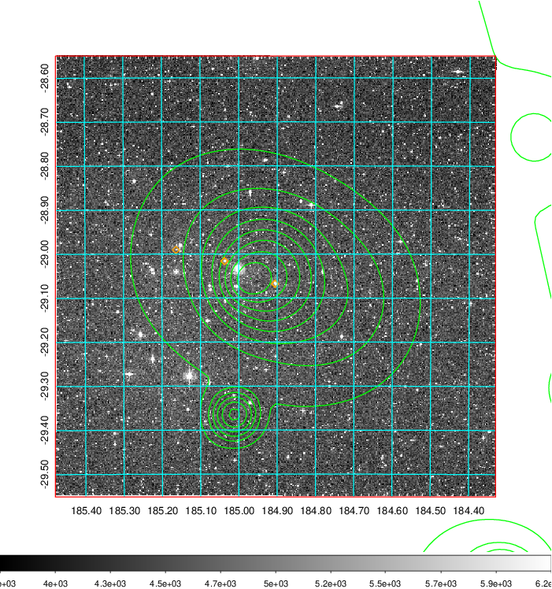
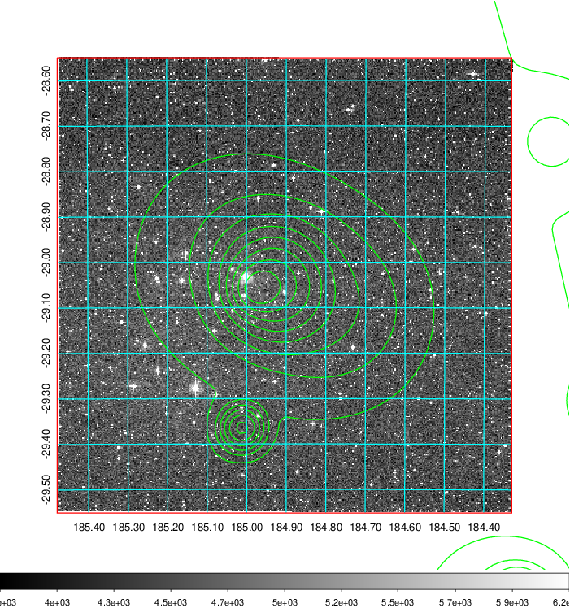
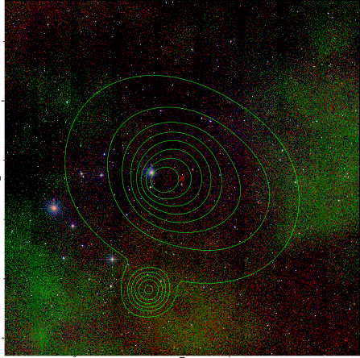

### 453

|Name|RAJ2000[deg]|DEJ2000[deg] |Ext[arcmin]| Ext,ml | z | z_src| C|GC(XSZ,Delta_z<0.01)| GC(OPT,Delta_z<0.01)|GC| R_sig[arcmin] | R500[arcmin] | R500[Mpc]| CRsig[c/s] | CR500[c/s] |L500[1E44 erg/s]|F500[1E-12 erg/s/cm^2]| M500[1E14 Msun]|Tx[keV]|Cnt_sig|Beta|Rc[arcmin]|Comment|Alias|
|---|---|---|---|---|---|------|---|--------|---------|----------|---|---|---|---|---|---|---|---|---|---|---|---|---|---|
|453| 184.904| -29.051| 5.74| 25.98| 0.0332(0.005)| z1,| G| -| -| -| 15.625| 13.850| 0.550| 0.164(0.055)| 0.161(0.054)| 0.060(0.016)| 2.354(0.639)| 0.49(0.07)| 1.39(0.12)| 48.9| 0.691(-0.141+0.194)| 6.286(-1.983+2.321)| -| t298|

|[RASS image](../image/453/453_img.pdf)|[filtered image](../image/453/453_fil.pdf)|[Segment image](../image/453/453_seg.pdf)|
|-------------------|--------------------|-------------------|
|   |    |   |

|[Exposure image](../image/453/453_mex.pdf)| [nH image](../image/453/453_nh.pdf)| [Planck image](../image/453/453_p.pdf)|
|-------------------|--------------------|-------------------|
|   |     |  |

|[Redshift Histogram](../image/453/453_zg.pdf) | [DSS image(z1)](../image/453/453_dss_z1.pdf)      |  [DSS image(z2)](../image/453/453_dss_z2.pdf)    |
|-------------------|--------------------|-------------------|
| |  Blue circle for optical clusters;  Magenta circle for XSZ clusters;  all with r=1Mpc;  Only GC with Delta_z<0.01 are shown. |  Blue circle for optical clusters;  Magenta circle for XSZ clusters;  all with r=1Mpc;  Only GC with Delta_z<0.01 are shown.  |

|[known Abell/XSZ clusters](../image/453/453_gc.pdf) | [2MASS image](../image/453/453_2mass.pdf)      |
|-------------------|-------------------|
|  Magenta, blue and green circles  for optical, X-ray and SZ clusters  respectively, with redshift of clusters  labelled. The radius of circles  are 1Mpc.|  |

|[PS1 image](../image/453/453_ps1.pdf)            |
|-------------------|
|   |
