

### 454

|Name|RAJ2000[deg]|DEJ2000[deg] |Ext[arcmin]| Ext,ml | z | z_src| C|GC(XSZ,Delta_z<0.01)| GC(OPT,Delta_z<0.01)|GC| R_sig[arcmin] | R500[arcmin] | R500[Mpc]| CRsig[c/s] | CR500[c/s] |L500[1E44 erg/s]|F500[1E-12 erg/s/cm^2]| M500[1E14 Msun]|Tx[keV]|Cnt_sig|Beta|Rc[arcmin]|Comment|Alias|
|---|---|---|---|---|---|------|---|--------|---------|----------|---|---|---|---|---|---|---|---|---|---|---|---|---|---|
|454| 186.033| 43.843| 23.08| 51.24| 0.0679(0.005)| z1,| G| -| -| N| 10.750| 7.926| 0.618| 0.077(0.033)| 0.074(0.031)| 0.148(0.057)| 1.322(0.507)| 0.72(0.14)| 1.78(0.22)| 47.5| 0.782(-0.171+0.151)| 5.729(-1.634+1.443)| -| t601|

|[RASS image](../image/454/454_img.pdf)|[filtered image](../image/454/454_fil.pdf)|[Segment image](../image/454/454_seg.pdf)|
|-------------------|--------------------|-------------------|
| 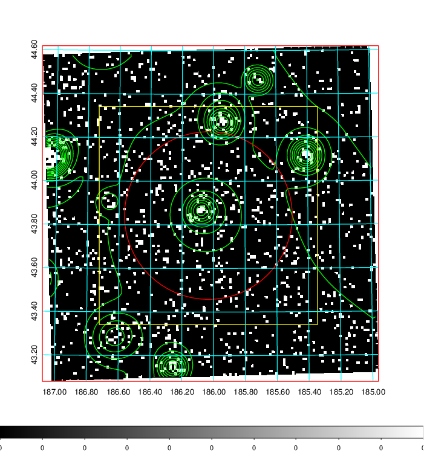  | 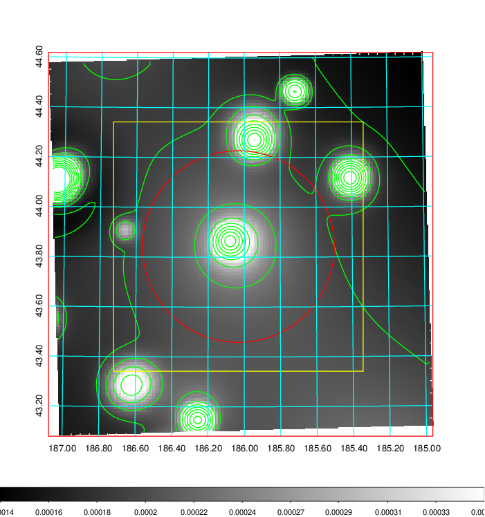   | 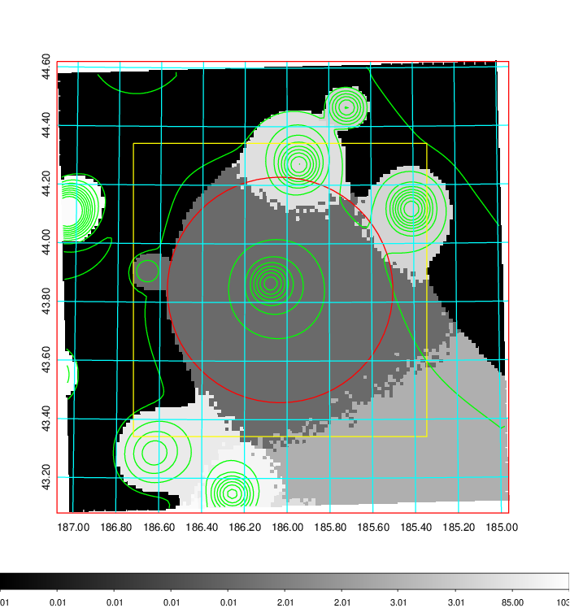  |

|[Exposure image](../image/454/454_mex.pdf)| [nH image](../image/454/454_nh.pdf)| [Planck image](../image/454/454_p.pdf)|
|-------------------|--------------------|-------------------|
|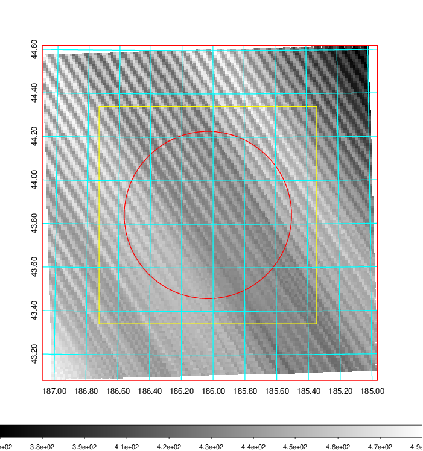   | 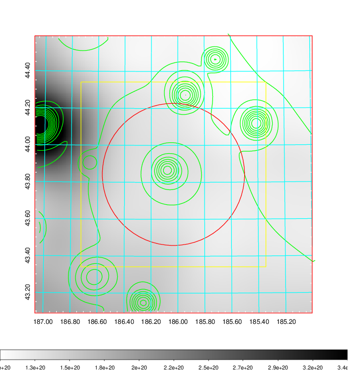    | 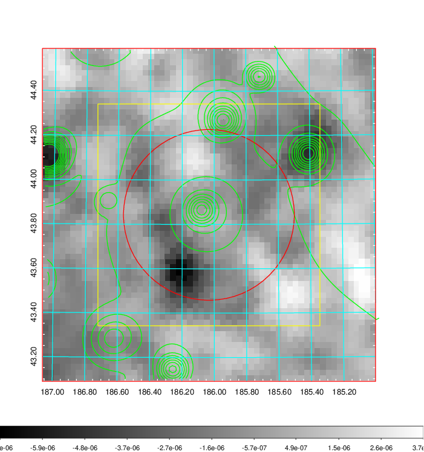 |

|[Redshift Histogram](../image/454/454_zg.pdf) | [DSS image(z1)](../image/454/454_dss_z1.pdf)      |  [DSS image(z2)](../image/454/454_dss_z2.pdf)    |
|-------------------|--------------------|-------------------|
|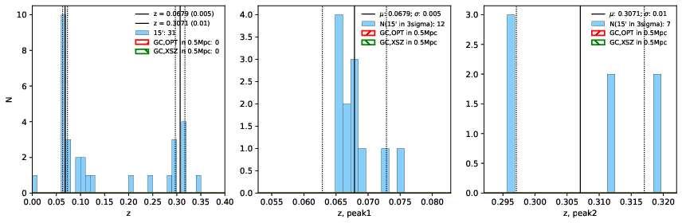 |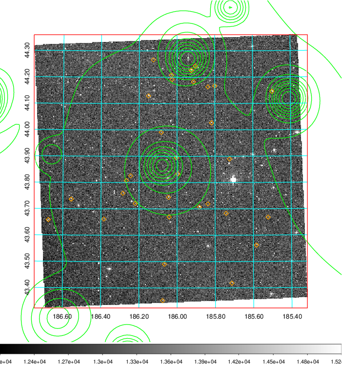  Blue circle for optical clusters;  Magenta circle for XSZ clusters;  all with r=1Mpc;  Only GC with Delta_z<0.01 are shown. | 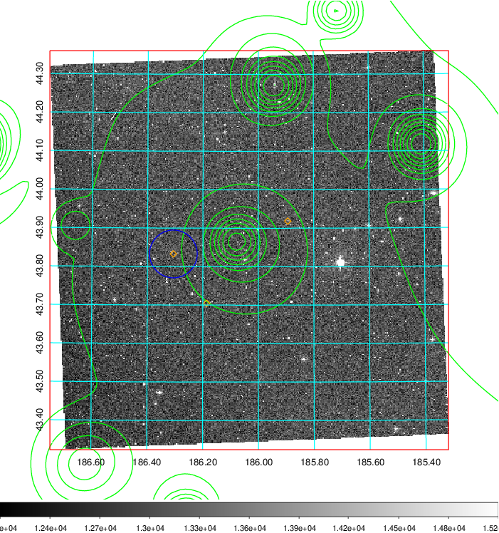 Blue circle for optical clusters;  Magenta circle for XSZ clusters;  all with r=1Mpc;  Only GC with Delta_z<0.01 are shown.  |

|[Previous-identified clusters](../image/454/454_gc.pdf) | [2MASS image](../image/454/454_2mass.pdf)      |
|-------------------|-------------------|
|  Green, magenta, and blue circles  for optical, X-ray and SZ clusters  respectively, with redshift of clusters  labelled. The radius of circles  are 1Mpc.|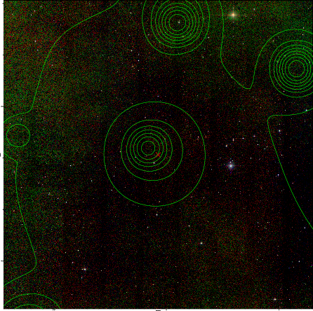  |

|[PS1 image](../image/454/454_ps1.pdf)            |
|-------------------|
| 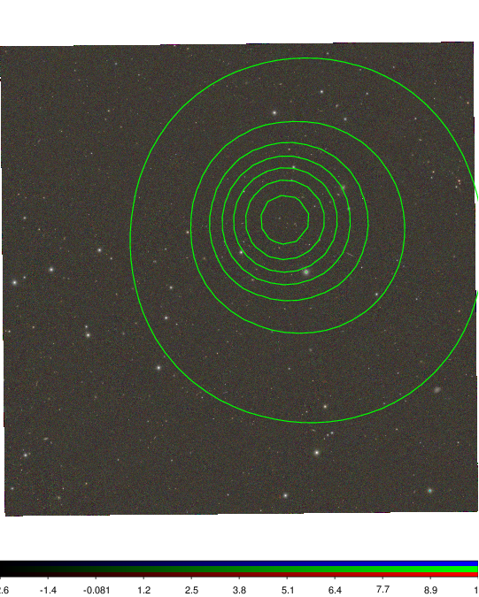  |
