

### 455

|Name|RAJ2000[deg]|DEJ2000[deg] |Ext[arcmin]| Ext,ml | z | z_src| C|GC(XSZ,Delta_z<0.01)| GC(OPT,Delta_z<0.01)|GC| R_sig[arcmin] | R500[arcmin] | R500[Mpc]| CRsig[c/s] | CR500[c/s] |L500[1E44 erg/s]|F500[1E-12 erg/s/cm^2]| M500[1E14 Msun]|Tx[keV]|Cnt_sig|Beta|Rc[arcmin]|Comment|Alias|
|---|---|---|---|---|---|------|---|--------|---------|----------|---|---|---|---|---|---|---|---|---|---|---|---|---|---|
|455| 186.150| 61.570| 12.56| 25.37| 0.0676(0.006)| z1, z_xsz| B| L03| A, N, W| A, C, L03, N, W| 13.675| 8.026| 0.623| 0.082(0.027)| 0.077(0.025)| 0.149(0.069)| 1.341(0.625)| 0.73(0.18)| 1.81(0.27)| 46.8| 0.524(-0.018+0.046)| 3.689(-0.336+0.485)| -| t500|

|[RASS image](../image/455/455_img.pdf)|[filtered image](../image/455/455_fil.pdf)|[Segment image](../image/455/455_seg.pdf)|
|-------------------|--------------------|-------------------|
| 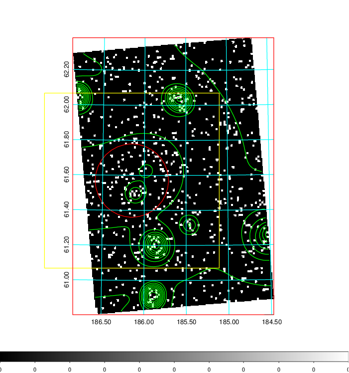  | 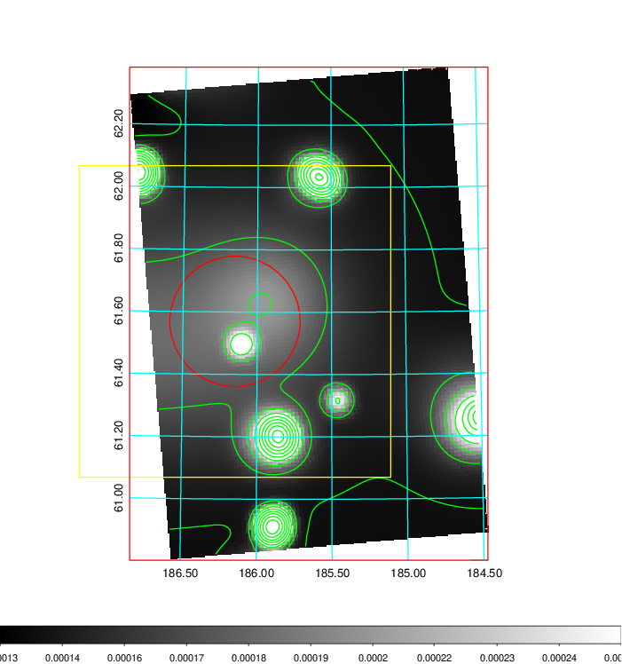   | 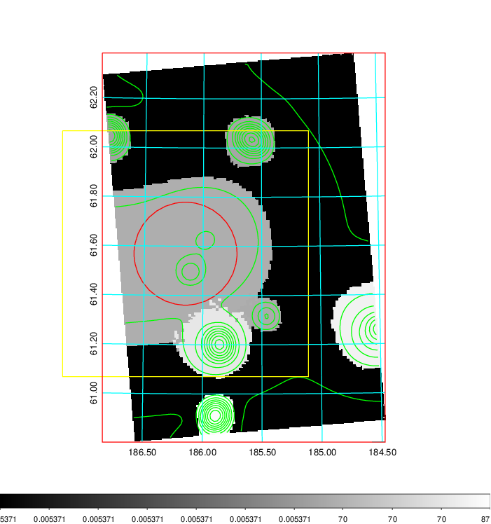  |

|[Exposure image](../image/455/455_mex.pdf)| [nH image](../image/455/455_nh.pdf)| [Planck image](../image/455/455_p.pdf)|
|-------------------|--------------------|-------------------|
|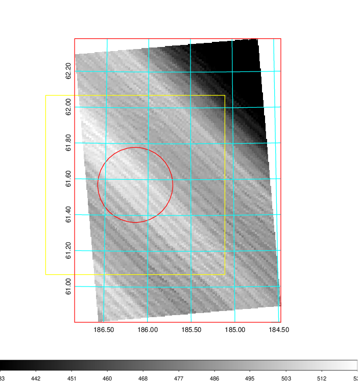   | 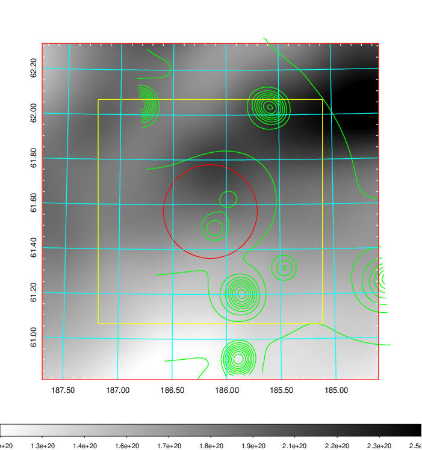    | 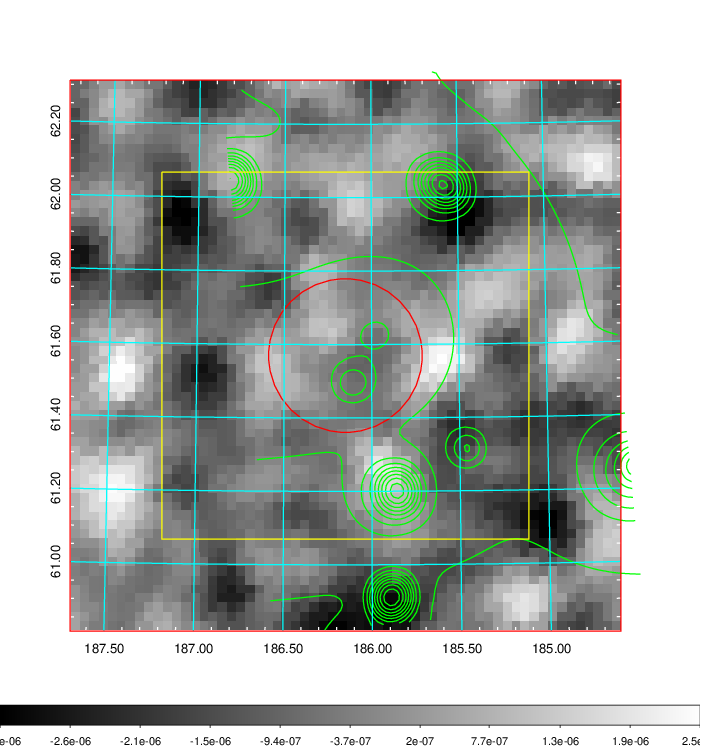 |

|[Redshift Histogram](../image/455/455_zg.pdf) | [DSS image(z1)](../image/455/455_dss_z1.pdf)      |  [DSS image(z2)](../image/455/455_dss_z2.pdf)    |
|-------------------|--------------------|-------------------|
|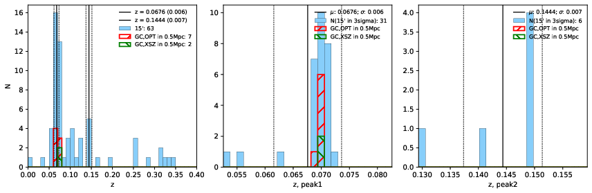 |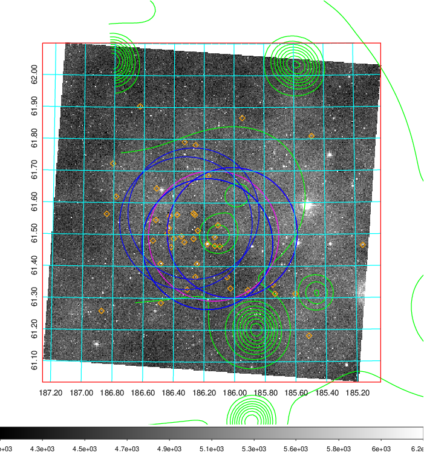  Blue circle for optical clusters;  Magenta circle for XSZ clusters;  all with r=1Mpc;  Only GC with Delta_z<0.01 are shown. | 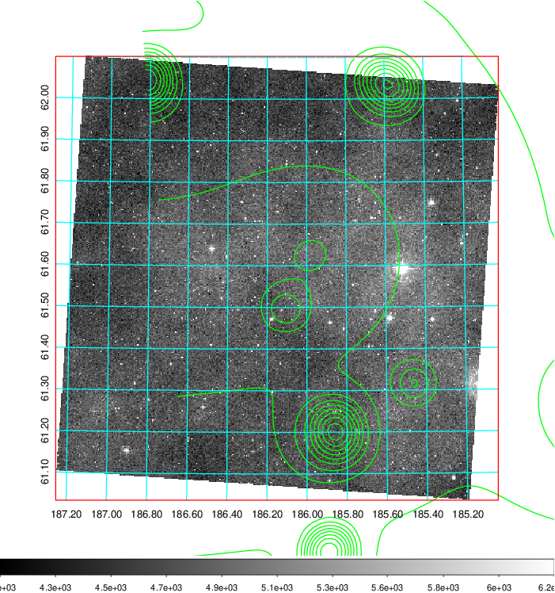 Blue circle for optical clusters;  Magenta circle for XSZ clusters;  all with r=1Mpc;  Only GC with Delta_z<0.01 are shown.  |

|[known Abell/XSZ clusters](../image/455/455_gc.pdf) | [2MASS image](../image/455/455_2mass.pdf)      |[SDSS image](../image/455/455_sdss.pdf)   |
|-------------------|-------------------|-------------------|
|  Magenta, blue and green circles  for optical, X-ray and SZ clusters  respectively, with redshift of clusters  labelled. The radius of circles  are 1Mpc.|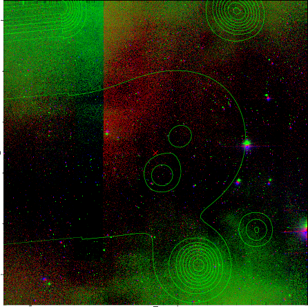  | 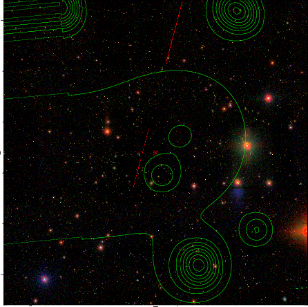  |

