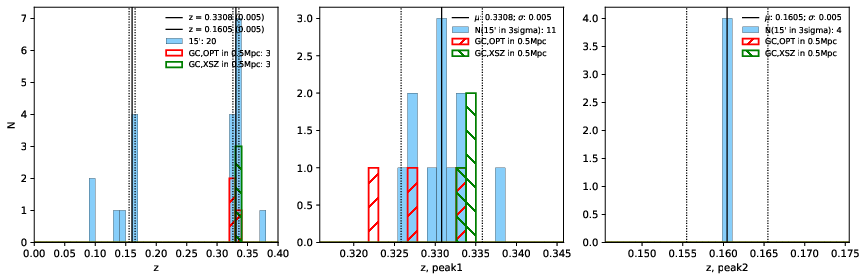

### 456

|Name|RAJ2000[deg]|DEJ2000[deg] |Ext[arcmin]| Ext,ml | z | z_src| C|GC(XSZ,Delta_z<0.01)| GC(OPT,Delta_z<0.01)|GC| R_sig[arcmin] | R500[arcmin] | R500[Mpc]| CRsig[c/s] | CR500[c/s] |L500[1E44 erg/s]|F500[1E-12 erg/s/cm^2]| M500[1E14 Msun]|Tx[keV]|Cnt_sig|Beta|Rc[arcmin]|Comment|Alias|
|---|---|---|---|---|---|------|---|--------|---------|----------|---|---|---|---|---|---|---|---|---|---|---|---|---|---|
|456| 187.692| 34.658| 1.94| 29.92| 0.3308(0.005)| z1, z_xsz| B| F20, MCXC, SPI| C, N| C, F20, MCXC, N, PSZ2, SPI, Tar, W| 10.262| 4.303| 1.229| 0.134(0.029)| 0.123(0.026)| 9.146(1.106)| 2.528(0.306)| 7.44(0.41)| 8.25(0.29)| 69.1| 0.823(-0.139+0.120)| 3.784(-0.909+0.749)| -| k206|

|[RASS image](../image/456/456_img.pdf)|[filtered image](../image/456/456_fil.pdf)|[Segment image](../image/456/456_seg.pdf)|
|-------------------|--------------------|-------------------|
|   |    |   |

|[Exposure image](../image/456/456_mex.pdf)| [nH image](../image/456/456_nh.pdf)| [Planck image](../image/456/456_p.pdf)|
|-------------------|--------------------|-------------------|
|   |     |  |

|[Redshift Histogram](../image/456/456_zg.pdf) | [DSS image(z1)](../image/456/456_dss_z1.pdf)      |  [DSS image(z2)](../image/456/456_dss_z2.pdf)    |
|-------------------|--------------------|-------------------|
| |  Blue circle for optical clusters;  Magenta circle for XSZ clusters;  all with r=1Mpc;  Only GC with Delta_z<0.01 are shown. |  Blue circle for optical clusters;  Magenta circle for XSZ clusters;  all with r=1Mpc;  Only GC with Delta_z<0.01 are shown.  |

|[known Abell/XSZ clusters](../image/456/456_gc.pdf) | [2MASS image](../image/456/456_2mass.pdf)      |[SDSS image](../image/456/456_sdss.pdf)   |
|-------------------|-------------------|-------------------|
|  Magenta, blue and green circles  for optical, X-ray and SZ clusters  respectively, with redshift of clusters  labelled. The radius of circles  are 1Mpc.|  |   |

