

### 457

|Name|RAJ2000[deg]|DEJ2000[deg] |Ext[arcmin]| Ext,ml | z | z_src| C|GC(XSZ,Delta_z<0.01)| GC(OPT,Delta_z<0.01)|GC| R_sig[arcmin] | R500[arcmin] | R500[Mpc]| CRsig[c/s] | CR500[c/s] |L500[1E44 erg/s]|F500[1E-12 erg/s/cm^2]| M500[1E14 Msun]|Tx[keV]|Cnt_sig|Beta|Rc[arcmin]|Comment|Alias|
|---|---|---|---|---|---|------|---|--------|---------|----------|---|---|---|---|---|---|---|---|---|---|---|---|---|---|
|457| 188.861| 1.858| 7.23| 29.62| 0.0799(0.005)| z1, z_xsz| B| F20| N| A, F20, L03, N, W| 36.145| 9.444| 0.855| 0.281(0.089)| 0.251(0.080)| 0.759(0.259)| 4.817(1.646)| 1.92(0.33)| 3.28(0.36)| 137.8| 0.750(-0.093+0.127)| 10.129(-1.869+2.193)| An X-ray cluster with $z$ = 0.0792 and offset = 0.67 Mpc(7.37 arcmin),| t360|

|[RASS image](../image/457/457_img.pdf)|[filtered image](../image/457/457_fil.pdf)|[Segment image](../image/457/457_seg.pdf)|
|-------------------|--------------------|-------------------|
| 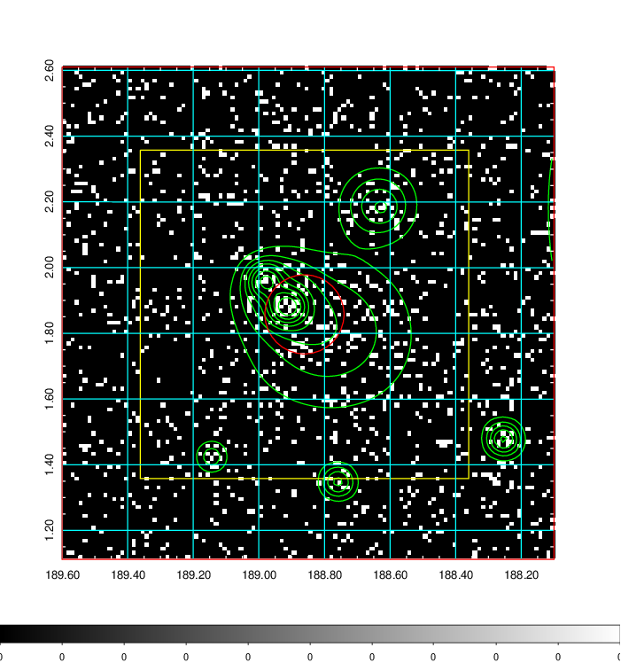  | 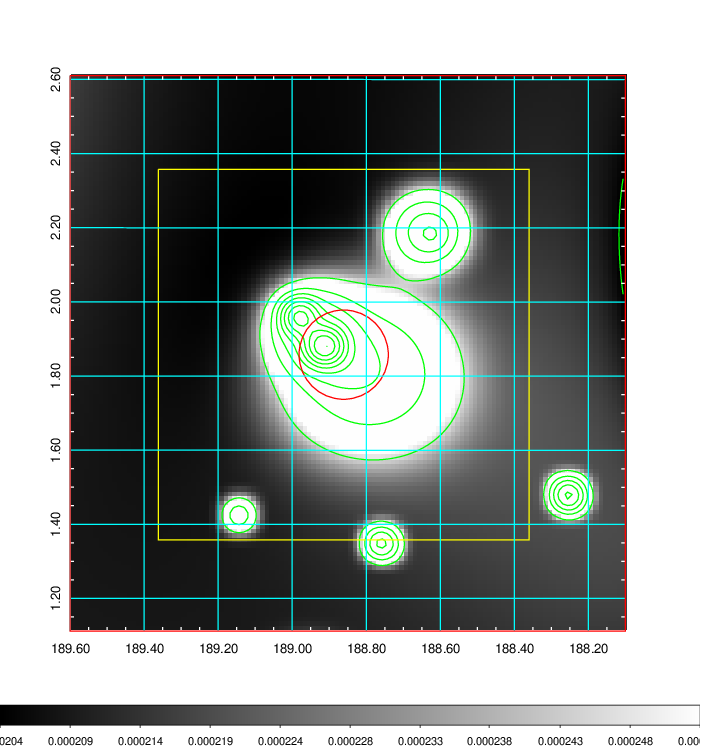   | 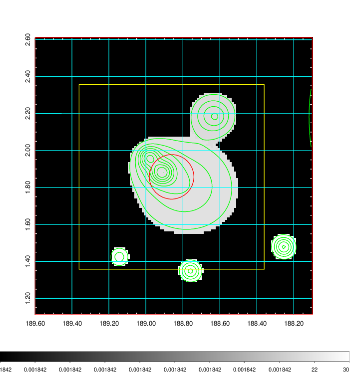  |

|[Exposure image](../image/457/457_mex.pdf)| [nH image](../image/457/457_nh.pdf)| [Planck image](../image/457/457_p.pdf)|
|-------------------|--------------------|-------------------|
|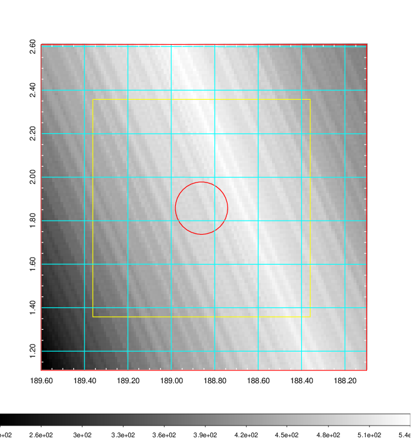   | 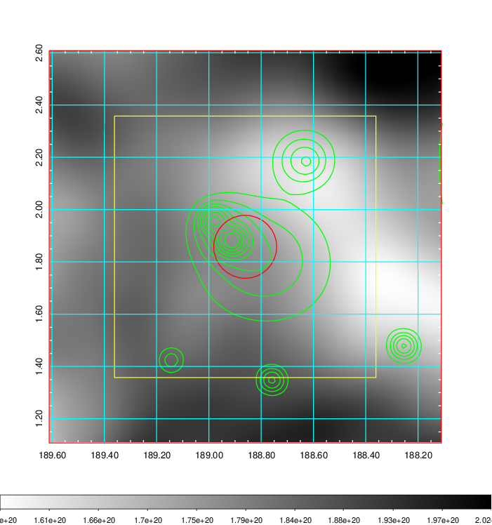    | 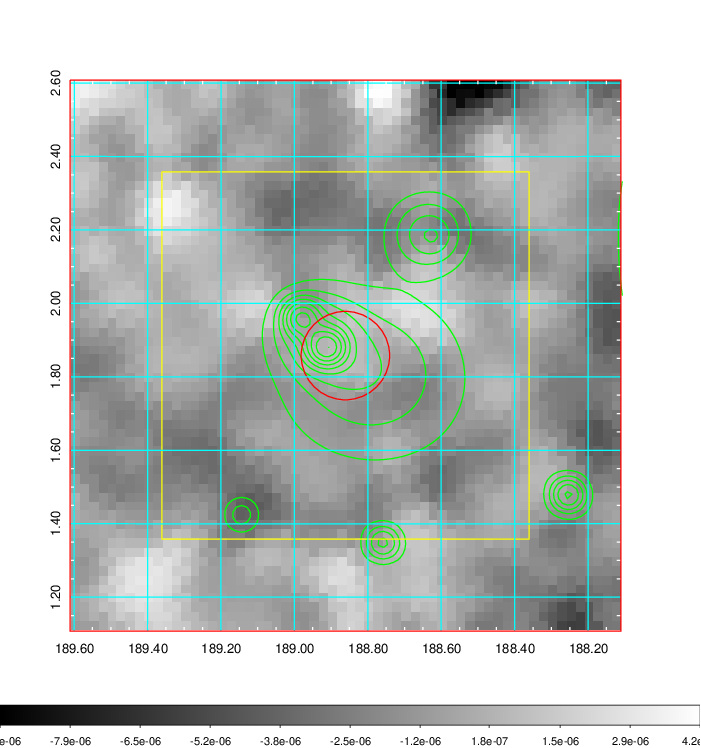 |

|[Redshift Histogram](../image/457/457_zg.pdf) | [DSS image(z1)](../image/457/457_dss_z1.pdf)      |  [DSS image(z2)](../image/457/457_dss_z2.pdf)    |
|-------------------|--------------------|-------------------|
|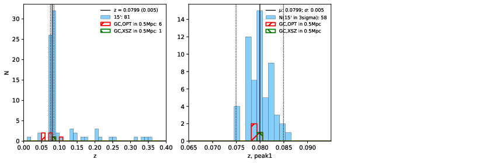 |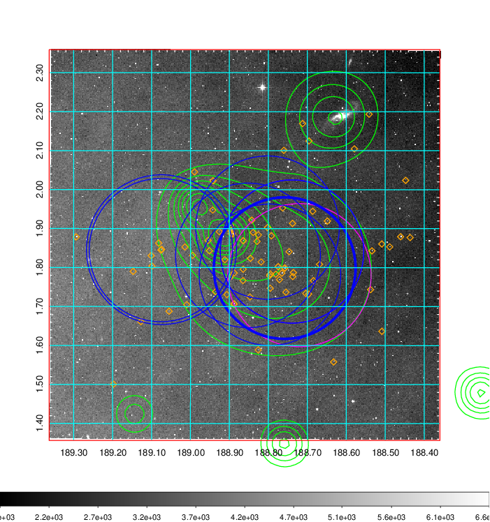  Blue circle for optical clusters;  Magenta circle for XSZ clusters;  all with r=1Mpc;  Only GC with Delta_z<0.01 are shown. | 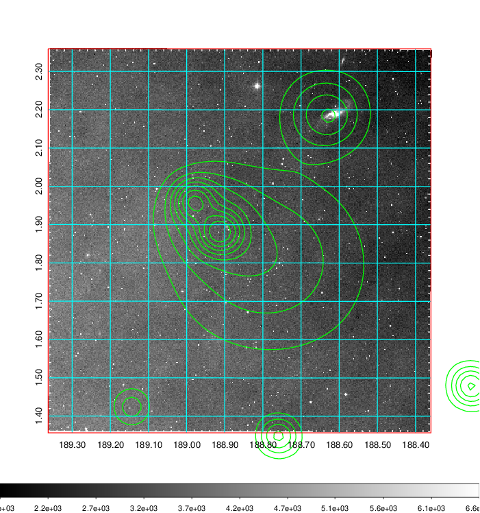 Blue circle for optical clusters;  Magenta circle for XSZ clusters;  all with r=1Mpc;  Only GC with Delta_z<0.01 are shown.  |

|[Previous-identified clusters](../image/457/457_gc.pdf) | [2MASS image](../image/457/457_2mass.pdf)      |[SDSS image](../image/457/457_sdss.pdf)   |
|-------------------|-------------------|-------------------|
|  Green, magenta, and blue circles  for optical, X-ray and SZ clusters  respectively, with redshift of clusters  labelled. The radius of circles  are 1Mpc.|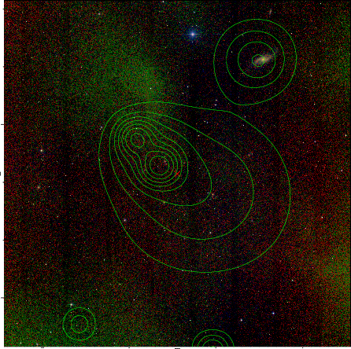  | 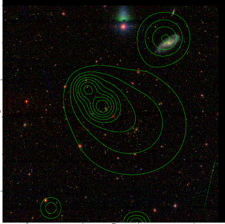  |

