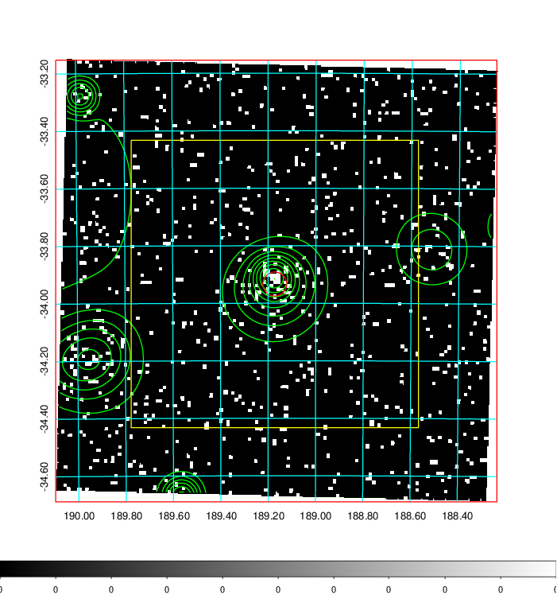
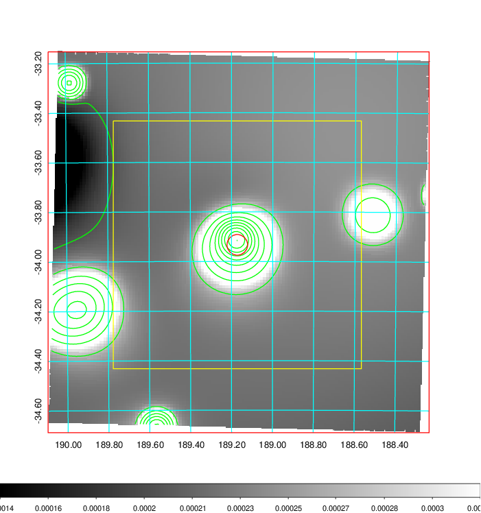
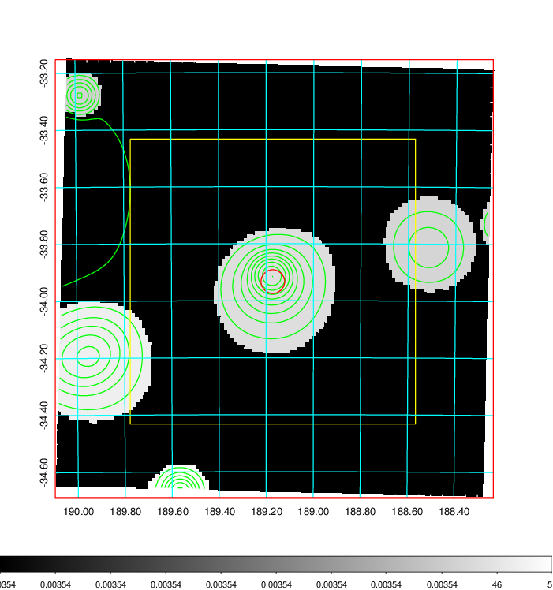
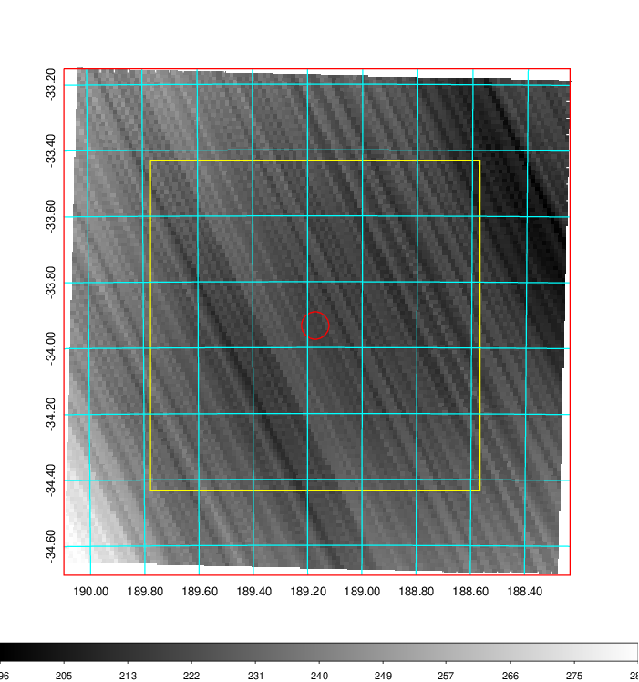
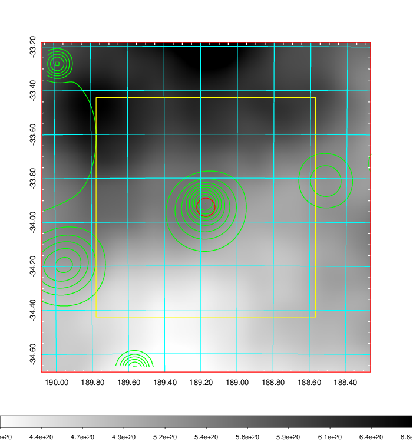
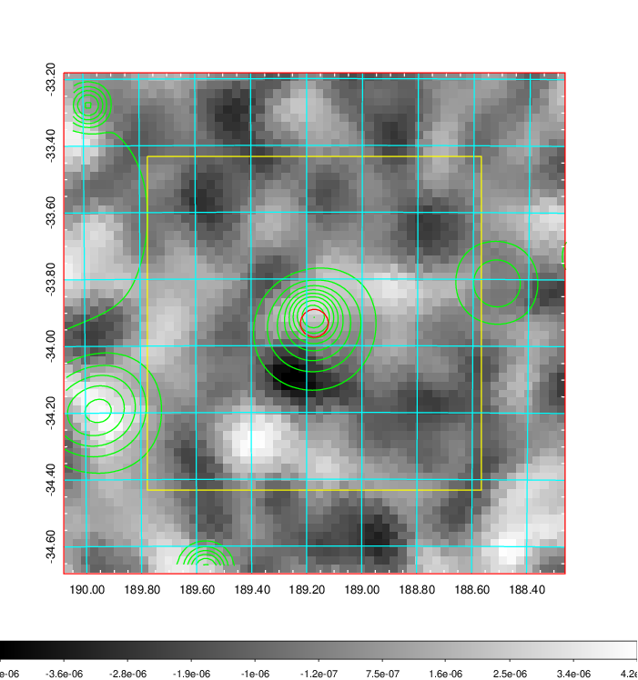
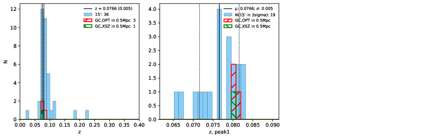
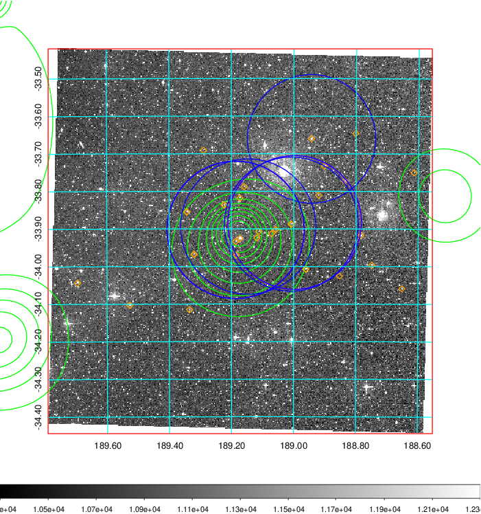
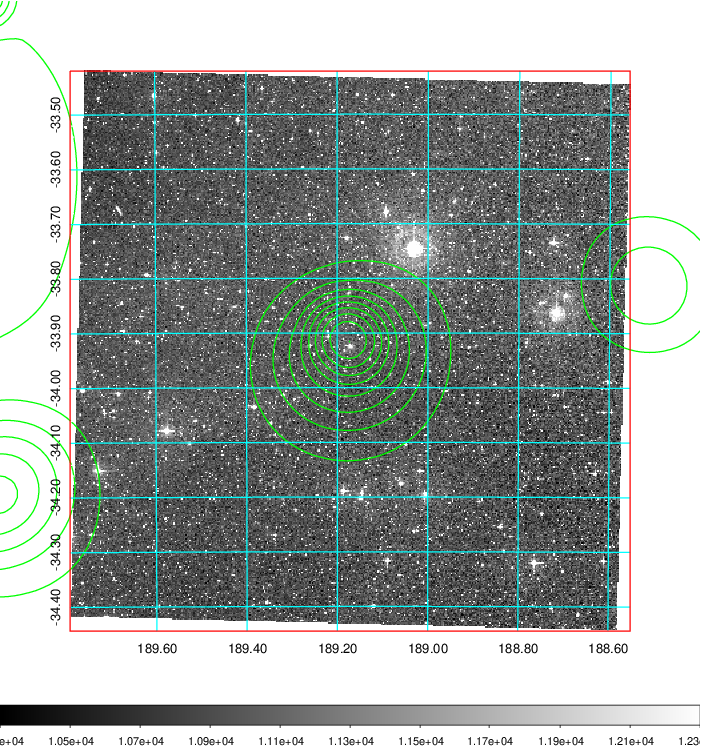
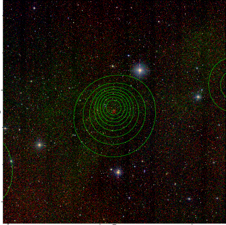

### 458

|Name|RAJ2000[deg]|DEJ2000[deg] |Ext[arcmin]| Ext,ml | z | z_src| C|GC(XSZ,Delta_z<0.01)| GC(OPT,Delta_z<0.01)|GC| R_sig[arcmin] | R500[arcmin] | R500[Mpc]| CRsig[c/s] | CR500[c/s] |L500[1E44 erg/s]|F500[1E-12 erg/s/cm^2]| M500[1E14 Msun]|Tx[keV]|Cnt_sig|Beta|Rc[arcmin]|Comment|Alias|
|---|---|---|---|---|---|------|---|--------|---------|----------|---|---|---|---|---|---|---|---|---|---|---|---|---|---|
|458| 189.172| -33.933| 2.50| 36.00| 0.0766(0.005)| z1, z_xsz| B| MCXC| A, N| A, MCXC, N, W| 9.775| 9.816| 0.855| 0.251(0.056)| 0.251(0.056)| 0.636(0.070)| 4.417(0.489)| 1.91(0.11)| 3.27(0.12)| 58.1| 0.814(-0.151+0.128)| 4.002(-1.118+0.872)| -| k296|

|[RASS image](../image/458/458_img.pdf)|[filtered image](../image/458/458_fil.pdf)|[Segment image](../image/458/458_seg.pdf)|
|-------------------|--------------------|-------------------|
|   |    |   |

|[Exposure image](../image/458/458_mex.pdf)| [nH image](../image/458/458_nh.pdf)| [Planck image](../image/458/458_p.pdf)|
|-------------------|--------------------|-------------------|
|   |     |  |

|[Redshift Histogram](../image/458/458_zg.pdf) | [DSS image(z1)](../image/458/458_dss_z1.pdf)      |  [DSS image(z2)](../image/458/458_dss_z2.pdf)    |
|-------------------|--------------------|-------------------|
| |  Blue circle for optical clusters;  Magenta circle for XSZ clusters;  all with r=1Mpc;  Only GC with Delta_z<0.01 are shown. |  Blue circle for optical clusters;  Magenta circle for XSZ clusters;  all with r=1Mpc;  Only GC with Delta_z<0.01 are shown.  |

|[known Abell/XSZ clusters](../image/458/458_gc.pdf) | [2MASS image](../image/458/458_2mass.pdf)      |
|-------------------|-------------------|
|  Magenta, blue and green circles  for optical, X-ray and SZ clusters  respectively, with redshift of clusters  labelled. The radius of circles  are 1Mpc.|  |

