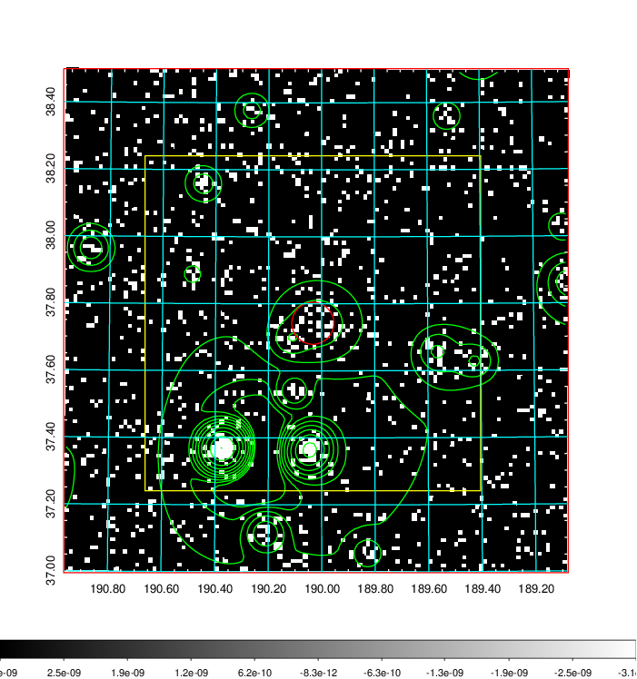
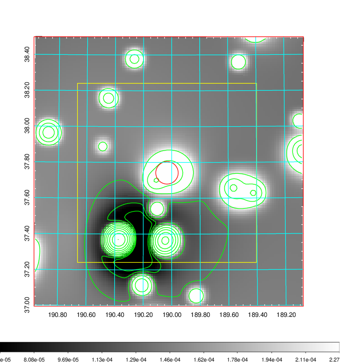
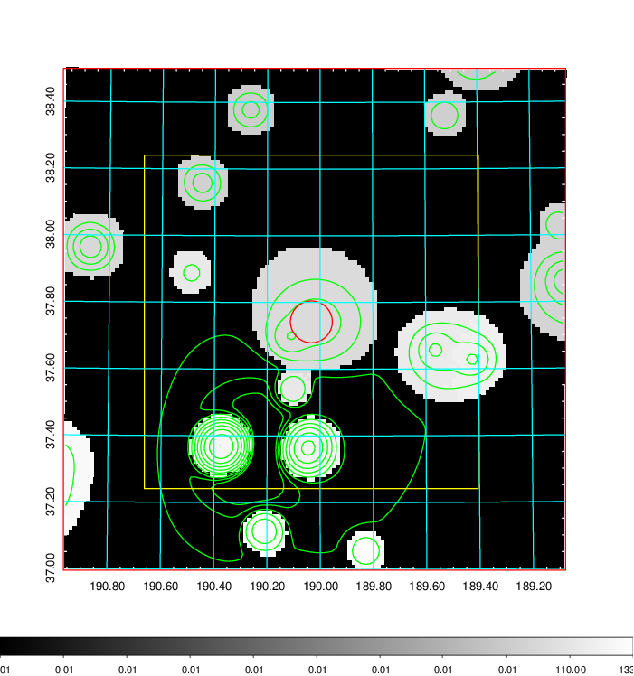
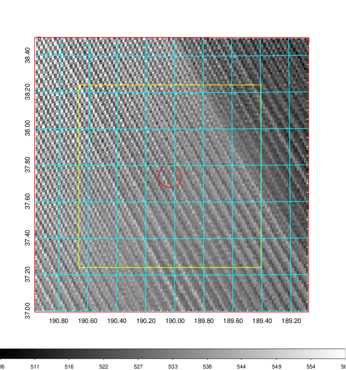
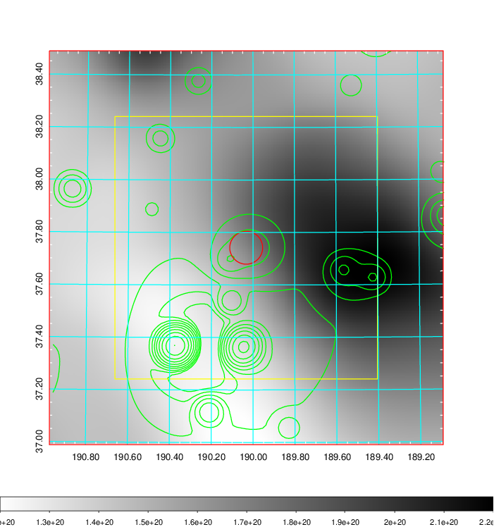
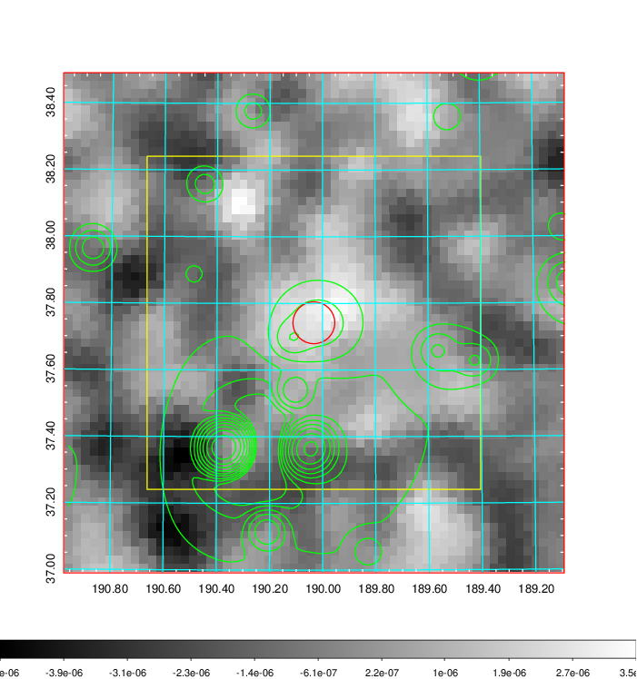
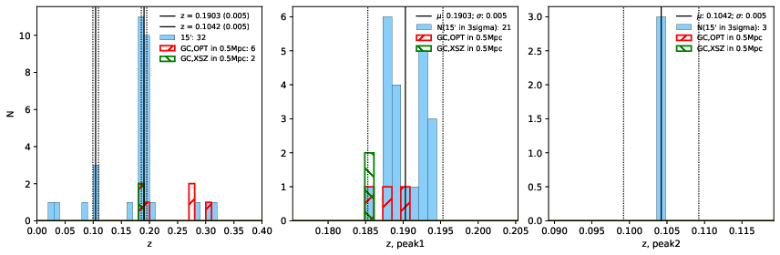
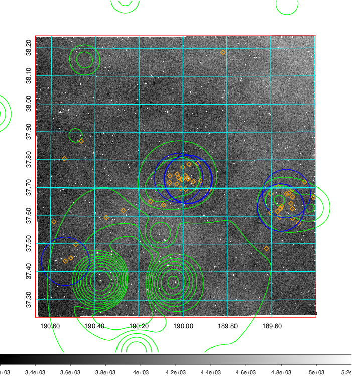
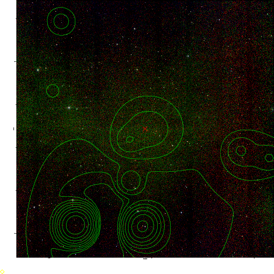
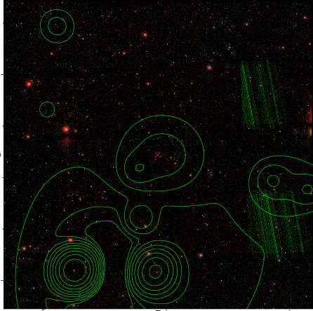

### 459

|Name|RAJ2000[deg]|DEJ2000[deg] |Ext[arcmin]| Ext,ml | z | z_src| C|GC(XSZ,Delta_z<0.01)| GC(OPT,Delta_z<0.01)|GC| R_sig[arcmin] | R500[arcmin] | R500[Mpc]| CRsig[c/s] | CR500[c/s] |L500[1E44 erg/s]|F500[1E-12 erg/s/cm^2]| M500[1E14 Msun]|Tx[keV]|Cnt_sig|Beta|Rc[arcmin]|Comment|Alias|
|---|---|---|---|---|---|------|---|--------|---------|----------|---|---|---|---|---|---|---|---|---|---|---|---|---|---|
|459| 190.033| 37.742| 3.76| 29.91| 0.1903(0.005)| z1, z_xsz| B| F20, SPI| C, N, RM| C, F20, N, SPI, W| 7.338| 4.788| 0.911| 0.073(0.025)| 0.069(0.024)| 1.428(0.436)| 1.388(0.423)| 2.60(0.39)| 4.10(0.39)| 33.5| 0.873(-0.138+0.091)| 6.124(-1.157+0.965)| -| t179|

|[RASS image](../image/459/459_img.pdf)|[filtered image](../image/459/459_fil.pdf)|[Segment image](../image/459/459_seg.pdf)|
|-------------------|--------------------|-------------------|
|   |    |   |

|[Exposure image](../image/459/459_mex.pdf)| [nH image](../image/459/459_nh.pdf)| [Planck image](../image/459/459_p.pdf)|
|-------------------|--------------------|-------------------|
|   |     |  |

|[Redshift Histogram](../image/459/459_zg.pdf) | [DSS image(z1)](../image/459/459_dss_z1.pdf)      |  [DSS image(z2)](../image/459/459_dss_z2.pdf)    |
|-------------------|--------------------|-------------------|
| |  Blue circle for optical clusters;  Magenta circle for XSZ clusters;  all with r=1Mpc;  Only GC with Delta_z<0.01 are shown. |  Blue circle for optical clusters;  Magenta circle for XSZ clusters;  all with r=1Mpc;  Only GC with Delta_z<0.01 are shown.  |

|[known Abell/XSZ clusters](../image/459/459_gc.pdf) | [2MASS image](../image/459/459_2mass.pdf)      |[SDSS image](../image/459/459_sdss.pdf)   |
|-------------------|-------------------|-------------------|
|  Magenta, blue and green circles  for optical, X-ray and SZ clusters  respectively, with redshift of clusters  labelled. The radius of circles  are 1Mpc.|  |   |

