

### 46

|Name|RAJ2000[deg]|DEJ2000[deg] |Ext[arcmin]| Ext,ml | z | z_src| C|GC(XSZ,Delta_z<0.01)| GC(OPT,Delta_z<0.01)|GC| R_sig[arcmin] | R500[arcmin] | R500[Mpc]| CRsig[c/s] | CR500[c/s] |L500[1E44 erg/s]|F500[1E-12 erg/s/cm^2]| M500[1E14 Msun]|Tx[keV]|Cnt_sig|Beta|Rc[arcmin]|Comment|Alias|
|---|---|---|---|---|---|------|---|--------|---------|----------|---|---|---|---|---|---|---|---|---|---|---|---|---|---|
|46| 14.716| 26.962| 5.10| 118.32| 0.0483(0.005)| z1, z_xsz| B| MCXC| N| C, F20, MCXC, N, SPI, W| 10.262| 12.545| 0.712| 0.242(0.036)| 0.251(0.037)| 0.232(0.018)| 4.212(0.325)| 1.08(0.04)| 2.27(0.06)| 97.5| 0.936(-0.086+0.047)| 8.724(-0.825+0.658)| -| k524|

|[RASS image](../image/46/46_img.pdf)|[filtered image](../image/46/46_fil.pdf)|[Segment image](../image/46/46_seg.pdf)|
|-------------------|--------------------|-------------------|
| 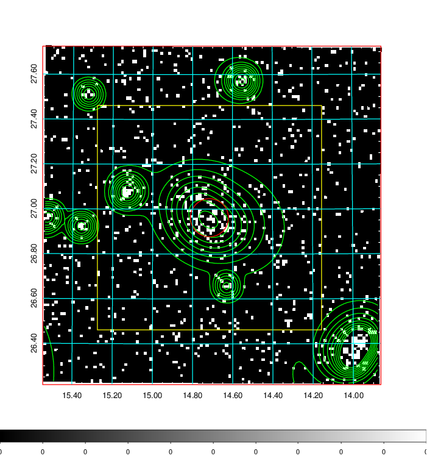  | 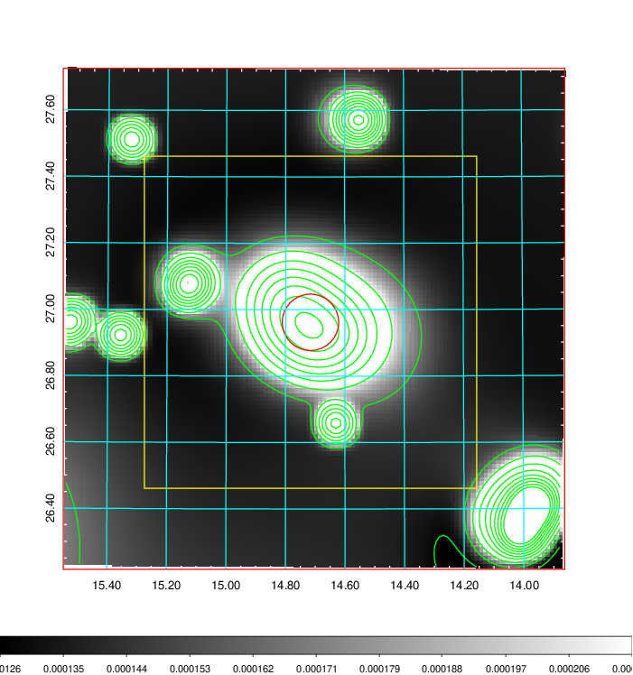   | 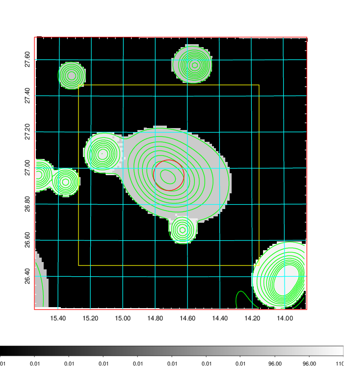  |

|[Exposure image](../image/46/46_mex.pdf)| [nH image](../image/46/46_nh.pdf)| [Planck image](../image/46/46_p.pdf)|
|-------------------|--------------------|-------------------|
|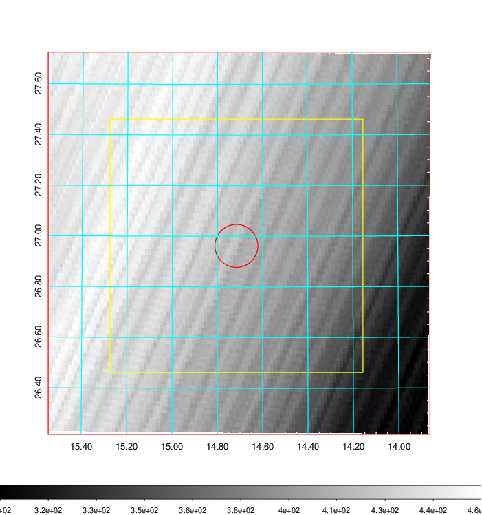   | 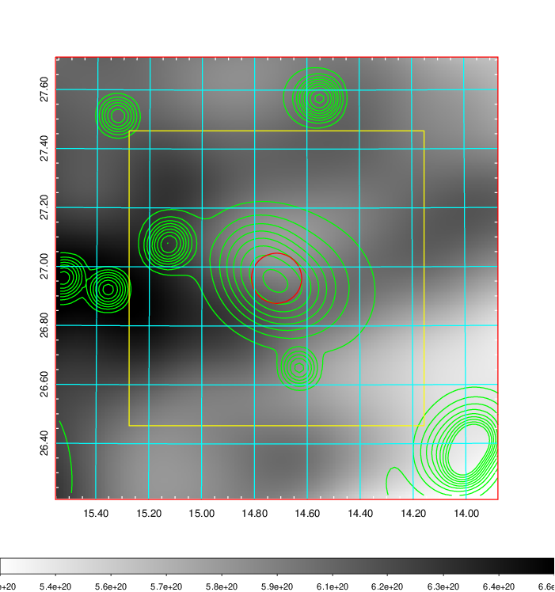    | 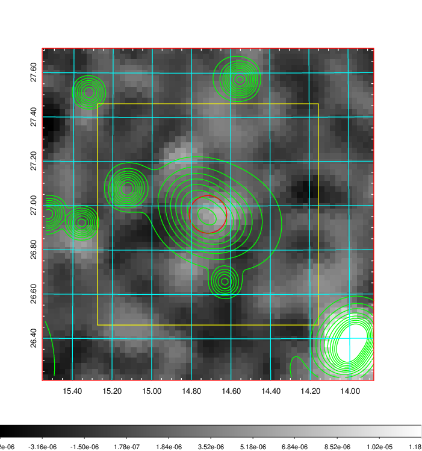 |

|[Redshift Histogram](../image/46/46_zg.pdf) | [DSS image(z1)](../image/46/46_dss_z1.pdf)      |  [DSS image(z2)](../image/46/46_dss_z2.pdf)    |
|-------------------|--------------------|-------------------|
|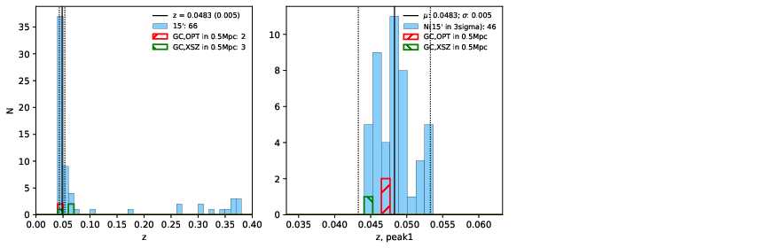 |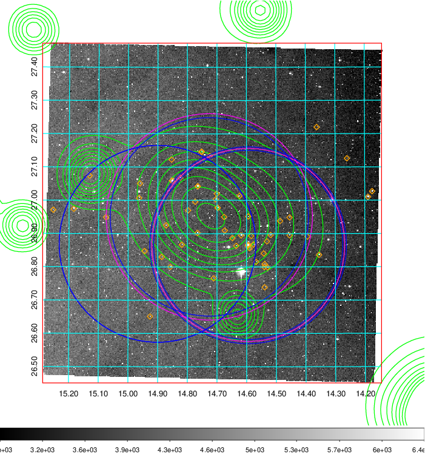  Blue circle for optical clusters;  Magenta circle for XSZ clusters;  all with r=1Mpc;  Only GC with Delta_z<0.01 are shown. | 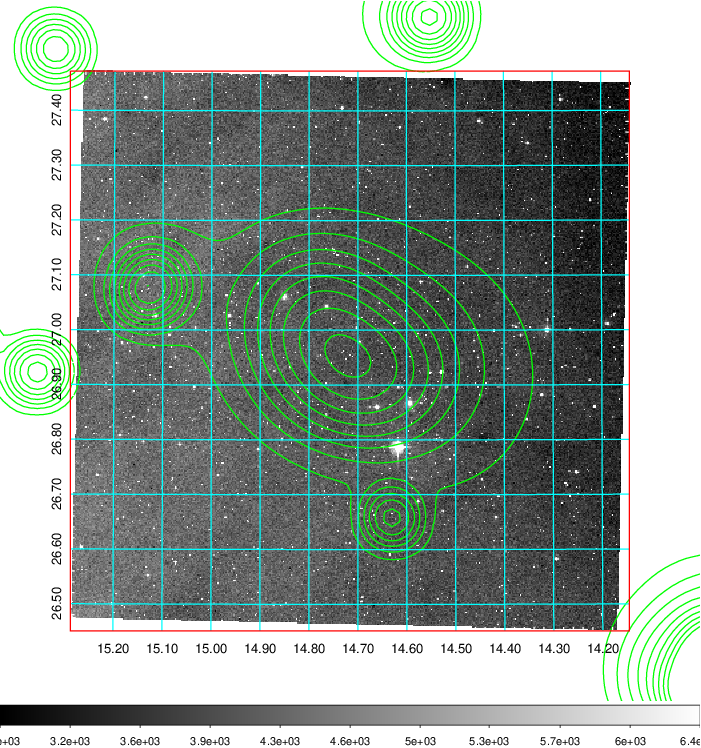 Blue circle for optical clusters;  Magenta circle for XSZ clusters;  all with r=1Mpc;  Only GC with Delta_z<0.01 are shown.  |

|[Previous-identified clusters](../image/46/46_gc.pdf) | [2MASS image](../image/46/46_2mass.pdf)      |[SDSS image](../image/46/46_sdss.pdf)   |
|-------------------|-------------------|-------------------|
|  Green, magenta, and blue circles  for optical, X-ray and SZ clusters  respectively, with redshift of clusters  labelled. The radius of circles  are 1Mpc.|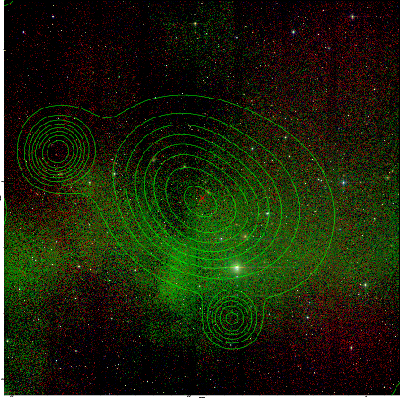  | 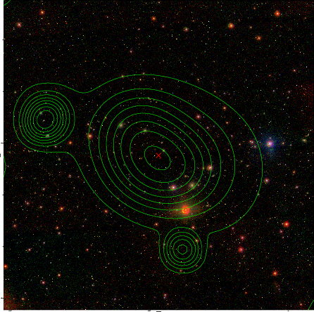  |

