

### 461

|Name|RAJ2000[deg]|DEJ2000[deg] |Ext[arcmin]| Ext,ml | z | z_src| C|GC(XSZ,Delta_z<0.01)| GC(OPT,Delta_z<0.01)|GC| R_sig[arcmin] | R500[arcmin] | R500[Mpc]| CRsig[c/s] | CR500[c/s] |L500[1E44 erg/s]|F500[1E-12 erg/s/cm^2]| M500[1E14 Msun]|Tx[keV]|Cnt_sig|Beta|Rc[arcmin]|Comment|Alias|
|---|---|---|---|---|---|------|---|--------|---------|----------|---|---|---|---|---|---|---|---|---|---|---|---|---|---|
|461| 191.137| -12.014| 2.36| 54.22| 0.0940(0.005)| z1, z_xsz| B| MCXC| A, N, W| A, MCXC, N, W| 29.144| 9.879| 1.035| 0.491(0.084)| 0.443(0.076)| 1.852(0.207)| 8.334(0.929)| 3.45(0.19)| 4.73(0.17)| 127.0| 0.618(-0.045+0.061)| 3.730(-0.634+0.782)| -| k273|

|[RASS image](../image/461/461_img.pdf)|[filtered image](../image/461/461_fil.pdf)|[Segment image](../image/461/461_seg.pdf)|
|-------------------|--------------------|-------------------|
| 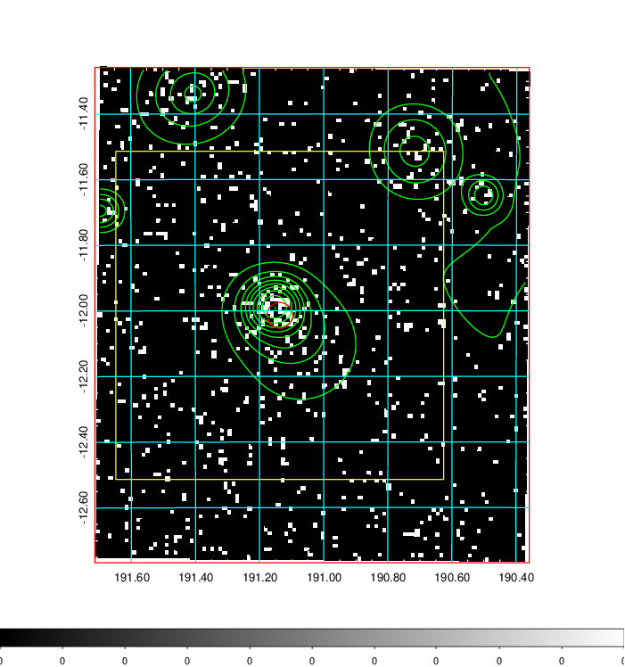  | 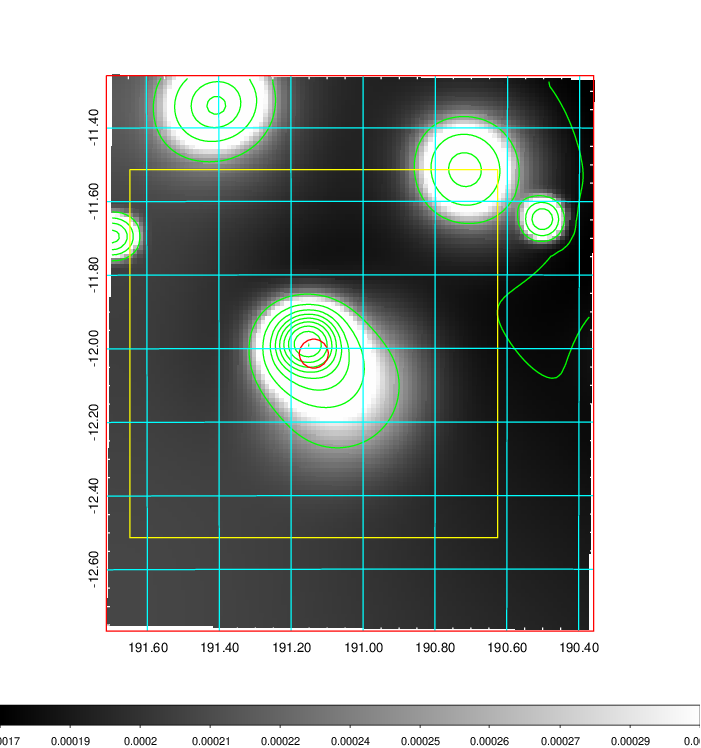   | 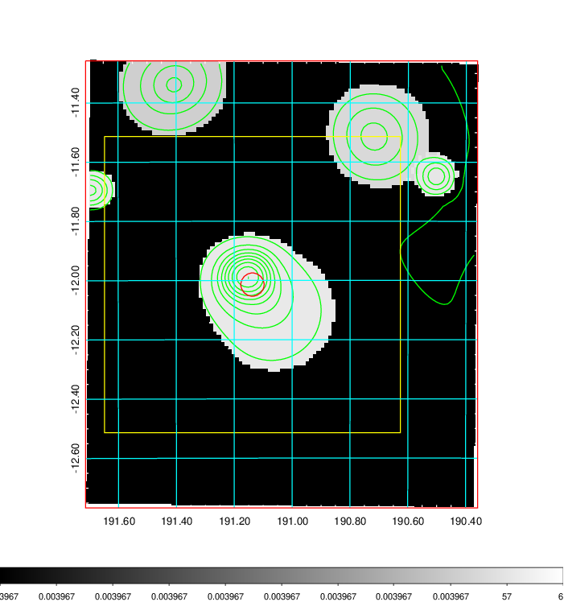  |

|[Exposure image](../image/461/461_mex.pdf)| [nH image](../image/461/461_nh.pdf)| [Planck image](../image/461/461_p.pdf)|
|-------------------|--------------------|-------------------|
|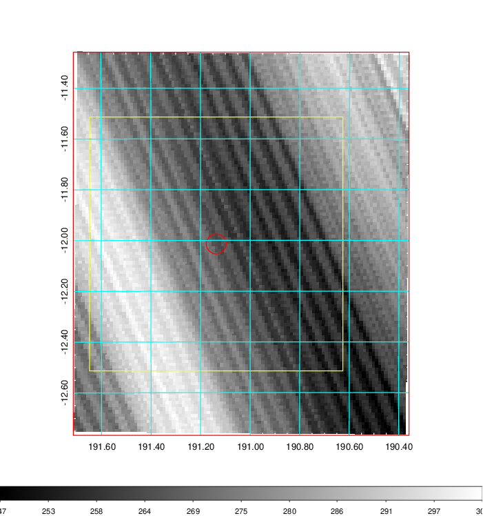   | 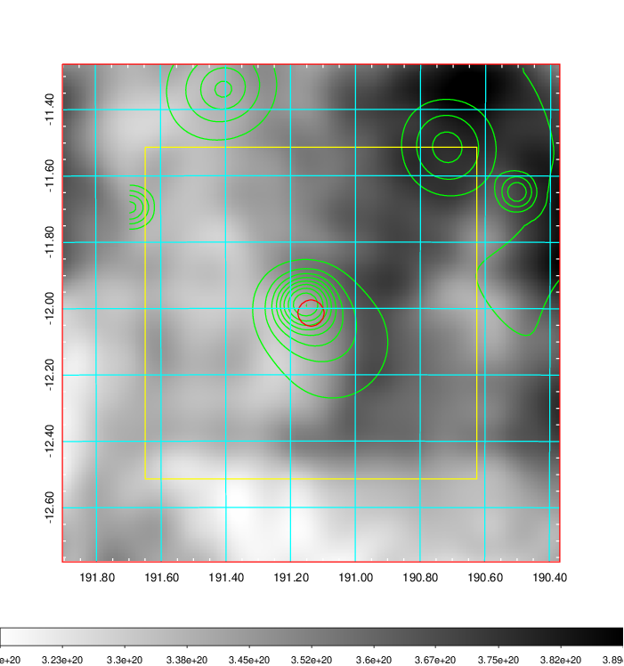    | 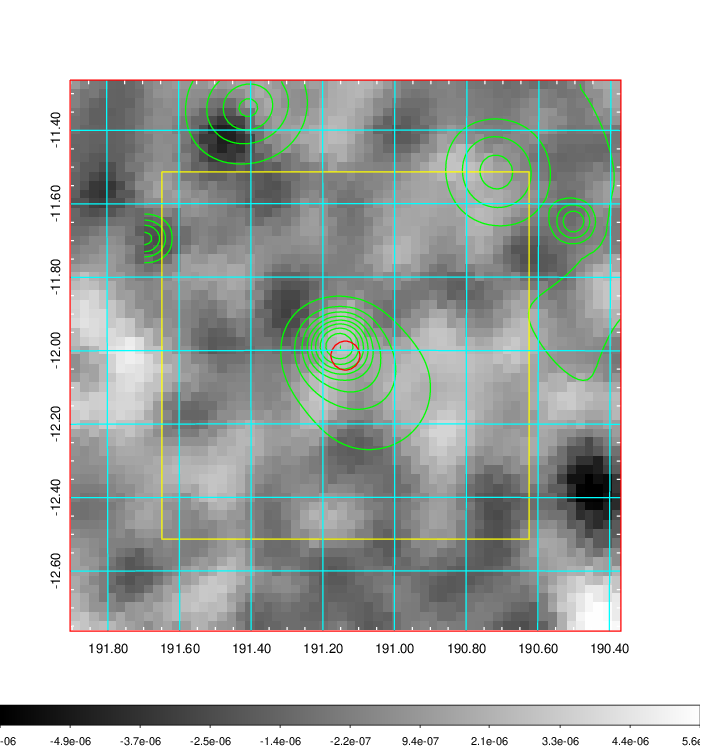 |

|[Redshift Histogram](../image/461/461_zg.pdf) | [DSS image(z1)](../image/461/461_dss_z1.pdf)      |  [DSS image(z2)](../image/461/461_dss_z2.pdf)    |
|-------------------|--------------------|-------------------|
|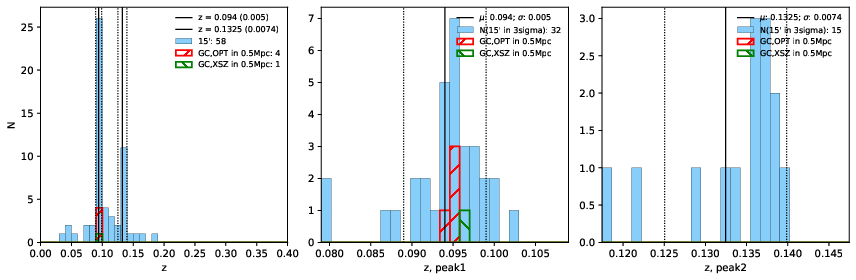 |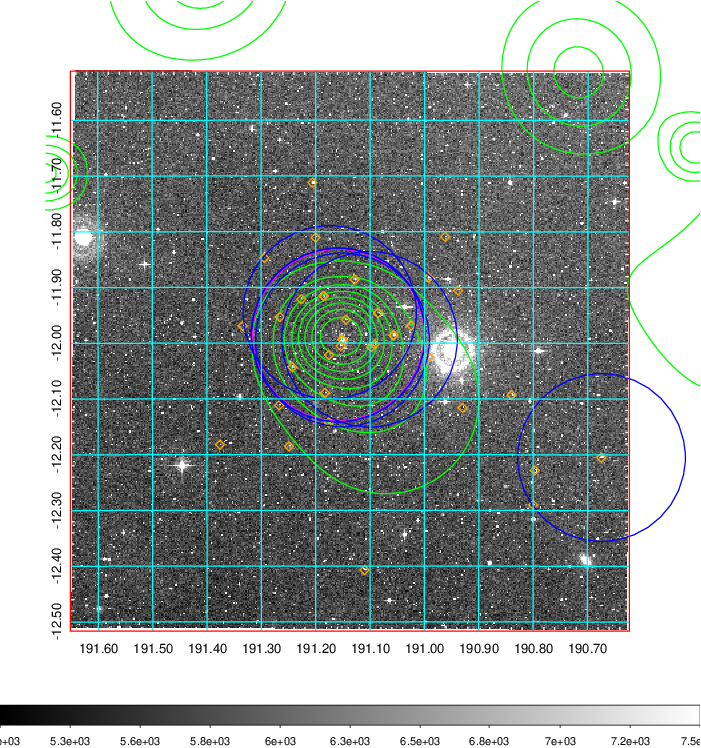  Blue circle for optical clusters;  Magenta circle for XSZ clusters;  all with r=1Mpc;  Only GC with Delta_z<0.01 are shown. | 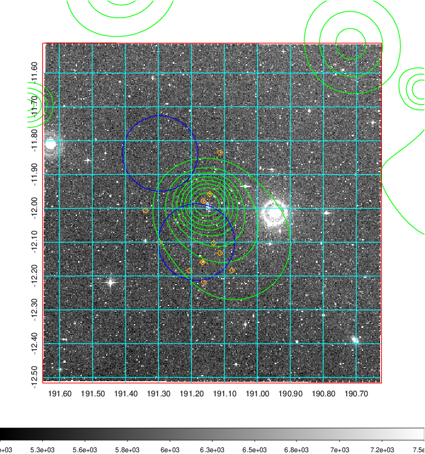 Blue circle for optical clusters;  Magenta circle for XSZ clusters;  all with r=1Mpc;  Only GC with Delta_z<0.01 are shown.  |

|[Previous-identified clusters](../image/461/461_gc.pdf) | [2MASS image](../image/461/461_2mass.pdf)      |[SDSS image](../image/461/461_sdss.pdf)   |
|-------------------|-------------------|-------------------|
|  Green, magenta, and blue circles  for optical, X-ray and SZ clusters  respectively, with redshift of clusters  labelled. The radius of circles  are 1Mpc.|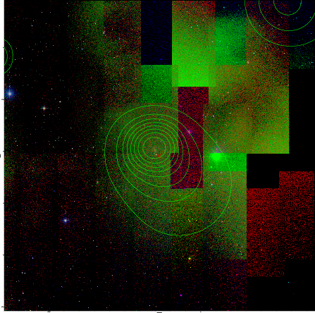  | 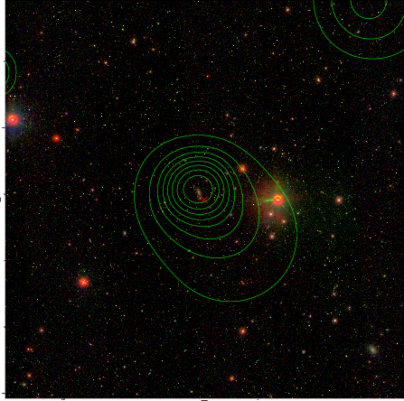  |

|[ATLAS image](../image/461/461_s.pdf)        |
|-------------------|
| 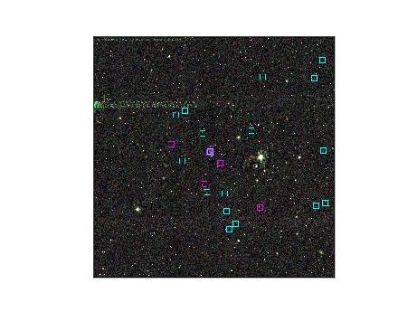  |
