

### 462

|Name|RAJ2000[deg]|DEJ2000[deg] |Ext[arcmin]| Ext,ml | z | z_src| C|GC(XSZ,Delta_z<0.01)| GC(OPT,Delta_z<0.01)|GC| R_sig[arcmin] | R500[arcmin] | R500[Mpc]| CRsig[c/s] | CR500[c/s] |L500[1E44 erg/s]|F500[1E-12 erg/s/cm^2]| M500[1E14 Msun]|Tx[keV]|Cnt_sig|Beta|Rc[arcmin]|Comment|Alias|
|---|---|---|---|---|---|------|---|--------|---------|----------|---|---|---|---|---|---|---|---|---|---|---|---|---|---|
|462| 191.145| 40.815| 14.57| 26.85| 0.0192(0.005)| z2, z_opt| S| -| N| N, W| 26.181| 18.830| 0.440| 0.187(0.052)| 0.178(0.050)| 0.021(0.010)| 2.490(1.187)| 0.25(0.06)| 0.91(0.14)| 126.5| 0.602(-0.081+0.202)| 15.036(-3.453+5.893)| -| t528|

|[RASS image](../image/462/462_img.pdf)|[filtered image](../image/462/462_fil.pdf)|[Segment image](../image/462/462_seg.pdf)|
|-------------------|--------------------|-------------------|
| 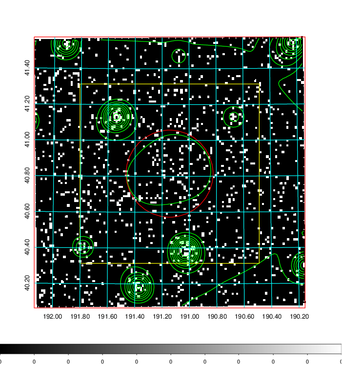  | 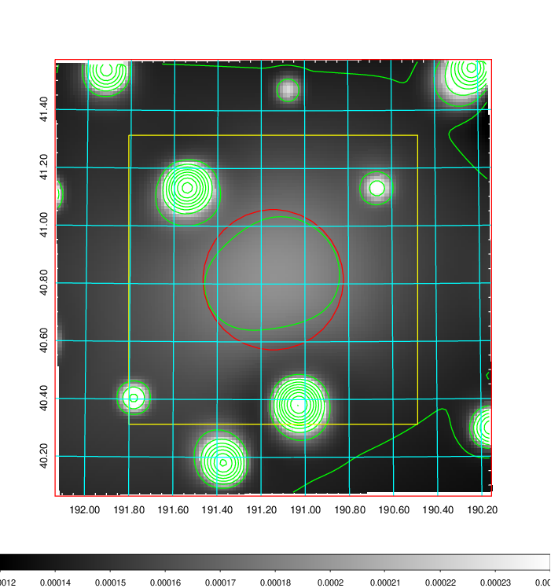   | 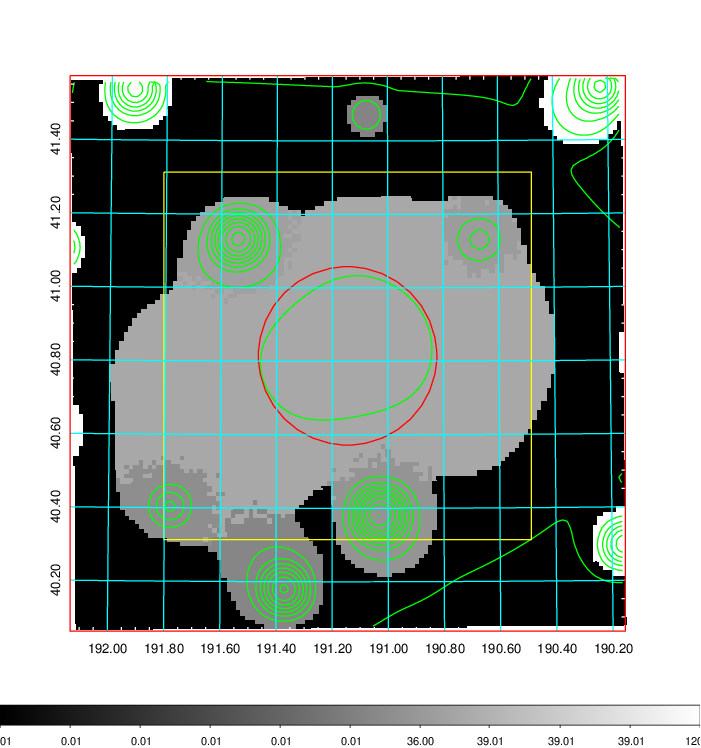  |

|[Exposure image](../image/462/462_mex.pdf)| [nH image](../image/462/462_nh.pdf)| [Planck image](../image/462/462_p.pdf)|
|-------------------|--------------------|-------------------|
|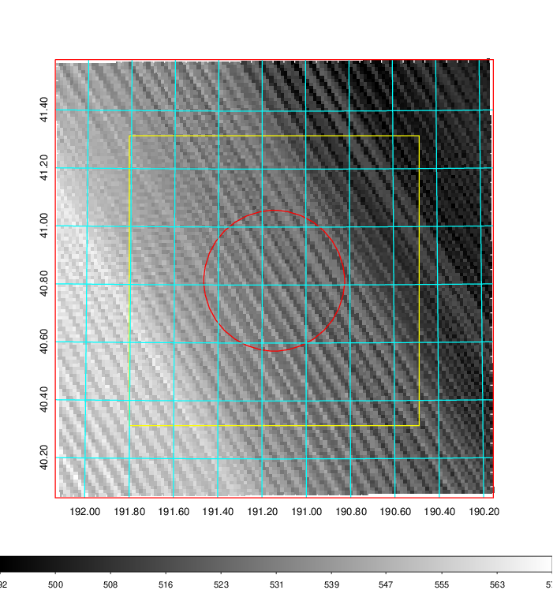   | 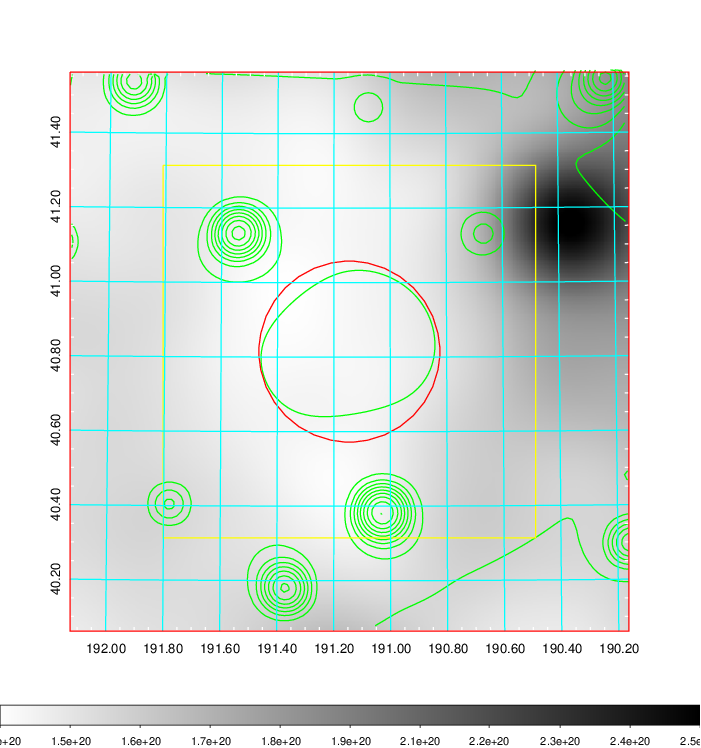    | 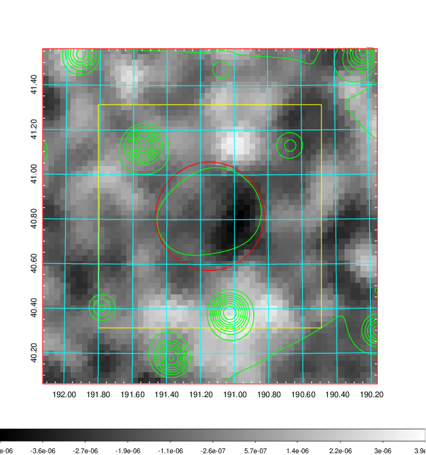 |

|[Redshift Histogram](../image/462/462_zg.pdf) | [DSS image(z1)](../image/462/462_dss_z1.pdf)      |  [DSS image(z2)](../image/462/462_dss_z2.pdf)    |
|-------------------|--------------------|-------------------|
|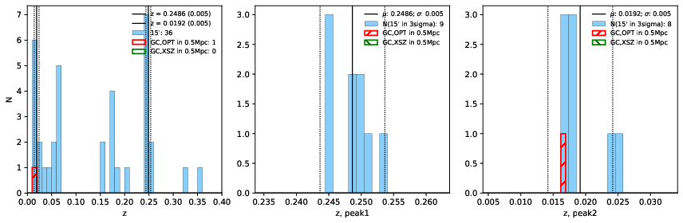 |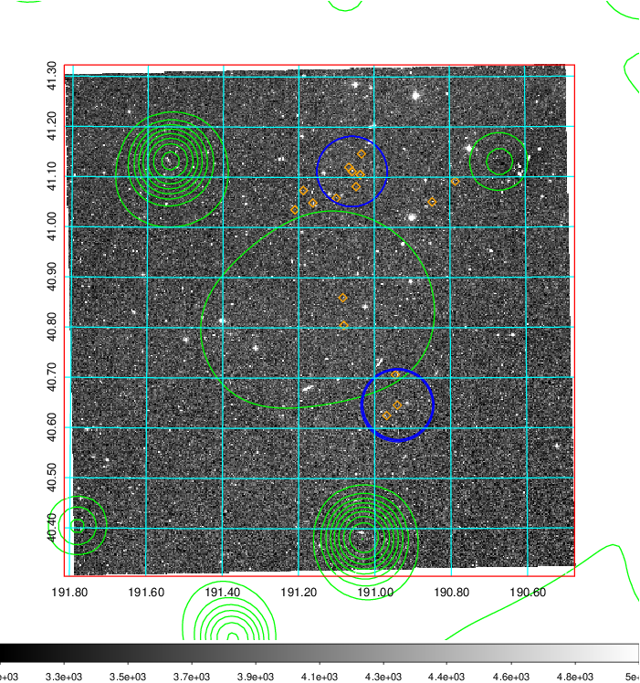  Blue circle for optical clusters;  Magenta circle for XSZ clusters;  all with r=1Mpc;  Only GC with Delta_z<0.01 are shown. | 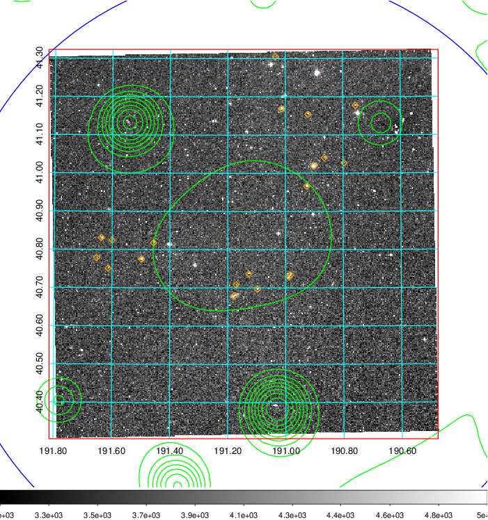 Blue circle for optical clusters;  Magenta circle for XSZ clusters;  all with r=1Mpc;  Only GC with Delta_z<0.01 are shown.  |

|[Previous-identified clusters](../image/462/462_gc.pdf) | [2MASS image](../image/462/462_2mass.pdf)      |[SDSS image](../image/462/462_sdss.pdf)   |
|-------------------|-------------------|-------------------|
|  Green, magenta, and blue circles  for optical, X-ray and SZ clusters  respectively, with redshift of clusters  labelled. The radius of circles  are 1Mpc.|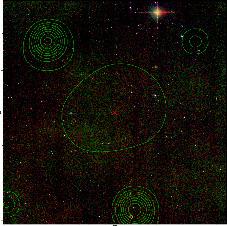  | 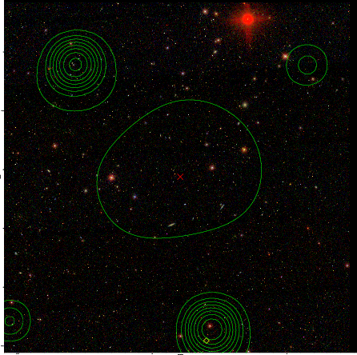  |

