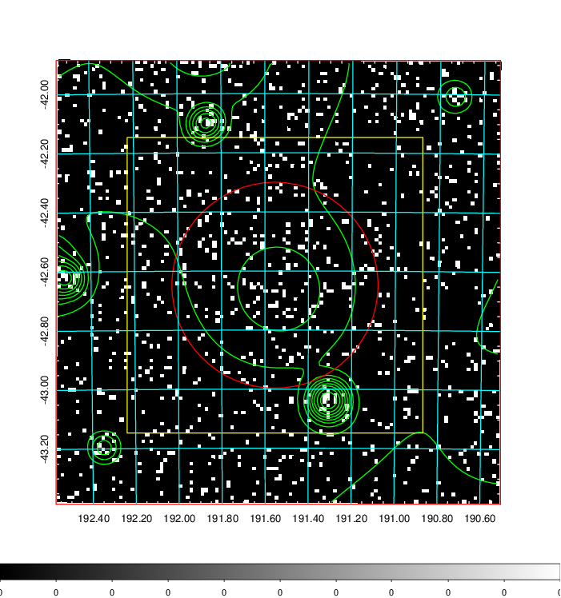
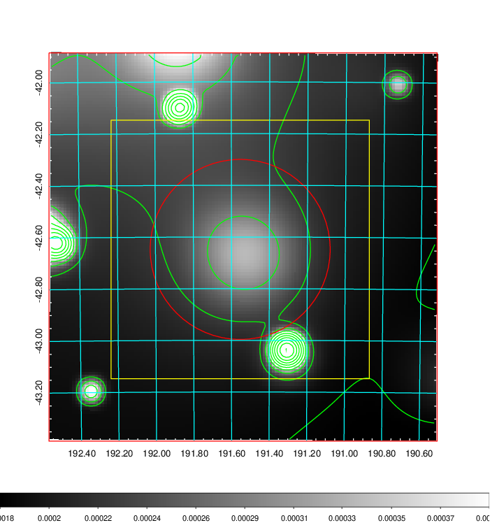
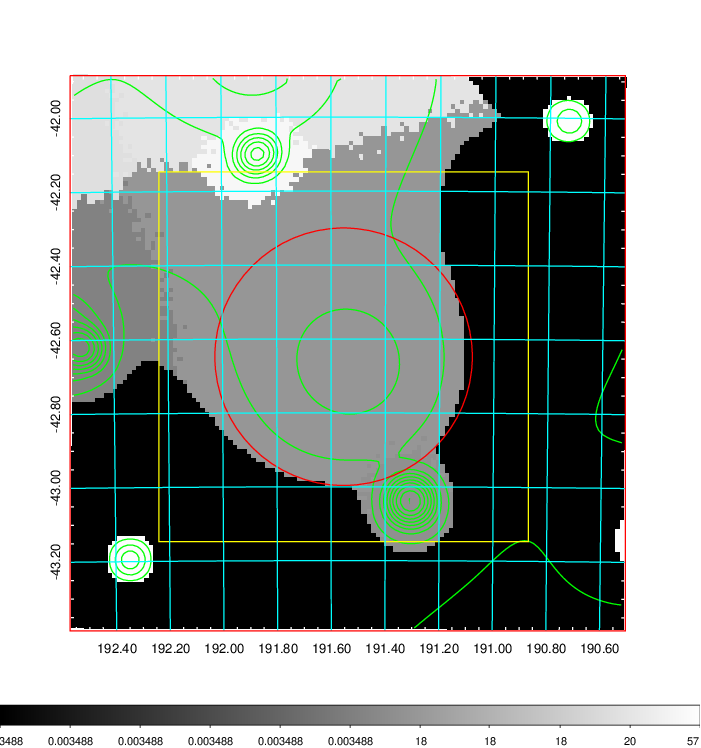
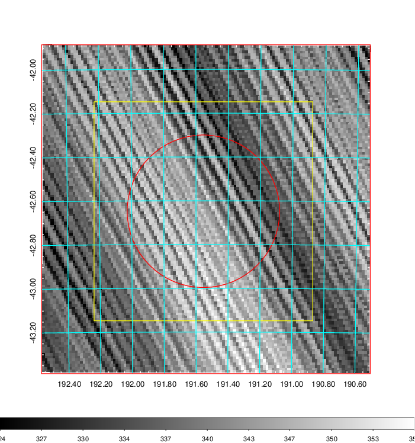
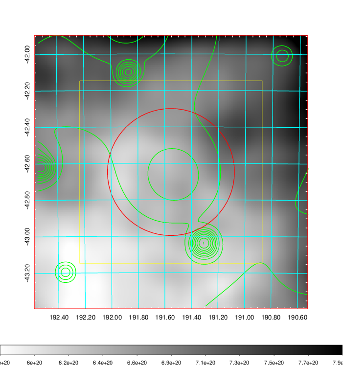
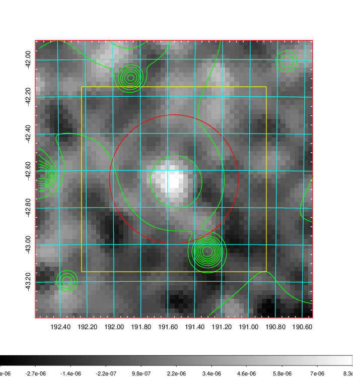
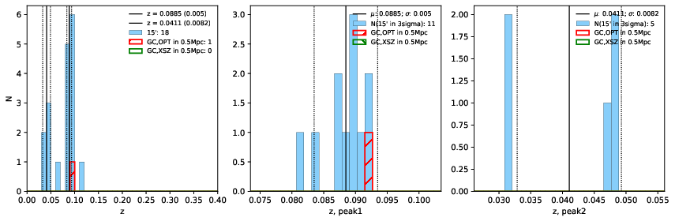
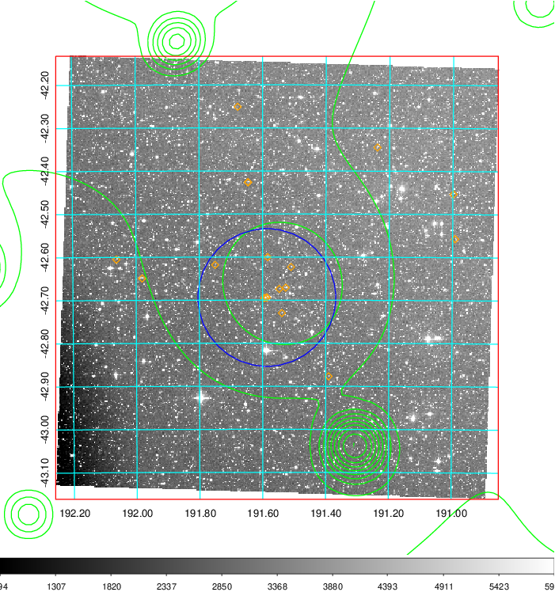
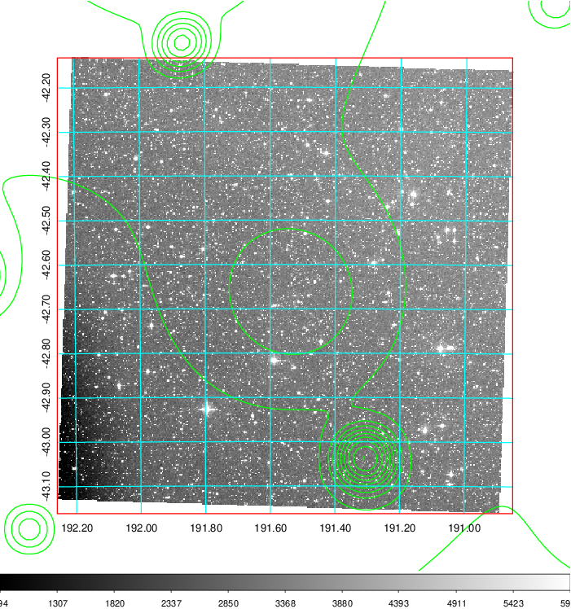
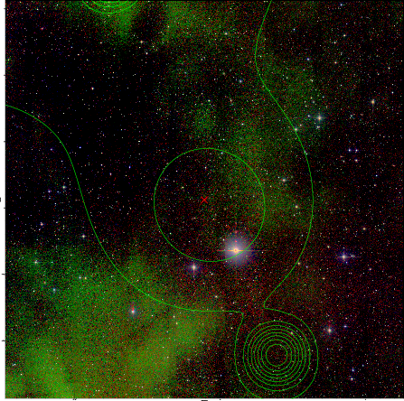

### 463

|Name|RAJ2000[deg]|DEJ2000[deg] |Ext[arcmin]| Ext,ml | z | z_src| C|GC(XSZ,Delta_z<0.01)| GC(OPT,Delta_z<0.01)|GC| R_sig[arcmin] | R500[arcmin] | R500[Mpc]| CRsig[c/s] | CR500[c/s] |L500[1E44 erg/s]|F500[1E-12 erg/s/cm^2]| M500[1E14 Msun]|Tx[keV]|Cnt_sig|Beta|Rc[arcmin]|Comment|Alias|
|---|---|---|---|---|---|------|---|--------|---------|----------|---|---|---|---|---|---|---|---|---|---|---|---|---|---|
|463| 191.554| -42.648| 20.91| 48.26| 0.0885(0.005)| z1, z_opt| S| -| W| A, PSZ2, Tar, W| 11.238| 7.592| 0.753| 0.107(0.039)| 0.101(0.037)| 0.337(0.155)| 1.726(0.791)| 1.32(0.31)| 2.62(0.38)| 45.1| 0.785(-0.178+0.150)| 13.033(-3.324+3.730)| An SZ cluster with no $z$ and offset = 0.21 Mpc| k579|

|[RASS image](../image/463/463_img.pdf)|[filtered image](../image/463/463_fil.pdf)|[Segment image](../image/463/463_seg.pdf)|
|-------------------|--------------------|-------------------|
|   |    |   |

|[Exposure image](../image/463/463_mex.pdf)| [nH image](../image/463/463_nh.pdf)| [Planck image](../image/463/463_p.pdf)|
|-------------------|--------------------|-------------------|
|   |     |  |

|[Redshift Histogram](../image/463/463_zg.pdf) | [DSS image(z1)](../image/463/463_dss_z1.pdf)      |  [DSS image(z2)](../image/463/463_dss_z2.pdf)    |
|-------------------|--------------------|-------------------|
| |  Blue circle for optical clusters;  Magenta circle for XSZ clusters;  all with r=1Mpc;  Only GC with Delta_z<0.01 are shown. |  Blue circle for optical clusters;  Magenta circle for XSZ clusters;  all with r=1Mpc;  Only GC with Delta_z<0.01 are shown.  |

|[Previous-identified clusters](../image/463/463_gc.pdf) | [2MASS image](../image/463/463_2mass.pdf)      |
|-------------------|-------------------|
|  Green, magenta, and blue circles  for optical, X-ray and SZ clusters  respectively, with redshift of clusters  labelled. The radius of circles  are 1Mpc.|  |

