

### 468

|Name|RAJ2000[deg]|DEJ2000[deg] |Ext[arcmin]| Ext,ml | z | z_src| C|GC(XSZ,Delta_z<0.01)| GC(OPT,Delta_z<0.01)|GC| R_sig[arcmin] | R500[arcmin] | R500[Mpc]| CRsig[c/s] | CR500[c/s] |L500[1E44 erg/s]|F500[1E-12 erg/s/cm^2]| M500[1E14 Msun]|Tx[keV]|Cnt_sig|Beta|Rc[arcmin]|Comment|Alias|
|---|---|---|---|---|---|------|---|--------|---------|----------|---|---|---|---|---|---|---|---|---|---|---|---|---|---|
|468| 193.247| -15.331| 13.05| 163.77| 0.0462(0.005)| z1, z_xsz| B| L03, MCXC, PSZ2, Tar, XB| N| A, L03, MCXC, N, PSZ2, Tar, W, XB| 50.005| 16.994| 0.925| 1.134(0.131)| 1.022(0.118)| 0.949(0.103)| 18.894(2.062)| 2.35(0.13)| 3.68(0.13)| 408.0| 0.608(-0.048+0.061)| 14.384(-1.922+2.266)| -| k576|

|[RASS image](../image/468/468_img.pdf)|[filtered image](../image/468/468_fil.pdf)|[Segment image](../image/468/468_seg.pdf)|
|-------------------|--------------------|-------------------|
| 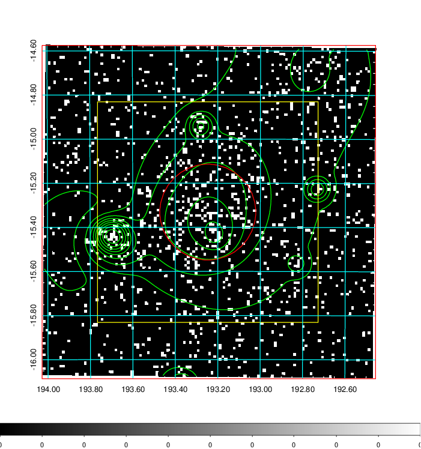  | 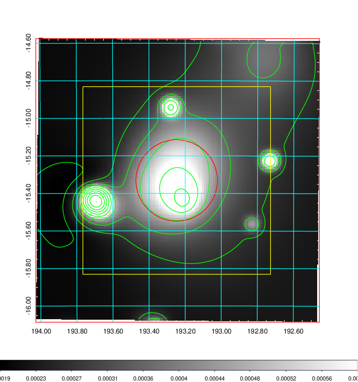   | 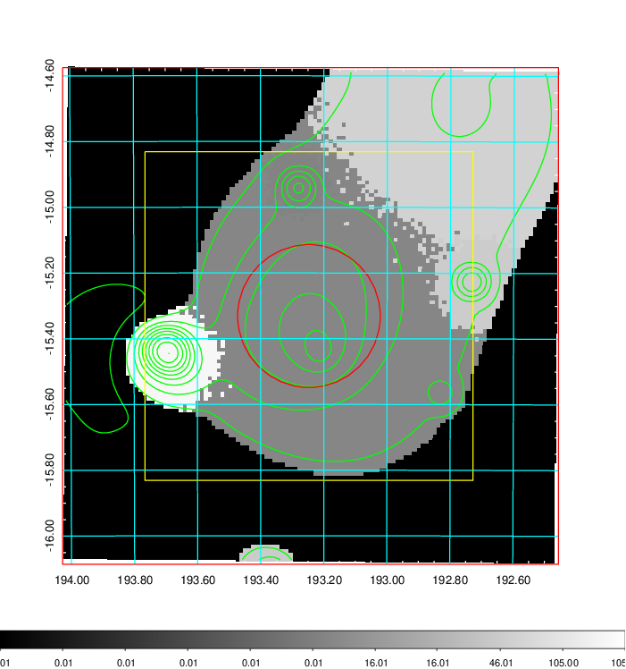  |

|[Exposure image](../image/468/468_mex.pdf)| [nH image](../image/468/468_nh.pdf)| [Planck image](../image/468/468_p.pdf)|
|-------------------|--------------------|-------------------|
|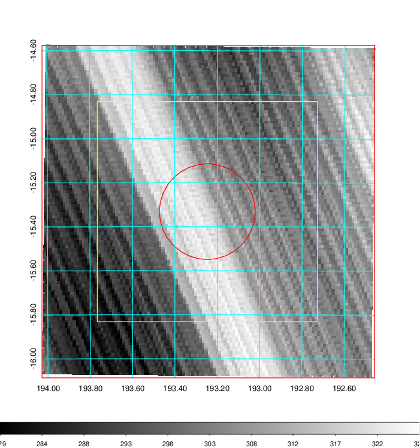   | 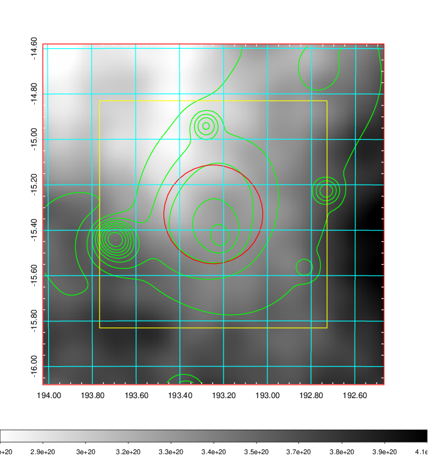    | 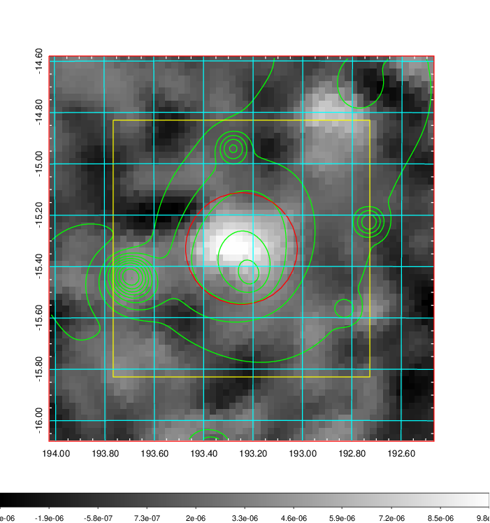 |

|[Redshift Histogram](../image/468/468_zg.pdf) | [DSS image(z1)](../image/468/468_dss_z1.pdf)      |  [DSS image(z2)](../image/468/468_dss_z2.pdf)    |
|-------------------|--------------------|-------------------|
|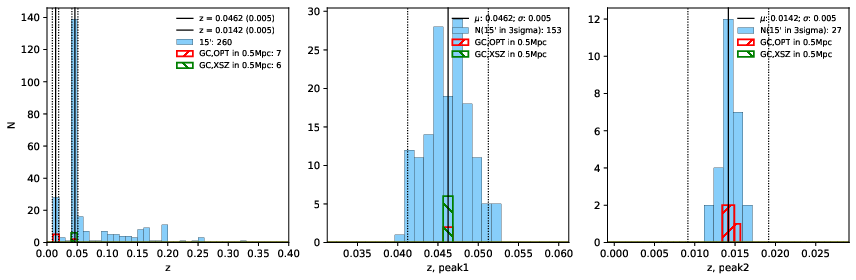 |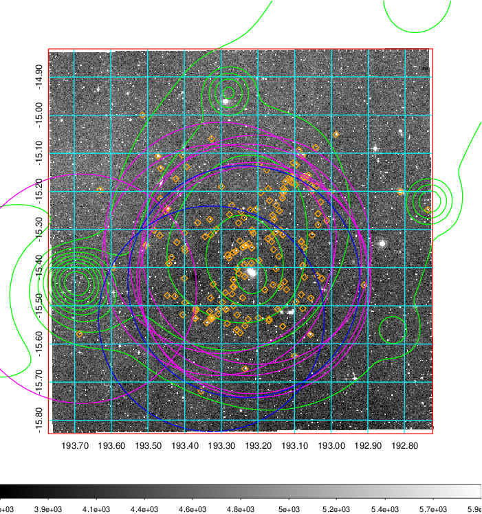  Blue circle for optical clusters;  Magenta circle for XSZ clusters;  all with r=1Mpc;  Only GC with Delta_z<0.01 are shown. | 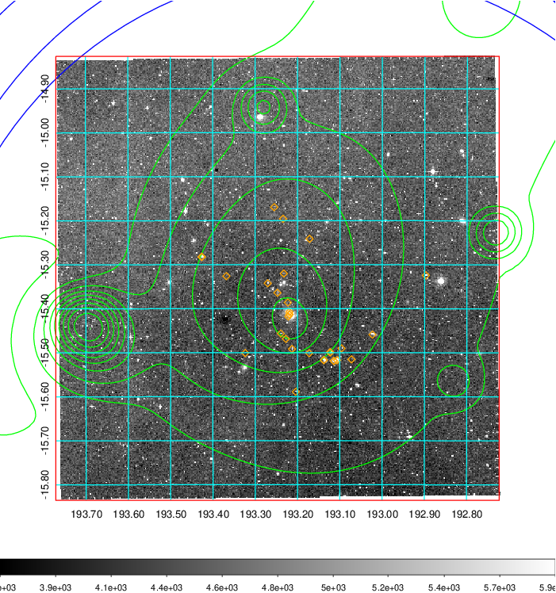 Blue circle for optical clusters;  Magenta circle for XSZ clusters;  all with r=1Mpc;  Only GC with Delta_z<0.01 are shown.  |

|[Previous-identified clusters](../image/468/468_gc.pdf) | [2MASS image](../image/468/468_2mass.pdf)      |
|-------------------|-------------------|
|  Green, magenta, and blue circles  for optical, X-ray and SZ clusters  respectively, with redshift of clusters  labelled. The radius of circles  are 1Mpc.|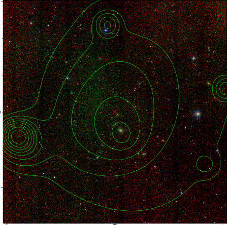  |

|[ATLAS image](../image/468/468_s.pdf)        |
|-------------------|
| 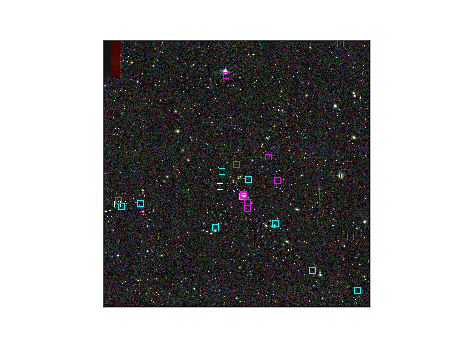  |
