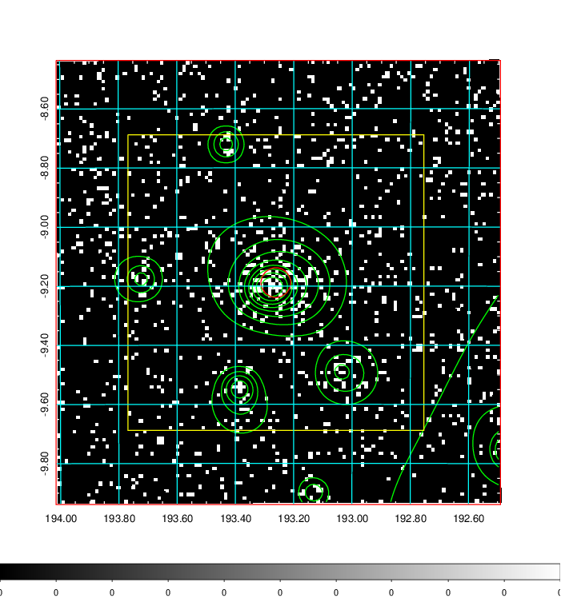
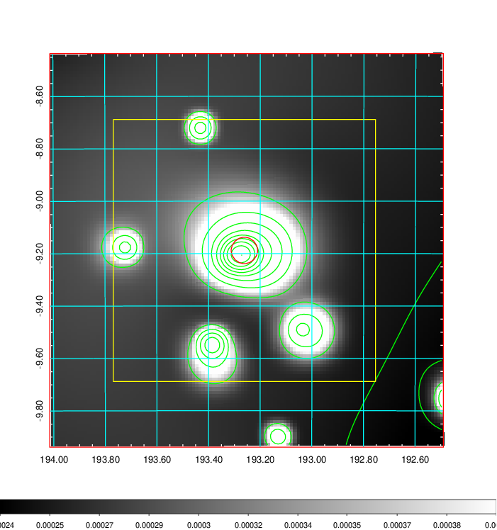
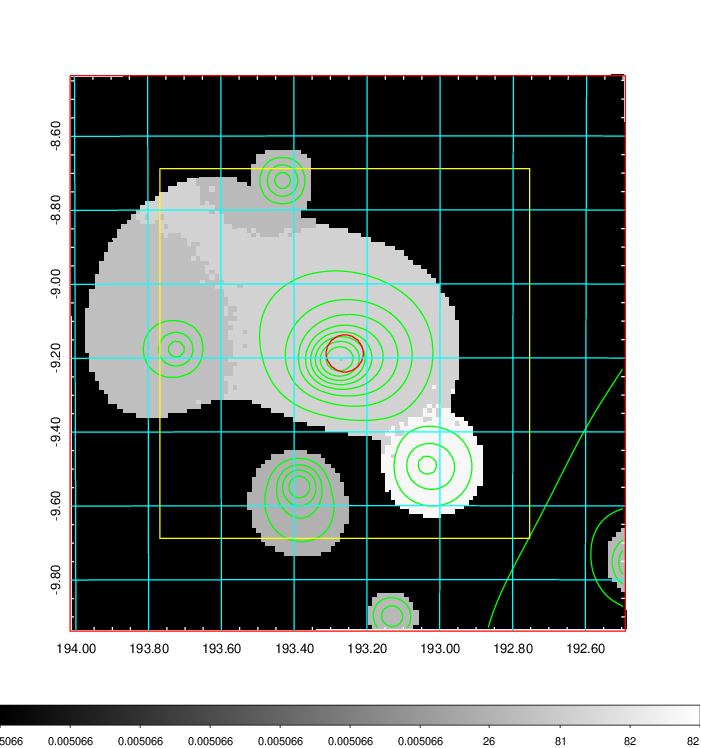
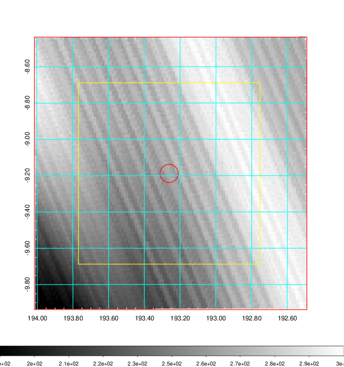
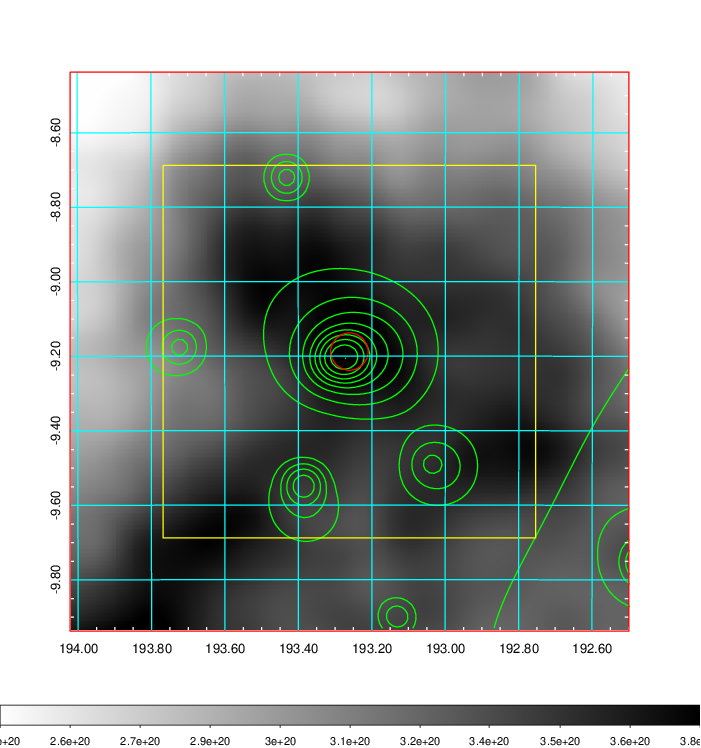
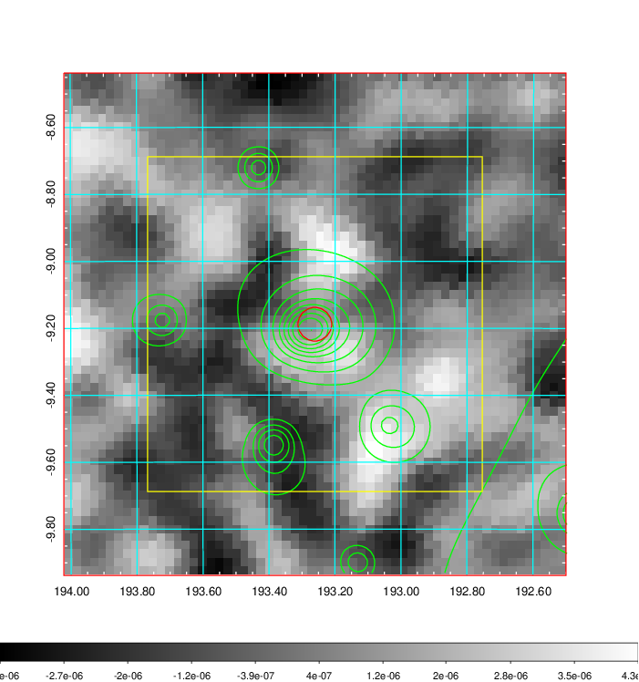
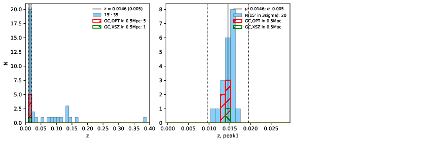
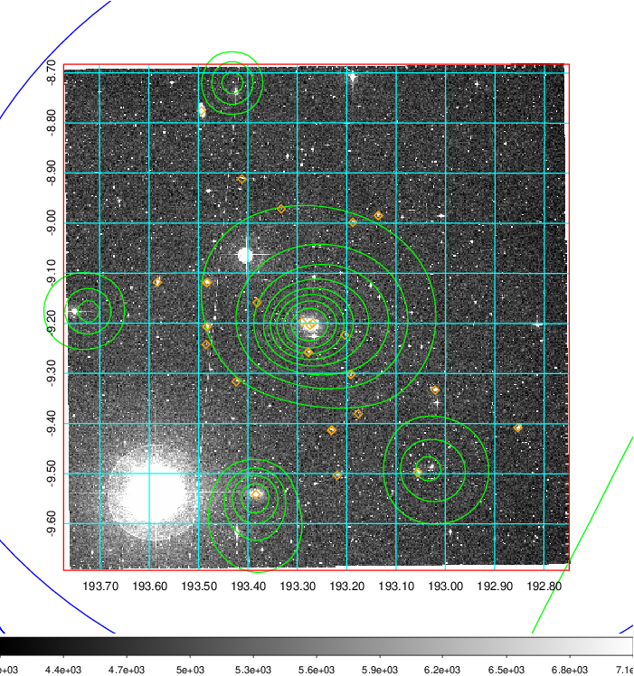
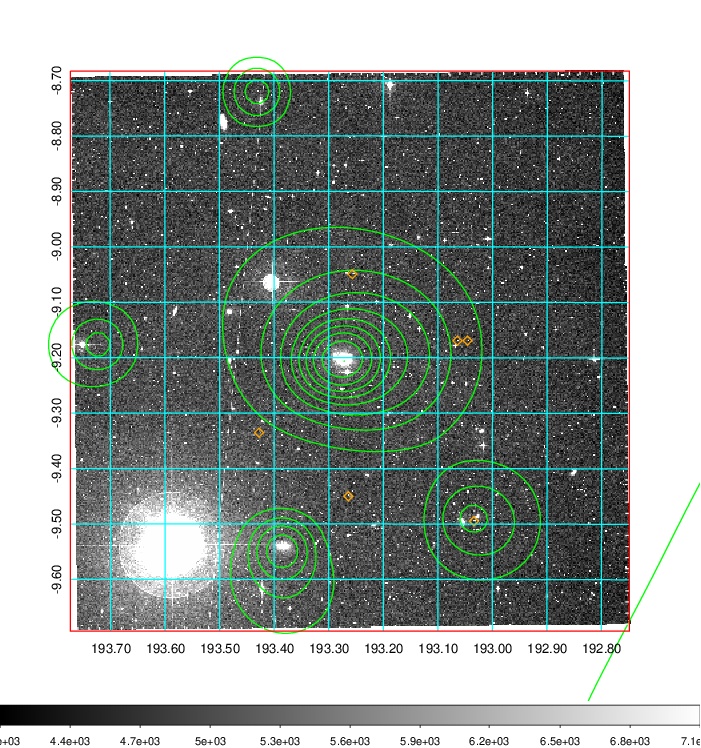
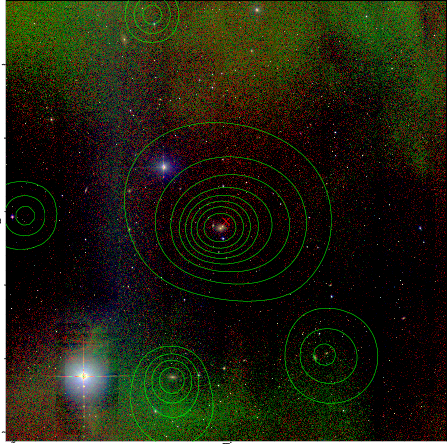

### 469

|Name|RAJ2000[deg]|DEJ2000[deg] |Ext[arcmin]| Ext,ml | z | z_src| C|GC(XSZ,Delta_z<0.01)| GC(OPT,Delta_z<0.01)|GC| R_sig[arcmin] | R500[arcmin] | R500[Mpc]| CRsig[c/s] | CR500[c/s] |L500[1E44 erg/s]|F500[1E-12 erg/s/cm^2]| M500[1E14 Msun]|Tx[keV]|Cnt_sig|Beta|Rc[arcmin]|Comment|Alias|
|---|---|---|---|---|---|------|---|--------|---------|----------|---|---|---|---|---|---|---|---|---|---|---|---|---|---|
|469| 193.261| -9.188| 3.02| 73.66| 0.0146(0.005)| z1, z_xsz| B| MCXC| N| MCXC, N, W| 10.750| 29.264| 0.523| 0.497(0.064)| 0.707(0.086)| 0.046(0.005)| 9.676(1.068)| 0.41(0.02)| 1.25(0.04)| 128.8| 0.725(-0.124+0.161)| 4.377(-1.245+1.342)| -| k380|

|[RASS image](../image/469/469_img.pdf)|[filtered image](../image/469/469_fil.pdf)|[Segment image](../image/469/469_seg.pdf)|
|-------------------|--------------------|-------------------|
|   |    |   |

|[Exposure image](../image/469/469_mex.pdf)| [nH image](../image/469/469_nh.pdf)| [Planck image](../image/469/469_p.pdf)|
|-------------------|--------------------|-------------------|
|   |     |  |

|[Redshift Histogram](../image/469/469_zg.pdf) | [DSS image(z1)](../image/469/469_dss_z1.pdf)      |  [DSS image(z2)](../image/469/469_dss_z2.pdf)    |
|-------------------|--------------------|-------------------|
| |  Blue circle for optical clusters;  Magenta circle for XSZ clusters;  all with r=1Mpc;  Only GC with Delta_z<0.01 are shown. |  Blue circle for optical clusters;  Magenta circle for XSZ clusters;  all with r=1Mpc;  Only GC with Delta_z<0.01 are shown.  |

|[known Abell/XSZ clusters](../image/469/469_gc.pdf) | [2MASS image](../image/469/469_2mass.pdf)      |
|-------------------|-------------------|
|  Magenta, blue and green circles  for optical, X-ray and SZ clusters  respectively, with redshift of clusters  labelled. The radius of circles  are 1Mpc.|  |

|[ATLAS image](../image/469/469_s.pdf)        |
|-------------------|
|   |
