

### 47

|Name|RAJ2000[deg]|DEJ2000[deg] |Ext[arcmin]| Ext,ml | z | z_src| C|GC(XSZ,Delta_z<0.01)| GC(OPT,Delta_z<0.01)|GC| R_sig[arcmin] | R500[arcmin] | R500[Mpc]| CRsig[c/s] | CR500[c/s] |L500[1E44 erg/s]|F500[1E-12 erg/s/cm^2]| M500[1E14 Msun]|Tx[keV]|Cnt_sig|Beta|Rc[arcmin]|Comment|Alias|
|---|---|---|---|---|---|------|---|--------|---------|----------|---|---|---|---|---|---|---|---|---|---|---|---|---|---|
|47| 15.673| -21.878| 1.69| 242.43| 0.0565(0.005)| z1, z_xsz| B| L03, MCXC, PSZ2, Tar, XB| A, N, W| A, L03, MCXC, N, PSZ2, Tar, W, XB| 16.800| 15.355| 1.010| 1.104(0.083)| 1.089(0.082)| 1.628(0.062)| 21.366(0.816)| 3.09(0.06)| 4.37(0.05)| 389.9| 0.725(-0.035+0.042)| 2.985(-0.304+0.347)| -| k155|

|[RASS image](../image/47/47_img.pdf)|[filtered image](../image/47/47_fil.pdf)|[Segment image](../image/47/47_seg.pdf)|
|-------------------|--------------------|-------------------|
| 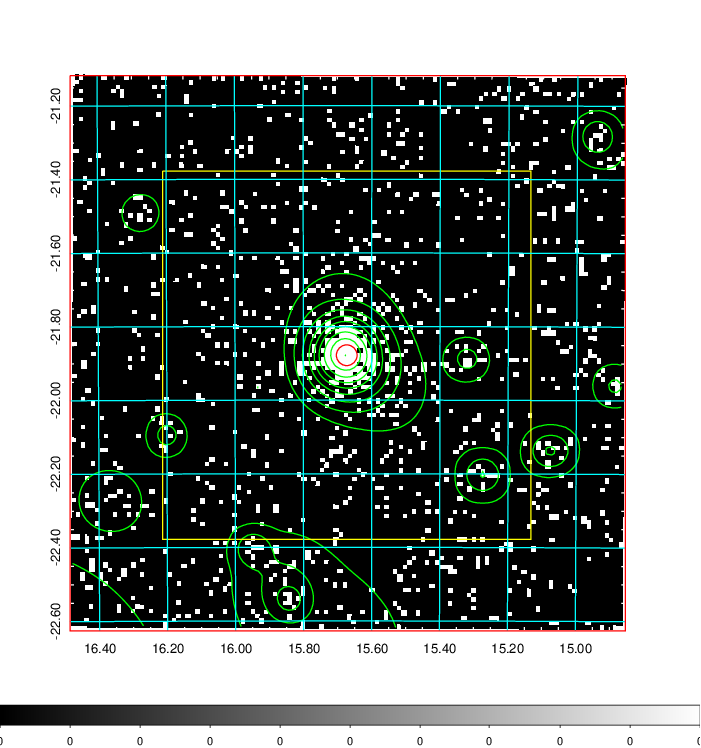  | 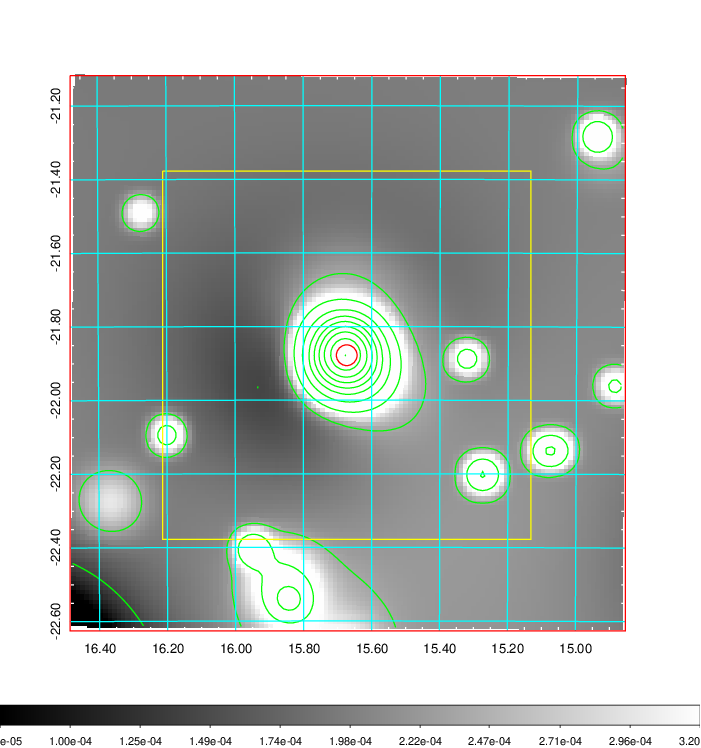   | 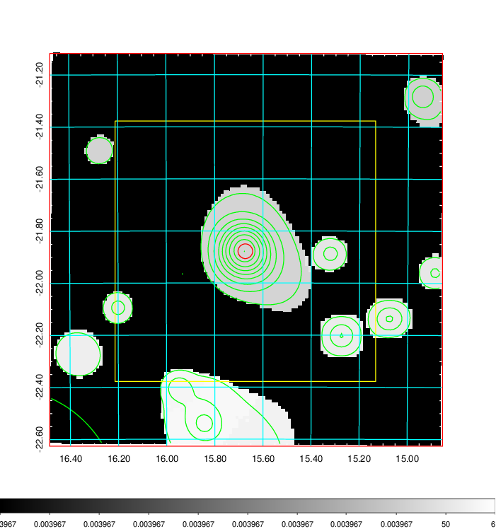  |

|[Exposure image](../image/47/47_mex.pdf)| [nH image](../image/47/47_nh.pdf)| [Planck image](../image/47/47_p.pdf)|
|-------------------|--------------------|-------------------|
|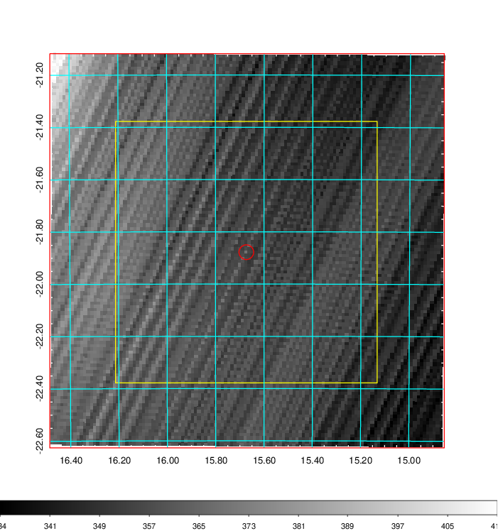   | 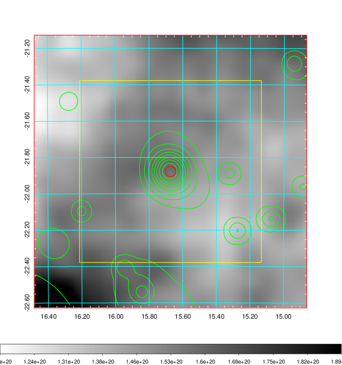    | 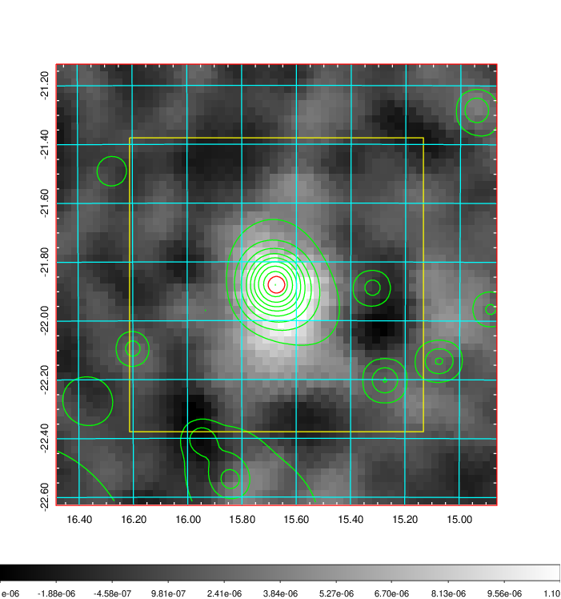 |

|[Redshift Histogram](../image/47/47_zg.pdf) | [DSS image(z1)](../image/47/47_dss_z1.pdf)      |  [DSS image(z2)](../image/47/47_dss_z2.pdf)    |
|-------------------|--------------------|-------------------|
|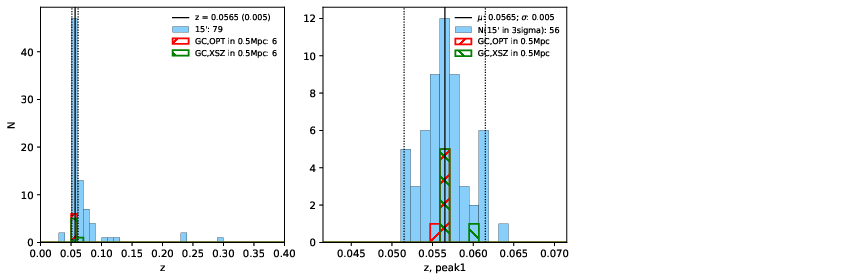 |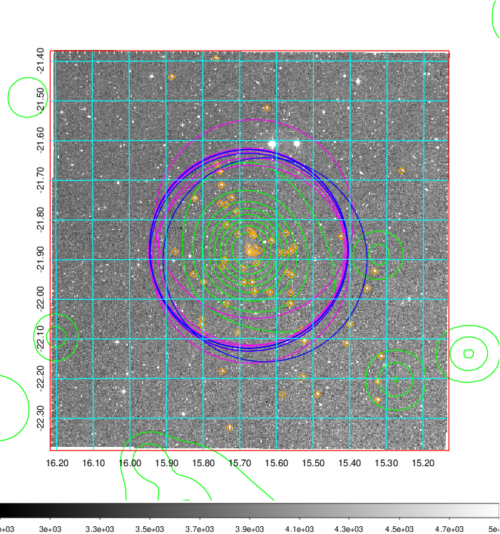  Blue circle for optical clusters;  Magenta circle for XSZ clusters;  all with r=1Mpc;  Only GC with Delta_z<0.01 are shown. | 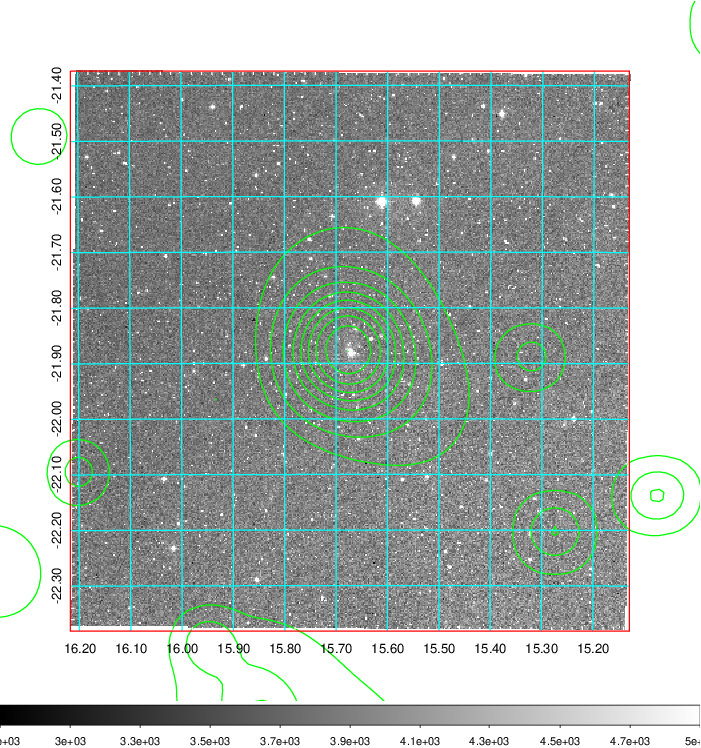 Blue circle for optical clusters;  Magenta circle for XSZ clusters;  all with r=1Mpc;  Only GC with Delta_z<0.01 are shown.  |

|[Previous-identified clusters](../image/47/47_gc.pdf) | [2MASS image](../image/47/47_2mass.pdf)      |
|-------------------|-------------------|
|  Green, magenta, and blue circles  for optical, X-ray and SZ clusters  respectively, with redshift of clusters  labelled. The radius of circles  are 1Mpc.|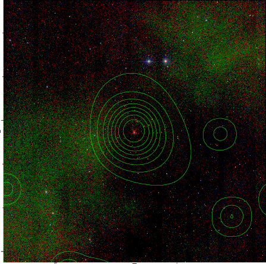  |

|[DES image](../image/47/47_des.pdf)   |[ATLAS image](../image/47/47_s.pdf)        |
|-------------------|-------------------|
| 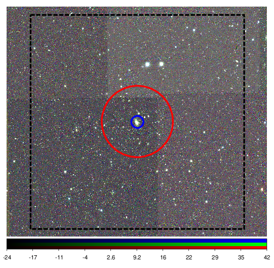  | 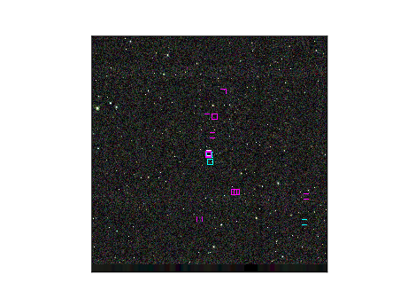  |
