

### 472

|Name|RAJ2000[deg]|DEJ2000[deg] |Ext[arcmin]| Ext,ml | z | z_src| C|GC(XSZ,Delta_z<0.01)| GC(OPT,Delta_z<0.01)|GC| R_sig[arcmin] | R500[arcmin] | R500[Mpc]| CRsig[c/s] | CR500[c/s] |L500[1E44 erg/s]|F500[1E-12 erg/s/cm^2]| M500[1E14 Msun]|Tx[keV]|Cnt_sig|Beta|Rc[arcmin]|Comment|Alias|
|---|---|---|---|---|---|------|---|--------|---------|----------|---|---|---|---|---|---|---|---|---|---|---|---|---|---|
|472| 194.242| 27.402| 13.59| 1070.96| 0.0238(0.005)| z1, z_opt| S| -| A, N| A, F20, N| 12.700| 19.439| 0.560| 0.350(0.054)| 0.383(0.059)| 0.082(0.010)| 6.331(0.780)| 0.51(0.03)| 1.43(0.06)| 338.2| 0.942(-0.079+0.042)| 10.560(-0.857+0.725)| -| t517|

|[RASS image](../image/472/472_img.pdf)|[filtered image](../image/472/472_fil.pdf)|[Segment image](../image/472/472_seg.pdf)|
|-------------------|--------------------|-------------------|
| 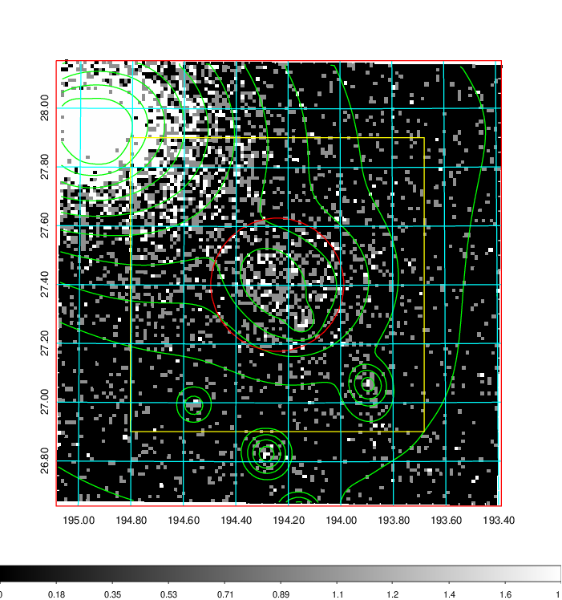  | 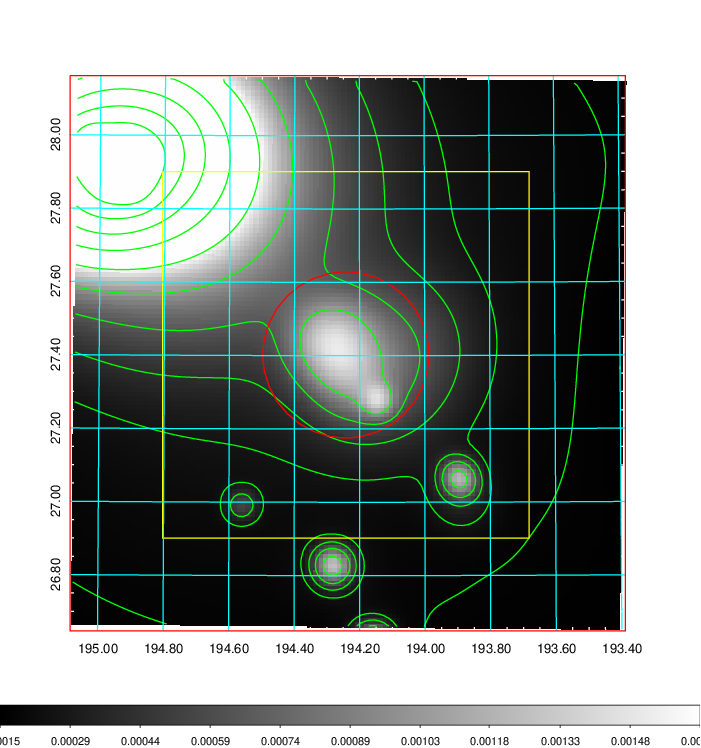   | 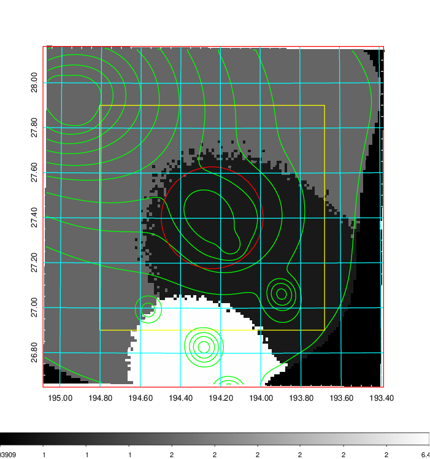  |

|[Exposure image](../image/472/472_mex.pdf)| [nH image](../image/472/472_nh.pdf)| [Planck image](../image/472/472_p.pdf)|
|-------------------|--------------------|-------------------|
|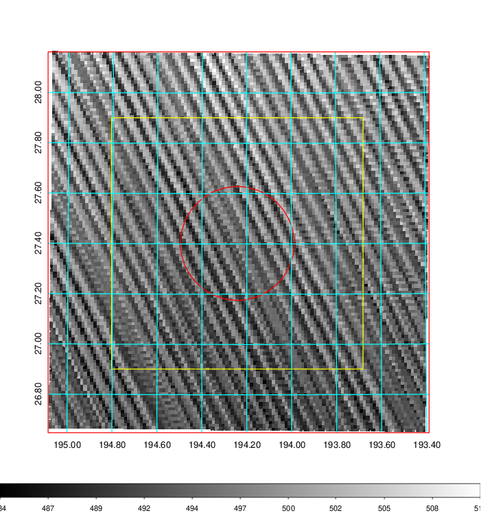   | 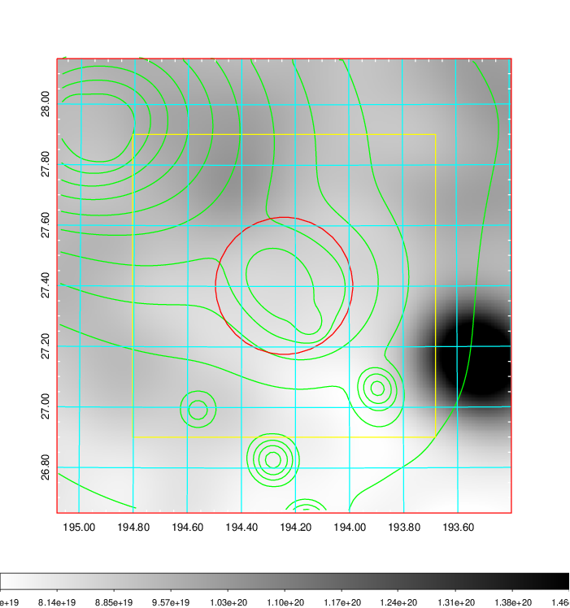    | 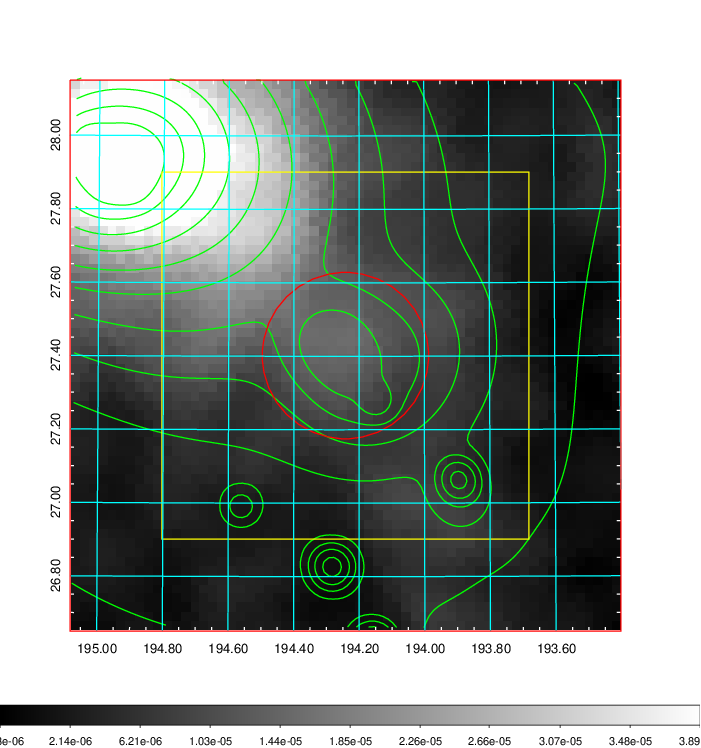 |

|[Redshift Histogram](../image/472/472_zg.pdf) | [DSS image(z1)](../image/472/472_dss_z1.pdf)      |  [DSS image(z2)](../image/472/472_dss_z2.pdf)    |
|-------------------|--------------------|-------------------|
|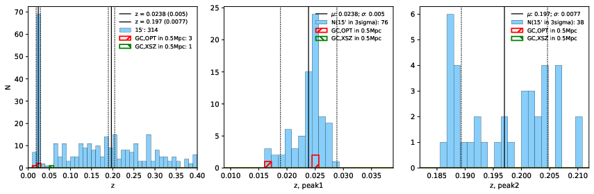 |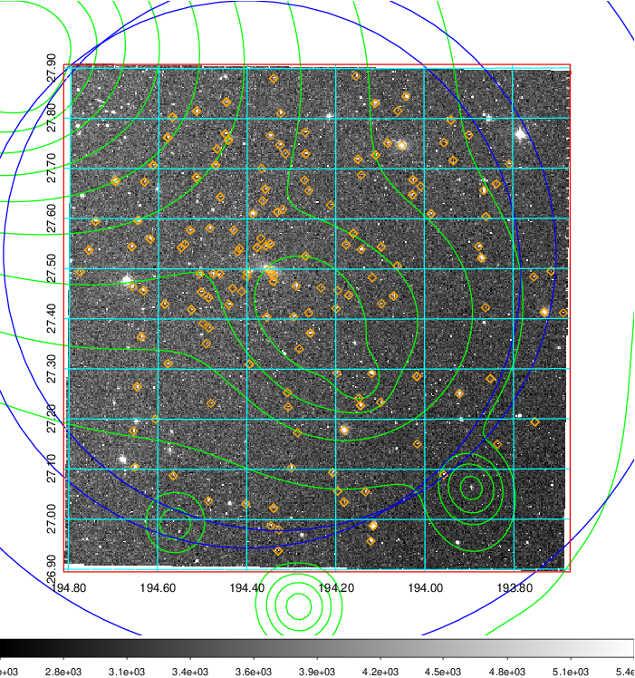  Blue circle for optical clusters;  Magenta circle for XSZ clusters;  all with r=1Mpc;  Only GC with Delta_z<0.01 are shown. | 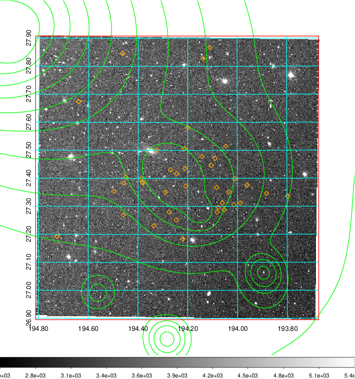 Blue circle for optical clusters;  Magenta circle for XSZ clusters;  all with r=1Mpc;  Only GC with Delta_z<0.01 are shown.  |

|[known Abell/XSZ clusters](../image/472/472_gc.pdf) | [2MASS image](../image/472/472_2mass.pdf)      |[SDSS image](../image/472/472_sdss.pdf)   |
|-------------------|-------------------|-------------------|
|  Magenta, blue and green circles  for optical, X-ray and SZ clusters  respectively, with redshift of clusters  labelled. The radius of circles  are 1Mpc.|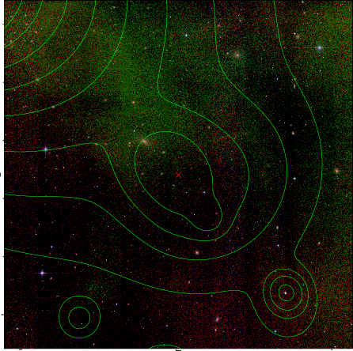  | 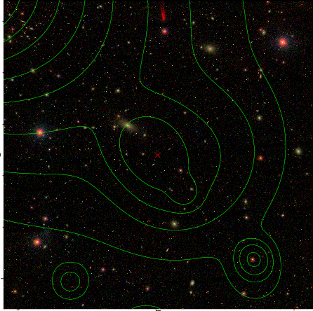  |

