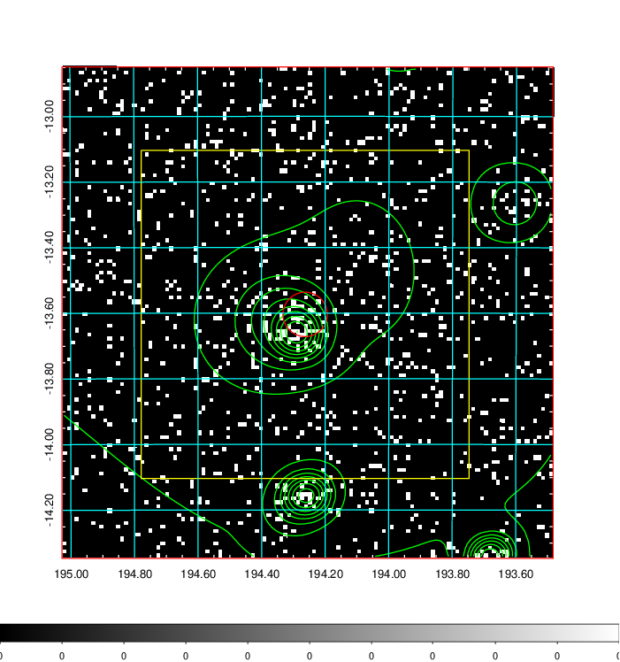
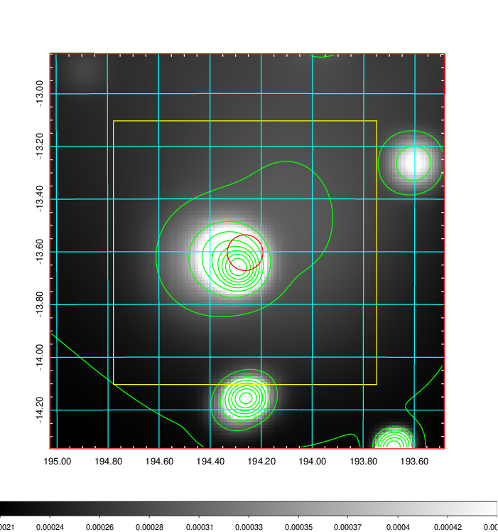
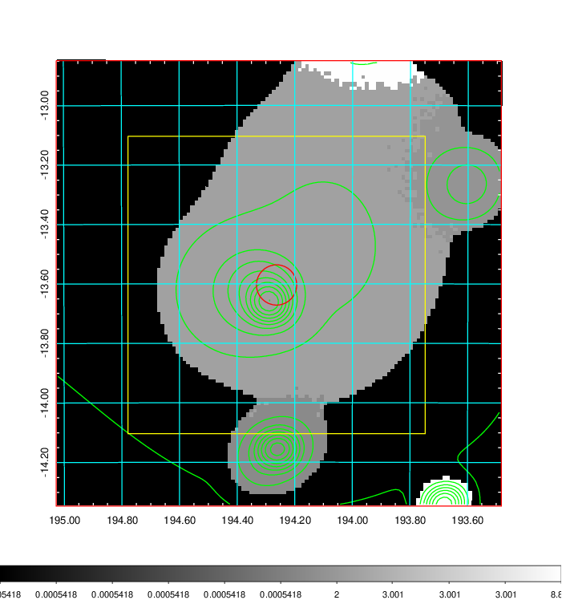
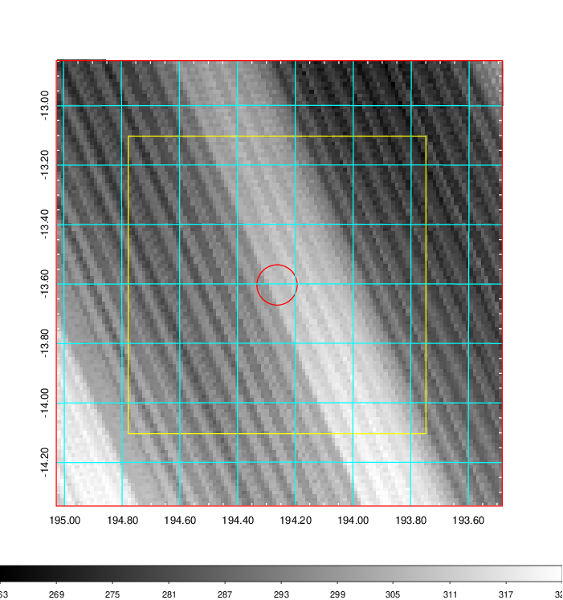
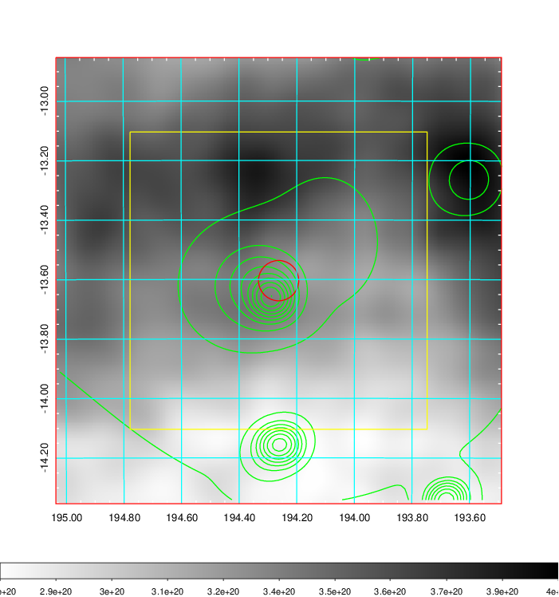
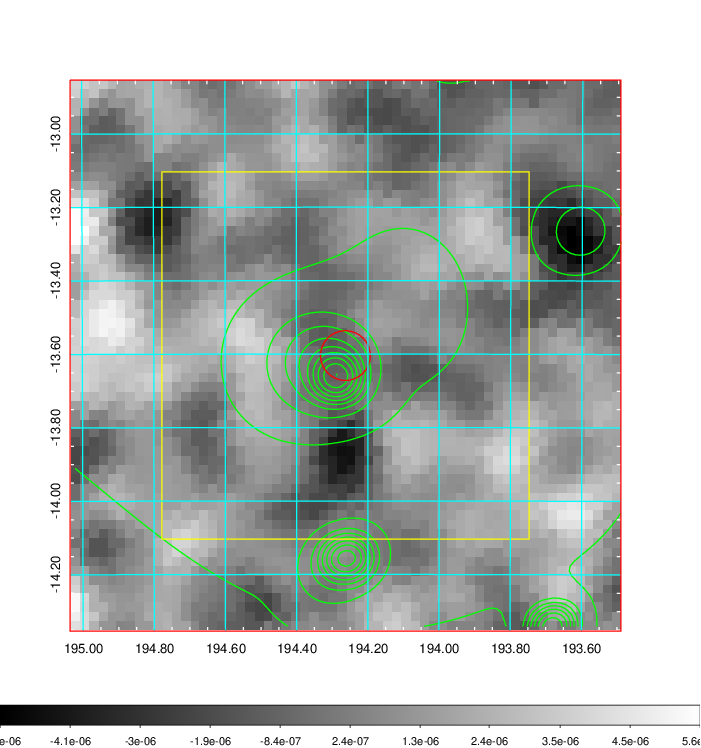
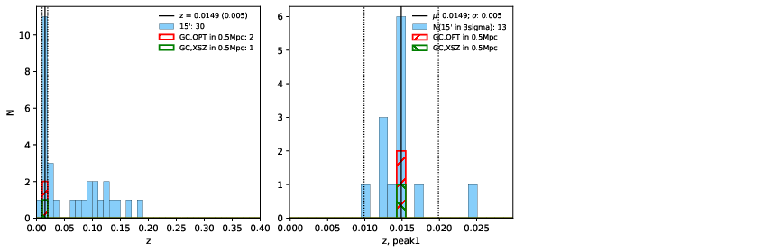
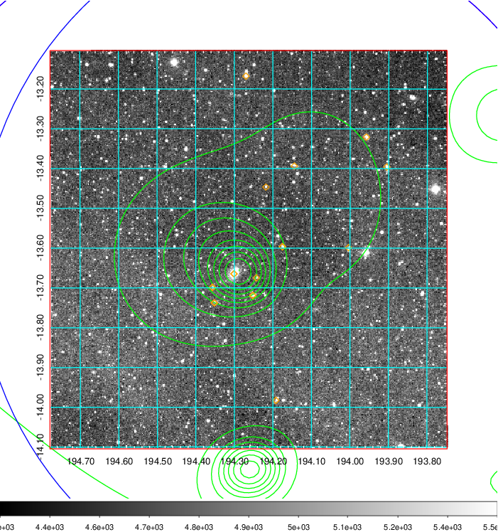
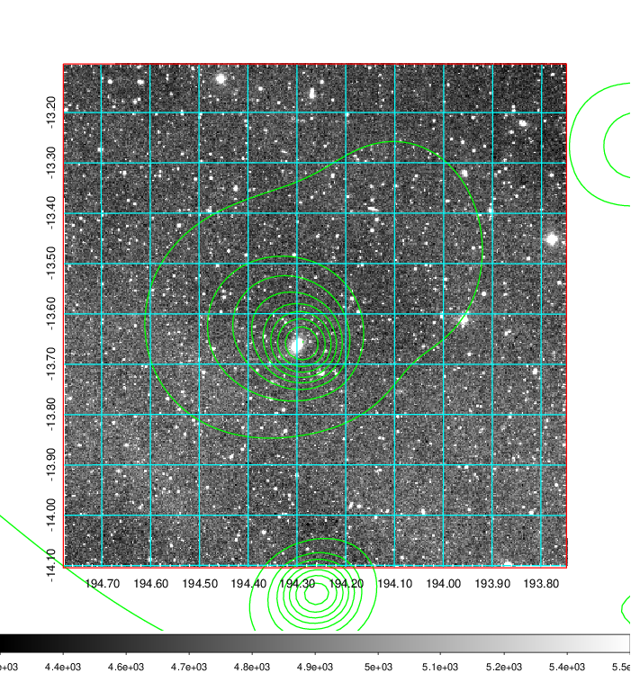
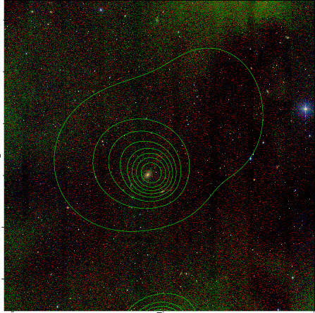

### 473

|Name|RAJ2000[deg]|DEJ2000[deg] |Ext[arcmin]| Ext,ml | z | z_src| C|GC(XSZ,Delta_z<0.01)| GC(OPT,Delta_z<0.01)|GC| R_sig[arcmin] | R500[arcmin] | R500[Mpc]| CRsig[c/s] | CR500[c/s] |L500[1E44 erg/s]|F500[1E-12 erg/s/cm^2]| M500[1E14 Msun]|Tx[keV]|Cnt_sig|Beta|Rc[arcmin]|Comment|Alias|
|---|---|---|---|---|---|------|---|--------|---------|----------|---|---|---|---|---|---|---|---|---|---|---|---|---|---|
|473| 194.263| -13.604| 4.07| 43.12| 0.0149(0.005)| z1, z_xsz| B| MCXC| N| MCXC, N| 41.590| 27.009| 0.492| 0.548(0.126)| 0.518(0.119)| 0.034(0.008)| 6.874(1.532)| 0.34(0.04)| 1.11(0.08)| 214.3| 0.510(-0.007+0.015)| 5.534(-0.444+0.548)| -| k482|

|[RASS image](../image/473/473_img.pdf)|[filtered image](../image/473/473_fil.pdf)|[Segment image](../image/473/473_seg.pdf)|
|-------------------|--------------------|-------------------|
|   |    |   |

|[Exposure image](../image/473/473_mex.pdf)| [nH image](../image/473/473_nh.pdf)| [Planck image](../image/473/473_p.pdf)|
|-------------------|--------------------|-------------------|
|   |     |  |

|[Redshift Histogram](../image/473/473_zg.pdf) | [DSS image(z1)](../image/473/473_dss_z1.pdf)      |  [DSS image(z2)](../image/473/473_dss_z2.pdf)    |
|-------------------|--------------------|-------------------|
| |  Blue circle for optical clusters;  Magenta circle for XSZ clusters;  all with r=1Mpc;  Only GC with Delta_z<0.01 are shown. |  Blue circle for optical clusters;  Magenta circle for XSZ clusters;  all with r=1Mpc;  Only GC with Delta_z<0.01 are shown.  |

|[known Abell/XSZ clusters](../image/473/473_gc.pdf) | [2MASS image](../image/473/473_2mass.pdf)      |
|-------------------|-------------------|
|  Magenta, blue and green circles  for optical, X-ray and SZ clusters  respectively, with redshift of clusters  labelled. The radius of circles  are 1Mpc.|  |

|[ATLAS image](../image/473/473_s.pdf)        |
|-------------------|
|   |
