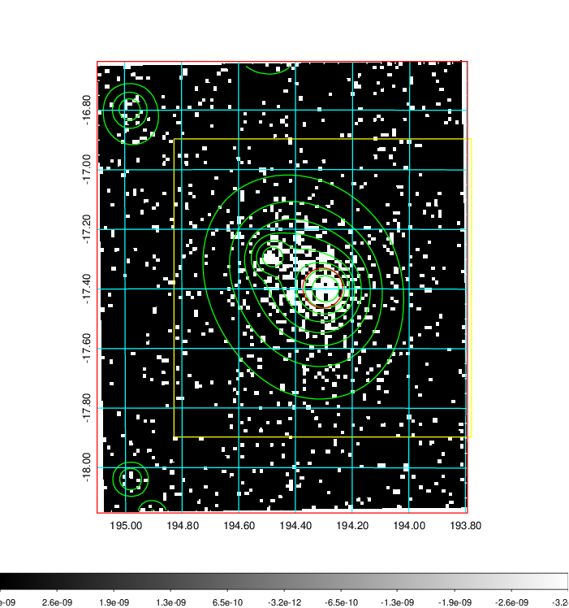
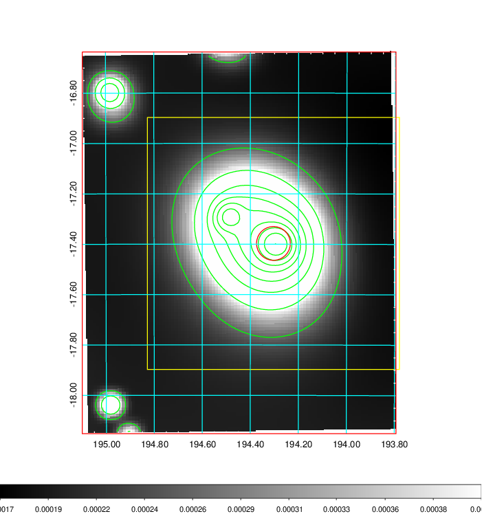
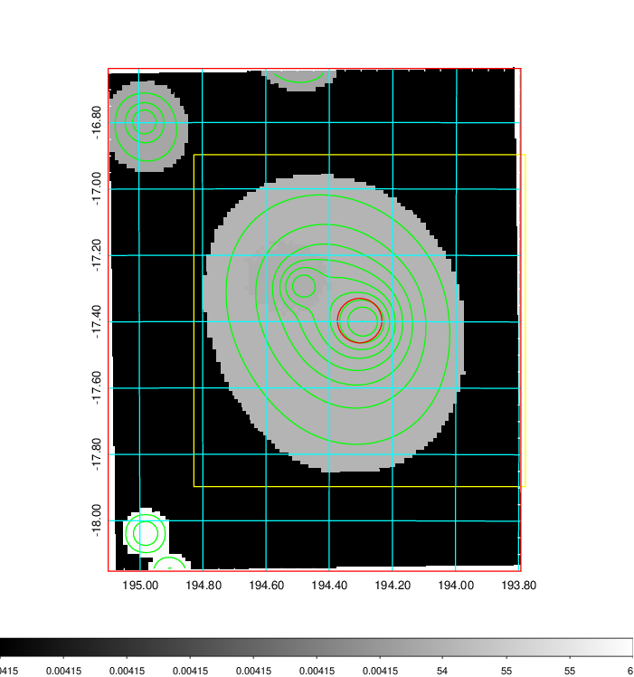
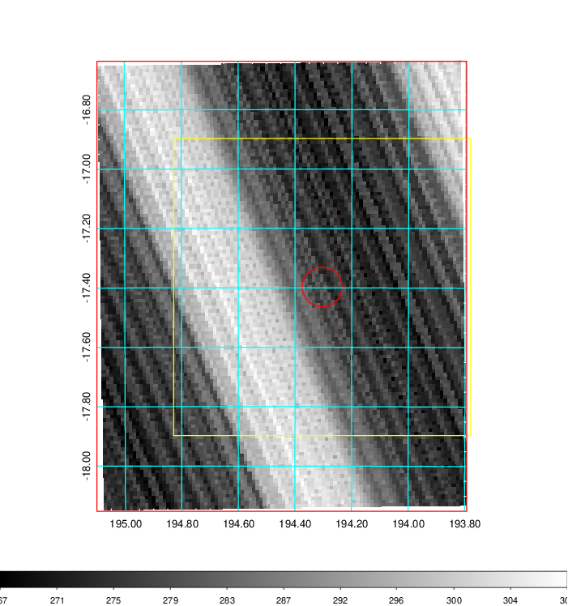
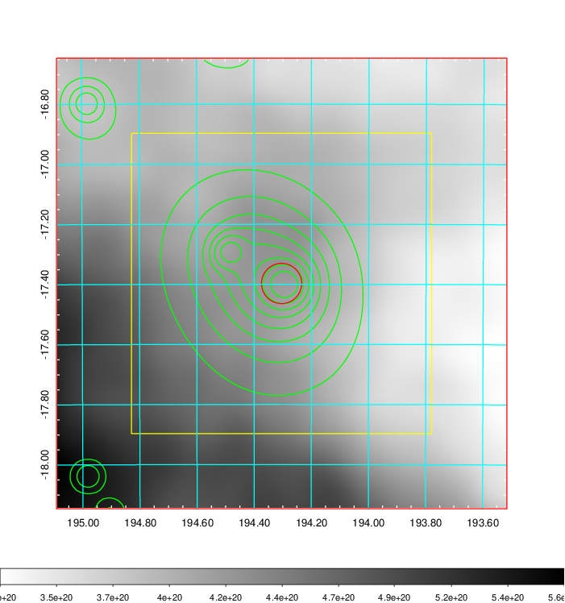
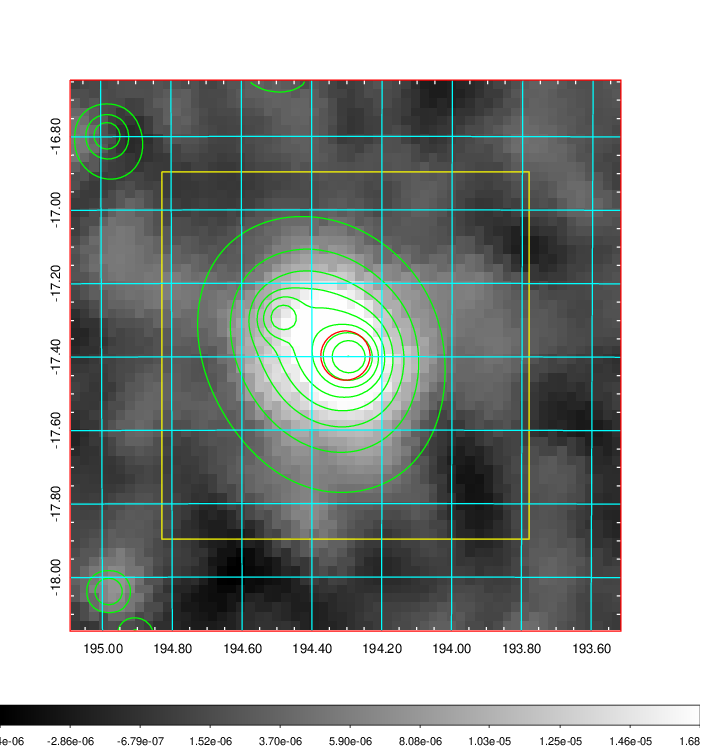
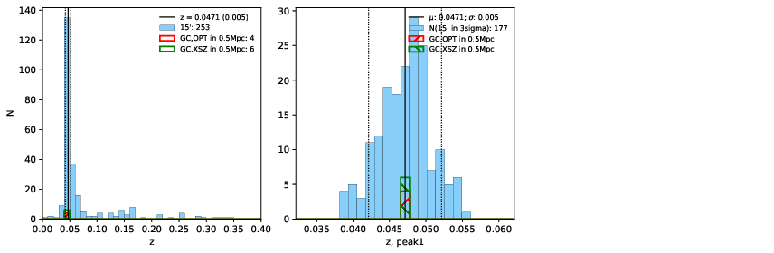
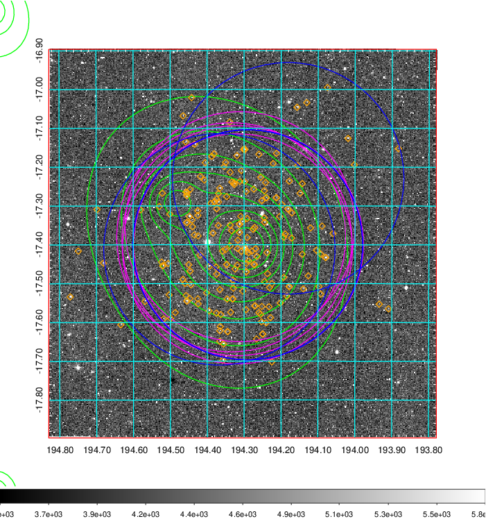
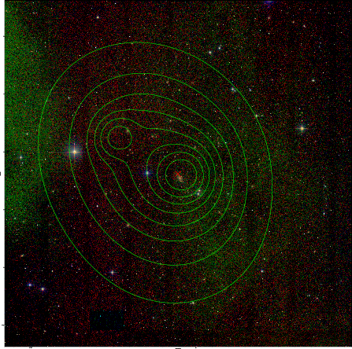
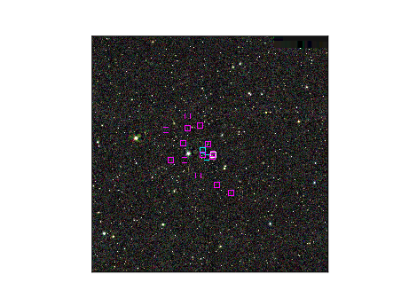

### 474

|Name|RAJ2000[deg]|DEJ2000[deg] |Ext[arcmin]| Ext,ml | z | z_src| C|GC(XSZ,Delta_z<0.01)| GC(OPT,Delta_z<0.01)|GC| R_sig[arcmin] | R500[arcmin] | R500[Mpc]| CRsig[c/s] | CR500[c/s] |L500[1E44 erg/s]|F500[1E-12 erg/s/cm^2]| M500[1E14 Msun]|Tx[keV]|Cnt_sig|Beta|Rc[arcmin]|Comment|Alias|
|---|---|---|---|---|---|------|---|--------|---------|----------|---|---|---|---|---|---|---|---|---|---|---|---|---|---|
|474| 194.304| -17.397| 4.02| 482.45| 0.0471(0.005)| z1, z_xsz| B| L03, MCXC, PSZ2, Tar, XB| A, N| A, L03, MCXC, N, PSZ2, Tar, XB| 24.700| 18.500| 1.026| 1.644(0.103)| 1.579(0.099)| 1.511(0.041)| 28.927(0.789)| 3.21(0.04)| 4.46(0.04)| 524.0| 0.640(-0.026+0.029)| 4.480(-0.418+0.452)| -| k479|

|[RASS image](../image/474/474_img.pdf)|[filtered image](../image/474/474_fil.pdf)|[Segment image](../image/474/474_seg.pdf)|
|-------------------|--------------------|-------------------|
|   |    |   |

|[Exposure image](../image/474/474_mex.pdf)| [nH image](../image/474/474_nh.pdf)| [Planck image](../image/474/474_p.pdf)|
|-------------------|--------------------|-------------------|
|   |     |  |

|[Redshift Histogram](../image/474/474_zg.pdf) | [DSS image(z1)](../image/474/474_dss_z1.pdf)      |  [DSS image(z2)](../image/474/474_dss_z2.pdf)    |
|-------------------|--------------------|-------------------|
| |  Blue circle for optical clusters;  Magenta circle for XSZ clusters;  all with r=1Mpc;  Only GC with Delta_z<0.01 are shown. |  Blue circle for optical clusters;  Magenta circle for XSZ clusters;  all with r=1Mpc;  Only GC with Delta_z<0.01 are shown.  |

|[Previous-identified clusters](../image/474/474_gc.pdf) | [2MASS image](../image/474/474_2mass.pdf)      |
|-------------------|-------------------|
|  Green, magenta, and blue circles  for optical, X-ray and SZ clusters  respectively, with redshift of clusters  labelled. The radius of circles  are 1Mpc.|  |

|[ATLAS image](../image/474/474_s.pdf)        |
|-------------------|
|   |
