

### 476

|Name|RAJ2000[deg]|DEJ2000[deg] |Ext[arcmin]| Ext,ml | z | z_src| C|GC(XSZ,Delta_z<0.01)| GC(OPT,Delta_z<0.01)|GC| R_sig[arcmin] | R500[arcmin] | R500[Mpc]| CRsig[c/s] | CR500[c/s] |L500[1E44 erg/s]|F500[1E-12 erg/s/cm^2]| M500[1E14 Msun]|Tx[keV]|Cnt_sig|Beta|Rc[arcmin]|Comment|Alias|
|---|---|---|---|---|---|------|---|--------|---------|----------|---|---|---|---|---|---|---|---|---|---|---|---|---|---|
|476| 194.675| -1.762| 1.37| 166.34| 0.0840(0.005)| z1, z_xsz| B| F20, L03, MCXC, PSZ2, Tar, XB| A, N, RM, W| A, C, F20, L03, MCXC, N, PSZ2, Tar, W, XB| 22.285| 12.335| 1.168| 1.094(0.117)| 1.019(0.109)| 3.590(0.171)| 20.512(0.976)| 4.91(0.11)| 5.87(0.09)| 369.7| 0.715(-0.032+0.039)| 2.537(-0.279+0.318)| -| k090|

|[RASS image](../image/476/476_img.pdf)|[filtered image](../image/476/476_fil.pdf)|[Segment image](../image/476/476_seg.pdf)|
|-------------------|--------------------|-------------------|
| 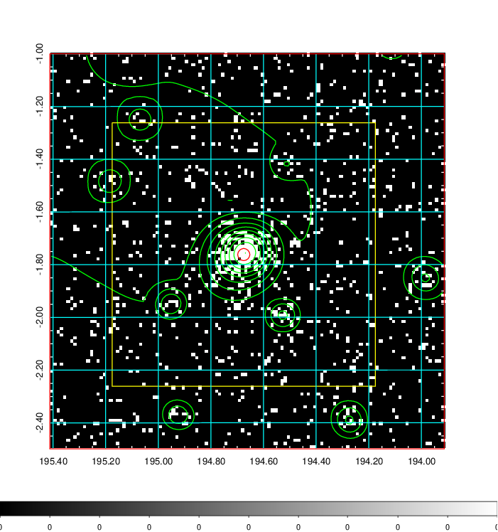  | 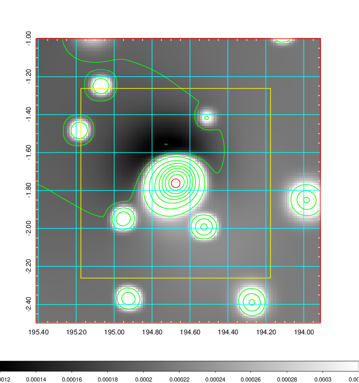   | 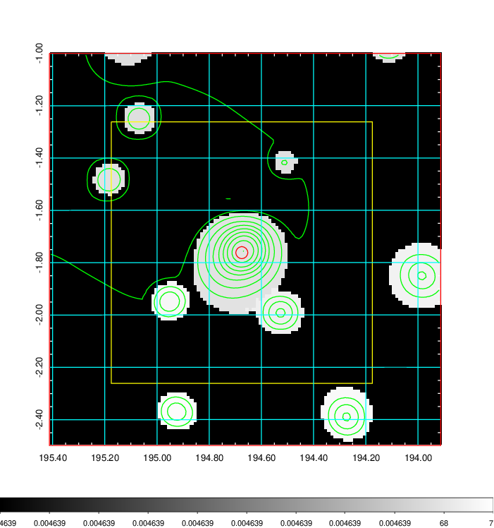  |

|[Exposure image](../image/476/476_mex.pdf)| [nH image](../image/476/476_nh.pdf)| [Planck image](../image/476/476_p.pdf)|
|-------------------|--------------------|-------------------|
|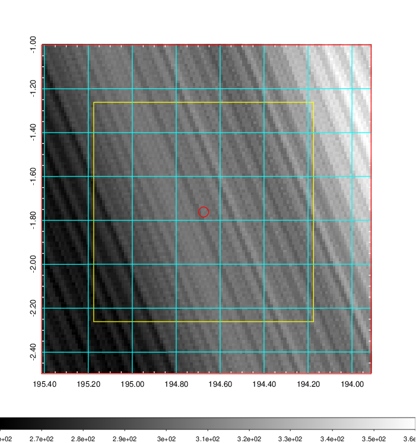   | 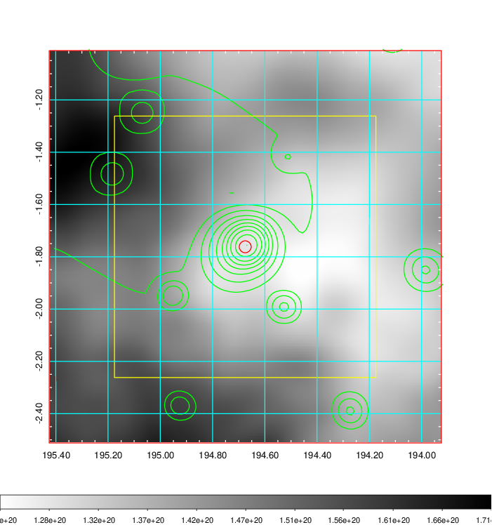    | 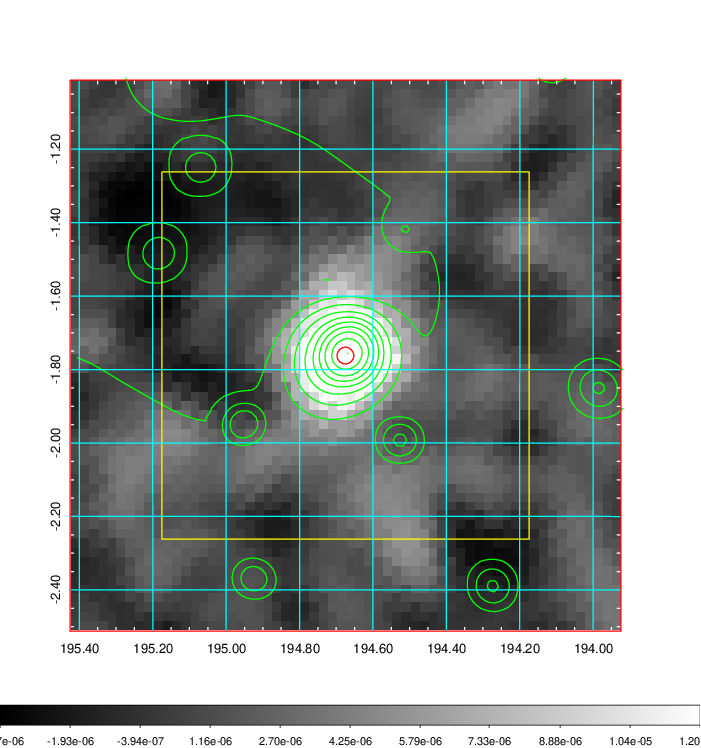 |

|[Redshift Histogram](../image/476/476_zg.pdf) | [DSS image(z1)](../image/476/476_dss_z1.pdf)      |  [DSS image(z2)](../image/476/476_dss_z2.pdf)    |
|-------------------|--------------------|-------------------|
|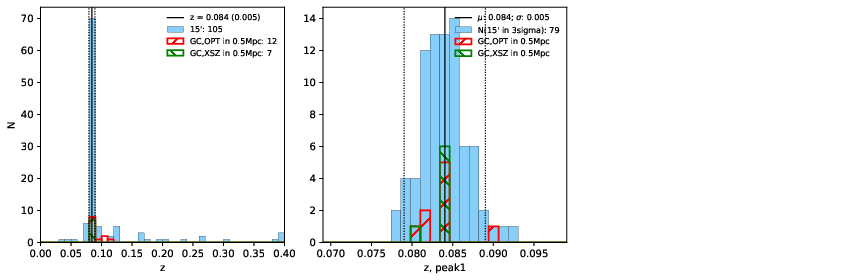 |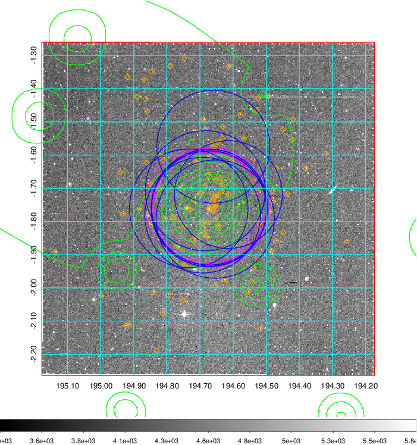  Blue circle for optical clusters;  Magenta circle for XSZ clusters;  all with r=1Mpc;  Only GC with Delta_z<0.01 are shown. | 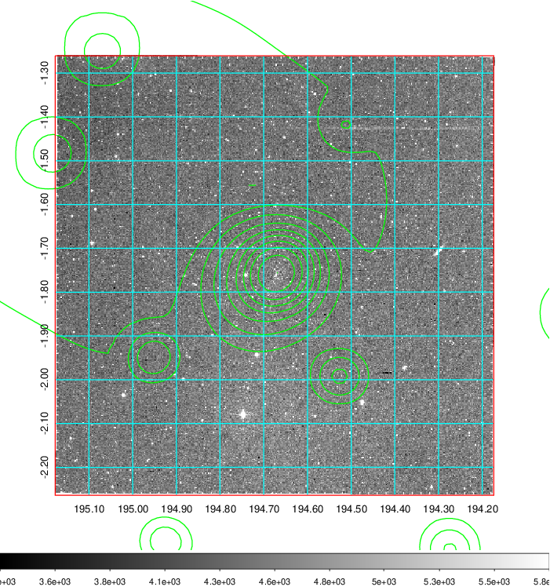 Blue circle for optical clusters;  Magenta circle for XSZ clusters;  all with r=1Mpc;  Only GC with Delta_z<0.01 are shown.  |

|[known Abell/XSZ clusters](../image/476/476_gc.pdf) | [2MASS image](../image/476/476_2mass.pdf)      |[SDSS image](../image/476/476_sdss.pdf)   |
|-------------------|-------------------|-------------------|
|  Magenta, blue and green circles  for optical, X-ray and SZ clusters  respectively, with redshift of clusters  labelled. The radius of circles  are 1Mpc.|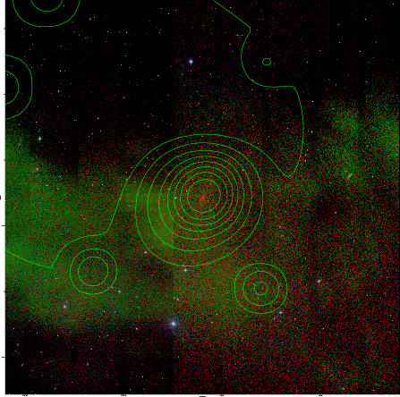  | 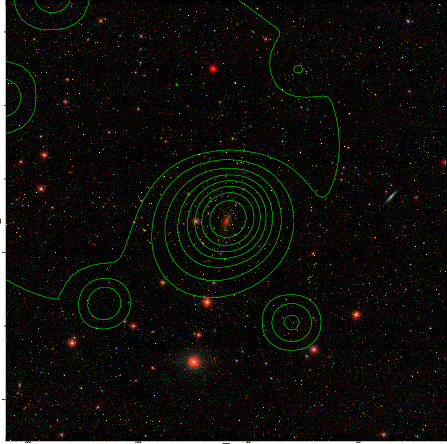  |

