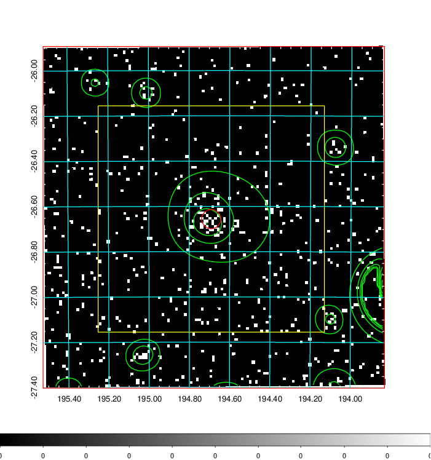
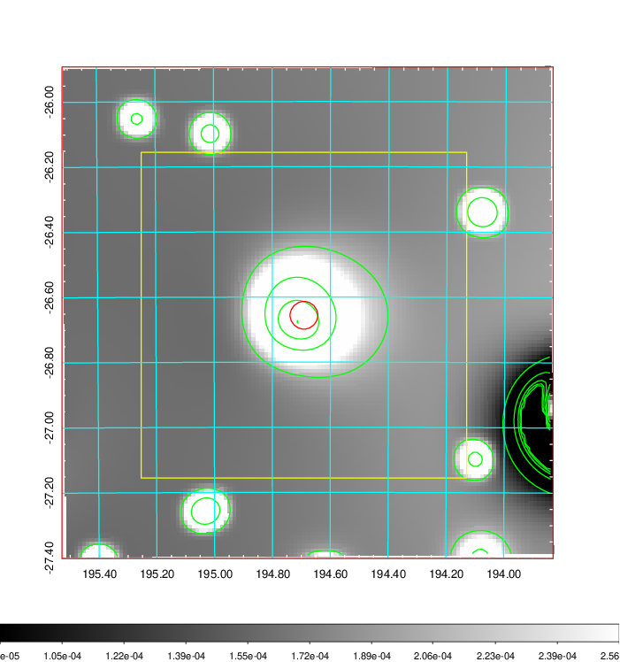
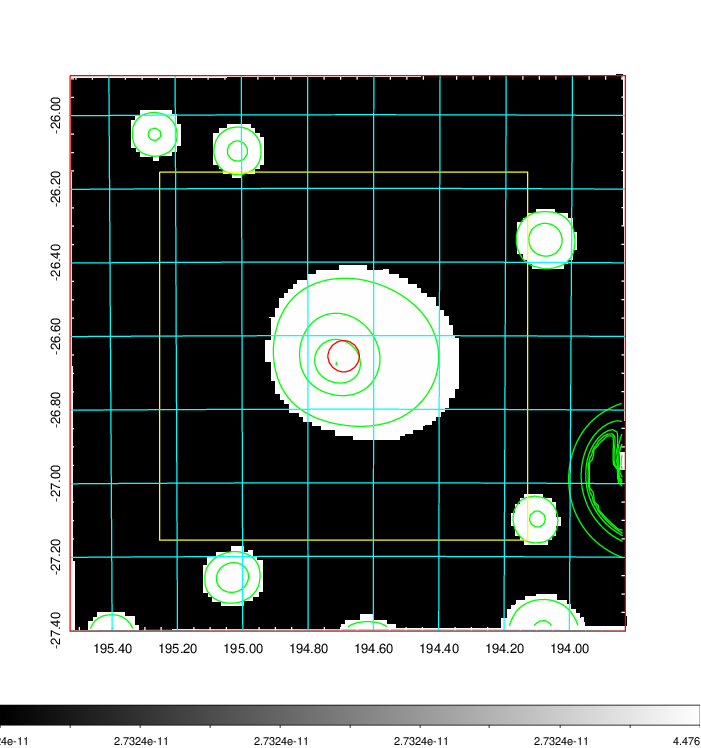
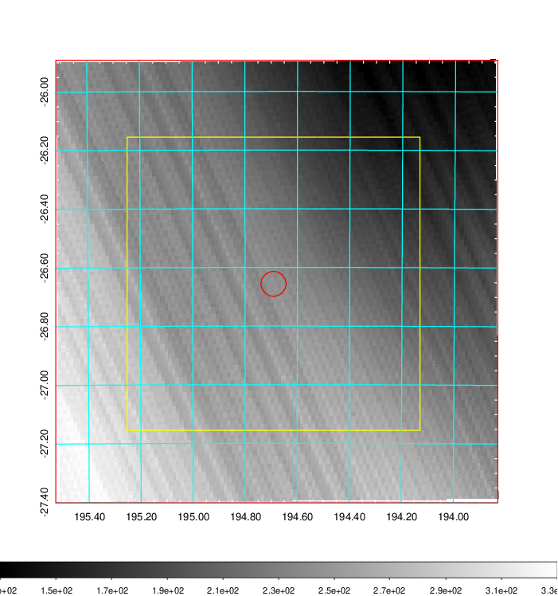
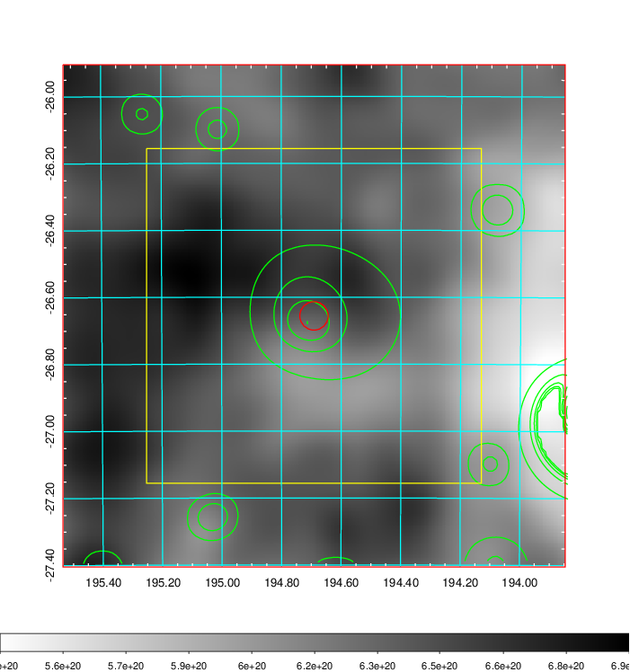
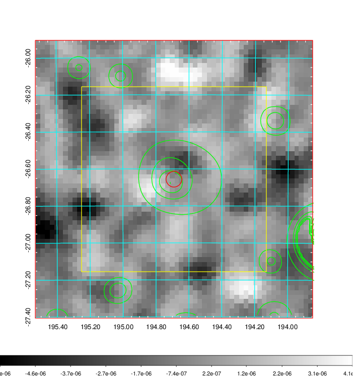
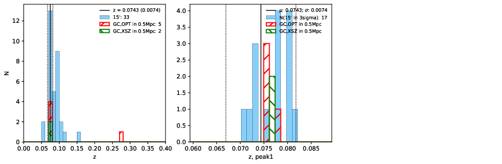
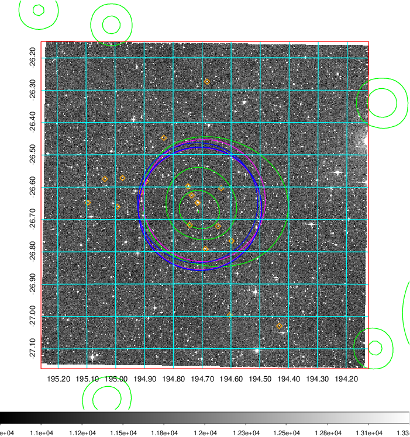
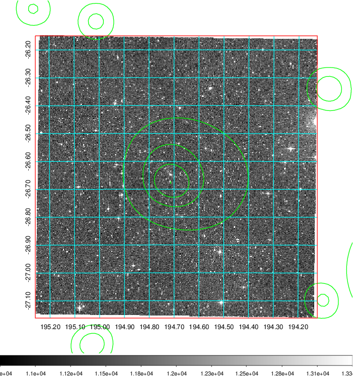
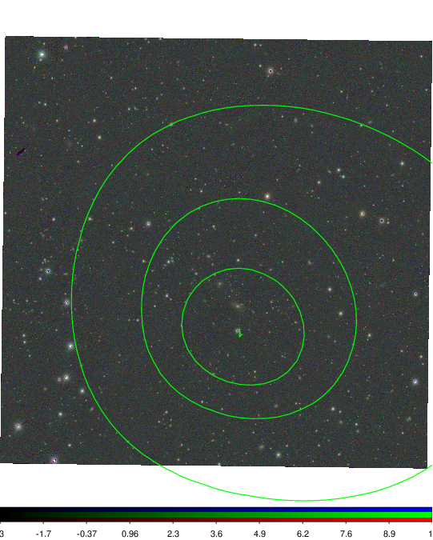

### 477

|Name|RAJ2000[deg]|DEJ2000[deg] |Ext[arcmin]| Ext,ml | z | z_src| C|GC(XSZ,Delta_z<0.01)| GC(OPT,Delta_z<0.01)|GC| R_sig[arcmin] | R500[arcmin] | R500[Mpc]| CRsig[c/s] | CR500[c/s] |L500[1E44 erg/s]|F500[1E-12 erg/s/cm^2]| M500[1E14 Msun]|Tx[keV]|Cnt_sig|Beta|Rc[arcmin]|Comment|Alias|
|---|---|---|---|---|---|------|---|--------|---------|----------|---|---|---|---|---|---|---|---|---|---|---|---|---|---|
|477| 194.691| -26.656| 2.55| 30.16| 0.0743(0.007)| z1, z_xsz| B| MCXC, XB| A, W| A, MCXC, W, XB| 8.312| 9.814| 0.831| 0.220(0.049)| 0.227(0.050)| 0.534(0.057)| 3.953(0.423)| 1.75(0.09)| 3.10(0.11)| 45.1| 0.908(-0.110+0.067)| 5.455(-0.812+0.649)| -| k309|

|[RASS image](../image/477/477_img.pdf)|[filtered image](../image/477/477_fil.pdf)|[Segment image](../image/477/477_seg.pdf)|
|-------------------|--------------------|-------------------|
|   |    |   |

|[Exposure image](../image/477/477_mex.pdf)| [nH image](../image/477/477_nh.pdf)| [Planck image](../image/477/477_p.pdf)|
|-------------------|--------------------|-------------------|
|   |     |  |

|[Redshift Histogram](../image/477/477_zg.pdf) | [DSS image(z1)](../image/477/477_dss_z1.pdf)      |  [DSS image(z2)](../image/477/477_dss_z2.pdf)    |
|-------------------|--------------------|-------------------|
| |  Blue circle for optical clusters;  Magenta circle for XSZ clusters;  all with r=1Mpc;  Only GC with Delta_z<0.01 are shown. |  Blue circle for optical clusters;  Magenta circle for XSZ clusters;  all with r=1Mpc;  Only GC with Delta_z<0.01 are shown.  |

|[Previous-identified clusters](../image/477/477_gc.pdf) | [2MASS image](../image/477/477_2mass.pdf)      |
|-------------------|-------------------|
|  Green, magenta, and blue circles  for optical, X-ray and SZ clusters  respectively, with redshift of clusters  labelled. The radius of circles  are 1Mpc.|  |

|[PS1 image](../image/477/477_ps1.pdf)            |
|-------------------|
|   |
