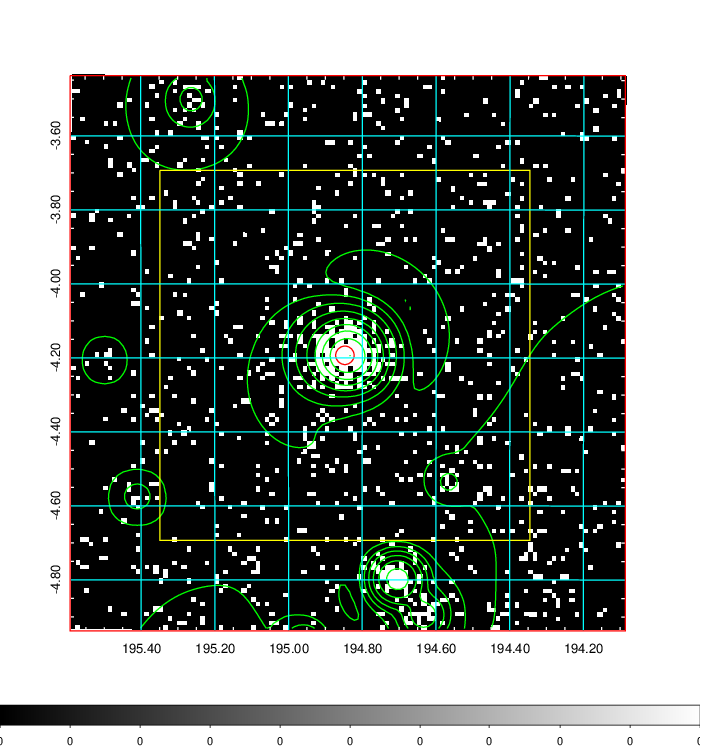
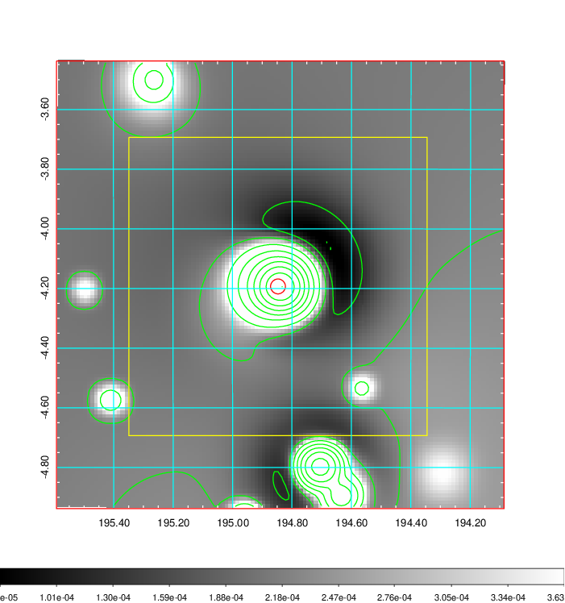
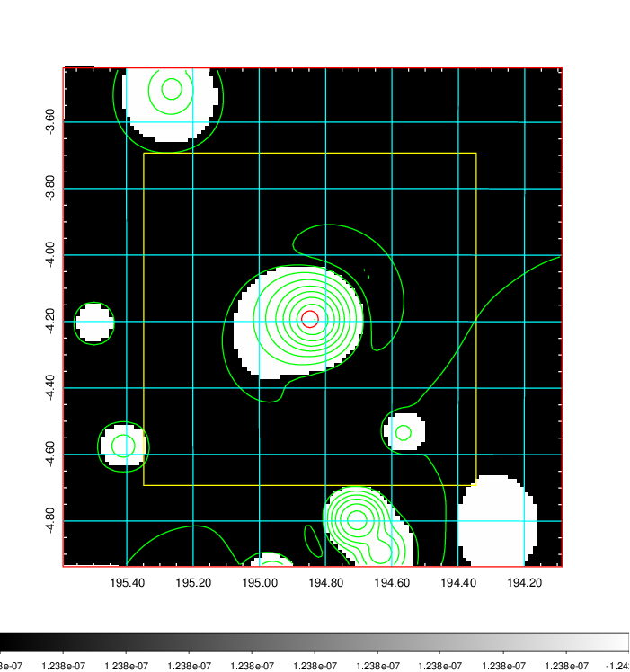
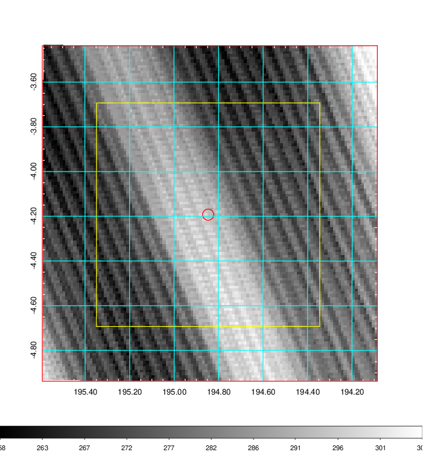
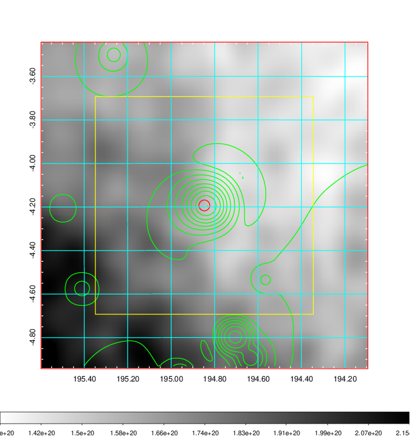
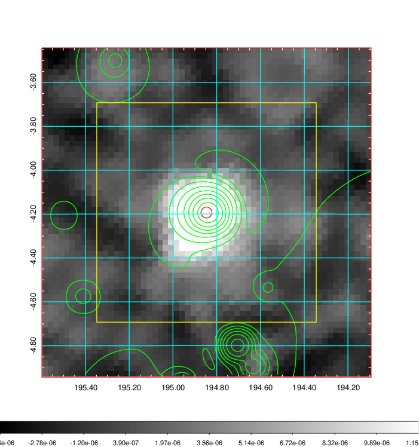
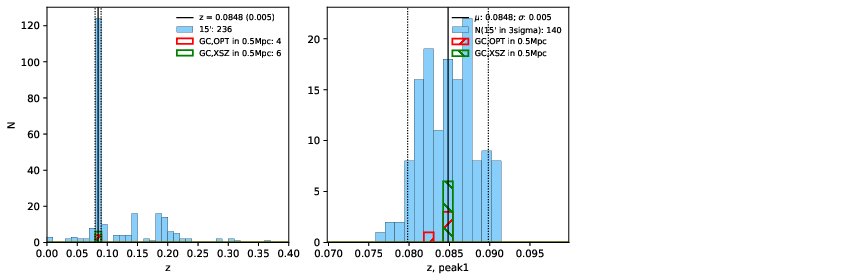
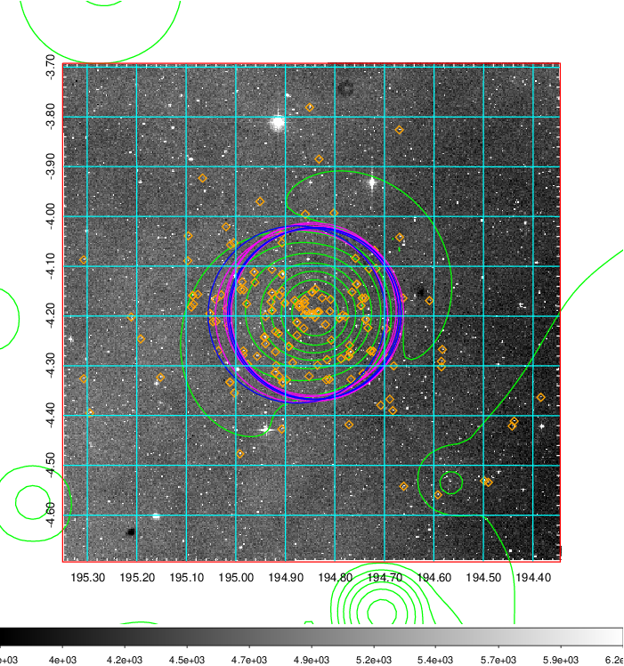
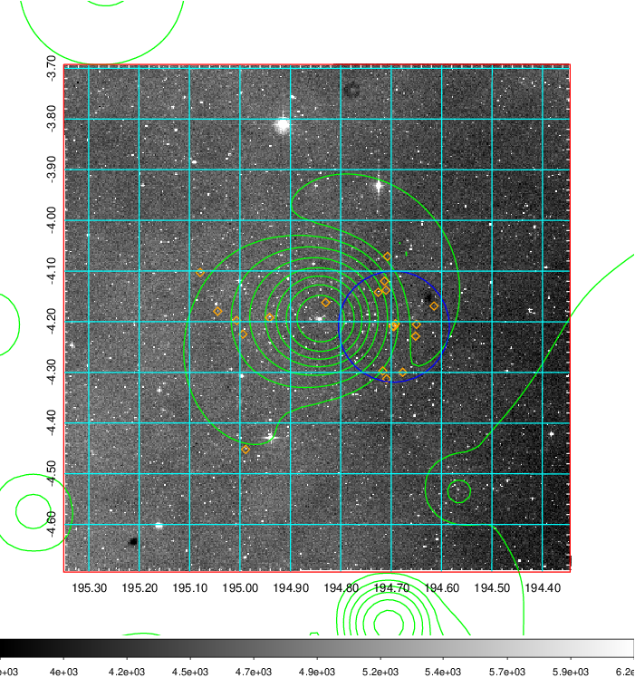
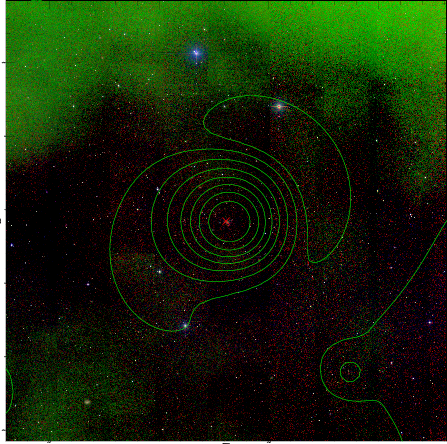

### 478

|Name|RAJ2000[deg]|DEJ2000[deg] |Ext[arcmin]| Ext,ml | z | z_src| C|GC(XSZ,Delta_z<0.01)| GC(OPT,Delta_z<0.01)|GC| R_sig[arcmin] | R500[arcmin] | R500[Mpc]| CRsig[c/s] | CR500[c/s] |L500[1E44 erg/s]|F500[1E-12 erg/s/cm^2]| M500[1E14 Msun]|Tx[keV]|Cnt_sig|Beta|Rc[arcmin]|Comment|Alias|
|---|---|---|---|---|---|------|---|--------|---------|----------|---|---|---|---|---|---|---|---|---|---|---|---|---|---|
|478| 194.847| -4.193| 1.50| 207.18| 0.0848(0.005)| z1, z_xsz| B| L03, MCXC, PSZ2, Tar, XB| A, N, W| A, L03, MCXC, N, PSZ2, Tar, W, XB| 9.775| 12.758| 1.218| 1.153(0.076)| 1.214(0.079)| 4.323(0.123)| 24.207(0.691)| 5.58(0.08)| 6.35(0.06)| 326.7| 0.949(-0.062+0.037)| 3.936(-0.320+0.224)| -| k114|

|[RASS image](../image/478/478_img.pdf)|[filtered image](../image/478/478_fil.pdf)|[Segment image](../image/478/478_seg.pdf)|
|-------------------|--------------------|-------------------|
|   |    |   |

|[Exposure image](../image/478/478_mex.pdf)| [nH image](../image/478/478_nh.pdf)| [Planck image](../image/478/478_p.pdf)|
|-------------------|--------------------|-------------------|
|   |     |  |

|[Redshift Histogram](../image/478/478_zg.pdf) | [DSS image(z1)](../image/478/478_dss_z1.pdf)      |  [DSS image(z2)](../image/478/478_dss_z2.pdf)    |
|-------------------|--------------------|-------------------|
| |  Blue circle for optical clusters;  Magenta circle for XSZ clusters;  all with r=1Mpc;  Only GC with Delta_z<0.01 are shown. |  Blue circle for optical clusters;  Magenta circle for XSZ clusters;  all with r=1Mpc;  Only GC with Delta_z<0.01 are shown.  |

|[known Abell/XSZ clusters](../image/478/478_gc.pdf) | [2MASS image](../image/478/478_2mass.pdf)      |
|-------------------|-------------------|
|  Magenta, blue and green circles  for optical, X-ray and SZ clusters  respectively, with redshift of clusters  labelled. The radius of circles  are 1Mpc.|  |

|[ATLAS image](../image/478/478_s.pdf)        |
|-------------------|
|   |
