

### 479

|Name|RAJ2000[deg]|DEJ2000[deg] |Ext[arcmin]| Ext,ml | z | z_src| C|GC(XSZ,Delta_z<0.01)| GC(OPT,Delta_z<0.01)|GC| R_sig[arcmin] | R500[arcmin] | R500[Mpc]| CRsig[c/s] | CR500[c/s] |L500[1E44 erg/s]|F500[1E-12 erg/s/cm^2]| M500[1E14 Msun]|Tx[keV]|Cnt_sig|Beta|Rc[arcmin]|Comment|Alias|
|---|---|---|---|---|---|------|---|--------|---------|----------|---|---|---|---|---|---|---|---|---|---|---|---|---|---|
|479| 194.927| 27.928| 8.54| 24998.89| 0.0235(0.005)| z1, z_xsz| B| L03, MCXC, PSZ2, Tar, XB| A, N, Zw| A, C, F20, L03, MCXC, N, PSZ2, Tar, W, XB| 52.975| 42.129| 1.199| 14.301(0.188)| 13.834(0.182)| 3.546(0.020)| 282.278(1.630)| 5.01(0.01)| 5.83(0.01)| 7728.6| 0.751(-0.009+0.009)| 11.449(-0.212+0.216)| -| k567|

|[RASS image](../image/479/479_img.pdf)|[filtered image](../image/479/479_fil.pdf)|[Segment image](../image/479/479_seg.pdf)|
|-------------------|--------------------|-------------------|
| 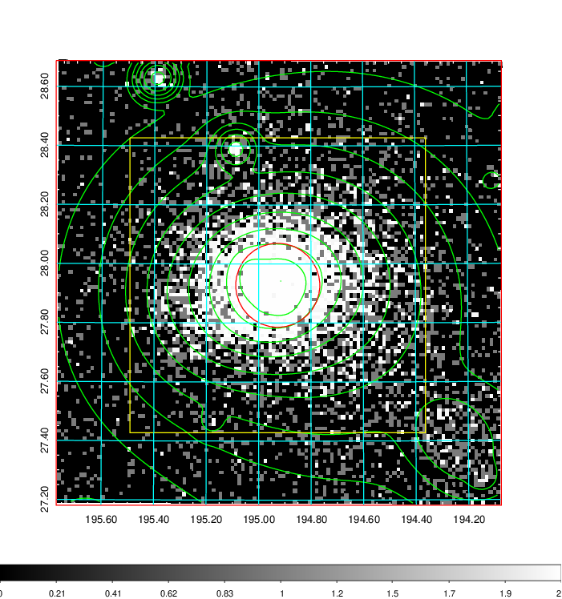  | 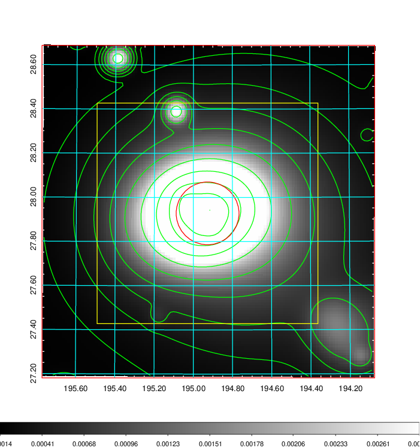   | 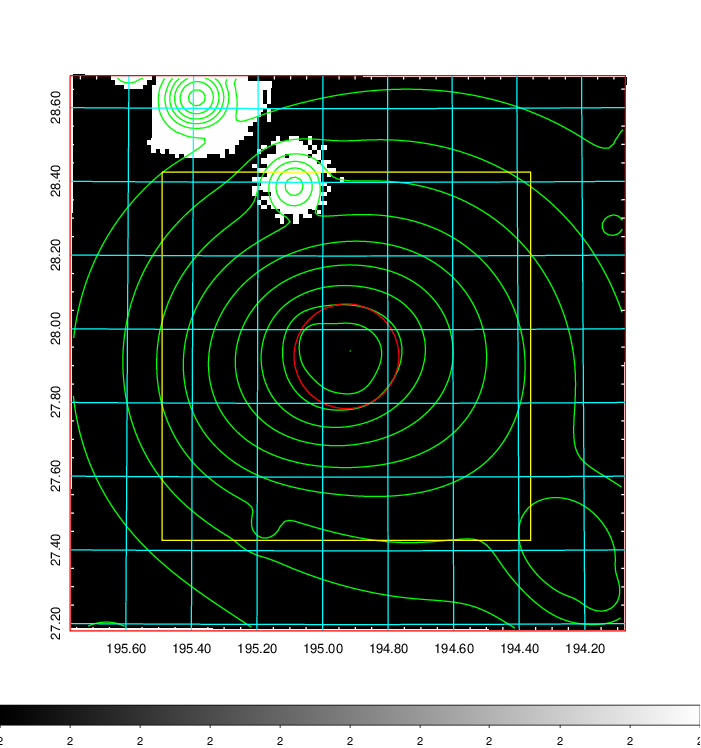  |

|[Exposure image](../image/479/479_mex.pdf)| [nH image](../image/479/479_nh.pdf)| [Planck image](../image/479/479_p.pdf)|
|-------------------|--------------------|-------------------|
|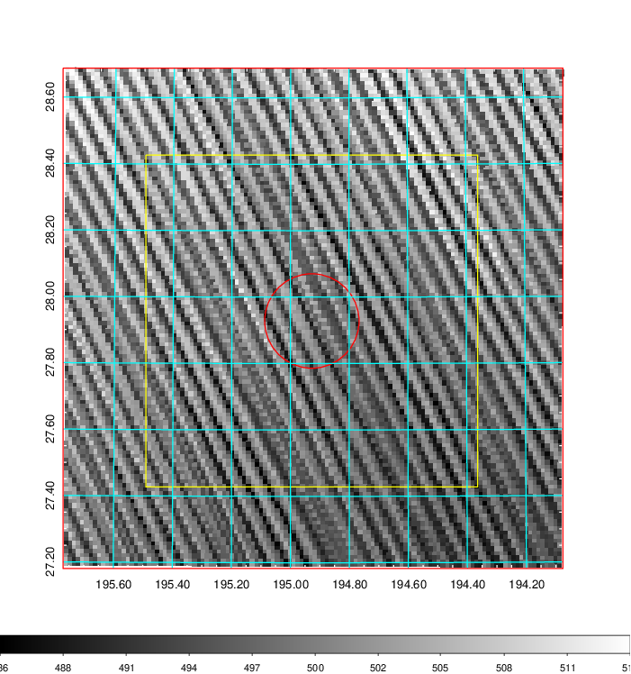   | 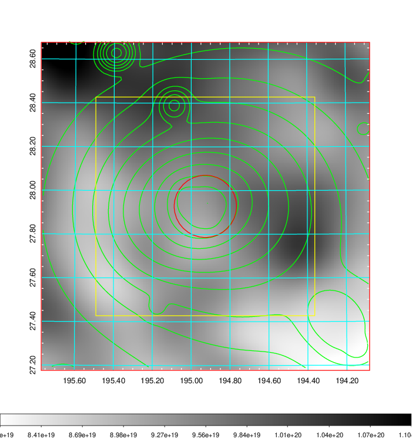    | 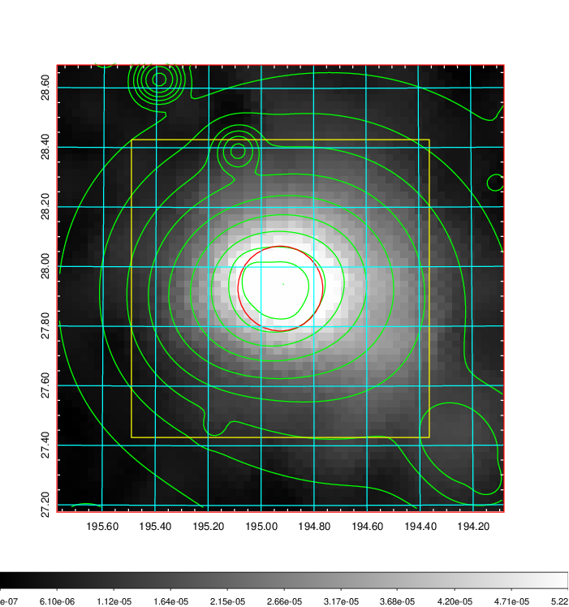 |

|[Redshift Histogram](../image/479/479_zg.pdf) | [DSS image(z1)](../image/479/479_dss_z1.pdf)      |  [DSS image(z2)](../image/479/479_dss_z2.pdf)    |
|-------------------|--------------------|-------------------|
|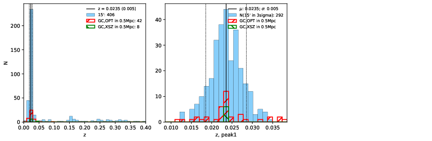 |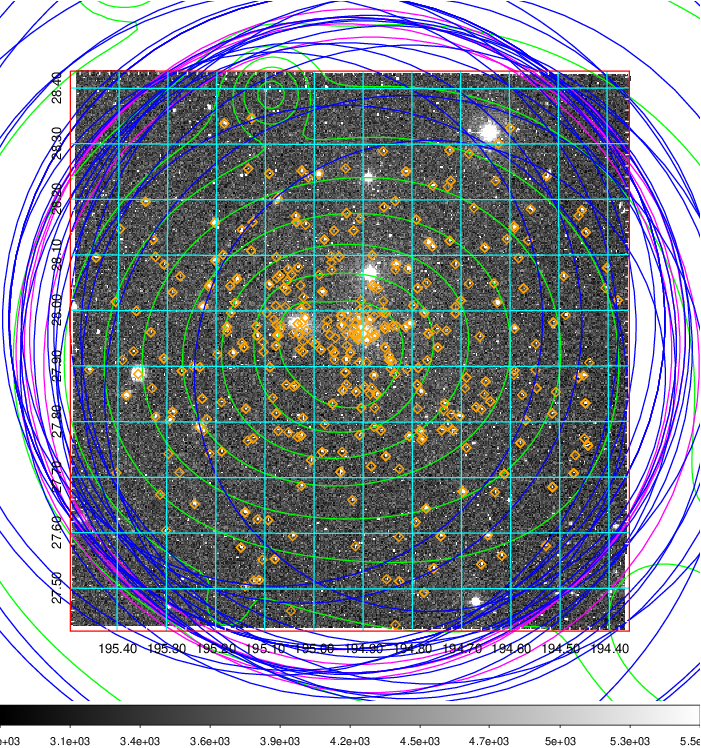  Blue circle for optical clusters;  Magenta circle for XSZ clusters;  all with r=1Mpc;  Only GC with Delta_z<0.01 are shown. | 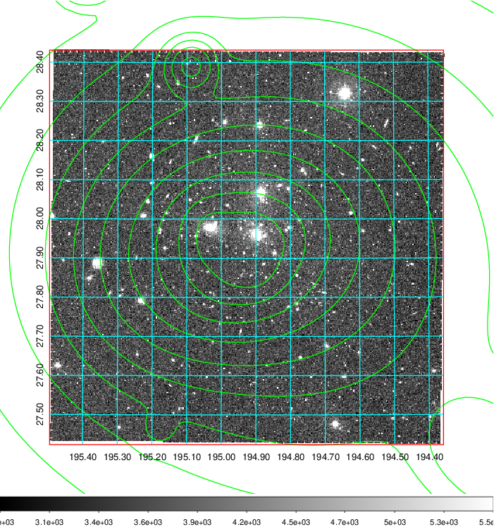 Blue circle for optical clusters;  Magenta circle for XSZ clusters;  all with r=1Mpc;  Only GC with Delta_z<0.01 are shown.  |

|[known Abell/XSZ clusters](../image/479/479_gc.pdf) | [2MASS image](../image/479/479_2mass.pdf)      |[SDSS image](../image/479/479_sdss.pdf)   |
|-------------------|-------------------|-------------------|
|  Magenta, blue and green circles  for optical, X-ray and SZ clusters  respectively, with redshift of clusters  labelled. The radius of circles  are 1Mpc.|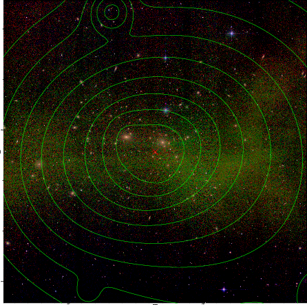  | 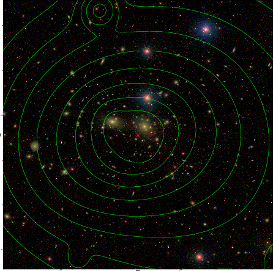  |

