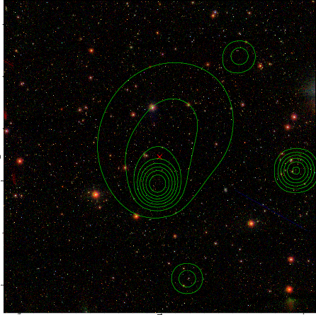

### 48

|Name|RAJ2000[deg]|DEJ2000[deg] |Ext[arcmin]| Ext,ml | z | z_src| C|GC(XSZ,Delta_z<0.01)| GC(OPT,Delta_z<0.01)|GC| R_sig[arcmin] | R500[arcmin] | R500[Mpc]| CRsig[c/s] | CR500[c/s] |L500[1E44 erg/s]|F500[1E-12 erg/s/cm^2]| M500[1E14 Msun]|Tx[keV]|Cnt_sig|Beta|Rc[arcmin]|Comment|Alias|
|---|---|---|---|---|---|------|---|--------|---------|----------|---|---|---|---|---|---|---|---|---|---|---|---|---|---|
|48| 16.006| 25.078| 7.02| 35.28| 0.2625(0.005)| z1,| G| -| -| A, C, F20, N, PSZ2, SPI, W| 12.700| 3.689| 0.897| 0.039(0.030)| 0.035(0.027)| 1.388(0.859)| 0.654(0.404)| 2.68(0.80)| 4.29(0.81)| 40.8| 0.883(-0.136+0.085)| 7.066(-1.312+1.245)| An SZ cluster with  $z$ = 0.1661 and offset = 1.38 Mpc(5.62 arcmin), an X-ray cluster with $z$ = 0.2619 and offset = 1.59 Mpc(6.48 arcmin), an Abell cluster with $z$ = 0.1569 and offset = 1 Mpc(4.08 a| k557|

|[RASS image](../image/48/48_img.pdf)|[filtered image](../image/48/48_fil.pdf)|[Segment image](../image/48/48_seg.pdf)|
|-------------------|--------------------|-------------------|
|   |    |   |

|[Exposure image](../image/48/48_mex.pdf)| [nH image](../image/48/48_nh.pdf)| [Planck image](../image/48/48_p.pdf)|
|-------------------|--------------------|-------------------|
|   |     |  |

|[Redshift Histogram](../image/48/48_zg.pdf) | [DSS image(z1)](../image/48/48_dss_z1.pdf)      |  [DSS image(z2)](../image/48/48_dss_z2.pdf)    |
|-------------------|--------------------|-------------------|
| |  Blue circle for optical clusters;  Magenta circle for XSZ clusters;  all with r=1Mpc;  Only GC with Delta_z<0.01 are shown. |  Blue circle for optical clusters;  Magenta circle for XSZ clusters;  all with r=1Mpc;  Only GC with Delta_z<0.01 are shown.  |

|[Previous-identified clusters](../image/48/48_gc.pdf) | [2MASS image](../image/48/48_2mass.pdf)      |[SDSS image](../image/48/48_sdss.pdf)   |
|-------------------|-------------------|-------------------|
|  Green, magenta, and blue circles  for optical, X-ray and SZ clusters  respectively, with redshift of clusters  labelled. The radius of circles  are 1Mpc.|  |   |

