

### 480

|Name|RAJ2000[deg]|DEJ2000[deg] |Ext[arcmin]| Ext,ml | z | z_src| C|GC(XSZ,Delta_z<0.01)| GC(OPT,Delta_z<0.01)|GC| R_sig[arcmin] | R500[arcmin] | R500[Mpc]| CRsig[c/s] | CR500[c/s] |L500[1E44 erg/s]|F500[1E-12 erg/s/cm^2]| M500[1E14 Msun]|Tx[keV]|Cnt_sig|Beta|Rc[arcmin]|Comment|Alias|
|---|---|---|---|---|---|------|---|--------|---------|----------|---|---|---|---|---|---|---|---|---|---|---|---|---|---|
|480| 195.940| 19.271| 1.83| 154.39| 0.0640(0.005)| z1, z_xsz| B| L03, MCXC, PSZ2, Tar, XB| A, N, W| A, C, F20, L03, MCXC, N, PSZ2, Tar, W, XB| 26.181| 12.476| 0.921| 0.591(0.058)| 0.544(0.053)| 1.025(0.056)| 10.376(0.569)| 2.36(0.06)| 3.71(0.06)| 345.0| 0.584(-0.021+0.024)| 2.268(-0.276+0.295)| -| k175|

|[RASS image](../image/480/480_img.pdf)|[filtered image](../image/480/480_fil.pdf)|[Segment image](../image/480/480_seg.pdf)|
|-------------------|--------------------|-------------------|
| 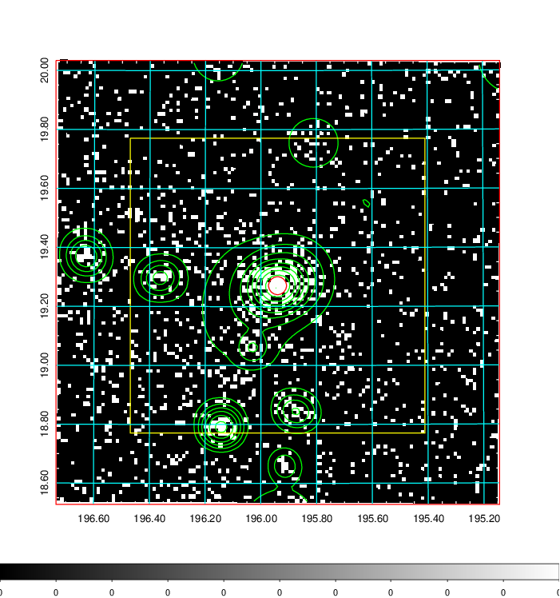  | 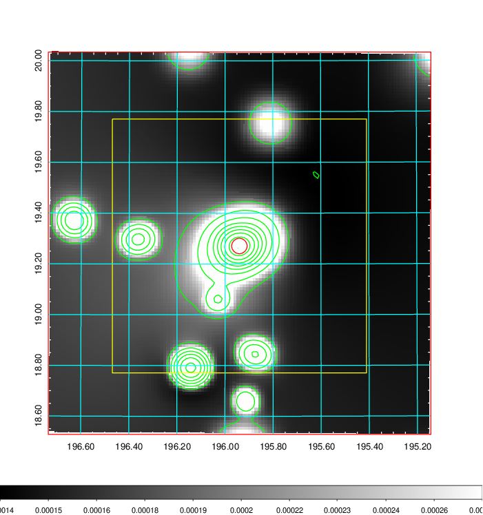   | 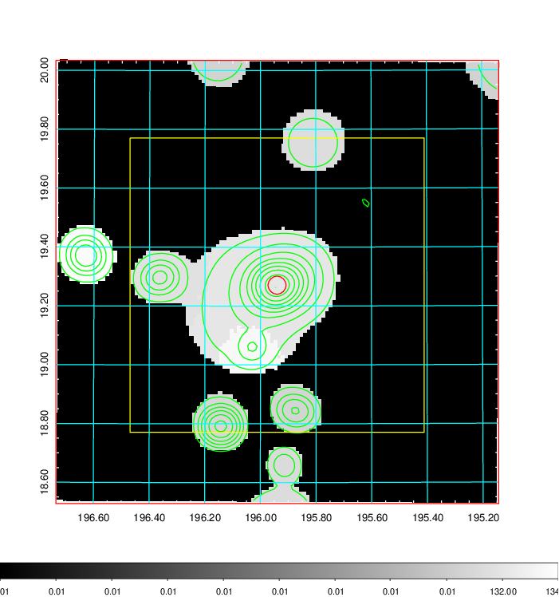  |

|[Exposure image](../image/480/480_mex.pdf)| [nH image](../image/480/480_nh.pdf)| [Planck image](../image/480/480_p.pdf)|
|-------------------|--------------------|-------------------|
|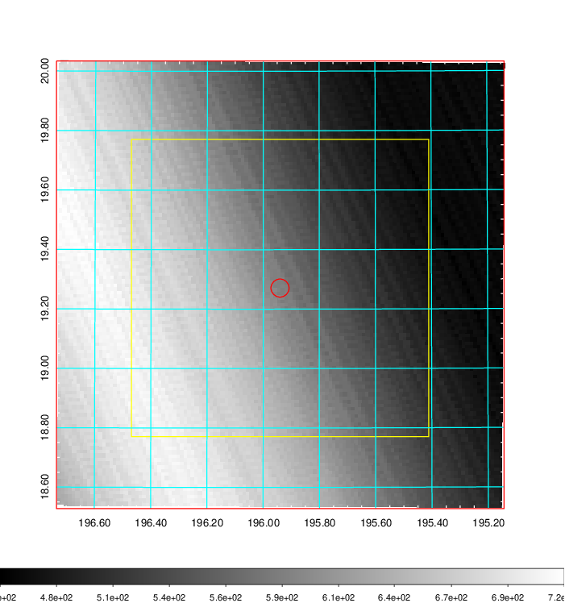   | 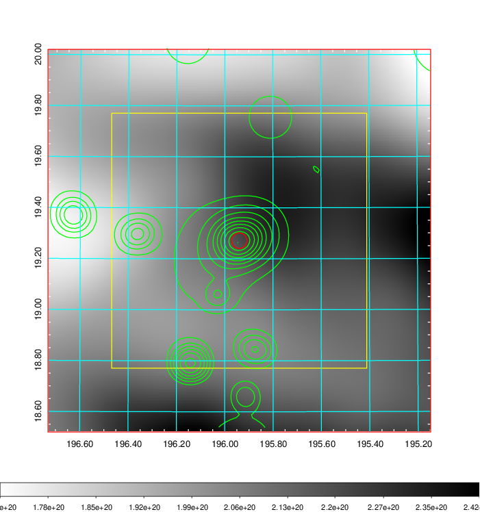    | 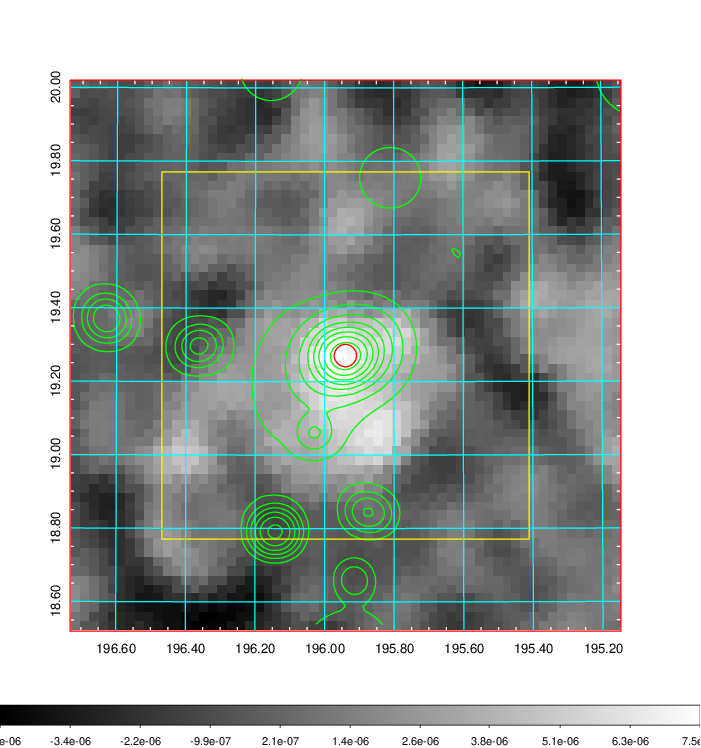 |

|[Redshift Histogram](../image/480/480_zg.pdf) | [DSS image(z1)](../image/480/480_dss_z1.pdf)      |  [DSS image(z2)](../image/480/480_dss_z2.pdf)    |
|-------------------|--------------------|-------------------|
|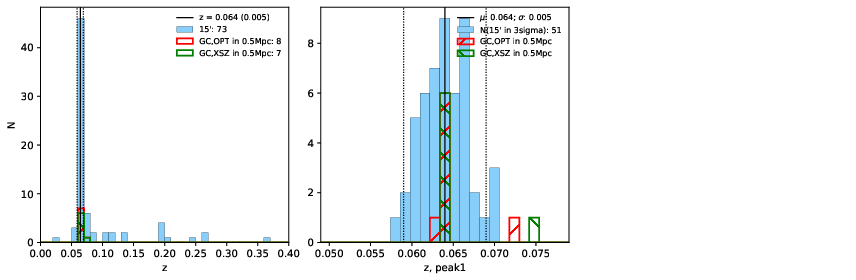 |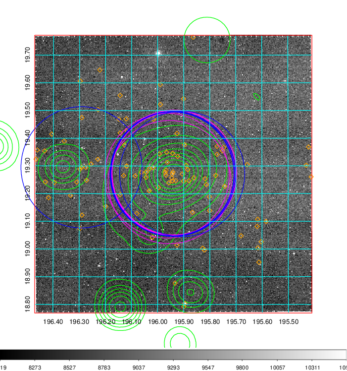  Blue circle for optical clusters;  Magenta circle for XSZ clusters;  all with r=1Mpc;  Only GC with Delta_z<0.01 are shown. | 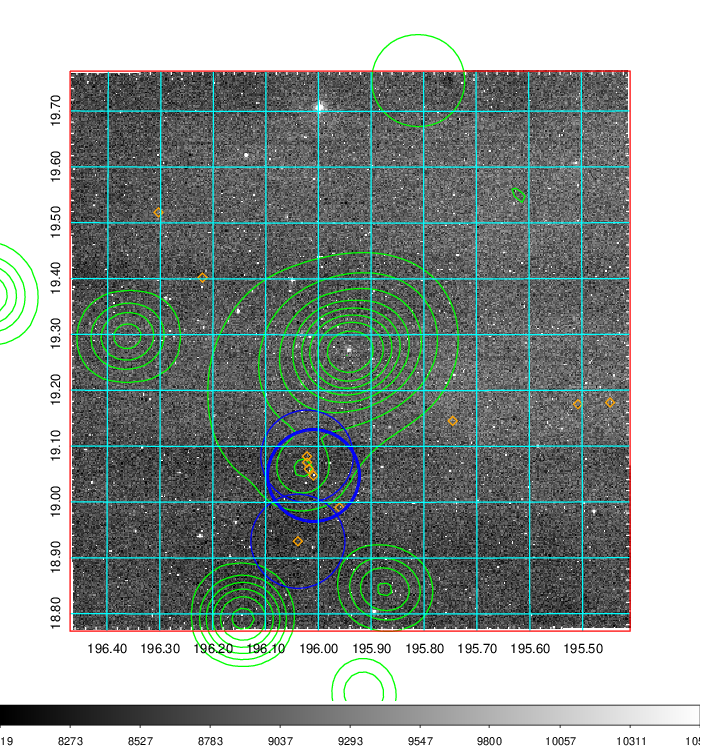 Blue circle for optical clusters;  Magenta circle for XSZ clusters;  all with r=1Mpc;  Only GC with Delta_z<0.01 are shown.  |

|[Previous-identified clusters](../image/480/480_gc.pdf) | [2MASS image](../image/480/480_2mass.pdf)      |[SDSS image](../image/480/480_sdss.pdf)   |
|-------------------|-------------------|-------------------|
|  Green, magenta, and blue circles  for optical, X-ray and SZ clusters  respectively, with redshift of clusters  labelled. The radius of circles  are 1Mpc.|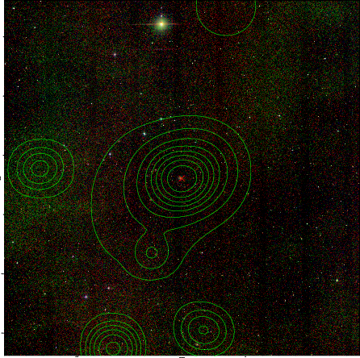  | 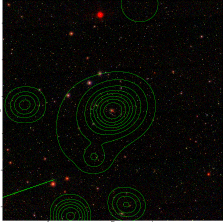  |

